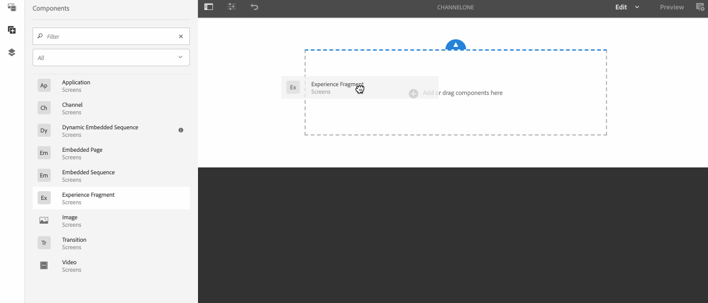

# Componenten toevoegen aan een kanaal{#adding-components-to-a-channel}

Componenten zijn de basiselementen van de AEM (Adobe Experience Manager)-ervaring. U kunt verschillende componenten gebruiken en deze aan uw kanaal toevoegen in een AEM Screens-project.

## Componenten in AEM Screens {#components-in-aem-screens}

AEM Screens biedt verschillende AEM componenten die in een Screens-project kunnen worden gebruikt.

### AEM Screens-componenten weergeven {#viewing-aem-screens-components}

Wanneer u een project van AEM Screens creeert, ziet u een lijst van standaardcomponenten die aan het project kunnen worden toegevoegd.

Volg onderstaande stappen om de standaardcomponenten voor uw project Schermen weer te geven:

1. Klik op het kanaal. Bijvoorbeeld: **`We.Retail In Store`** > **Kanalen** > **Niet-actief kanaal**.

1. Klikken **Bewerken** in de actiebalk.
1. Klik in de AEM Editor op de knop **+** van de zijbalk.
1. Alle componenten die door gebrek in een het projectvertoningen van AEM Screens inbegrepen zijn, zoals aangetoond in het hieronder cijfer.

### Een nieuwe component toevoegen {#adding-a-new-component}

AEM biedt diverse andere componenten. U kunt altijd andere componenten (die niet standaard zijn opgenomen) aan uw project toevoegen, omdat deze compatibel zijn met AEM Screens.

In het volgende voorbeeld wordt de toevoeging van een component Livefyre aan een AEM Screens-project getoond:

1. Klik op het kanaal waaraan u een component wilt toevoegen. Bijvoorbeeld: **`We.Retail In Store`** > **Kanalen** > **Niet-actief kanaal**.

1. Klikken **Bewerken** in de actiebalk.
1. Klikken **Ontwerp** -modus.
1. Klik op de volledige ontwerpeditor aan de rechterkant en klik op het instellingensymbool, zodat u het dialoogvenster **Parsys-ontwerp** in.
1. U kunt op de componenten klikken die u in uw AEM Screens-project wilt importeren. In het volgende voorbeeld wordt de toevoeging van **Livefyre** aan een AEM Screens-project.

>[!NOTE]
>
>Op dezelfde manier kunt u om het even welk aantal andere nieuwe componenten toevoegen die met AEM Screens aan uw project compatibel zijn.

## Schermcomponenten AEM {#understanding-aem-screen-components}

In de volgende sectie worden de AEM Screens-componenten uitgelegd die u in uw project kunt gebruiken.

>[!NOTE]
>
>Als u de eigenschappen van een component wilt weergeven, klikt u op de component en klikt u op het hamerpictogram om eigenschappen te openen/weergeven.

### Toepassing {#application}

De **Toepassing** kunt u een toepassing aan uw kanaal toevoegen.

Toepassingscomponent heeft de volgende eigenschappen:

| **Eigenschap** | **Beschrijving** |
|---|---|
| ***Toepassingspad*** | Klik op het absolute pad waar de toepassing bestaat. |
| ***Duur (milliseconden)*** | Klik op de duur van de toepassing. Standaard is de duur ingesteld op -1, wat betekent dat het element voorgoed wordt uitgevoerd (dat wil zeggen, toepassing op één pagina). Wanneer u de waarde voor de duur > 0 instelt, wordt het element voor de opgegeven duur weergegeven en gaat u vervolgens naar de volgende waarde. |

In het volgende voorbeeld wordt getoond hoe u een toepassingscomponent insluit samen met de voorvertoning van de eigenschappen ervan:

>[!NOTE]
>
>Zie het bovenstaande voorbeeld om de eigenschappen van elk van de onderstaande componenten weer te geven.

### Kanaal {#channel}

De **Kanaal** kunt u een volledig kanaal aan uw project toevoegen.

De component Channel heeft de volgende eigenschappen:

<table>
 <tbody>
  <tr>
   <td><strong>Eigenschap</strong></td>
   <td><strong>Beschrijving</strong></td>
  </tr>
  <tr>
   <td><strong><em>Kanaalpad</em></strong></td>
   <td>Selecteer dit absolute pad waar de toepassing bestaat.  </td>
  </tr>
  <tr>
   <td><strong><em>Duur (milliseconden)</em></strong></td>
   <td>Selecteer de volledige duur van het kanaal. Wanneer u de duur instelt op -1, wordt de volledige lengte van het ingesloten kanaal in een bepaald kanaal uitgevoerd.</td>
  </tr>
 </tbody>
</table>

### Ingesloten pagina {#embedded-page}

An **Ingesloten pagina** Hiermee kunt u een ingesloten pagina toevoegen aan uw project. Het kan bijvoorbeeld een webtoepassing of een productcatalogus zijn.

De ingesloten pagina heeft de volgende eigenschappen:

<table>
 <tbody>
  <tr>
   <td><strong>Eigenschap</strong></td>
   <td><strong>Beschrijving</strong></td>
  </tr>
  <tr>
   <td><strong><em>Pad naar pagina  </em></strong></td>
   <td>Selecteer dit absolute pad waar het kanaal bestaat.  </td>
  </tr>
  <tr>
   <td><strong><em>Duur (milliseconden)</em></strong></td>
   <td>Selecteer de volledige duur van het kanaal. Wanneer u de duur instelt op -1, wordt de volledige lengte van het ingesloten kanaal in een bepaald kanaal uitgevoerd.</td>
  </tr>
 </tbody>
</table>

### Ingesloten reeks {#embedded-sequence}

>[!NOTE]
>
>Zie voor meer informatie over ingesloten reeksen [Ingesloten reeksen](embedded-sequences.md) onder sectie Ontwerpschermen.

Met een ingesloten reeks kunt u een ingesloten volgnummer toevoegen aan uw bestaande kanaal (met andere elementen).

De ingesloten reeks heeft de volgende pagina-eigenschappen:

<table>
 <tbody>
  <tr>
   <td><strong>Eigenschap</strong></td>
   <td><strong>Beschrijving</strong></td>
  </tr>
  <tr>
   <td>Kanaalpad</td>
   <td>Selecteer het absolute pad van de reeks die u in het kanaal wilt opnemen.  </td>
  </tr>
  <tr>
   <td><strong><em>Duur (milliseconden)</em></strong></td>
   <td>Selecteer de volledige duur van het kanaal. Wanneer u de duur instelt op -1, wordt de volledige lengte van het ingesloten kanaal in een bepaald kanaal uitgevoerd.</td>
  </tr>
  <tr>
   <td><strong><em>Strategie</em></strong></td>
   <td>Instellen op <strong>origineel</strong> of <strong>enkel</strong>. De waarde instellen op <strong>origineel</strong> betekent dat de volgende reeks volledig op elke cyclus van de bovenliggende reeks wordt uitgevoerd. De andere mogelijke waarde is <strong>enkel</strong>. Bij deze waarde wordt slechts één item van de volgende waarde op elke run weergegeven. Bijvoorbeeld het eerste item op de eerste lus en het tweede item op de tweede lus.</td>
  </tr>
 </tbody>
</table>

### Dynamische ingesloten reeks {#dynamic-embedded-sequence}

Met een dynamische ingesloten reeks kunt u een reeks toevoegen die vergelijkbaar is met de bovenstaande reeks, behalve met de rol van het kanaal.

Zie voor meer informatie over ingesloten reeksen [Ingesloten reeksen](embedded-sequences.md) onder sectie Ontwerpschermen.

De dynamische ingesloten reeks heeft de volgende eigenschappen:

<table>
 <tbody>
  <tr>
   <td><strong>Eigenschap</strong></td>
   <td><strong>Beschrijving</strong></td>
  </tr>
  <tr>
   <td><strong><em>Kanaaltoewijzingsrol</em></strong>  </td>
   <td>Voer de kanaalrol in.  </td>
  </tr>
  <tr>
   <td><strong><em>Duur (milliseconden)</em></strong></td>
   <td>Selecteer de volledige duur van het kanaal. Wanneer u de duur instelt op -1, wordt de volledige lengte van het ingesloten kanaal in een bepaald kanaal uitgevoerd.</td>
  </tr>
  <tr>
   <td><strong><em>Strategie</em></strong></td>
   <td>Instellen op <strong>origineel</strong> of <strong>enkel</strong>. De waarde instellen op <strong>origineel</strong> betekent dat de volgende reeks volledig op elke cyclus van de bovenliggende reeks wordt uitgevoerd. De andere mogelijke waarde is <strong>enkel</strong>. Bij een dergelijke waarde wordt slechts één item van de volgende waarde op elke run weergegeven. Bijvoorbeeld het eerste item op de eerste lus en het tweede item op de tweede lus.</td>
  </tr>
 </tbody>
</table>

### Ervaar fragment {#experience-fragment}

Met een ervaringsfragment kunt u een Experience-fragment (groep van een of meer componenten, inclusief de inhoud en lay-out, waarnaar op pagina&#39;s kan worden verwezen) toevoegen aan uw AEM Screens-kanaal. Sleep de component naar AEM Editor en klik op Fragment van ervaring.

Ga voor meer informatie over het maken van een Experience Fragment en het toepassen op een AEM Screens-project naar [Beleidsfragmenten gebruiken](experience-fragments-in-screens.md).

| **Eigenschap** | **Beschrijving** |
|---|---|
| **Ervaar fragment** |
| ***Ervaar fragment*** | Selecteer het fragment van de Ervaring. |
| ***Duur*** | Selecteer de volledige duur van het ervaringsfragment dat in het kanaal wordt afgespeeld. |
| **Offline configuratie** |
| ***Client-side bibliotheken*** | JavaScript- en CSS-bestanden. |
| ***Statische bestanden*** | Statische bestanden die u als offline configuraties kunt toevoegen aan uw ervaringsfragment. |

>[!NOTE]
>
>De **Client-side bibliotheken** en de **Statische bestanden** dat u toevoegt van deze component is naast reeds gevormd **Client-side bibliotheken** en de statische bestanden die worden toegevoegd uit de Experience Fragment **Eigenschappen**.

### Afbeelding {#image}

Met een afbeelding kunt u een afbeelding aan het kanaal toevoegen.

Het afbeeldingselement heeft drie tabbladen, namelijk **Afbeelding**, **Toegankelijkheid**, en **Reeks**:

| **Eigenschap** | **Beschrijving** |
|---|---|
| **Afbeelding** |
| ***Afbeeldingselement*** | Klik op het afbeeldingselement. |
| ***Titel*** | Titel van de afbeelding. |
| ***Koppelen naar*** | Voeg een koppeling toe aan de afbeelding. |
| ***Beschrijving*** | Korte beschrijving voor de afbeelding. |
| ***Grootte*** | Grootte van de afbeelding. |
| **Toegankelijkheid** |
| ***Alternatieve tekst*** | Alternatieve tekst voor de afbeelding. |
| **Reeks** |
| ***Duur*** | Standaard is de duur ingesteld op *8000 milliseconden*. Als u de afspeelduur van de afbeelding wilt wijzigen, werkt u de **Duur** veld. |

### Overgang {#transition}

Met de component Overgang kunt u een overgang toevoegen aan uw schermproject.

In de volgende afbeelding ziet u de overgangscomponent (die wordt toegevoegd door slepen en neerzetten) in de editor.

Klik op het overgangspictogram en klik op de knop **Configureren** (moersleutelpictogram) om het dialoogvenster **Overgang** in. Dit dialoogvenster bevat drie tabbladen:

* **Overgang**
* **Reeks**
* **Activering**

>[!NOTE]
>
>Standaard wordt de reeks ingesteld op 600 milliseconden. U kunt de overgangsreeks bijwerken naar andere waarden met de opdracht **Reeks** tab.

De overgangscomponent heeft de volgende eigenschappen:

<table>
 <tbody>
  <tr>
   <td><strong>Eigenschap</strong></td>
   <td><strong>Beschrijving</strong></td>
  </tr>
  <tr>
   <td><strong>Overgang</strong></td>
   <td></td>
  </tr>
  <tr>
   <td><strong><em>Type</em></strong></td>
   <td>
Het type overgang tussen het element voor en na. De overgang <strong>Type</strong> bevat de volgende opties:

    <ul>
     <li><strong>Normaal</strong></li>
     <li><strong>Vervagen</strong></li>
     <li><strong>Inschuiven vanaf rechterkant</strong></li>
     <li><strong>Inschuiven vanaf linkerkant</strong></li>
     <li><strong>Inschuiven vanaf bovenkant</strong></li>
     <li><strong>Inschuiven vanaf onderkant</strong></li>
    </ul> </td>
  </tr>
  <tr>
   <td><strong>Reeks</strong></td>
   <td></td>
  </tr>
  <tr>
   <td><strong><em>Duur</em></strong></td>
   <td>Selecteer de volledige duur van de overgang. De standaardwaarde is 600 milliseconden.</td>
  </tr>
  <tr>
   <td><strong>Activering</strong></td>
   <td></td>
  </tr>
  <tr>
   <td><strong><em>Actief van</em></strong></td>
   <td>Tijdstempel dat aangeeft vanaf wanneer de overgang actief kan zijn.  </td>
  </tr>
  <tr>
   <td><strong><em>Actief tot</em></strong></td>
   <td>Tijdstempel dat aangeeft tot wanneer de overgang actief kan zijn.</td>
  </tr>
  <tr>
   <td><strong><em>Schema</em></strong></td>
   <td>Voeg een vooraf gedefinieerd schema toe.</td>
  </tr>
 </tbody>
</table>

### Video {#video}

Met de component Video kunt u een video toevoegen aan uw schermproject.

De videocomponent heeft de volgende eigenschappen:

<table>
 <tbody>
  <tr>
   <td><strong>Eigenschap</strong></td>
   <td><strong>Beschrijving</strong></td>
  </tr>
  <tr>
   <td><em><strong>Video-element</strong></em></td>
   <td>Klik op de koppeling naar de video.</td>
  </tr>
  <tr>
   <td><em><strong>Duur</strong></em></td>
   <td>Selecteer de duur van de video. Standaard is de duur ingesteld op -1, wat betekent dat het element altijd wordt uitgevoerd. Wanneer u de waarde voor de duur &gt; 0 instelt, wordt het element voor de opgegeven duur weergegeven en gaat u vervolgens naar de volgende waarde.  </td>
  </tr>
  <tr>
   <td><em><strong>Renderen</strong></em></td>
   <td>
Als de hoogte-breedteverhouding van de video niet op het scherm past, kunt u de rendering instellen op <strong>bevatten</strong> of <strong>bedekken</strong>.
 
<em>Bevat</em> betekent dat de volledige video wordt weergegeven en de ontbrekende gebieden worden opgevuld met een zwarte rand.
 
<em>Omslag</em> Dit betekent dat de video de hele viewport bedekt, maar dat sommige onderdelen die aan de zijkanten overlopen, verborgen zijn.
 </td>
  </tr>
  <tr>
   <td><em><strong>Grootte</strong></em></td>
   <td>Grootte van de video.</td>
  </tr>
 </tbody>
</table>
