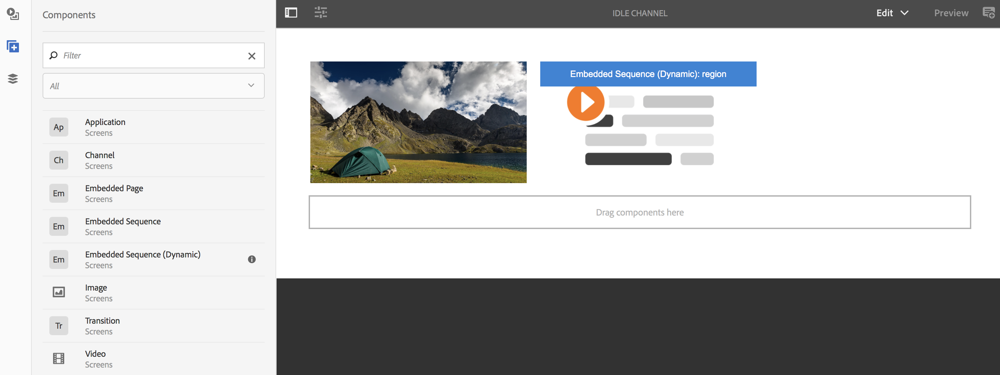
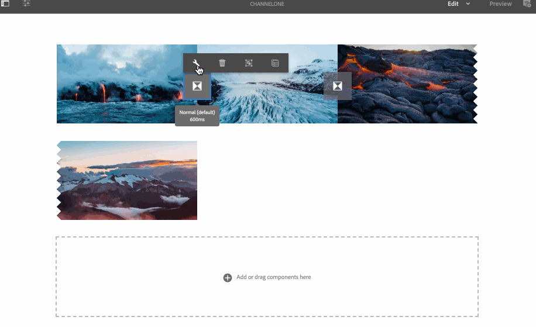

# Componenten toevoegen aan een kanaal{#adding-components-to-a-channel}

Componenten zijn de basiselementen van de AEM-ervaring (Adobe Experience Manager). U kunt een aantal componenten gebruiken en het toevoegen aan uw kanaal in een project van het Schermen AEM.

## Componenten in AEM-schermen {#components-in-aem-screens}

AEM-schermen bieden verschillende AEM-componenten die in een schermproject kunnen worden gebruikt.

### AEM-rastercomponenten weergeven {#viewing-aem-screens-components}

Wanneer u een project van de Schermen AEM creeert, zult u een lijst van standaardcomponenten zien die aan het project kunnen worden toegevoegd.

Volg onderstaande stappen om de standaardcomponenten voor uw project Schermen weer te geven:

1. Selecteer het kanaal. Bijvoorbeeld: **We.Retail in Store** —> **Channels** —> **Indle Channel**.

1. Klik op **Bewerken** op de actiebalk om de AEM-editor te openen.
1. Klik op het pictogram **+** van de zijbalk om de componenten te openen.
1. Alle componenten die door gebrek in AEM de projectiesvertoningen van Schermen inbegrepen zijn, zoals aangetoond in het hieronder cijfer.

### Een nieuwe component toevoegen {#adding-a-new-component}

AEM biedt een aantal andere componenten. U kunt altijd andere componenten (die niet standaard zijn opgenomen) aan uw project toevoegen, omdat deze compatibel zijn met AEM-schermen.

In het volgende voorbeeld wordt de toevoeging van een component Livefyre aan een AEM-rasterproject getoond:

1. Selecteer het kanaal waaraan u een nieuwe component wilt toevoegen. Bijvoorbeeld: **We.Retail in Store** —> **Channels** —> **Indle Channel**.

1. Klik op **Bewerken** op de actiebalk om de editor te openen.
1. Selecteer de **ontwerpmodus** .
1. Selecteer de volledige ontwerpredacteur op het recht en klik op het montagessymbool om de de dialoogdoos van het Ontwerp van **Speelgoed** te openen.
1. U kunt de componenten selecteren die u in uw project van de Schermen wilt invoeren AEM. In het volgende voorbeeld wordt de toevoeging van **Livefyre** -component aan een AEM Screens-project getoond.

>[!NOTE]
>
>Op dezelfde manier kunt u om het even welk aantal andere nieuwe componenten toevoegen die met Schermen AEM aan uw project compatibel zijn.

## AEM-schermcomponenten begrijpen {#understanding-aem-screen-components}

In de volgende sectie worden de componenten van AEM-schermen uitgelegd die u in uw project kunt gebruiken.

>[!NOTE]
>
>Als u de eigenschappen van een component wilt weergeven, selecteert u de component en klikt u op het hamerpictogram om eigenschappen te openen of weer te geven.

### Toepassing {#application}

Met de component **Application** kunt u een toepassing toevoegen aan uw kanaal.

Toepassingscomponent heeft de volgende eigenschappen:

| **Eigenschap** | **Beschrijving** |
|---|---|
| ***Toepassingspad*** | Selecteer het absolute pad waar de toepassing bestaat. |
| ***Duur (ms)*** | Selecteer de duur van de toepassing. Standaard is de duur ingesteld op -1, wat betekent dat het element voorgoed wordt uitgevoerd (dat wil zeggen, toepassing op één pagina). Wanneer u de waarde voor de duur > 0 instelt, wordt het element voor de opgegeven duur weergegeven en gaat u vervolgens naar de volgende waarde. |

In het volgende voorbeeld wordt getoond hoe u een toepassingscomponent insluit samen met de voorvertoning van de eigenschappen ervan:

>[!NOTE]
>
>Zie het bovenstaande voorbeeld voor de eigenschappen van elk van de onderstaande componenten.

### Kanaal {#channel}

Met de component **Kanaal** kunt u een volledig kanaal toevoegen aan uw project.

De component Channel heeft de volgende eigenschappen:

<table>
 <tbody>
  <tr>
   <td><strong>Eigenschap</strong></td>
   <td><strong>Beschrijving</strong></td>
  </tr>
  <tr>
   <td><strong><em>Kanaalpad</em></strong></td>
   <td>Selecteer dit absolute pad waar de toepassing bestaat.  </td>
  </tr>
  <tr>
   <td><strong><em>Duur (ms)</em></strong></td>
   <td>Selecteer de volledige duur van het kanaal. Als u de duur instelt op -1, wordt de volledige lengte van het ingesloten kanaal in een bepaald kanaal uitgevoerd.</td>
  </tr>
 </tbody>
</table>

### Ingesloten pagina {#embedded-page}

Met een **ingesloten pagina** kunt u een ingesloten pagina toevoegen aan uw project. Het kan bijvoorbeeld een webtoepassing of een productcatalogus zijn.

De ingesloten pagina heeft de volgende eigenschappen:

<table>
 <tbody>
  <tr>
   <td><strong>Eigenschap</strong></td>
   <td><strong>Beschrijving</strong></td>
  </tr>
  <tr>
   <td><strong><em>Pad naar pagina  </em></strong></td>
   <td>Selecteer dit absolute pad waar het kanaal bestaat.  </td>
  </tr>
  <tr>
   <td><strong><em>Duur (ms)</em></strong></td>
   <td>Selecteer de volledige duur van het kanaal. Als u de duur instelt op -1, wordt de volledige lengte van het ingesloten kanaal in een bepaald kanaal uitgevoerd.</td>
  </tr>
 </tbody>
</table>

### Ingesloten reeks {#embedded-sequence}

>[!NOTE]
>
>Raadpleeg de sectie [Ingesloten reeksen](embedded-sequences.md) onder Ontwerpschermen voor meer informatie over ingesloten reeksen.

Met een ingesloten reeks kunt u een ingesloten volgnummer toevoegen aan uw bestaande kanaal (met andere elementen).

De ingesloten reeks heeft de volgende pagina-eigenschappen:

<table>
 <tbody>
  <tr>
   <td><strong>Eigenschap</strong></td>
   <td><strong>Beschrijving</strong></td>
  </tr>
  <tr>
   <td>Kanaalpad</td>
   <td>Selecteer het absolute pad van de reeks die u in het kanaal wilt opnemen.  </td>
  </tr>
  <tr>
   <td><strong><em>Duur (ms)</em></strong></td>
   <td>Selecteer de volledige duur van het kanaal. Als u de duur instelt op -1, wordt de volledige lengte van het ingesloten kanaal in een bepaald kanaal uitgevoerd.</td>
  </tr>
  <tr>
   <td><strong><em>Strategie</em></strong></td>
   <td>Stel het in op <strong>origineel</strong> of <strong>enkelvoudig</strong>. Als u de waarde instelt op <strong>origineel</strong> , wordt de volgende waarde volledig uitgevoerd op elke cyclus van de bovenliggende reeks. De andere mogelijke waarde is <strong>single</strong> en die slechts één punt van de opeenvolging op elke looppas zou tonen (bijvoorbeeld, het eerste punt op de eerste lijn, het tweede punt op de tweede lijn, etc.)</td>
  </tr>
 </tbody>
</table>

### Dynamische ingesloten reeks {#dynamic-embedded-sequence}

Met een dynamische ingesloten reeks kunt u een reeks toevoegen die lijkt op de bovenstaande reeks, behalve met de rol van het kanaal.

Raadpleeg de sectie [Ingesloten reeksen](embedded-sequences.md) onder Ontwerpschermen voor meer informatie over ingesloten reeksen.

De dynamische ingesloten reeks heeft de volgende eigenschappen:

<table>
 <tbody>
  <tr>
   <td><strong>Eigenschap</strong></td>
   <td><strong>Beschrijving</strong></td>
  </tr>
  <tr>
   <td><strong><em>Kanaaltoewijzingsrol</em></strong>  </td>
   <td>Voer de kanaalrol in.  </td>
  </tr>
  <tr>
   <td><strong><em>Duur (ms)</em></strong></td>
   <td>Selecteer de volledige duur van het kanaal. Als u de duur instelt op -1, wordt de volledige lengte van het ingesloten kanaal in een bepaald kanaal uitgevoerd.</td>
  </tr>
  <tr>
   <td><strong><em>Strategie</em></strong></td>
   <td>Stel het in op <strong>origineel</strong> of <strong>enkelvoudig</strong>. Als u de waarde instelt op <strong>origineel</strong> , wordt de volgende waarde volledig uitgevoerd op elke cyclus van de bovenliggende reeks. De andere mogelijke waarde is <strong>single</strong> en die slechts één punt van de opeenvolging op elke looppas zou tonen (bijvoorbeeld, het eerste punt op de eerste lijn, het tweede punt op de tweede lijn, etc.)</td>
  </tr>
 </tbody>
</table>

### Ervaar fragment {#experience-fragment}

Met een ervaringsfragment kunt u een ervaringsfragment (groep van een of meer componenten, waaronder inhoud en lay-out, waarnaar op pagina&#39;s kan worden verwezen) toevoegen aan uw AEM-rasterkanaal. Sleep de component naar de AEM-editor en selecteer het ervaringsfragment.

Meer over hoe te om een ervaringsfragment tot stand te brengen en het in een project van het Scherm te gebruiken AEM, verwijs naar het [Gebruiken van de Fragmenten](experience-fragments-in-screens.md)van de Ervaring.

| **Eigenschap** | **Beschrijving** |
|---|---|
| **Ervaar fragment** |
| ***Ervaar fragment*** | Selecteer het ervaringsfragment. |
| ***Duur*** | Selecteer de volledige duur van het ervaringsfragment dat in het kanaal speelt. |
| **Offlineconfiguratie** |
| ***Client-side bibliotheken*** | Javascript- en CSS-bestanden. |
| ***Statische bestanden*** | Statische bestanden die u als offline configuraties kunt toevoegen aan uw ervaringsfragment. |

>[!NOTE]
>
>De **cliënt-zijBibliotheken** en de **Statische Dossiers** die u van deze component toevoegt zullen naast reeds gevormde **cliënt-zijBibliotheken** en de Statische Dossiers zijn die van de **Eigenschappen** van het ervaringsfragment worden toegevoegd.

### Image {#image}

Met een afbeelding kunt u een afbeelding aan het kanaal toevoegen.

Het afbeeldingselement heeft drie tabbladen, namelijk **Afbeelding**, **Toegankelijkheid** en **Reeks**:

| **Eigenschap** | **Beschrijving** |
|---|---|
| **Afbeelding** |
| ***Afbeeldingselement*** | Selecteer het afbeeldingselement. |
| ***Titel*** | Titel van de afbeelding. |
| ***Koppelen naar*** | Voeg een koppeling toe aan de afbeelding. |
| ***Beschrijving*** | Korte beschrijving voor de afbeelding. |
| ***Grootte*** | Grootte van de afbeelding. |
| **Toegankelijkheid** |
| ***Alternatieve tekst*** | Alternatieve tekst voor de afbeelding. |
| **Reeks** |
| ***Duur*** | Standaard is de duur ingesteld op *8000 ms*. Als u de afspeelduur van de afbeelding wilt wijzigen, werkt u het veld **Duur** bij. |

### Overgang {#transition}

Met de component Overgang kunt u een overgang toevoegen aan uw schermproject.

In de volgende afbeelding ziet u de overgangscomponent (die via slepen en neerzetten wordt toegevoegd) in de editor.

Selecteer het overgangspictogram en klik op het pictogram **Configureren** (moersleutel) om het dialoogvenster **Overgang** te openen. Dit dialoogvenster bevat drie tabbladen:

* **Overgang**
* **Reeks**
* **Activering**

>[!NOTE]
>
>Standaard wordt de reeks ingesteld op 600 ms. U kunt de overgangsopeenvolging aan andere waarde bijwerken gebruikend het lusje van de **Opeenvolging** .

De overgangscomponent heeft de volgende eigenschappen:

<table>
 <tbody>
  <tr>
   <td><strong>Eigenschap</strong></td>
   <td><strong>Beschrijving</strong></td>
  </tr>
  <tr>
   <td><strong>Overgang</strong></td>
   <td></td>
  </tr>
  <tr>
   <td><strong><em>Type</em></strong></td>
   <td>
Het type overgang tussen het element voor en na. Het <strong>overgangstype</strong> bevat de volgende opties:

    <ul>
     <li><strong>Normaal</strong></li>
     <li><strong>Vervagen</strong></li>
     <li><strong>Inschuiven vanaf rechterkant</strong></li>
     <li><strong>Inschuiven vanaf linkerkant</strong></li>
     <li><strong>Inschuiven vanaf bovenkant</strong></li>
     <li><strong>Inschuiven vanaf onderkant</strong></li>
    </ul> </td>
  </tr>
  <tr>
   <td><strong>Reeks</strong></td>
   <td></td>
  </tr>
  <tr>
   <td><strong><em>Duur</em></strong></td>
   <td>Selecteer de volledige duur van de overgang. De standaardwaarde is 600 ms.</td>
  </tr>
  <tr>
   <td><strong>Activering</strong></td>
   <td></td>
  </tr>
  <tr>
   <td><strong><em>Actief van</em></strong></td>
   <td>Tijdstempel dat aangeeft vanaf wanneer de overgang actief kan zijn.  </td>
  </tr>
  <tr>
   <td><strong><em>Actief tot</em></strong></td>
   <td>Tijdstempel dat aangeeft tot wanneer de overgang actief kan zijn.</td>
  </tr>
  <tr>
   <td><strong><em>Schema</em></strong></td>
   <td>Voeg een vooraf gedefinieerd schema toe.</td>
  </tr>
 </tbody>
</table>

### Video {#video}

Met de component Video kunt u een video toevoegen aan uw schermproject.

De videocomponent heeft de volgende eigenschappen:

<table>
 <tbody>
  <tr>
   <td><strong>Eigenschap</strong></td>
   <td><strong>Beschrijving</strong></td>
  </tr>
  <tr>
   <td><em><strong>Video-element</strong></em></td>
   <td>Selecteer de koppeling naar de video.</td>
  </tr>
  <tr>
   <td><em><strong>Duur</strong></em></td>
   <td>Selecteer de duur van de video. Standaard is de duur ingesteld op -1, wat betekent dat het element altijd wordt uitgevoerd. Wanneer u de waarde voor de duur &gt; 0 instelt, wordt het element voor de opgegeven duur weergegeven en gaat u vervolgens naar de volgende waarde.  </td>
  </tr>
  <tr>
   <td><em><strong>Renderen</strong></em></td>
   <td>
Als de hoogte-breedteverhouding van de video niet op het scherm past, kunt u de rendering aanpassen zodat deze <strong>bevat</strong> of <strong>bedekt</strong>is.
 
<em>Bevat</em> betekent dat de volledige video wordt weergegeven en de ontbrekende gebieden worden opgevuld met een zwarte rand.
 
<em>Omslag</em> betekent dat de video de hele viewport bedekt, maar dat bepaalde onderdelen die aan de zijkanten overlopen, verborgen zijn.
 </td>
  </tr>
  <tr>
   <td><em><strong>Grootte</strong></em></td>
   <td>Grootte van de video.</td>
  </tr>
 </tbody>
</table>

