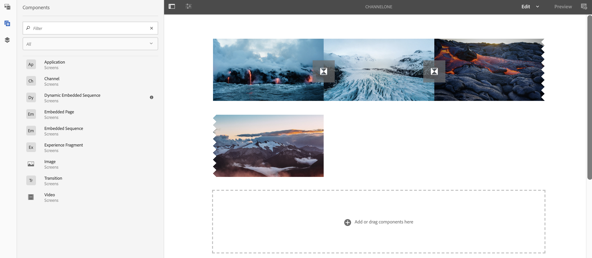

# Componenten toevoegen aan een kanaal{#adding-components-to-a-channel}

Componenten zijn de basiselementen van de AEM (Adobe Experience Manager)-ervaring. U kunt een aantal componenten gebruiken en het toevoegen aan uw kanaal in een project van AEM Screens.

## Componenten in AEM Screens {#components-in-aem-screens}

AEM Screens biedt verschillende AEM componenten die in een Screens-project kunnen worden gebruikt.

### AEM Screens-componenten bekijken {#viewing-aem-screens-components}

Wanneer u een project van AEM Screens creeert, zult u een lijst van standaardcomponenten zien die aan het project kunnen worden toegevoegd.

Volg onderstaande stappen om de standaardcomponenten voor uw project Schermen weer te geven:

1. Selecteer het kanaal. Bijvoorbeeld **We.Retail in Store** —> **Kanalen** —> **Niet-actief kanaal**.

1. Klik **Bewerken** van de actiebar om de AEM redacteur te openen.
1. Klik op het pictogram **+** van de zijbalk om de componenten te openen.
1. Alle componenten die door gebrek in een het projectvertoningen van AEM Screens inbegrepen zijn, zoals aangetoond in het hieronder cijfer.

### Een nieuwe component toevoegen {#adding-a-new-component}

AEM verstrekt een aantal andere componenten. U kunt altijd andere componenten (die niet standaard zijn opgenomen) aan uw project toevoegen, omdat deze compatibel zijn met AEM Screens.

In het volgende voorbeeld wordt de toevoeging van een component Livefyre aan een AEM Screens-project getoond:

1. Selecteer het kanaal waaraan u een nieuwe component wilt toevoegen. Bijvoorbeeld **We.Retail in Store** —> **Kanalen** —> **Niet-actief kanaal**.

1. Klik **Bewerken** van de actiebar om de redacteur te openen.
1. Selecteer **Modus Ontwerp**.
1. Selecteer de volledige ontwerpredacteur op het recht en klik op het montagessymbool om **ParSys Design** dialoogdoos te openen.
1. U kunt de componenten selecteren die u in uw AEM Screens-project wilt importeren. Het volgende voorbeeld toont de toevoeging van **Livefyre** component aan een project van AEM Screens.

>[!NOTE]
>
>Op dezelfde manier kunt u om het even welk aantal andere nieuwe componenten toevoegen die met AEM Screens aan uw project compatibel zijn.

## Schermcomponenten AEM {#understanding-aem-screen-components}

In de volgende sectie worden de AEM Screens-componenten uitgelegd die u in uw project kunt gebruiken.

>[!NOTE]
>
>Als u de eigenschappen van een component wilt weergeven, selecteert u de component en klikt u op het hamerpictogram om eigenschappen te openen of weer te geven.

### Toepassing {#application}

Met de component **Application** kunt u een toepassing toevoegen aan uw kanaal.

Toepassingscomponent heeft de volgende eigenschappen:

| **Eigenschap** | **Beschrijving** |
|---|---|
| ***Toepassingspad*** | Selecteer het absolute pad waar de toepassing bestaat. |
| ***Duur (ms)*** | Selecteer de duur van de toepassing. Standaard is de duur ingesteld op -1, wat betekent dat het element voorgoed wordt uitgevoerd (dat wil zeggen, toepassing op één pagina). Wanneer u de waarde voor de duur > 0 instelt, wordt het element voor de opgegeven duur weergegeven en gaat u vervolgens naar de volgende waarde. |

In het volgende voorbeeld wordt getoond hoe u een toepassingscomponent insluit samen met de voorvertoning van de eigenschappen ervan:

>[!NOTE]
>
>Zie het bovenstaande voorbeeld voor de eigenschappen van elk van de onderstaande componenten.

### Kanaal {#channel}

Met de component **Channel** kunt u een volledig kanaal aan uw project toevoegen.

De component Channel heeft de volgende eigenschappen:

<table>
 <tbody>
  <tr>
   <td><strong>Eigenschap</strong></td>
   <td><strong>Beschrijving</strong></td>
  </tr>
  <tr>
   <td><strong><em>Kanaalpad</em></strong></td>
   <td>Selecteer dit absolute pad waar de toepassing bestaat.  </td>
  </tr>
  <tr>
   <td><strong><em>Duur (ms)</em></strong></td>
   <td>Selecteer de volledige duur van het kanaal. Als u de duur instelt op -1, wordt de volledige lengte van het ingesloten kanaal in een bepaald kanaal uitgevoerd.</td>
  </tr>
 </tbody>
</table>

### Ingesloten pagina {#embedded-page}

Met een **Ingesloten pagina** kunt u een ingesloten pagina toevoegen aan uw project. Het kan bijvoorbeeld een webtoepassing of een productcatalogus zijn.

De ingesloten pagina heeft de volgende eigenschappen:

<table>
 <tbody>
  <tr>
   <td><strong>Eigenschap</strong></td>
   <td><strong>Beschrijving</strong></td>
  </tr>
  <tr>
   <td><strong><em>Pad naar pagina  </em></strong></td>
   <td>Selecteer dit absolute pad waar het kanaal bestaat.  </td>
  </tr>
  <tr>
   <td><strong><em>Duur (ms)</em></strong></td>
   <td>Selecteer de volledige duur van het kanaal. Als u de duur instelt op -1, wordt de volledige lengte van het ingesloten kanaal in een bepaald kanaal uitgevoerd.</td>
  </tr>
 </tbody>
</table>

### Ingesloten reeks {#embedded-sequence}

>[!NOTE]
>
>Raadpleeg [Ingesloten reeksen](embedded-sequences.md) onder sectie Ontwerpschermen voor meer informatie over ingesloten reeksen.

Met een ingesloten reeks kunt u een ingesloten volgnummer toevoegen aan uw bestaande kanaal (met andere elementen).

De ingesloten reeks heeft de volgende pagina-eigenschappen:

<table>
 <tbody>
  <tr>
   <td><strong>Eigenschap</strong></td>
   <td><strong>Beschrijving</strong></td>
  </tr>
  <tr>
   <td>Kanaalpad</td>
   <td>Selecteer de absolute weg van de opeenvolging die u in uw kanaal wilt omvatten.  </td>
  </tr>
  <tr>
   <td><strong><em>Duur (ms)</em></strong></td>
   <td>Selecteer de volledige duur van het kanaal. Als u de duur instelt op -1, wordt de volledige lengte van het ingesloten kanaal in een bepaald kanaal uitgevoerd.</td>
  </tr>
  <tr>
   <td><strong><em>Strategie</em></strong></td>
   <td>Stel dit in op <strong>original</strong> of <strong>single</strong>. Als u de waarde instelt op <strong>original</strong>, betekent dit dat de volgende waarde volledig wordt uitgevoerd op elke cyclus van de bovenliggende reeks. De andere mogelijke waarde is <strong>single</strong> en die slechts één punt van de opeenvolging op elke looppas zouden tonen (bijvoorbeeld, het eerste punt op de eerste lijn, het tweede punt op de tweede lijn, etc.)</td>
  </tr>
 </tbody>
</table>

### Dynamische ingesloten reeks {#dynamic-embedded-sequence}

Met een dynamische ingesloten reeks kunt u een reeks toevoegen die lijkt op de bovenstaande reeks, behalve met de rol van het kanaal.

Raadpleeg [Ingesloten reeksen](embedded-sequences.md) onder sectie Ontwerpschermen voor meer informatie over ingesloten reeksen.

De dynamische ingesloten reeks heeft de volgende eigenschappen:

<table>
 <tbody>
  <tr>
   <td><strong>Eigenschap</strong></td>
   <td><strong>Beschrijving</strong></td>
  </tr>
  <tr>
   <td><strong><em>Kanaaltoewijzingsrol</em></strong>  </td>
   <td>Voer de kanaalrol in.  </td>
  </tr>
  <tr>
   <td><strong><em>Duur (ms)</em></strong></td>
   <td>Selecteer de volledige duur van het kanaal. Als u de duur instelt op -1, wordt de volledige lengte van het ingesloten kanaal in een bepaald kanaal uitgevoerd.</td>
  </tr>
  <tr>
   <td><strong><em>Strategie</em></strong></td>
   <td>Stel dit in op <strong>original</strong> of <strong>single</strong>. Als u de waarde instelt op <strong>original</strong>, betekent dit dat de volgende waarde volledig wordt uitgevoerd op elke cyclus van de bovenliggende reeks. De andere mogelijke waarde is <strong>single</strong> en die slechts één punt van de opeenvolging op elke looppas zouden tonen (bijvoorbeeld, het eerste punt op de eerste lijn, het tweede punt op de tweede lijn, etc.)</td>
  </tr>
 </tbody>
</table>

### Ervaar fragment {#experience-fragment}

Met een ervaringsfragment kunt u een ervaringsfragment (groep van een of meer componenten, waaronder inhoud en lay-out, waarnaar op pagina&#39;s kan worden verwezen) toevoegen aan uw AEM Screens-kanaal. Sleep de component naar AEM editor en selecteer het ervaringsfragment.

Meer over hoe te om een ervaringsfragment tot stand te brengen en het in een project van AEM Screens te gebruiken, verwijs naar [Gebruikend de Fragments van de Ervaring](experience-fragments-in-screens.md).

| **Eigenschap** | **Beschrijving** |
|---|---|
| **Ervaar fragment** |
| ***Ervaar fragment*** | Selecteer het ervaringsfragment. |
| ***Duur*** | Selecteer de volledige duur van het ervaringsfragment dat in het kanaal speelt. |
| **Offlineconfiguratie** |
| ***Client-side bibliotheken*** | Javascript- en CSS-bestanden. |
| ***Statische bestanden*** | Statische bestanden die u als offline configuraties kunt toevoegen aan uw ervaringsfragment. |

>[!NOTE]
>
>De **Client-side bibliotheken** en de **Statische bestanden** die u uit deze component toevoegt, worden toegevoegd naast de reeds geconfigureerde **Client-side bibliotheken** en de statische bestanden die worden toegevoegd uit de **Eigenschappen** van het ervaringsfragment.

### Afbeelding {#image}

Met een afbeelding kunt u een afbeelding aan het kanaal toevoegen.

Het afbeeldingselement heeft drie tabbladen: **Afbeelding**, **Toegankelijkheid** en **Reeks**:

| **Eigenschap** | **Beschrijving** |
|---|---|
| **Afbeelding** |
| ***Afbeeldingselement*** | Selecteer het afbeeldingselement. |
| ***Titel*** | Titel van de afbeelding. |
| ***Koppelen naar*** | Voeg een koppeling toe aan de afbeelding. |
| ***Beschrijving*** | Korte beschrijving voor de afbeelding. |
| ***Grootte*** | Grootte van de afbeelding. |
| **Toegankelijkheid** |
| ***Alternatieve tekst*** | Alternatieve tekst voor de afbeelding. |
| **Reeks** |
| ***Duur*** | Standaard wordt de duur ingesteld op *8000 ms*. Als u de afspeelduur van de afbeelding wilt wijzigen, werkt u het veld **Duur** bij. |

### Overgang {#transition}

Met de component Overgang kunt u een overgang toevoegen aan uw schermproject.

In de volgende afbeelding ziet u de overgangscomponent (die via slepen en neerzetten wordt toegevoegd) in de editor.

Selecteer het overgangspictogram en klik **Configureer** (moersleutelpictogram) om het dialoogvenster **Overgang** te openen. Dit dialoogvenster bevat drie tabbladen:

* **Overgang**
* **Reeks**
* **Activering**

>[!NOTE]
>
>Standaard wordt de reeks ingesteld op 600 ms. U kunt de overgangsopeenvolging aan andere waarde bijwerken gebruikend **Opeenvolging** tabel.

De overgangscomponent heeft de volgende eigenschappen:

<table>
 <tbody>
  <tr>
   <td><strong>Eigenschap</strong></td>
   <td><strong>Beschrijving</strong></td>
  </tr>
  <tr>
   <td><strong>Overgang</strong></td>
   <td></td>
  </tr>
  <tr>
   <td><strong><em>Type</em></strong></td>
   <td>
Het type overgang tussen het element voor en na. De overgang <strong>Type</strong> bevat de volgende opties:

    <ul>
     <li><strong>Normaal</strong></li>
     <li><strong>Vervagen</strong></li>
     <li><strong>Inschuiven vanaf rechterkant</strong></li>
     <li><strong>Inschuiven vanaf linkerkant</strong></li>
     <li><strong>Inschuiven vanaf bovenkant</strong></li>
     <li><strong>Inschuiven vanaf onderkant</strong></li>
    </ul> </td>
  </tr>
  <tr>
   <td><strong>Reeks</strong></td>
   <td></td>
  </tr>
  <tr>
   <td><strong><em>Duur</em></strong></td>
   <td>Selecteer de volledige duur van de overgang. De standaardwaarde is 600 ms.</td>
  </tr>
  <tr>
   <td><strong>Activering</strong></td>
   <td></td>
  </tr>
  <tr>
   <td><strong><em>Actief van</em></strong></td>
   <td>Tijdstempel dat aangeeft vanaf wanneer de overgang actief kan zijn.  </td>
  </tr>
  <tr>
   <td><strong><em>Actief tot</em></strong></td>
   <td>Tijdstempel dat aangeeft tot wanneer de overgang actief kan zijn.</td>
  </tr>
  <tr>
   <td><strong><em>Schema</em></strong></td>
   <td>Voeg een vooraf gedefinieerd schema toe.</td>
  </tr>
 </tbody>
</table>

### Video {#video}

Met de component Video kunt u een video toevoegen aan uw schermproject.

De videocomponent heeft de volgende eigenschappen:

<table>
 <tbody>
  <tr>
   <td><strong>Eigenschap</strong></td>
   <td><strong>Beschrijving</strong></td>
  </tr>
  <tr>
   <td><em><strong>Video-element</strong></em></td>
   <td>Selecteer de koppeling naar de video.</td>
  </tr>
  <tr>
   <td><em><strong>Duur</strong></em></td>
   <td>Selecteer de duur van de video. Standaard is de duur ingesteld op -1, wat betekent dat het element altijd wordt uitgevoerd. Als u de waarde voor de duur &gt; 0 instelt, wordt het element voor de opgegeven duur weergegeven en gaat u vervolgens naar de volgende waarde.  </td>
  </tr>
  <tr>
   <td><em><strong>Renderen</strong></em></td>
   <td>
Als de hoogte-breedteverhouding van de video niet op het scherm past, kunt u de rendering instellen op <strong>contain</strong> of <strong>cover</strong>.
 
<em>Met </em> Container wordt de volledige video weergegeven en worden de ontbrekende gebieden opgevuld met een zwarte rand.
 
<em>De </em> video dekt de gehele viewport, maar sommige onderdelen die aan de zijkanten overlopen, zijn verborgen.
 </td>
  </tr>
  <tr>
   <td><em><strong>Grootte</strong></em></td>
   <td>Grootte van de video.</td>
  </tr>
 </tbody>
</table>

