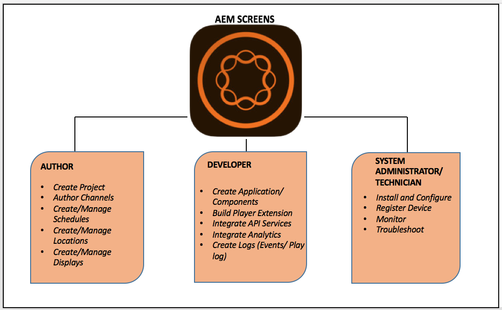

# Wat is Adobe Experience Manager Screens?{#what-is-aem-screens}

**Experience Managers Screens** - een Digital Signage-oplossing waarmee u dynamische en interactieve digitale ervaringen en interacties met verschillende soorten schermen kunt publiceren, allemaal op een uitgebreid digitaal marketingplatform.

Ga aan de slag met een eenvoudige digitale handtekening, met [Kickstart voor AEM Screens](kickstart-for-aem-screens.md).

Om te leren hoe te om uw Experience Managers Screens project in as a Cloud Service Experience Manager te vormen en te creëren, zie [hier](https://experienceleague.adobe.com/en/docs/experience-manager-screens/using/about-guide).

## Overzicht {#overview}

**Experience Managers Screens** is gebouwd op de solide basis van ***Experience Manager Sites***. Het stelt marketers en IT-personeel in staat om ervaringen te creëren en te beheren op meerdere digitale schermen die van invloed zijn op in-store/in-venue doelstellingen voor het opbouwen van merken en het stimuleren van de vraag. De integratie van Experience Managers Screens met Plaatsen laat u bestaande inhoud hergebruiken en effectief een coherente en verenigbare klantenoplossing leveren. Dit biedt een gestroomlijnde workflow voor het maken van speciale digitale ervaringen die zeer kosteneffectief en bruikbaar zijn. Het helpt ook de merkperceptie en invloed beslissingen te beïnvloeden die tot opleving in aankoop en betrokkenheid leiden.

Experience Managers Screens is een krachtige webgebaseerde oplossing waarmee u speciale digitale menuborden, productadviseurs en achtergrondafbeeldingen kunt maken om de interactie van klanten uit te breiden. Het helpt u verenigde en nuttige merkervaringen in fysieke plaatsen, zoals winkels, hotels, banken, gezondheidszorg en onderwijsinstellingen, en nog veel meer - van het zelfde platform van de Experience Manager te leveren. De schermen verstrekken vele unieke toepassingen zoals interactieve vertoningen, manier-vinden, branding, en het toevoegen van ambience aan uw milieu voor klanten en werknemers die op het domein worden gebaseerd waar deze worden opgesteld.

Het maken en beheren van een toepassing met behulp van Experience Managers Screens is eenvoudig en intuïtief. An *toepassing* gastheren Web-pagina&#39;s die voor Experience Managers Screens door klanten of implementatiepartners worden gebouwd. *Locaties* vooraf gedefinieerde hiërarchieën beheren en *displays*. Elke weergave heeft een dashboard waarop verschillende apparaten en schermen worden weergegeven. Inhoud voor Experience Managers Screens wordt beheerd in *kanalen*. De Speler van Experience Managers Screens geeft inhoud terug binnen kanalen op vertoningen.

Om de belangrijkste terminologieën te begrijpen verbonden aan Experience Managers Screens, zie [Verklarende woordenlijst](screens-glossary.md).

### Architectuur van schermspeler

Het volgende diagram toont de algemene architectuur van een speler van Experience Managers Screens:

### Maak over 5 minuten een digitale signaalervaring {#create-a-digital-signage-experience-in-minutes}

Als u een demo Screens-project wilt maken en uw inhoud in de Schermspeler wilt publiceren, raadpleegt u [Kickstart voor Experience Managers Screens](kickstart-for-aem-screens.md).

## Een nieuw project voor Experience Managers Screens starten {#starting-a-new-aem-screens-project}

Voor het starten van een nieuwe digitale ondertekeningservaring is een samenhang van rollen vereist voordat deze klaar is voor consumptie. De volgende rollen bieden een beginpunt voor het maken van een project Screens:

* **Auteur**
* **Ontwikkelaar**
* **Systeembeheerder/technicus**

Het volgende cijfer bepaalt de karakters en hun rollen voor Experience Managers Screens.

## Overige bronnen {#additional-resources}

* **Essentiële elementen voor implementatie met instructies**

  Volg het geleide leerpad **[Essentiële elementen voor implementatie van Experience Managers Screens](https://experienceleague.adobe.com/?launch=AEM-7a)** die fundamentele en geavanceerde functies omvat die in Experience Managers Screens worden ondersteund.

* **Best Practices Guide for Experience Managers Screens projects**

  Volgen **[Best Practices Guide for Experience Managers Screens projects](/help/using/about-guide.md)** dat bedoeld is om gemeenschappelijke valkuilen te identificeren terwijl het uitvoeren van een project van Experience Managers Screens. Het materiaal concentreert zich hoofdzakelijk op de Rollen en de Verantwoordelijkheden van het Project, RACI Grafiek voor de Verschillende Configuraties van het Platform van de Experience Manager van Rollen, en Steun en Controle.

<!-- DEAD LINK * **New Adobe Customer Support Experience**

   Follow **[Customer One for Enterprise Help](https://docs.adobe.com/content/help/en/customer-one/using/home.htmlhome.html#)** to learn more about Admin Console Support tickets. -->
