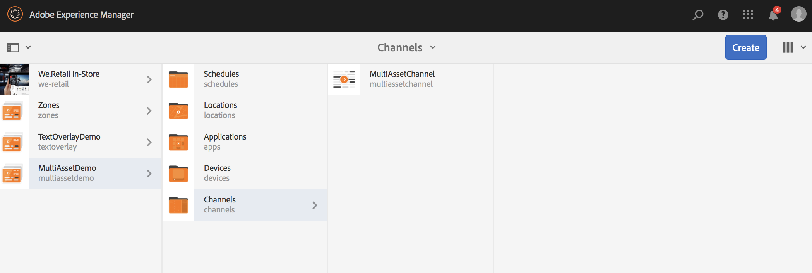

# Activering van middelenniveau {#asset-level-scheduling}

Deze pagina beschrijft activering op middelenniveau voor de middelen die in Kanalen worden gebruikt.

De volgende onderwerpen worden behandeld in deze sectie:

* Overzicht
* Activeringsvenster
* Afspelen van één gebeurtenis
* Herhaling van activa afhandelen
   * DayParting
   * WeekParting
   * MonthParting
   * Combinatie van partners
* Activering van meerdere middelen
* Globale overschrijving voor universele begintijd

>[!CAUTION]
>
>Deze AEM Screens-functionaliteit is alleen beschikbaar als u AEM 6.3 Feature Pack 3 of AEM 6.4 Screens Feature Pack 1 hebt geïnstalleerd.
>
>Als u toegang wilt krijgen tot dit pakket functies, moet u contact opnemen met de Adobe Support en toegang aanvragen. Als u beschikt over de juiste machtigingen, kunt u deze downloaden via Pakket delen.

## Overzicht {#overview}

***Activering van middelenniveau***, kunt u een specifiek middel in een kanaal activeren voor een gepland tijdkader in de lokale tijdzone van de speler. Dit is beschikbaar voor afbeeldingen, video&#39;s, overgangen, pagina&#39;s en ingesloten kanalen (dynamisch of statisch).

*Bijvoorbeeld*, wilt u dat een speciale promotie alleen tijdens het gelukkig uur (23.00 uur tot 17.00 uur) op maandag en woensdag wordt weergegeven.

Met deze functie kunt u niet alleen de begin- en einddatum en -tijd opgeven, maar ook een herhalingspatroon.

## Activeringsvenster {#single-event-playback}

Activering van middelenniveau wordt uitgevoerd door de **Activering** te gebruiken tijdens het openen van eigenschappen van een element.

Voer de onderstaande stappen uit om de middelenplanning uit te voeren:

1. Selecteer een kanaal en klik op **Bewerken** in de actiebalk om inhoud aan uw kanaal toe te voegen of te bewerken.

   

   >[!NOTE]
   >
   >Meer informatie over hoe u
   >
   >* Een project maken, zie [Een nieuw project maken](creating-a-screens-project.md).
   >* Inhoud maken en toevoegen aan een kanaal, zie [Kanalen beheren](managing-channels.md).

1. Klikken **Bewerken** om de kanaaleditor te openen en een element te selecteren waarop u het plannen wilt toepassen.

   

1. Selecteer het element en klik linksboven **Configureren** (moersleutelpictogram) om de eigenschappen van de afbeelding te openen.

   Klik op de knop **Activering** tab.

   

1. U kunt de datum vanaf de datumkiezer opgeven met **Actief van** en **Actief tot** velden.

   Als u **Actief van** en **Actief tot** datum en tijd, zal het activa tonen en slechts lijn tussen die begindatum/tijd en einddatum/tijd respectievelijk.

   

## Herhaling van activa afhandelen {#handling-recurrence-in-assets}

U kunt ook bepalen dat de middelen elke dag, week of maand opnieuw worden uitgevoerd, afhankelijk van uw vereisten.

Stel dat u een afbeelding alleen op vrijdag van 13.00 tot 19.00 uur wilt weergeven. U kunt de **Activering** om het gewenste herhalingsinterval voor uw element in te stellen.

### Dagverdeling {#day-parting}

1. Selecteer het element en klik op **Configureren** (moersleutelpictogram) om het dialoogvenster Eigenschappen te openen.

1. Na het ingaan van de begindatum/de tijd en eind/datumtijd, kunt u een uitdrukking of een natuurlijke tekstversie gebruiken om uw herhalingsprogramma te specificeren.

   >[!NOTE]
   >U kunt de **Actief van** en **Actief tot** en voeg de expressie toe aan het veld Planningen, naar wens.

1. Voer de expressie in de **Schema** en uw middel zal voor het bepaalde interval van dag en tijd tonen.

#### Voorbeeldexpressies voor dagparatie {#example-one}

In de volgende tabel worden enkele voorbeeldexpressies samengevat die u aan het schema kunt toevoegen terwijl u kanaal toewijst aan een weergave.

| **Uitdrukking** | **Interpretatie** |
|---|---|
| vóór 8:00 | het middel in het kanaal speelt vóór 20:00 uur dagelijks |
| 14:00 | het middel in het kanaal speelt na 2:00 pm dagelijks af |
| na 12:15 en vóór 12:45 | het middel in het kanaal speelt na 12:15 elke dag gedurende 30 minuten af |
| vóór 12:15 ook na 12:45 | het middel in het kanaal speelt vóór 12:15 elke dag en dan ook na 12:45 uur af |

>[!NOTE]
>
>U kunt ook _militaire tijd_ notatie (dat wil zeggen 14:00) in plaats van *am/pm* notatie (dat wil zeggen, 14:00 uur).

### WeekParting {#week-parting}

1. Selecteer het element en klik op **Configureren** (moersleutelpictogram) om het dialoogvenster Eigenschappen te openen.

1. Na het ingaan van de begindatum/de tijd en eind/datumtijd, kunt u een uitdrukking of een natuurlijke tekstversie gebruiken om uw herhalingsprogramma te specificeren.

   >[!NOTE]
   >U kunt de **Actief van** en **Actief tot** en voeg de expressie toe aan het veld Planningen, naar wens.

1. Voer de expressie in de **Schema** en uw middel zal voor het bepaalde interval van dag en tijd tonen.

#### Voorbeelden van expressies voor WeekParting {#example-two}

In de volgende tabel worden enkele voorbeeldexpressies samengevat die u aan het schema kunt toevoegen terwijl u kanaal toewijst aan een weergave.

| **Uitdrukking** | **Interpretatie** |
|---|---|
| Ma,Wed,Fri | de activa spelen in het kanaal vanaf maandag, woensdag en vrijdag |
| Mon-Thu | de activa spelen in het kanaal van op Maandagen aan Donderdag |

>[!NOTE]
>
>U kunt ook _volledig_ notatie (dat wil zeggen maandag,woensdag,vrijdag) in plaats van _kortzichtig_ notatie (dat wil zeggen: Mon,Wed,Fri).

### MonthParting {#month-parting}

1. Selecteer het element en klik op **Configureren** (moersleutelpictogram) om het dialoogvenster Eigenschappen te openen.

1. Na het ingaan van de begindatum/de tijd en eind/datumtijd, kunt u een uitdrukking of een natuurlijke tekstversie gebruiken om uw herhalingsprogramma te specificeren.

   >[!NOTE]
   >U kunt de **Actief van** en **Actief tot** en voeg de expressie toe aan het veld Planningen, naar wens.

1. Voer de expressie in de **Schema** en uw middel zal voor het bepaalde interval van dag en tijd tonen.

#### Voorbeelden van expressies voor MonthParting {#example-three}

In de volgende tabel worden enkele voorbeeldexpressies samengevat die u aan het schema kunt toevoegen terwijl u kanaal toewijst aan een weergave.

| **Uitdrukking** | **Interpretatie** |
|---|---|
| van februari,mei,augustus,november | de activa spelen in februari, mei, augustus en november op het kanaal |
| van februari-juli | het actief vanaf februari tot eind juli op het kanaal wordt afgespeeld |

>[!NOTE]
>Wanneer u dagen van de week en maanden definieert, kunt u zowel de korte als de volledige-naamnotatie gebruiken, zoals Mon/Maandag en januari.

### Combinatie van partners {#combined-parting}

1. Selecteer het element en klik op **Configureren** (moersleutelpictogram) om het dialoogvenster Eigenschappen te openen.

1. Na het ingaan van de begindatum/de tijd en eind/datumtijd, kunt u een uitdrukking of een natuurlijke tekstversie gebruiken om uw herhalingsprogramma te specificeren.

   >[!NOTE]
   >U kunt de **Actief van** en **Actief tot** en voeg de expressie toe aan het veld Planningen, naar wens.

1. Voer de expressie in de **Schema** en uw middel zal voor het bepaalde interval van dag en tijd tonen.

#### Voorbeelden van expressies voor de combinatie van delen {#example-four}

In de volgende tabel worden enkele voorbeeldexpressies samengevat die u aan het schema kunt toevoegen terwijl u kanaal toewijst aan een weergave.

| **Uitdrukking** | **Interpretatie** |
|---|---|
| na 6.00 uur en vóór 18.00 uur op de maan,Wed van Jan-Mar | de activa spelen in het kanaal tussen 6.00 uur en 6.00 uur op maandag en woensdag van januari tot en met eind maart |
| op de eerste dag van januari na 23.00 uur ook op de tweede dag van januari, ook op de derde dag van januari vóór 15.00 uur | het middel in het kanaal begint na 1 januari om 2:00 uur af te spelen, blijft de hele dag afspelen op 2 januari tot 3:00 uur op 3 januari |
| op de 1-2 dag van januari na 2:00 uur, ook op de 2-3 dag van januari vóór 15.00 uur | Het middel in het kanaal begint speler na 1 januari om 2:00 uur, blijft spelen tot 2 januari om 3:00 uur, dan begint het opnieuw op 2 januari om 2:00 uur en blijft spelen tot 3:00 uur op 3 januari |

>[!NOTE]
>Wanneer u dagen van de week en maanden definieert, kunt u zowel de korte als de volledige-naamnotatie gebruiken, zoals Mon/Maandag en januari.  Bovendien kunt u ook _militaire tijd_ notatie (dat wil zeggen 14:00) in plaats van *am/pm* notatie (dat wil zeggen, 14:00 uur).

## Activering van meerdere middelen {#multi-asset-scheduling}

>[!CAUTION]
>
>De **Activering van meerdere middelen** Deze functie is alleen beschikbaar als u AEM 6.3 Feature Pack 5 of AEM 6.4 Feature Pack 3 hebt geïnstalleerd.

***Activering van meerdere middelen*** Hiermee kan de gebruiker meerdere elementen selecteren en een afspeelschema toepassen op alle geselecteerde elementen.

### Vereisten {#prerequisites}

Als u activering op meerdere niveaus voor uw middelen wilt gebruiken, maakt u een AEM Screens-project met een volgnummer. In het volgende voorbeeld wordt de implementatie van de functie getoond:

* Een AEM Screens-project maken met de naam **MultiAssetDemo**
* Een kanaal maken met de naam **MultiAssetChannel** en voeg inhoud aan het kanaal toe, zoals aangetoond in hieronder figuur

Voer de onderstaande stappen uit om meerdere elementen te selecteren en de weergave ervan in een AEM Screens-project te plannen:

1. Selecteren **MultiAssetChannel** en klik op **Bewerken** in de actiebalk om de editor te openen.

   

1. Selecteer meerdere elementen in de editor en klik op **Activering bewerken** (pictogram linksboven).

   

1. Selecteer de datum en tijd in **Actief van** en **Actief tot** van de **Componentactivering** in. Klik op het pictogram van het vinkje wanneer u klaar bent met het selecteren van de schema&#39;s.

   

1. Klik verfrissen om de activa te controleren waarop multi-activa programma wordt toegepast.

   >[!NOTE]
   >
   >Het planningspictogram is in de rechterbovenhoek zichtbaar voor de elementen die worden geactiveerd met meerdere elementen.

   

## Globale overschrijving voor universele begintijd {#global-override-scheduling}

***Algemene Overschrijving voor universele begintijd***, is een instelling waarmee de auteur van de inhoud het afspelen van een afbeelding of video-element kan definiëren op basis van een specifieke tijd. De tijd-/tijdzone-instelling van een afzonderlijke speler wordt niet gebruikt.

Doorgaans wordt het afspelen bepaald door de lokale tijd van een bepaalde speler, maar met de algemene overschrijving kan een specifieke, universele begintijd worden gebruikt om het afspelen van het element te starten.

Op deze manier kan de auteur van de inhoud het afspelen van een bepaald element aanduiden als actief op een bepaalde datum/tijd, ongeacht de lokale klok, op alle spelers met de toegewezen inhoud.

De globale Opheffing voor de Universele Tijd van het Begin wordt gedaan door te vormen **Activering** te gebruiken tijdens het openen van eigenschappen van een element. Voer de onderstaande stappen uit om een globale overschrijving uit te voeren voor het plannen van elementen:

1. Selecteer een kanaal en klik op **Bewerken** in de actiebalk om inhoud aan uw kanaal toe te voegen of te bewerken.

   

1. Klikken **Bewerken** om de kanaaleditor te openen en een element te selecteren waarop u het plannen wilt toepassen.

   

1. Voer voor een globale overschrijving de activeringstijd in het dialoogvenster **Tijdzoneoverschrijving** voor het element. Als u niets op dit gebied ingaat, wordt de toegepaste tijdzone de tijdzone van de speler.

