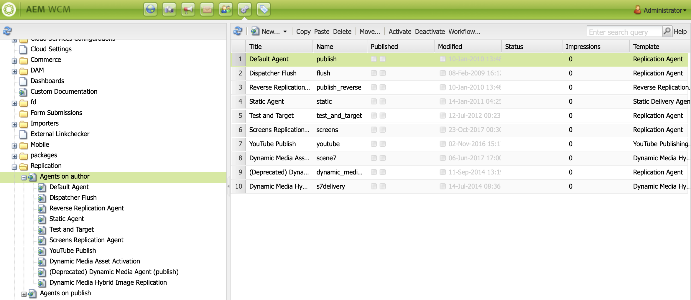

# Auteur- en Publish-instanties configureren in AEM Screens {#configuring-author-and-publish-in-aem-screens}

Deze pagina benadrukt de volgende onderwerpen:

* **het Vormen de Instanties van de Auteur en van Publish**
* **de Topologie van Publish van de Vestiging**
* **het Leiden Publicatie: Het leveren van de Updates van de Inhoud van Auteur aan Publish aan Apparaat**

## Vereisten {#prerequisites}

Voordat u aan de slag gaat met Auteur- en Publish-servers, hebt u eerst kennis van:

* **AEM Topology**
* **Creërend en het Leiden het Project van AEM Screens**
* **Proces van de Registratie van het Apparaat**

>[!NOTE]
>
>Deze AEM Screens-functionaliteit is alleen beschikbaar als u AEM 6.4 Screens Feature Pack 2 hebt geïnstalleerd. Neem contact op met de Adobe voor ondersteuning en vraag toegang tot dit functiepakket. Nadat u toestemming hebt, kunt u het van het Aandeel van het Pakket downloaden.

>[!IMPORTANT]
>
>Als u meer dan één Publish-exemplaar met Dispatcher wilt gebruiken, werkt u de Dispatcher bij. Zie [ toelatend Vaste Zittingen ](dispatcher-configurations-aem-screens.md#enable-sticky-session).

## Author- en Publish-instanties configureren {#configuring-author-and-publish-instances}

>[!NOTE]
>
>Meer over het architecturale overzicht van de Auteur en van Publish leren en hoe de inhoud op een AEM instantie van de Auteur en dan voorwaarts-gerepliceerd aan veelvoudige instanties van Publish wordt geschreven, zie [ het Overzicht van de Architectuur van de Auteur en van Publish ](author-publish-architecture-overview.md).

De volgende sectie verklaart hoe te opstellings replicatieagenten op de topologie van de Auteur en van Publish.

U kunt een eenvoudig voorbeeld instellen, waarin u een auteur en twee Publish-instanties host:

* Auteur > localhost:4502
* Publish 1 (pub1) > localhost:4503
* Publish 2 (pub2) > localhost:4504

## Replication Agents instellen op auteur {#setting-replication-agents}

Om replicatieagenten tot stand te brengen, leer hoe te om een standaardreplicatieagent tot stand te brengen.

Er zijn drie replicatieagenten die voor Screens nodig zijn:

1. **de Agent van de Standaard van de Replicatie ***(die als*** StandaardAgent van de Replicatie** wordt gespecificeerd)
1. **de Agent van de Replicatie van Screens**
1. **Omgekeerde Agent van de Replicatie**

### Stap 1: Het creëren van een Agent van de Standaard van de Replicatie {#step-creating-a-default-replication-agent}

Voer de onderstaande stappen uit om een standaardreplicatieagent te maken:

1. Navigeer aan uw AEM instantie > hamerpictogram > **Verrichtingen** > **Configuratie**.

   

1. Klik de **Replicatie** van de linkernavigatieboom.

   

1. Klik de **Agenten op Auteur** van de **omslag van de Replicatie** en klik **Nieuw** om een nieuwe standaardreplicatieagent tot stand te brengen.

   

1. Ga de **Titel** en **Naam** in zodat kunt u de replicatieagent tot stand brengen, dan klikken **creeert**.

   

1. Klik de replicatieagent met de rechtermuisknop aan en klik **Open** om de montages uit te geven.

   

1. Klik **uitgeven**.

1. In het **de dialoogvakje van de Montages van de Agent**, ga de details in.

   >[!NOTE]
   >
   >De gebruiker moet **Toegelaten** controleren om de replicatieagent toe te laten. Schakel deze optie in bij Standaard, Screens en Reverse Replication Agents.

   

1. Navigeer aan het **Vervoer** lusje en ga **URI**, **Gebruiker** in, en **Wachtwoord**.

   

   >[!NOTE]
   >
   >U kunt een bestaande standaardreplicatieagent ook kopiëren en anders noemen.

#### Standaardreplicatieagents maken {#creating-standard-replication-agents}

1. Creeer een standaardreplicatieagent voor pub1 (een uit-van-de-doos standaardagent zou reeds moeten worden gevormd). Bijvoorbeeld: *`https://<hostname>:4503/bin/receive?sling:authRequestLogin=1`*
1. Creeer een standaard replicatieagent voor pub2. U kunt als replicatieagent voor pub1 kopiëren en het vervoer bijwerken dat voor pub2 moet worden gebruikt door de haven in de vervoerconfiguratie te veranderen. Bijvoorbeeld *`https://<hostname>:4504/bin/receive?sling:authRequestLogin=1`* .

#### Screens-replicatieagents maken {#creating-screens-replication-agents}

1. Maak een AEM Screens-replicatieagent voor pub1. Buiten-de-doos, is er één genoemde replicatieagent van Screens die aan haven 4503 richt. Schakel deze optie in.
1. Maak een AEM Screens-replicatieagent voor pub2. Kopieer de Screens replicatieagent voor pub1 en verander de haven aan punt 4504 voor pub2.

   >[!NOTE]
   >Leren hoe te om de replicatieagenten van Screens te vormen, zie [ Vormend de Agent van de Replicatie van Screens ](https://experienceleague.adobe.com/en/docs/experience-manager-screens/user-guide/administering/configure-screens-replication).

#### Screens Reverse Replication Agents maken {#creating-screens-reverse-replication-agents}

1. Creeer een omgekeerde replicatieagent voor pub1.
1. Creeer een omgekeerde replicatieagent voor pub2. U kunt de omgekeerde replicatieagent voor pub1 kopiëren en het vervoer bijwerken dat voor pub2 moet worden gebruikt door de haven in de vervoerconfiguratie te veranderen.

## Publish-topologie instellen {#setting-up-publish-topology}

### Stap 1: Apache Sling op Oak gebaseerde detectie configureren {#step-configure-apache-sling-oak-based-discovery}

Apache Sling Oak-Based Discovery instellen voor alle Publish-instanties in de topologie

Voor elke Publish-instantie:

1. Navigeren naar `https://<host>:<port>/system/console/configMgr`
1. Klik **Apache Sling op Oak-Gebaseerde Configuratie van de Dienst van de Ontdekking**.
1. Update Topology schakelaar-URL&#39;s: voeg URL&#39;s toe van alle Publish-instanties die worden geparafeerd:
   * `https://publish:4503/libs/sling/topology/connector`
   * `https://publish:4504/libs/sling/topology/connector`
1. **schakelaar van de Topologie `Whitelist` Lijst**: Pas aan IPs of subnets aan die alle instanties van Publish behandelen. Zorg ervoor dat u `whitelist` de IP/hostnaam van alle Publish-instanties zonder het poortnummer.

1. Laat **toe auto-Stop Lokaal-Lussen**

De configuratie moet identiek zijn voor elke Publish-instantie en de Local-loop met de auto-stop voorkomt een oneindige lus.

#### Stap 2: Verifieer de Topologie van Publish {#step-verify-publish-topology}

Navigeer naar `https://:/system/console/topology` voor een van de Publish-instanties. U zou elke instantie van Publish moeten zien die in de topologie onder **Uitgaande topologieschakelaars** wordt vertegenwoordigd.

#### Stap 3: ActiveMQ Artemis-cluster instellen {#step-setup-activemq-artemis-cluster}

Met deze stap kunt u een gecodeerd wachtwoord maken voor de ActiveMQ Artemis-cluster.
De clustergebruiker en het wachtwoord van alle instanties van Publish in de topologie moeten identiek zijn. Het wachtwoord van de configuratie van de Artemis ActiveMQ moet worden gecodeerd. Omdat elke instantie een eigen coderingssleutel heeft, is het nodig Crypto Support te gebruiken om een gecodeerde wachtwoordtekenreeks te maken. Dan, kan het gecodeerde wachtwoord in OSGi config voor ActiveMQ worden gebruikt.

Op elke Publish-instantie:

1. In de Console OSGi, navigeer aan **MAIN** > **Crypto Steun** (`https://<host>:<port>/system/console/crypto`).
1. Type in het gewenste gewone tekstwachtwoord (het zelfde voor alle instanties) in **Onbewerkte Tekst**
1. Klik **Protect**.
1. Kopieer de waarde **Beschermde Tekst** aan een notitieboekje of een tekstredacteur. Deze waarde kan in OSGi config voor ActiveMQ worden gebruikt.

Omdat elke instantie van Publish, door gebrek, unieke crypto sleutels heeft, voer deze stap op elke pub instantie uit en bewaar de unieke sleutel voor de volgende configuratie.

>[!NOTE]
>
>Het wachtwoord moet beginnen en eindigen met accolades. Bijvoorbeeld:
>`{1ec346330f1c26b5c48255084c3b7272a5e85260322edd59119828d1fa0a610e}`

#### Stap 4: ActiveMQ Artemis-cluster activeren {#step-activate-activemq-artemis-cluster}

Op elke publicatie-instantie:

1. Navigeren naar de OSGi Config-manager `https://<host>:<port>/system/console/configMgr`
1. Klik **Apache ActiveMQ Artemis JMS Provider** Configuratie
1. Werk het volgende bij:

   * ***Wachtwoord van de Cluster***: gebruik gecodeerde waarde van de vorige stap per respectieve instantie
   * ***Onderwerpen***: `{name: 'commands', address: 'com.adobe.cq.screens.commands', maxConsumers: 50}`

#### ActiveMQ Artemis-cluster verifiëren {#verify-activemq-artemis-cluster}

Voer de onderstaande stappen uit op elk Publish-exemplaar:

1. Navigeer naar de OSGi-console > Main > ActiveMQ-artemis `https://localhost:4505/system/console/mq` .
1. Verifieer en controleer om de havens van andere instanties onder de Informatie van de Cluster te bekijken > Topology > knopen=2, members=2.
1. Een testbericht verzenden (boven aan het scherm onder Informatie over kiezer)
1. Voer de volgende wijzigingen in velden in:

   1. **Bestemming**: /com.adobe.cq.screens/devTestTopic
   1. **Tekst**: De Wereld van Hello
   1. Bekijk `error.log` van elke instantie zodat kunt u zien dat het bericht over de cluster werd verzonden en werd ontvangen.

>[!NOTE]
>
>Het navigeren aan Console OSGi kan een paar seconden na het bewaren van de configuratie in de voorafgaande stap vergen. U kunt error.log voor meer details ook controleren.

Als voorbeeld, toont het volgende beeld op succesvolle configuratie van de Server van Artemis ActiveMQ.

Als u niet de volgende configuratie van *ziet/system/console/mq*, dan navigeer aan */system/console/mq* en klik **opnieuw beginnen** om de makelaar opnieuw te beginnen.

#### Vereiste koptekst verwijzing verwijderen {#remove-referrer-header-requirement}

Voer de stappen uit in elk Publish-exemplaar:

1. Navigeer aan de **Console OSGi** > **Manager van de Configuratie**
1. Klik **Apache die de Filter van de Verwijzer van de Verschuiving**
1. De update config en **controle staat Lege** toe

### Auteur en Publish-instantie configureren {#configuring-author-and-publish-instance}

Nadat u opstelling de het publiceren topologie hebt, vorm de Instanties van de Auteur en van Publish om de praktische resultaten van de implementatie te bekijken:

>[!NOTE]
>
>**Eerste vereisten**
>
>Als u aan de slag wilt gaan met dit voorbeeld, maakt u een AEM Screens-project gevolgd door een locatie, weergave en kanaal in uw project te maken. Voeg inhoud aan uw kanaal toe en wijs het kanaal aan een vertoning toe.

#### Stap 1: een AEM Screens Player (apparaat) starten

1. Open een apart browservenster.
1. Ga naar de speler van Screens gebruikend *Webbrowser*, namelijk `https://localhost:4502/content/mobileapps/cq-screens-player/firmware.html` of lanceer AEM Screens app. Wanneer u het apparaat opent, ziet u dat het apparaat niet is geregistreerd.

>[!NOTE]
>
>U kunt een AEM Screens Player openen met de AEM Screens-app die u hebt gedownload of met de webbrowser.

#### Stap 2: Een apparaat registreren bij auteur {#step-registering-a-device-on-author}

1. Ga naar `https://localhost:4502/screens.html/content/screens/we-retail` of klik op uw project en navigeer naar Apparaten > Apparaatbeheer.
1. Klik **Apparaat van het Register**.
1. Klik **Registratie van het Apparaat**.
1. Klik het apparaat dat u wilt registreren, dan klik **Apparaat van het Register**.
1. Verifieer de registratiecode, dan klik **bevestigen**.
1. Ga een titel voor uw apparaat in, dan klik **Register**.

#### Stap 3: Het apparaat toewijzen aan weergave {#step-assigning-the-device-to-display}

1. Klik **toewijzen Vertoning** van de dialoogdoos van de voorafgaande stap.
1. Klik de vertoningsweg voor uw kanaal van de **omslag van Plaatsen**.
1. Klik **toewijzen**.
1. Klik **Afwerking** om het proces te voltooien, en nu wordt het apparaat toegewezen.

Controleer de speler en bekijk de inhoud die u in het kanaal hebt toegevoegd.

#### Stap 4: Apparaatconfiguratie publiceren naar Publish-instanties {#step-publishing-device-configuration-to-publish-instances}

**die het Apparaat** verifieert

Voer de onderstaande stappen uit om de gebruiker van het apparaat te repliceren:

1. Navigeer naar de pagina voor gebruikersbeheer. Bijvoorbeeld `https://localhost:4502/useradmin` .
1. Zoek naar de **`screens-devices-master`** groep.
1. Klik de groep met de rechtermuisknop aan en klik **activeren**.

>[!CAUTION]
>
>Activeer de publicatieservice van de auteur niet, omdat dit een systeemgebruiker is die door de Auteur-taak wordt gebruikt.

U kunt het apparaat ook activeren via de apparaatbeheerconsole. Voer de onderstaande stappen uit:

1. Navigeer aan uw project van Screens > **Apparaten**.
1. Klik **Manager van het Apparaat** van de actiebar.
1. Klik het apparaat en klik **activeren** van de actiebar, zoals in hieronder getoond cijfer.

>[!NOTE]
>
>Als u het apparaat hebt geactiveerd, kunt u ook de URL van de server bewerken of bijwerken. Van de actiebar, klik **uitgeeft server URL**, zoals aangetoond in het hieronder cijfer. Uw wijzigingen worden doorgegeven aan de AEM Screens Player.

### Lijst met publicatiecontrole {#publishing-check-list}

De volgende punten vatten de lijst van de Controle van het Publiceren samen:

* *Gebruiker van het Apparaat van Screens* - Deze informatie wordt opgeslagen als AEM gebruiker en kan van **Hulpmiddelen** worden geactiveerd > **Veiligheid** > **Gebruikers**. De gebruiker heeft een lange geserialiseerde tekenreeks als voorvoegsel &quot;screens&quot;.

* *Project* - het project van AEM Screens.
* *Plaats* - Plaats dat het apparaat met wordt verbonden.
* *Kanalen* - één of meerdere kanalen die bij de plaats worden getoond.
* *Programma* - als het gebruiken van een programma, zorg ervoor dat dit programma wordt gepubliceerd.
* *Plaats, Programma&#39;s, en de Omslag van het Kanaal* - als de overeenkomstige middelen binnen een omslag zijn.

Voer de onderstaande stappen uit om het gedrag bij schrijven en publiceren te controleren:

1. Anaalinhoud bijwerken op instantie Auteur.
1. Voer **Publicatie** leiden uit om nieuwe veranderingen in alle instanties van Publish te publiceren.
1. De pers **activeert** om het apparaat van **Manager van het Apparaat** te activeren.
1. Selecteer **uitgeven URL** van de instantieURL van de Auteur aan één van de het Publiceren instanties URL.
1. Controleer of de inhoud van het bijgewerkte kanaal wordt weergegeven op de AEM Screens Player.
1. Herhaal deze stappen met een ander Publish-exemplaar.

#### Stap 5: Het apparaat naar de Publish-instantie verwijzen in het deelvenster Beheer {#step-pointing-the-device-to-publish-instance-in-the-admin-panel}

1. Geef de interface voor het beheer van de Screens-speler weer en druk lang op de linkerbovenhoek zodat u het menu Admin kunt openen, op uw AEM Screens Player met aanraakbediening of met een muis.
1. Klik de **optie van de Configuratie** van het zijpaneel.
1. De instantie van de Auteur van de verandering in de instantie van Publish in **Server**.

Bekijk de wijzigingen in uw AEM Screens Player.

U kunt de URL van de server ook bijwerken/bewerken vanuit de apparaatbeheerconsole met de volgende stappen:

1. Navigeer aan uw project van AEM Screens en klik de **omslag van Apparaten**.
1. Klik **Manager van het Apparaat** van de actiebar.
1. Klik het apparaat, dan van de actiebar, klik **uitgeeft server URL**, zoals aangetoond in het hieronder cijfer. Uw wijzigingen worden doorgegeven aan de AEM Screens Player.

De **beheert Publicatie** eigenschap laat u inhoudsupdates van Auteur aan Publish aan apparaat leveren. U kunt inhoud publiceren/unpublish voor uw volledige AEM Screens-project of slechts voor één van uw kanalen, plaats, apparaat, toepassing, of een programma. Meer over deze eigenschap leren, zie [ Update van de Inhoud op bestelling ](on-demand-content.md).

## Tips voor het oplossen van problemen {#troubleshoot-tips}

Volg de onderstaande sectie om antwoorden te krijgen op veelgestelde vragen over de installatie van Auteur/Publish.

### Hoe voegt u een omleiding van https naar http toe na de eerste registratie en toewijzing? {#add-redirect}

**Oplossing**
Stel Enable `Proxy/Load Balancer Connection in the Jetty configuration` in op `true` .

### Hoe kan ik offline-inhoud bijwerken en problemen met het downloaden van spelers met middelen buiten `/content/dam/projects/<project>`? {#update-offline-content}

**Oplossing**
Geef leesmachtigingen voor gebruikers en groepen van de service voor bulksgewijs-offline-updateschermen voor alle `/content/dam` of de specifieke elementen die u wilt gebruiken, als u meer beperkingen wilt instellen.`screens-devices-master`

### Hoe kan ik fouten met Screens Replication Agent oplossen? {#replication-agent}

**Oplossing**
Zorg ervoor u niet Gebruik voor omgekeerde replicatieoptie in de agentenconfiguratie hebt gecontroleerd. Screens replicatieagent kan niet als omgekeerde replicatieagent worden gebruikt en het werkingsgebied van deze eigenschap is apparatenbevelen van Auteur aan Publish door:sturen.