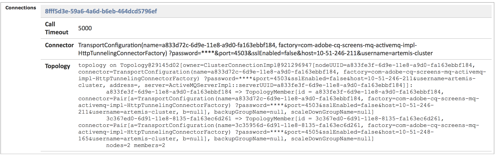

# Instanties voor auteurs en publiceren configureren in AEM Screens {#configuring-author-and-publish-in-aem-screens}

Deze pagina benadrukt de volgende onderwerpen:

* **Instanties voor auteur en publiceren configureren**
* **Publicatietopologie instellen**
* **Publicatie beheren: Inhoudsupdates leveren van auteur naar apparaat voor publicatie**

## Vereisten {#prerequisites}

Voordat u aan de slag gaat met auteur- en publicatieservers, hebt u eerst kennis van:

* **AEM**
* **AEM Screens-project maken en beheren**
* **Registratieproces van apparaat**

>[!NOTE]
>
>Deze AEM Screens-functionaliteit is alleen beschikbaar als u AEM 6.4 Screens Feature Pack 2 hebt geïnstalleerd. Neem contact op met de Adobe voor ondersteuning en vraag toegang tot dit functiepakket. Nadat u toestemming hebt, kunt u het van het Aandeel van het Pakket downloaden.

>[!IMPORTANT]
>
>Als u meer dan één instantie Publish met Dispatcher wilt gebruiken, werk de Dispatcher bij. Zie [Vaste sessies inschakelen](dispatcher-configurations-aem-screens.md#enable-sticky-session).

## Instanties voor auteur en publiceren configureren {#configuring-author-and-publish-instances}

>[!NOTE]
>
>Als u meer wilt weten over het architecturale overzicht Auteur en Publiceren en hoe de inhoud is geschreven op een AEM Author-instantie en vervolgens wordt gerepliceerd naar meerdere Publish-instanties, raadpleegt u [Overzicht van auteur- en publicatiearchitectuur](author-publish-architecture-overview.md).

De volgende sectie verklaart hoe te opstellings replicatieagenten op Auteur en publiceer topologie.

U kunt een eenvoudig voorbeeld instellen, waarin u een auteur host en twee instanties Publish:

* Auteur > localhost:4502
* Publiceren 1 (pub1) > localhost:4503
* Publish 2 (pub2) > localhost:4504

## Replication Agents instellen op auteur {#setting-replication-agents}

Om replicatieagenten tot stand te brengen, leer hoe te om een standaardreplicatieagent tot stand te brengen.

Er zijn drie replicatiemiddelen die voor de Schermen nodig zijn:

1. **Standaardreplicatieagent ***(opgegeven als*** Standard Replication Agent**)
1. **Screens Replication Agent**
1. **Replicatieagent omkeren**

### Stap 1: Het creëren van een Agent van de Standaard van de Replicatie {#step-creating-a-default-replication-agent}

Voer de onderstaande stappen uit om een standaardreplicatieagent te maken:

1. Ga naar uw AEM-instantie > hamerpictogram > **Bewerkingen** > **Configuratie**.

   

1. Selecteer de **Replicatie** in de linkernavigatiestructuur.

   

1. Selecteer de **Medewerkers op auteur** van de **Replicatie** map en selecteer **Nieuw** om een nieuwe standaardreplicatieagent te creëren.

   

1. Voer de **Titel** en **Naam** zodat kunt u de replicatieagent tot stand brengen, dan selecteren **Maken**.

   

1. Klik met de rechtermuisknop op de replicatieagent en selecteer **Openen** om de instellingen te bewerken.

   

1. Selecteren **Bewerken**.

1. In de **Instellingen agent** voert u de gegevens in.

   >[!NOTE]
   >
   >Gebruiker moet controleren **Ingeschakeld** om replicatieagent toe te laten. Schakel deze optie in bij Standaard, Schermen en Reverse Replication Agents.

   

1. Ga naar de **Vervoer** en voert u de **URI**, **Gebruiker**, en **Wachtwoord**.

   

   >[!NOTE]
   >
   >U kunt een bestaande standaardreplicatieagent ook kopiëren en anders noemen.

#### Standaardreplicatieagents maken  {#creating-standard-replication-agents}

1. Creeer standaard replicatieagent voor pub1 (uit-van-de-doos standaardagent zou reeds moeten worden gevormd). Bijvoorbeeld: *`https://<hostname>:4503/bin/receive?sling:authRequestLogin=1`*
1. Creeer standaard replicatieagent voor pub2. U kunt als replicatieagent voor pub1 kopiëren en het vervoer bijwerken dat voor pub2 moet worden gebruikt door de haven in de vervoerconfiguratie te veranderen. Bijvoorbeeld: *`https://<hostname>:4504/bin/receive?sling:authRequestLogin=1`*.

#### Schermreplicatieagents maken {#creating-screens-replication-agents}

1. Maak een AEM Screens-replicatieagent voor pub1. Buiten-de-doos, is er één genoemde Agent van de Replicatie van het Scherm die aan haven 4503 richt. Schakel deze optie in.
1. Maak een AEM Screens-replicatieagent voor pub2. Kopieer de Agent van de Replicatie van het Scherm voor pub1 en verander de haven aan punt 4504 voor pub2.

   >[!NOTE]
   >Om te leren hoe te om de Agenten van de Replicatie van het Scherm te vormen, zie [De agent voor schermreplicatie configureren](https://experienceleague.adobe.com/en/docs/experience-manager-screens/user-guide/administering/configure-screens-replication).

#### Screens Reverse Replication Agents maken {#creating-screens-reverse-replication-agents}

1. Creeer een omgekeerde replicatieagent voor pub1.
1. Creeer een omgekeerde replicatieagent voor pub2. U kunt omgekeerde replicatieagent voor pub1 kopiëren en het vervoer bijwerken dat voor pub2 moet worden gebruikt door de haven in de vervoerconfiguratie te veranderen.

## Publicatietopologie instellen {#setting-up-publish-topology}

### Stap 1: Apache Sling Oak-gebaseerde detectie configureren {#step-configure-apache-sling-oak-based-discovery}

Apache Sling Oak-Gebaseerde Ontdekking voor alle Publish instanties in de topologie opzetten

Voor elke instantie Publish:

1. Navigeren naar `https://<host>:<port>/system/console/configMgr`
1. Selecteren **Apache Sling Oak-based Discovery Service** Configuratie.
1. Update Topology schakelaar URLs: voeg URLs van alle het ontleden toe Publish instanties die zijn:
   * `https://publish:4503/libs/sling/topology/connector`
   * `https://publish:4504/libs/sling/topology/connector`
1. **Topologieaansluiting `Whitelist` Lijst**: Pas aan IPs of subnets aan die alle Publish instanties behandelen. Zorgen voor `whitelist` IP/hostname van alle Publish instanties zonder het havenaantal.

1. Inschakelen **Lokale lussen automatisch stoppen**

De configuratie zou voor elke Publish instantie identiek moeten zijn en auto-stop Lokaal-lijn verhindert een oneindige lijn.

#### Stap 2: Verifieer Publish Topology {#step-verify-publish-topology}

Navigeer voor een van de publicatie-instanties naar `https://:/system/console/topology`. U zou elke Publish instantie moeten zien die in de topologie onder wordt vertegenwoordigd **Uitgaande topologieschakelaars**.

#### Stap 3: ActiveMQ Artemis-cluster instellen {#step-setup-activemq-artemis-cluster}

Met deze stap kunt u een gecodeerd wachtwoord maken voor de ActiveMQ Artemis-cluster.
De clustergebruiker en het wachtwoord van alle Publish instanties in de topologie moeten identiek zijn. Het wachtwoord van de configuratie van de Artemis ActiveMQ moet worden gecodeerd. Omdat elke instantie een eigen coderingssleutel heeft, is het nodig Crypto Support te gebruiken om een gecodeerde wachtwoordtekenreeks te maken. Dan, kan het gecodeerde wachtwoord in OSGi config voor ActiveMQ worden gebruikt.

Op elke publicatie-instantie:

1. Navigeer in de OSGi-console naar **BELANGRIJK** > **Crypto-ondersteuning** (`https://<host>:<port>/system/console/crypto`).
1. Typ het gewenste wachtwoord voor normale tekst (voor alle instanties hetzelfde) in **Onbewerkte tekst**
1. Selecteren **Protect**.
1. De waarde kopiëren **Beveiligde tekst** op notitiepad of teksteditor. Deze waarde kan in OSGi config voor ActiveMQ worden gebruikt.

Omdat elke instantie Publish, door gebrek, unieke crypto sleutels heeft, voer deze stap op elke pub instantie uit en bewaar de unieke sleutel voor de volgende configuratie.

>[!NOTE]
>
>Het wachtwoord moet beginnen en eindigen met accolades. Bijvoorbeeld:
>`{1ec346330f1c26b5c48255084c3b7272a5e85260322edd59119828d1fa0a610e}`

#### Stap 4: ActiveMQ Artemis-cluster activeren {#step-activate-activemq-artemis-cluster}

Op elke instantie Publish:

1. Navigeer naar de manager van OSGi Config `https://<host>:<port>/system/console/configMgr`
1. Selecteren **Apache ActiveMQ Artemis JMS Provider** Configuratie
1. Werk het volgende bij:

   * ***Clusterwachtwoord***: gebruik gecodeerde waarde uit vorige stap per instantie
   * ***Onderwerpen***: `{name: 'commands', address: 'com.adobe.cq.screens.commands', maxConsumers: 50}`

#### ActiveMQ Artemis-cluster verifiëren {#verify-activemq-artemis-cluster}

Voer de onderstaande stappen uit voor elke instantie Publiceren:

1. Navigeer naar de OSGi-console > Hoofd > ActiveMQ-artemis `https://localhost:4505/system/console/mq`.
1. Verifieer en controleer om de havens van andere instanties onder de Informatie van de Cluster te bekijken > Topology > knopen=2, members=2.
1. Een testbericht verzenden (boven aan het scherm onder Informatie over kiezer)
1. Voer de volgende wijzigingen in velden in:

   1. **Doel**: /com.adobe.cq.screens/devTestTopic
   1. **Tekst**: Hello World
   1. De weergave `error.log` van elke instantie zodat kunt u zien dat het bericht over de cluster werd verzonden en werd ontvangen.

>[!NOTE]
>
>Het navigeren aan console OSGi kan een paar seconden na het bewaren van de configuratie in de voorafgaande stap vergen. U kunt error.log voor meer details ook controleren.

Als voorbeeld, toont het volgende beeld op succesvolle configuratie van de Server van Artemis ActiveMQ.

Als u de volgende configuratie niet ziet van */system/console/mq* en navigeer vervolgens naar */system/console/mq* en selecteert u **Opnieuw starten** om de makelaar opnieuw te starten.

#### Vereiste koptekst verwijzing verwijderen {#remove-referrer-header-requirement}

Voer de stappen uit op elke instantie Publiceren:

1. Ga naar de **OSGi Console** > **Configuratiebeheer**
1. Selecteren **Filter Apache Sling Referrer**
1. Configureren en bijwerken **selectievakje Lege waarden toestaan**

### Instantie voor auteur en publicatie configureren {#configuring-author-and-publish-instance}

Nadat u opstelling de het publiceren topologie hebt, vorm de Auteur en publiceer instanties om de praktische resultaten van de implementatie te bekijken:

>[!NOTE]
>
>**Vereisten**
>
>Als u aan de slag wilt gaan met dit voorbeeld, maakt u een AEM Screens-project gevolgd door een locatie, weergave en kanaal in uw project te maken. Voeg inhoud aan uw kanaal toe en wijs het kanaal aan een vertoning toe.

#### Stap 1: een AEM Screens Player (apparaat) starten

1. Open een apart browservenster.
1. Ga naar de schermspeler met de *webbrowser*, dat wil zeggen:`https://localhost:4502/content/mobileapps/cq-screens-player/firmware.html` of start de AEM Screens-app. Wanneer u het apparaat opent, ziet u dat het apparaat niet is geregistreerd.

>[!NOTE]
>
>U kunt een AEM Screens-speler openen met de AEM Screens-app die u hebt gedownload of met de webbrowser.

#### Stap 2: Een apparaat registreren bij auteur {#step-registering-a-device-on-author}

1. Ga naar `https://localhost:4502/screens.html/content/screens/we-retail` of selecteer uw project en navigeer naar Apparaten > Apparaatbeheer.
1. Selecteren **Apparaat registreren**.
1. Selecteren **Apparaatregistratie**.
1. Selecteer het apparaat dat u wilt registreren en selecteer vervolgens **Apparaat registreren**.
1. Verifieer de registratiecode, dan selecteer **Valideren**.
1. Voer een titel in voor uw apparaat en selecteer vervolgens **Registreren**.

#### Stap 3: Het apparaat toewijzen aan weergave {#step-assigning-the-device-to-display}

1. Selecteren **Weergave toewijzen** in het dialoogvenster van de vorige stap.
1. Selecteer het weergavepad voor uw kanaal in het menu **Locaties** map.
1. Selecteren **Toewijzen**.
1. Selecteren **Voltooien** om het proces te voltooien, en nu wordt het apparaat toegewezen.

Controleer de speler en bekijk de inhoud die u in het kanaal hebt toegevoegd.

#### Stap 4: Het publiceren van de Configuratie van het Apparaat om Instanties te publiceren {#step-publishing-device-configuration-to-publish-instances}

**Het apparaat controleren**

Voer de onderstaande stappen uit om de gebruiker van het apparaat te repliceren:

1. Navigeer naar de pagina voor gebruikersbeheer. Bijvoorbeeld: `https://localhost:4502/useradmin`.
1. Zoeken naar **`screens-devices-master`** groep.
1. Klik met de rechtermuisknop op de groep en selecteer **Activeren**.

>[!CAUTION]
>
>Activeer de publicatieservice van de auteur niet omdat dit een systeemgebruiker is die door de AuteurTaak wordt gebruikt.

U kunt het apparaat ook activeren via de apparaatbeheerconsole. Voer de onderstaande stappen uit:

1. Ga naar uw project van de Schermen > **Apparaten**.
1. Selecteren **Apparaatbeheer** in de actiebalk.
1. Selecteer het apparaat en selecteer **Activeren** op de actiebalk, zoals in de onderstaande afbeelding.

>[!NOTE]
>
>Als u het apparaat hebt geactiveerd, kunt u ook de URL van de server bewerken of bijwerken. Selecteren **URL van server bewerken** in de actiebalk, zoals in de onderstaande afbeelding wordt getoond, worden uw wijzigingen doorgegeven aan de AEM Screens-speler.

### Lijst met publicatiecontrole {#publishing-check-list}

De volgende punten vatten de lijst van de Controle van het Publiceren samen:

* *Apparaatgebruiker voor schermen* - Dit wordt opgeslagen als een AEM gebruiker en geactiveerd van **Gereedschappen** > **Beveiliging** > **Gebruikers**. De gebruiker heeft een lange geserialiseerde tekenreeks als voorvoegsel &quot;screens&quot;.

* *Project* - Het AEM Screens-project.
* *Locatie* - Locatie waarmee het apparaat is verbonden.
* *Kanalen* - een of meer kanalen die op de locatie worden weergegeven
* *Schema* - indien een schema wordt gebruikt, zorg ervoor dat dit wordt gepubliceerd
* *Locatie, planningen en kanaalmap* - als de bijbehorende bronnen zich in een map bevinden.

Voer de onderstaande stappen uit om het gedrag bij schrijven en publiceren te controleren:

1. Anaalinhoud bijwerken op instantie Auteur.
1. Uitvoeren **Publicatie beheren** om nieuwe wijzigingen in alle instanties Publiceren te publiceren.
1. Druk **Activeren** om het apparaat te activeren van **Apparaatbeheer**.
1. **URL bewerken** van de instantie-URL van de auteur naar een van de URL voor het publiceren.
1. Controleer of de inhoud van het bijgewerkte kanaal wordt weergegeven op de AEM Screens-speler.
1. Herhaal deze stappen met een andere instantie Publiceren.

#### Stap 5: het apparaat aanwijzen om een instantie te publiceren in het deelvenster Beheer {#step-pointing-the-device-to-publish-instance-in-the-admin-panel}

1. Geef de interface voor het beheer van de schermspeler weer en druk op de linkerbovenhoek zodat u het menu Admin kunt openen, op de AEM Screens-speler met aanraakbediening of met een muis.
1. Selecteer de **Configuratie** in het zijpaneel.
1. Auteurinstantie wijzigen in instantie Publiceren in **Server**.

Bekijk de wijzigingen in je AEM Screens-speler.

U kunt de URL van de server ook bijwerken/bewerken vanuit de apparaatbeheerconsole met de volgende stappen:

1. Ga naar uw AEM Screens-project en selecteer het **Apparaten** map.
1. Selecteren **Apparaatbeheer** in de actiebalk.
1. Selecteer het apparaat en selecteer **URL van server bewerken** in de actiebalk, zoals in de onderstaande afbeelding wordt getoond, en uw wijzigingen worden doorgegeven aan de AEM Screens-speler.

De **Publicatie beheren** Met deze functie kunt u inhoud-updates leveren van Auteur naar apparaat. U kunt inhoud publiceren/unpublish voor uw volledige AEM Screens-project of slechts voor één van uw kanalen, plaats, apparaat, toepassing, of een programma. Zie voor meer informatie over deze functie [Update voor on-demand inhoud](on-demand-content.md).

## Tips voor het oplossen van problemen {#troubleshoot-tips}

Volg de onderstaande sectie om antwoorden te krijgen op veelgestelde vragen over de instelling Auteur/Publicatie.

### Hoe voegt u een omleiding van https naar http toe na de eerste registratie en toewijzing? {#add-redirect}

**Oplossing**
Inschakelen instellen `Proxy/Load Balancer Connection in the Jetty configuration` tot `true`.

### Offline-inhoud en downloadproblemen met speler bijwerken met externe middelen `/content/dam/projects/<project>`? {#update-offline-content}

**Oplossing**
Leesmachtigingen geven voor gebruiker en `screens-devices-master` groep voor iedereen `/content/dam` of de specifieke elementen die u wilt gebruiken, als u restrictiever wilt zijn.

### Hoe te om de fouten van de Agent van de Replicatie van het Scherm op te lossen? {#replication-agent}

**Oplossing**
Zorg ervoor u niet Gebruik voor omgekeerde replicatieoptie in de agentenconfiguratie hebt gecontroleerd. De Agent van de Replicatie van schermen kan niet als omgekeerde replicatieagent worden gebruikt en het werkingsgebied van deze eigenschap is apparatenbevelen van Auteur door:sturen aan Publish.