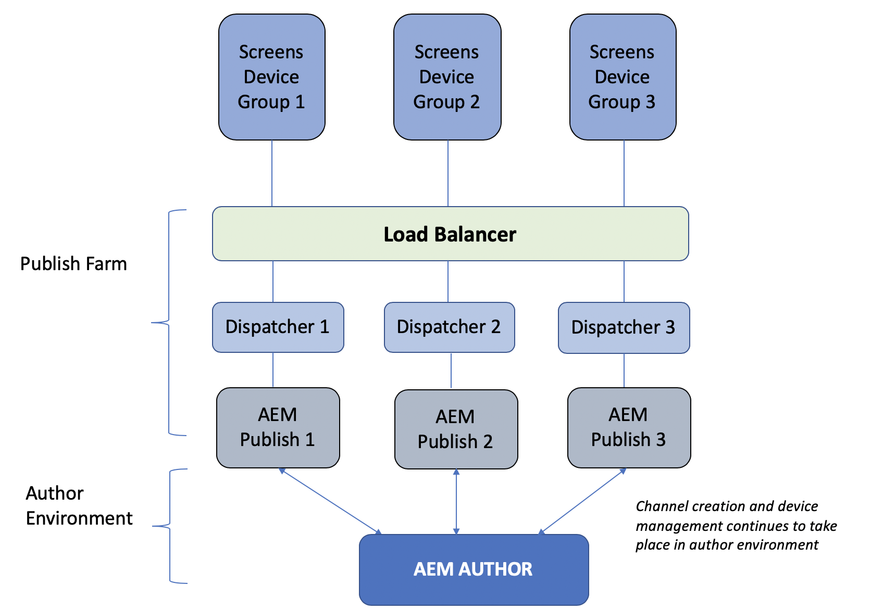

# Overzicht van auteur- en publicatiearchitectuur {#author-and-publish-architectural-overview}

Deze pagina benadrukt de volgende onderwerpen:

* **Inleiding tot publicatieservers**
* **Overzicht van architectuur**
* **Registratieproces**

## Vereisten {#prerequisites}

Voordat u aan de slag gaat met auteur- en publicatieservers, hebt u eerst kennis van:

* **AEM**
* **AEM Screens-project maken en beheren**
* **Registratieproces van apparaat**

>[!NOTE]
>
>Deze AEM Screens-functionaliteit is alleen beschikbaar als u AEM 6.4 Screens Feature Pack 2 hebt geïnstalleerd. Als u toegang wilt krijgen tot dit pakket functies, moet u contact opnemen met de Adobe Support en toegang aanvragen. Als u beschikt over de juiste machtigingen, kunt u deze downloaden via Pakket delen.

## Inleiding {#introduction}

AEM Screens-architectuur lijkt op een traditionele AEM Sites-architectuur. De inhoud wordt ontworpen op een AEM auteursinstantie en dan voorwaarts-herhaald aan veelvoudige publiceer instanties. AEM Screens-apparaten kunnen nu via het taakverdelingsmechanisme verbinding maken met een AEM publicatiefarm. De veelvoudige AEM publiceer instanties kunnen worden toegevoegd om te blijven het publicatielandbouwbedrijf schrapen.

*Bijvoorbeeld*, geeft een de inhoudauteur van AEM Screens een bevel op het auteurssysteem voor een bepaald apparaat uit dat wordt gevormd om met een publicatielandbouwbedrijf of een de inhoudauteur van AEM Screens in wisselwerking te staan die informatie over apparaten verkrijgt die worden gevormd om met te communiceren publiceert landbouwbedrijven.

Het volgende diagram illustreert de auteur en publicatiemilieu&#39;s.

## Architecturaal ontwerp {#architectural-design}

Er zijn vijf architecturale componenten, die deze oplossing vergemakkelijken:

* ***Repliceren van*** inhoud van auteur naar publicatie voor weergave door apparaten

* ***Binaire inhoud*** opnieuw genereren van publicatie (ontvangen van apparaten) naar auteur
* ***Opdrachten van*** auteur verzenden om te publiceren via specifieke REST API&#39;s
* ***Berichten*** tussen publicatie-instanties om updates en opdrachten voor apparaatinformatie te synchroniseren
* ****** Pollingby the auteur of publish instances to obtain device information via specific REST APIs

### Replicatie (vooruit) van inhoud en configuraties {#replication-forward-of-content-and-configurations}

De standaard replicatieagenten worden gebruikt om de inhoud van het het schermkanaal, locatieconfiguraties en apparatenconfiguraties te herhalen. Op deze manier kunnen auteurs de inhoud van een kanaal bijwerken en desgewenst een goedkeuringswerkstroom doorlopen voordat ze kanaalupdates publiceren. Een replicatieagent moet voor elke publicatieinstantie in publicatielandbouwbedrijf worden gecreeerd.

Het volgende diagram illustreert het replicatieproces:

>[!NOTE]
>
>Een replicatieagent moet voor elke publicatieinstantie in publicatielandbouwbedrijf worden gecreeerd.

### Screens Replication Agents and Commands {#screens-replication-agents-and-commands}

Er worden aangepaste schermspecifieke replicatiemiddelen gemaakt om opdrachten van de instantie Auteur naar het AEM Screens-apparaat te verzenden. De publicatie-instanties van AEM fungeren als tussenpersoon om deze opdrachten naar het apparaat door te sturen.

Hierdoor kunnen auteurs het apparaat blijven beheren, zoals apparaatupdates verzenden en screenshots nemen van de auteursomgeving. De de replicatieagenten van AEM Screens hebben een configuratie van het douanevervoer, als standaardreplicatieagenten.

### Overseinen tussen publicatie-instanties {#messaging-between-publish-instances}

In veel gevallen is een opdracht slechts bedoeld om één keer naar een apparaat te worden verzonden. In een publicatiearchitectuur met taakverdeling is het echter onbekend met welke instantie het apparaat verbinding maakt.

Daarom verzendt de auteurinstantie het bericht naar alle Publish instanties. Nochtans zou slechts één enkel bericht dan aan het apparaat moeten worden afgelost. Om correct overseinen te verzekeren moet één of andere mededeling plaatsvinden tussen publiceer instanties. Dit wordt bereikt met *Apache ActiveMQ Artemis*. Elke publicatieinstantie wordt geplaatst in een losjes gekoppelde Topologie gebruikend de Eak-Gebaseerde de ontdekkingsdienst van de Verkenning en ActiveMQ wordt gevormd zodat elke publicatieinstantie één enkele berichtrij kan communiceren en creëren. Het apparaat van het Scherm opiniepeilt het publicatielandbouwbedrijf via het ladingsverdelingsmechanisme en neemt het bevel van de bovenkant van de rij op.

### Replicatie omkeren {#reverse-replication}

In veel gevallen, na een bevel, wordt één of andere soort reactie verwacht van het apparaat van het Scherm om aan de instantie van de Auteur door:sturen. Om dit AEM te bereiken wordt ***Omgekeerde replicatie*** gebruikt.

* Creeer een omgekeerde replicatieagent voor elke publiceer instantie, zoals aan de standaardreplicatieagenten en de agenten van de het schermreplicatie.
* Een configuratie van de werkschemaopstarter luistert naar knopen die op de publicatieinstantie worden gewijzigd en brengt beurtelings een werkschema in werking om de reactie van het Apparaat in de Publish outbox van de instantie te plaatsen.
* Een omgekeerde replicatie in deze context wordt slechts gebruikt voor binaire gegevens (zoals, logboekdossiers en screenshots) die door de apparaten worden verstrekt. Niet-binaire gegevens worden opgehaald door polling.
* De omgekeerde replicatie die van de AEM auteursinstantie wordt gepolled wint de reactie terug en bewaart het aan de auteursinstantie.

### Opiniepeiling van publicatie-instanties {#polling-of-publish-instances}

De auteurinstantie moet de apparaten kunnen opiniepeilen om een hartslag te krijgen en de gezondheidsstatus van een aangesloten apparaat te kennen.

Apparaten pingelen het taakverdelingsmechanisme en worden gerouteerd naar een publicatie-instantie. De status van het apparaat wordt vervolgens vrijgegeven door de publicatie-instantie via een publicatie-API die @ **api/screens-dcc/devices/static** voor alle actieve apparaten en **api/screens-dcc/devices/&lt;device_id>/status.json** voor één apparaat wordt aangeboden.

De instantie van de auteur opiniepeilt alle publicatieinstanties en voegt de reacties van de apparatenstatus in één enkele status samen. De geplande baan die op auteur opiniepeilt is `com.adobe.cq.screens.impl.jobs.DistributedDevicesStatiUpdateJob` en kan op een cron uitdrukking worden gevormd.

## Registratie {#registration}

Registratie begint nog steeds bij de AEM auteur. AEM Screens Device wordt verwezen naar de auteurinstantie en de registratie is voltooid.

Zodra een apparaat op het auteursmilieu is geregistreerd worden de apparatenconfiguratie en kanaal/planningtoewijzingen herhaald aan AEM publiceer instanties. De configuratie van het Apparaat van AEM Screens wordt dan bijgewerkt om aan de Balancer van de Lading vóór AEM te richten publiceert landbouwbedrijf. Dit is bedoeld om eenmalig te worden ingesteld, zodra het schermapparaat is aangesloten op de publicatieomgeving, kan het opdrachten blijven ontvangen die afkomstig zijn van de auteursomgeving en hoeft het schermapparaat nooit rechtstreeks aan te sluiten op de auteursomgeving.

### De volgende stappen {#the-next-steps}

Als u het architecturale ontwerp van auteur en publiceer opstelling in AEM Screens begrijpt, verwijs naar [Het Vormen Auteur en Publiceren voor AEM Screens](author-and-publish.md) voor meer details.
