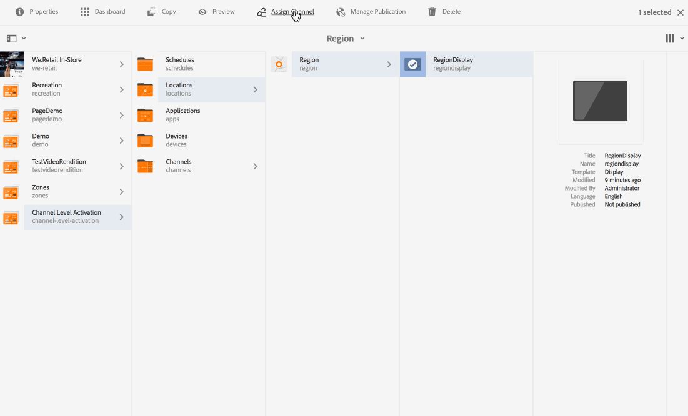

# Activering op kanaalniveau {#channel-level-activation-single-event-playback}

Op deze pagina vindt u een beschrijving van de activering op kanaalniveau voor de middelen die in Kanalen worden gebruikt.

De volgende onderwerpen worden behandeld in deze sectie:

* Overzicht
* Activeringsvenster
* Activering op kanaalniveau gebruiken als één gebeurtenis afspelen
* Herhaling van middelen in een kanaal afhandelen
   * DayParting
   * WeekParting
   * MonthParting
   * Combinatie van partners
* Activering op kanaalniveau gebruiken als één gebeurtenis afspelen

## Overzicht {#overview}

***Activering op kanaalniveau*** staat de kanalen toe om na een bepaald vastgestelde programma te schakelen. Het enige gebeurteniskanaal vervangt het hoofdkanaal na een ingesteld programma en speelt gedurende een bepaalde tijd af, totdat de inhoud van het hoofdkanaal opnieuw wordt afgespeeld.

In het volgende voorbeeld wordt een oplossing geboden waarbij de nadruk ligt op de volgende sleuteltermen:

* a ***hoofdsequentiekanaal*** voor de algemene reeks
* a ***één gebeurteniskanaal*** dat slechts eenmaal bij een ingestelde tijd wordt uitgevoerd
* a ***tijdschema en prioriteit*** voor de enige afspeelgebeurtenis die plaatsvindt binnen het hoofdkanaal van de reeks

## Activeringsvenster {#using-channel-level-activation}

In de volgende sectie wordt uitgelegd hoe u één gebeurtenis kunt afspelen in een kanaal voor een AEM Screens-project.

### Vereisten {#prerequisites}

Voordat u begint met het implementeren van deze functionaliteit, moet u ervoor zorgen dat u aan de volgende voorwaarden kunt voldoen om activering op kanaalniveau te kunnen starten:

* Een AEM Screens-project maken, in dit voorbeeld **Activering op kanaalniveau**

* Een kanaal maken als **MainAdChannel** krachtens **Kanalen** map

* Een ander kanaal maken als **TargetedSinglePlay** krachtens **Kanalen** map

* Relevante elementen aan beide kanalen toevoegen

In de volgende afbeelding wordt de **Activering op kanaalniveau** project met **MainAdChannel** en **TargetedSinglePlay** kanalen in **Kanalen** map.

>[!NOTE]
>
>Zie de volgende bronnen voor aanvullende informatie over het maken van een project en het maken van een sequentiekanaal:
>
>* [Projecten maken en beheren](creating-a-screens-project.md)
>
>* [Een kanaal beheren](managing-channels.md)
>

### Implementatie {#implementation}

Het uitvoeren van de Activering van het Niveau van het Kanaal in een project van AEM Screens omvat drie belangrijke taken:

1. **Projecttaxonomie instellen, waaronder Kanalen, Locaties en Weergaven**
1. **Kanalen toewijzen aan weergave**
1. **Een planning en prioriteit instellen**

Voer de volgende stappen uit om de functionaliteit te implementeren:

1. **Een locatie maken**

   Ga naar uw **Locaties** in uw AEM Screens-project en maak een locatie als **Regio**.

   

   >[!NOTE]
   >
   >Ga voor meer informatie over het maken van een locatie naar **[Locaties maken en beheren](managing-locations.md)**.

1. **Weergave onder locatie maken**

   1. Navigeren naar **Activering op kanaalniveau** > **Locaties** > **Regio**.
   1. Klikken **Regio** en klik op **+ Maken** in de actiebalk.
   1. Klikken **Weergave** van de wizard en maakt u een weergave met de naam **RegionDisplay.**

   

1. **Kanalen toewijzen aan weergave**

   Voor **MainAdChannel:**

   1. Navigeren naar **Activering op kanaalniveau** > **Locaties** > **Regio** > **RegionDisplay** en klik op **Kanaal toewijzen** in de actiebalk.
   1. **Kanaaltoewijzing** wordt geopend.
   1. Klikken **Referentiekanaal** per pad.
   1. Klik op de knop **Kanaalpad** als **Activering op kanaalniveau** > ***Kanalen*** > ***MainAdChannel***.
   1. De **Kanaalrol** is gevuld als **hoofdkanaal**.
   1. Klik op de knop **Prioriteit** als **1**.
   1. Klik op de knop **Ondersteunde gebeurtenissen** als **Oorspronkelijke belasting** en **Niet-actief scherm**.
   1. Klikken **Opslaan**.

   

   >[!NOTE]
   >
   >U kunt ook kanaal toewijzen vanaf het weergavedashboard door te navigeren naar **Activering op kanaalniveau** > **Locaties** > **Regio** > **RegionDisplay** en selecteren **Dashboard** in de actiebalk. Klikken **+ Kanaal toewijzen** van de **TOEGEWEZEN KANALEN EN SCHEMA&#39;S** deelvenster.

   Kanaal toewijzen **TargetedSinglePlay** voor display**:

   1. Navigeren naar **Activering op kanaalniveau** > **Locaties** > **Regio** > **RegionDisplay** en klik op **Kanaal toewijzen** in de actiebalk.
   1. **Kanaaltoewijzing** wordt geopend.
   1. Klikken **Referentiekanaal** per pad.
   1. Klik op de knop **Kanaalpad** als **Activering op kanaalniveau*** > ***Kanalen*** > ***TargetedSinglePlay***.
   1. De **Kanaalrol** is gevuld als **doelgericht**.
   1. Stel de **Prioriteit** als **2**.
   1. Klik op de knop **Ondersteunde gebeurtenissen** als **Oorspronkelijke belasting**, **Niet-actief scherm**, en **Timer**, zoals weergegeven in onderstaande afbeelding.
   1. Kies in **actief van** 27 november 2018 11:59 **actief tot** 28 november 2018 12:05
   1. Klikken **Opslaan**.

   >[!CAUTION]
   >
   >De prioriteit instellen voor **TargetedSinglePlay** kanaal hoger dan **MainAdSegment** kanaal.

   

   >[!NOTE]
   >
   >Als u dezelfde dag wilt kiezen, klikt u op de volgende dag en bewerkt u de datum vervolgens handmatig naar dezelfde dag, maar voor een later tijdstip. Als u dit doet, kan de gebruiker geen datum uit het verleden selecteren. Zie het volgende voorbeeld:

   

## De resultaten bekijken {#viewing-the-results}

Wanneer u de instellingen voor kanalen hebt ingesteld en de weergave is voltooid, start u de AEM Screens-speler om de inhoud weer te geven.

De speler geeft de inhoud van **MainAdChannel** en precies om 23:59 (zoals bepaald in het schema), de **TargetedSinglePlay** het kanaal toont zijn inhoud tot 12:05 A.M. en toen **MainAdChannel** hervat het afspelen van de inhoud.

>[!NOTE]
>
>Zie de volgende bronnen voor meer informatie over AEM Screen Player:
>[Downloads voor AEM Screens Player](https://download.macromedia.com/screens/)
>[Werken met AEM Screens Player](working-with-screens-player.md)

## Herhaling van middelen in een kanaal afhandelen {#handling-recurrence-in-assets}

U kunt middelen in een kanaal plannen om ook met bepaalde tussenpozen op dag, week of maandbasis opnieuw te komen naar wens.

Stel dat u de inhoud van een kanaal alleen op vrijdag van 13.00 uur tot 10.00 uur wilt weergeven. U kunt de **Activering** om het gewenste herhalingsinterval voor uw element in te stellen.

### Dagverdeling {#day-parting}

1. Klik op het kanaal en klik vervolgens op **Dashboard** in de actiebalk.

1. Na het ingaan van de begindatum/de tijd en eind/datumtijd van **Kanaaltoewijzing** kunt u een expressie of een natuurlijke tekstversie gebruiken om uw schema voor herhalingen op te geven.

   >[!NOTE]
   >
   >U kunt de **Actief van** en **Actief tot** en voeg de expressie toe aan het veld Planningen, naar wens.

1. Voer de expressie in de **Schema** en uw activa toont voor het bepaalde interval van dag en tijd.

#### Voorbeeldexpressies voor dagparatie {#example-one}

In de volgende tabel worden enkele voorbeeldexpressies samengevat die u aan het schema kunt toevoegen terwijl u kanaal toewijst aan een weergave.

| **Uitdrukking** | **Interpretatie** |
|---|---|
| vóór 8:00 | Het middel in het kanaal speelt vóór 8:00 a.m. dagelijks |
| na 2:00 | Het middel in het kanaal speelt na 2:00 p.m. dagelijks af |
| na 12:15 en vóór 12:45 | Het middel in het kanaal speelt na 23:15 uur elke dag gedurende 30 minuten af |
| vóór 12:15 ook na 12:45 | Het middel in het kanaal speelt vóór 12:15 elke dag en dan ook na 12:45 uur. |
| Mon,Kleurtoon,Wed of MonWed | het actief vanaf maandag tot en met woensdag in het kanaal wordt afgespeeld |
| op de eerste dag van januari na 2:00 uur, ook op de tweede dag van januari, ook op de derde dag van januari vóór 3:00 uur. | het middel in het kanaal begint na 1 januari om 2.00 uur af te spelen, blijft de hele dag afspelen op 2 januari tot 3.00 uur &#39;s middags op 3 januari |
| op de 1-2 dagen van januari na 2:00 uur, ook op de 2-3 dagen van januari vóór 3:00 uur. | Het middel in het kanaal start speler na 1 januari om 2:00 uur, gaat verder met afspelen tot 2 januari om 3:00 uur &#39;s middags, vervolgens begint het opnieuw op 2 januari om 2:00 uur &#39;s middags en wordt verder afgespeeld tot 3:00 uur &#39;s middags op 3 januari |

>[!NOTE]
>
>U kunt ook _militaire tijd_ notatie (14:00) in plaats van *A.M./P.M.* (14:00)

### WeekParting {#week-parting}

1. Klik op het kanaal en klik vervolgens op **Dashboard** in de actiebalk.

1. Na het ingaan van de begindatum/de tijd en eind/datumtijd van **Kanaaltoewijzing** kunt u een expressie of een natuurlijke tekstversie gebruiken om uw schema voor herhalingen op te geven.

   >[!NOTE]
   >
   >U kunt de **Actief van** en **Actief tot** en voeg de expressie toe aan het veld Planningen, naar wens.

1. Voer de expressie in de **Schema** en uw activa toont voor het bepaalde interval van dag en tijd.

#### Voorbeelden van expressies voor WeekParting {#example-two}

In de volgende tabel worden enkele voorbeeldexpressies samengevat die u aan het schema kunt toevoegen terwijl u kanaal toewijst aan een weergave.

| **Uitdrukking** | **Interpretatie** |
|---|---|
| Mon,Kleurtoon,Wed of MonWed | het actief vanaf maandag tot en met woensdag in het kanaal wordt afgespeeld |
| vóór 8:00 | Het middel in het kanaal speelt vóór 8:00 a.m. dagelijks |
| na 2:00 | Het middel in het kanaal speelt na 2:00 p.m. dagelijks af |
| na 12:15 en vóór 12:45 | Het middel in het kanaal speelt na 23:15 uur elke dag gedurende 30 minuten af |
| vóór 12:15 ook na 12:45 | Het kanaal speelt vóór 12:15 elke dag en dan ook na 12:45 |

>[!NOTE]
>
>U kunt ook _militaire tijd_ notatie (14:00) in plaats van *A.M./P.M.* (14:00)

### MonthParting {#month-parting}

1. Klik op het kanaal en klik vervolgens op **Dashboard** in de actiebalk.

1. Na het ingaan van de begindatum/de tijd en eind/datumtijd van **Kanaaltoewijzing** kunt u een expressie of een natuurlijke tekstversie gebruiken om uw schema voor herhalingen op te geven.

   >[!NOTE]
   >
   >U kunt de **Actief van** en **Actief tot** en voeg de expressie toe aan het veld Planningen, naar wens.

1. Voer de expressie in de **Schema** en uw activa toont voor het bepaalde interval van dag en tijd.

#### Voorbeelden van expressies voor MonthParting {#example-three}

In de volgende tabel worden enkele voorbeeldexpressies samengevat die u aan het schema kunt toevoegen terwijl u kanaal toewijst aan een weergave.

| **Uitdrukking** | **Interpretatie** |
|---|---|
| van `February,May,August,November` | de activa spelen in de kanalen in februari, mei, augustus, november |

>[!NOTE]
>
>Wanneer u dagen van de week en maanden definieert, kunt u zowel de korte- als de volledige-naamnotatie gebruiken, zoals Mon/Maandag en januari.

>[!NOTE]
>
>U kunt ook _militaire tijd_ notatie (14:00) in plaats van *A.M./P.M.* (14:00)

### Combinatie van partners {#combined-parting}

1. Klik op het kanaal en klik vervolgens op **Dashboard** in de actiebalk.

1. Na het ingaan van de begindatum/de tijd en eind/datumtijd van **Kanaaltoewijzing** kunt u een expressie of een natuurlijke tekstversie gebruiken om uw schema voor herhalingen op te geven.

   >[!NOTE]
   >
   >U kunt de **Actief van** en **Actief tot** en voeg de expressie toe aan het veld Planningen, naar wens.

1. Voer de expressie in de **Schema** en uw activa toont voor het bepaalde interval van dag en tijd.

#### Voorbeelden van expressies voor de combinatie van delen {#example-four}

In de volgende tabel worden enkele voorbeeldexpressies samengevat die u aan het schema kunt toevoegen terwijl u kanaal toewijst aan een weergave.

| **Uitdrukking** | **Interpretatie** |
|---|---|
| na 6:00 en vóór 18:00 op maandag, wijk Jan-Mar | de activa spelen in het kanaal tussen 6.00 uur en 6.00 uur op maandag en woensdag van januari tot en met eind maart |
| op de eerste dag van januari na 2:00 uur, ook op de tweede dag van januari, ook op de derde dag van januari vóór 3:00 uur. | het middel in het kanaal begint na 1 januari om 2.00 uur af te spelen, blijft de hele dag afspelen op 2 januari tot 3.00 uur &#39;s middags op 3 januari |
| op de 1-2 dagen van januari na 2:00 uur, ook op de 2-3 dagen van januari vóór 3:00 uur. | Het middel in het kanaal start speler na 1 januari om 2:00 uur, gaat verder met afspelen tot 2 januari om 3:00 uur &#39;s middags, vervolgens begint het opnieuw op 2 januari om 2:00 uur &#39;s middags en wordt verder afgespeeld tot 3:00 uur &#39;s middags op 3 januari |

>[!NOTE]
>
>Wanneer u dagen van de week en maanden definieert, kunt u zowel de korte- als de volledige-naamnotatie gebruiken, zoals Mon/Maandag en januari. U kunt ook _militaire tijd_ notatie (14:00) in plaats van *A.M./P.M.* (14:00)
