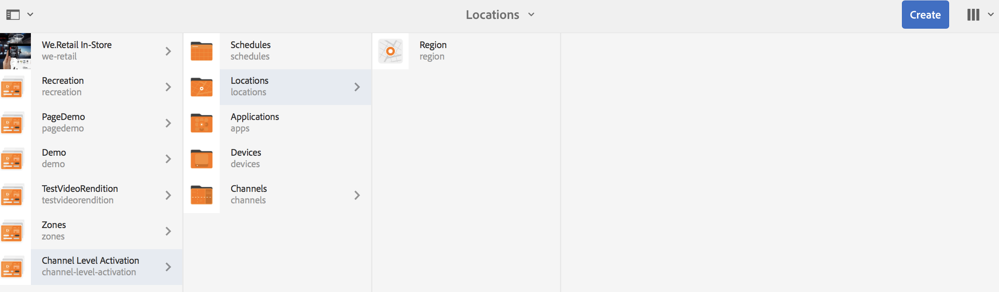

# Activering op kanaalniveau {#channel-level-activation-single-event-playback}

Op deze pagina vindt u een beschrijving van de activering op kanaalniveau voor de middelen die in Kanalen worden gebruikt.

De volgende onderwerpen worden behandeld in deze sectie:

* Overzicht
* Activeringsvenster
* Activering op kanaalniveau gebruiken als één gebeurtenis afspelen
* Herhaling van Assets in een kanaal afhandelen
   * DayParting
   * WeekParting
   * MonthParting
   * Combinatie van partners
* Activering op kanaalniveau gebruiken als één gebeurtenis afspelen

## Overzicht {#overview}

***de Activering van het Niveau van het Kanaal*** staat de kanalen toe om na een bepaald vastgestelde programma te schakelen. Het enige gebeurteniskanaal vervangt het hoofdkanaal na een ingesteld programma en speelt gedurende een bepaalde tijd af, totdat de inhoud van het hoofdkanaal opnieuw wordt afgespeeld.

In het volgende voorbeeld wordt een oplossing geboden waarbij de nadruk ligt op de volgende sleuteltermen:

* a ***belangrijkste opeenvolgingskanaal*** voor de globale opeenvolging
* a ***enig gebeurteniskanaal*** dat slechts eens bij een vastgestelde tijd loopt
* a ***plaats programma en prioriteit*** voor de enige playbackgebeurtenis die binnen het belangrijkste kanaal van de opeenvolging voorkomt

## Activeringsvenster {#using-channel-level-activation}

In de volgende sectie wordt uitgelegd hoe u één gebeurtenis kunt afspelen in een kanaal voor een AEM Screens-project.

### Vereisten {#prerequisites}

Voordat u begint met het implementeren van deze functionaliteit, moet u ervoor zorgen dat u aan de volgende voorwaarden kunt voldoen om activering op kanaalniveau te kunnen starten:

* Creeer een project van AEM Screens, in dit voorbeeld, **de Activering van het Niveau van het Kanaal**.

* Creeer een kanaal als **MainAdChannel** onder de **omslag van Kanalen**.

* Creeer een ander kanaal als **TargetedSinglePlay** onder de **omslag van Kanalen**.

* Voeg relevante elementen aan beide kanalen toe.

Het volgende beeld toont het **project van de Activering van het Niveau van het 0&rbrace; Kanaal met** MainAdChannel **en** TargetedSinglePlay **kanalen in de** omslag van Kanalen **.**

>[!NOTE]
>
>Zie de volgende bronnen voor aanvullende informatie over het maken van een project en het maken van een sequentiekanaal:
>
>* [&#x200B; Creërend en het Leiden Projecten &#x200B;](creating-a-screens-project.md)
>
>* [&#x200B; het Leiden een Kanaal &#x200B;](managing-channels.md)
>

### Implementatie {#implementation}

Het uitvoeren van de Activering van het Niveau van het Kanaal in een project van AEM Screens omvat drie belangrijke taken:

1. **de taxonomie van het Project van de vestiging met inbegrip van Kanalen, Plaatsen, en Vertoningen**
1. **Toewijzend Kanalen aan Vertoning**
1. **Vestiging een Programma en Prioriteit**

Voer de volgende stappen uit om de functionaliteit te implementeren:

1. **creeer een Plaats**

   Navigeer aan uw **plaats** omslag in uw project van AEM Screens en creeer een plaats als **Gebied**.

   

   >[!NOTE]
   >
   >Leren hoe te om een plaats tot stand te brengen, zie **[Creërend en het Leiden Plaatsen](managing-locations.md)**.

1. **creeer Vertoning onder Plaats**

   1. Navigeer aan **Activering van het Niveau van het Kanaal** > **Plaatsen** > **Gebied**.
   1. Klik **Gebied** en klik **+ creeer** van de actiebar.
   1. Klik **Vertoning** van de tovenaar en creeer een vertoning die als **wordt genoemd RegionDisplay.**

   

1. **wijs Kanalen aan Vertoning toe**

   Voor **MainAdChannel:**

   1. Navigeer aan **Activering van het Niveau van het Kanaal** > **Plaatsen** > **Gebied** > **RegionDisplay** en klik **toewijzen Kanaal** van de actiebar.
   1. In het **de dialoogvakje van de Toewijzing van het Kanaal**, klik **Kanaal van de Verwijzing** door weg.
   1. Klik het **Weg van het Kanaal**, dan klik **de Activering van het Niveau van het Kanaal** > ***Kanalen*** > ***MainAdChannel***.
   1. De **Rol van het Kanaal** wordt bevolkt als **mainadchannel**.
   1. Klik de **Prioriteit** en reeks aan **1**.
   1. Klik de **Gesteunde Gebeurtenissen**, zoals **Aanvankelijke Lading** en **IdleScreen**.
   1. Klik **sparen**.

   

   >[!NOTE]
   >
   >U kunt het kanaal ook toewijzen via het weergavedashboard. Navigeer aan **Activering van het Niveau van het Kanaal** > **Plaatsen** > **Gebied** > **RegionDisplay**. Voor de actiebar, uitgezochte **Dashboard**. Van **TOEGEWEZEN KANALEN &amp; SCHADULES** paneel, klik **+ wijs Kanaal** toe.

   Op dezelfde manier wijs kanaal **TargetedSinglePlay** voor display** toe:

   1. Navigeer aan **Activering van het Niveau van het Kanaal** > **Plaatsen** > **Gebied** > **RegionDisplay** en klik **toewijzen Kanaal** van de actiebar.
   1. In het **de dialoogvakje van de Toewijzing van het Kanaal**, klik **Kanaal van de Verwijzing** door weg.
   1. Klik de **Weg van het Kanaal**, dan klik **Activering van het Niveau van het Kanaal** > ***Kanalen*** > ***TargetedSinglePlay***.
   1. De **Rol van het Kanaal** wordt bevolkt als **gericht singleplay**.
   1. Plaats de **Prioriteit** aan **&#x200B;**.
   1. Klik de **Gesteunde Gebeurtenissen**, en plaats **Aanvankelijke Lading**, **het Niet-actieve Scherm**, en **Tijdopnemer**, zoals aangetoond in het hieronder cijfer.
   1. In **actief van**, geplaatst als 27 November, 2018, 11:59 P.M., en in **actief tot**, geplaatst als 28 November, 2018, 12:05 A.M.
   1. Klik **sparen**.

   >[!CAUTION]
   >
   >Plaats de prioriteit voor het **TargetedSinglePlay** kanaal hoger dan het **MainAdSegment** kanaal.

   

   >[!NOTE]
   >
   >Als u dezelfde dag wilt kiezen, klikt u op de volgende dag en bewerkt u de datum vervolgens handmatig naar dezelfde dag, maar voor een later tijdstip. Als u dit doet, kan de gebruiker geen datum uit het verleden selecteren. Zie het volgende voorbeeld:

   

## De resultaten bekijken {#viewing-the-results}

Wanneer u de instellingen voor kanalen hebt ingesteld en de weergave is voltooid, start u AEM Screens Player om de inhoud weer te geven.

De speler toont de inhoud van **MainAdChannel** en precies bij 11:59 P.M. (zoals die in de planning) wordt geplaatst, **richtSinglePlay** kanaal toont zijn inhoud tot 12:05 A.M. en dan hervat **MainAdChannel** opnieuw speel opnieuw zijn inhoud.

>[!NOTE]
>
>Raadpleeg de volgende bronnen voor meer informatie over AEM Screen Player:
>&#x200B;>[Downloads van AEM Screens Player &#x200B;](https://download.macromedia.com/screens/)
>&#x200B;>[Werken met AEM Screens Player &#x200B;](working-with-screens-player.md)

## Herhaling van Assets in een kanaal afhandelen {#handling-recurrence-in-assets}

U kunt middelen in een kanaal plannen om met bepaalde intervallen op een dagelijkse, wekelijkse of maandelijkse basis volgens uw vereiste terug te keren.

Stel dat u de inhoud van een kanaal alleen op vrijdag van 13.00 uur tot 10.00 uur wilt weergeven. U kunt het **lusje van de Activering** gebruiken om het gewenste terugkomende interval voor uw activa te plaatsen.

### Dagverdeling {#day-parting}

1. Klik het kanaal, dan klik **Dashboard** van de actiebar.

1. Na het ingaan van de begindatum/de tijd en eind/datumtijd van de **dialoogdoos van de Toewijzing van het Kanaal**, kunt u een uitdrukking of een natuurlijke tekstversie gebruiken om uw terugkeringsprogramma te specificeren.

   >[!NOTE]
   >
   >U kunt overslaan of **Actief van** omvatten en **Actief tot** gebieden en de uitdrukking toevoegen aan het gebied van Programma&#39;s, zoals per uw vereiste.

1. Ga de uitdrukking in het **Programma** in en uw activa toont voor het bepaalde interval van dag en tijd.

#### Voorbeeldexpressies voor dagparatie {#example-one}

De volgende tabel geeft een overzicht van een aantal voorbeeldexpressies die u aan het schema kunt toevoegen terwijl u een kanaal toewijst aan een weergave.

| **Uitdrukking** | **Interpretatie** |
|---|---|
| vóór 8:00 | Het middel in het kanaal speelt vóór 8:00 a.m. dagelijks |
| na 2:00 | Het middel in het kanaal speelt na 2:00 p.m. dagelijks af |
| na 12:15 en vóór 12:45 | Het middel in het kanaal speelt na 23:15 uur elke dag gedurende 30 minuten af |
| vóór 12:15 ook na 12:45 | Het middel in het kanaal speelt vóór 12:15 elke dag en dan ook na 12:45 uur. |
| Mon,Kleurtoon,Wed of MonWed | het actief vanaf maandag tot en met woensdag in het kanaal wordt afgespeeld |
| op de eerste dag van januari na 14.00 uur, ook op de tweede dag van januari en ook op de derde dag van januari vóór 3.00 uur &#39;s middags. | het middel in het kanaal begint na 1 januari om 2.00 uur af te spelen, blijft de hele dag afspelen op 2 januari tot 3.00 uur &#39;s middags op 3 januari |
| op de 1-2 dagen van januari na 2:00 uur, ook op de 2-3 dagen van januari vóór 3:00 uur. | Het middel in het kanaal start speler na 1 januari om 2:00 uur, gaat verder met afspelen tot 2 januari om 3:00 uur &#39;s middags, vervolgens begint het opnieuw op 2 januari om 2:00 uur &#39;s middags en wordt verder afgespeeld tot 3:00 uur &#39;s middags op 3 januari |

>[!NOTE]
>
>U kunt _militaire tijd_ aantekening (14:00) in plaats van *ook gebruiken A.M./P.M.* (2:00 P.M.).

### WeekParting {#week-parting}

1. Klik het kanaal, dan klik **Dashboard** van de actiebar.

1. Na het ingaan van de begindatum/de tijd en eind/datumtijd van de **dialoogdoos van de Toewijzing van het Kanaal**, kunt u een uitdrukking of een natuurlijke tekstversie gebruiken om uw terugkeringsprogramma te specificeren.

   >[!NOTE]
   >
   >U kunt overslaan of **Actief van** omvatten en **Actief tot** gebieden en de uitdrukking toevoegen aan het gebied van Programma&#39;s, zoals per uw vereiste.

1. Ga de uitdrukking in het **Programma** in en uw activa toont voor het bepaalde interval van dag en tijd.

#### Voorbeelden van expressies voor WeekParting {#example-two}

De volgende tabel geeft een overzicht van een aantal voorbeeldexpressies die u aan het schema kunt toevoegen terwijl u een kanaal toewijst aan een weergave.

| **Uitdrukking** | **Interpretatie** |
|---|---|
| Mon,Kleurtoon,Wed of MonWed | het actief vanaf maandag tot en met woensdag in het kanaal wordt afgespeeld |
| vóór 8:00 | Het middel in het kanaal speelt vóór 8:00 a.m. dagelijks |
| na 2:00 | Het middel in het kanaal speelt na 2:00 p.m. dagelijks af |
| na 12:15 en vóór 12:45 | Het middel in het kanaal speelt na 23:15 uur elke dag gedurende 30 minuten af |
| vóór 12:15 ook na 12:45 | Het kanaal speelt vóór 12:15 elke dag en dan ook na 12:45 |

>[!NOTE]
>
>U kunt _militaire tijd_ aantekening (14:00) in plaats van *ook gebruiken A.M./P.M.* (2:00 P.M.).

### MonthParting {#month-parting}

1. Klik het kanaal, dan klik **Dashboard** van de actiebar.

1. Na het ingaan van de begindatum/de tijd en eind/datumtijd van de **dialoogdoos van de Toewijzing van het Kanaal**, kunt u een uitdrukking of een natuurlijke tekstversie gebruiken om uw terugkeringsprogramma te specificeren.

   >[!NOTE]
   >
   >U kunt overslaan of **Actief van** omvatten en **Actief tot** gebieden en de uitdrukking toevoegen aan het gebied van Programma&#39;s, zoals per uw vereiste.

1. Ga de uitdrukking in het **Programma** in en uw activa toont voor het bepaalde interval van dag en tijd.

#### Voorbeelden van expressies voor MonthParting {#example-three}

De volgende tabel geeft een overzicht van een aantal voorbeeldexpressies die u aan het schema kunt toevoegen terwijl u een kanaal toewijst aan een weergave.

| **Uitdrukking** | **Interpretatie** |
|---|---|
| van `February,May,August,November` | de activa spelen in de kanalen in februari, mei, augustus, november |

>[!NOTE]
>
>Wanneer u dagen van de week en maanden definieert, kunt u zowel de korte- als de volledige-naamnotatie gebruiken, zoals Mon/Maandag en januari.

>[!NOTE]
>
>U kunt _militaire tijd_ aantekening (14:00) in plaats van *ook gebruiken A.M./P.M.* (2:00 P.M.).

### Combinatie van partners {#combined-parting}

1. Klik het kanaal, dan klik **Dashboard** van de actiebar.

1. Na het ingaan van de begindatum/de tijd en eind/datumtijd van de **dialoogdoos van de Toewijzing van het Kanaal**, kunt u een uitdrukking of een natuurlijke tekstversie gebruiken om uw terugkeringsprogramma te specificeren.

   >[!NOTE]
   >
   >U kunt overslaan of **Actief van** omvatten en **Actief tot** gebieden en de uitdrukking toevoegen aan het gebied van Programma&#39;s, zoals per uw vereiste.

1. Ga de uitdrukking in het **Programma** in en uw activa toont voor het bepaalde interval van dag en tijd.

#### Voorbeelden van expressies voor de combinatie van delen {#example-four}

De volgende tabel geeft een overzicht van een aantal voorbeeldexpressies die u aan het schema kunt toevoegen terwijl u een kanaal toewijst aan een weergave.

| **Uitdrukking** | **Interpretatie** |
|---|---|
| na 6:00 en vóór 18:00 op maandag, wijk Jan-Mar | de activa spelen in het kanaal tussen 6.00 uur en 6.00 uur op maandag en woensdag van januari tot eind maart |
| op de eerste dag van januari na 14.00 uur, ook op de tweede dag van januari en ook op de derde dag van januari vóór 3.00 uur &#39;s middags. | het middel in het kanaal begint na 1 januari om 2.00 uur af te spelen, blijft de hele dag afspelen op 2 januari tot 3.00 uur &#39;s middags op 3 januari |
| op de 1-2 dagen van januari na 2:00 uur, ook op de 2-3 dagen van januari vóór 3:00 uur. | Het middel in het kanaal start speler na 1 januari om 2:00 uur, gaat verder met afspelen tot 2 januari om 3:00 uur &#39;s middags, vervolgens begint het opnieuw op 2 januari om 2:00 uur &#39;s middags en wordt verder afgespeeld tot 3:00 uur &#39;s middags op 3 januari |

>[!NOTE]
>
>Wanneer u dagen van de week en maanden definieert, kunt u zowel de korte- als de volledige-naamnotatie gebruiken, zoals Mon/Maandag en januari. Ook, kunt u _militaire tijd_ aantekening (14:00) in plaats van *ook gebruiken A.M./P.M.* (2:00 P.M.).
