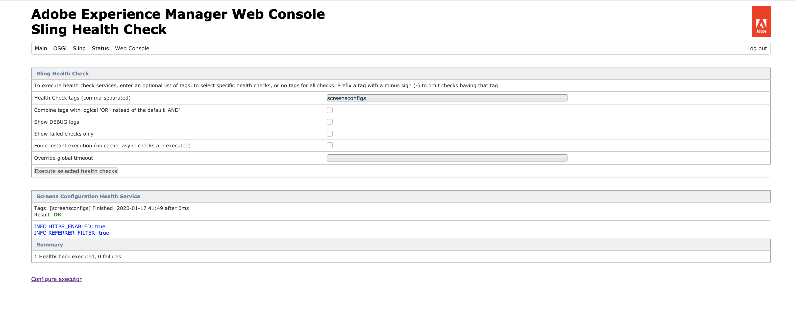

# AEM Screens {#configuring-and-deploying-aem-screens} configureren en implementeren

Deze pagina laat zien hoe u de schermspelers op uw apparaten kunt installeren en configureren.

## Serverconfiguratie {#server-configuration}

>[!NOTE]
>
>**Belangrijk**:
>
>De AEM Screens-speler maakt geen gebruik van de token Cross-Site Request Smeery (CSRF). Als u de server wilt configureren en AEM klaar voor gebruik voor AEM Screens, slaat u het verwijzingsfilter over door lege referenties toe te staan.

## Health Check Framework {#health-check-framework}

Met het Health Check-framework kan de gebruiker controleren of twee benodigde configuraties zijn ingesteld voordat een AEM Screens-project wordt uitgevoerd.

Het staat de gebruiker toe om de volgende twee configuratiecontroles te verifiëren om een project van AEM Screens in werking te stellen, namelijk om de staat van de volgende twee filters te controleren:

1. **Lege referentie toestaan**
2. **https**

Volg de onderstaande stappen om te controleren of deze twee vitale configuraties zijn ingeschakeld voor AEM Screens:

1. Navigeer naar [Adobe Experience Manager Web Console Sling Health Check](http://localhost:4502/system/console/healthcheck?tags=screensconfigs&amp;overrideGlobalTimeout=).

   

2. Klik op **Geselecteerde health checks uitvoeren** om de validatie voor twee hierboven vermelde eigenschappen uit te voeren.

   Als beide filters zijn ingeschakeld, wordt **Screens Configuration Health Service** **Result** weergegeven als **OK** met beide configuraties ingeschakeld.

   

   Als een of beide filters zijn uitgeschakeld, wordt een waarschuwing voor de gebruiker weergegeven, zoals in de onderstaande afbeelding wordt getoond.

   In de volgende waarschuwing wordt aangegeven of beide filters zijn uitgeschakeld:
   

>[!NOTE]
>
>* Als u het filter **Apache Sling Referrer** wilt inschakelen, raadpleegt u [Lege referenties toestaan](/help/user-guide/configuring-screens-introduction.md#allow-empty-referrer-requests).
>* Als u de **HTTP**-service wilt inschakelen, raadpleegt u [Op Jetty gebaseerde HTTP-service van Apache Felix](/help/user-guide/configuring-screens-introduction.md#allow-apache-felix-service).

### Vereisten {#prerequisites}

Met de volgende belangrijke punten hieronder kunt u de server configureren en AEM om klaar te zijn voor gebruik voor AEM Screens.

#### Lege verwijzingsverzoeken {#allow-empty-referrer-requests} toestaan

1. Navigeer naar **Adobe Experience Manager Web Console Configuration** via AEM instance —> hammer icon —> **Operations** —> **Web Console**.

   

1. **Adobe Experience Manager Web Console** Configuration wordt geopend. Zoeken naar de referentie van de sling.

   Voor het zoeken van het bezit van de lijstverwijzer, druk **Command+F** voor **MAC** en **Control+F** voor **Vensters**.

1. Schakel de optie **Lege waarden toestaan** in, zoals in de onderstaande afbeelding wordt getoond.

   

1. Klik op **Opslaan** om het filter Leeg toestaan van paginaverwijzing in te schakelen.

#### Op Jetty gebaseerde HTTP-service van Apache Felix {#allow-apache-felix-service}

1. Navigeer naar **Adobe Experience Manager Web Console Configuration** via AEM instance —> hammer icon —> **Operations** —> **Web Console**.

   

1. **Adobe Experience Manager Web Console** Configuration wordt geopend. Zoek naar Apache Felix op Jetty Gebaseerde Dienst van HTTP.

   Voor het zoeken van deze eigenschap drukt u op **Command+F** voor **Mac** en **Control+F** voor **Windows**.

1. Schakel de optie **ENABLE HTTP** in, zoals in de onderstaande afbeelding wordt getoond.

   

1. Klik **Opslaan** om de service *http* in te schakelen.

#### Aanraakinterface inschakelen voor AEM Screens {#enable-touch-ui-for-aem-screens}

AEM Screens vereist TOUCH UI en werkt niet met CLASSIC UI of Adobe Experience Manager (AEM).

1. Navigeer naar *&lt;yourAuthorInstance>/system/console/configMgr/com.day.cq.wcm.core.impl.AuthoringUIModeServiceImpl*
1. Zorg ervoor dat de **Standaardontwerpmodus voor gebruikersinterface** is ingesteld op **TOUCH**, zoals in de onderstaande afbeelding wordt getoond

U kunt ook dezelfde instelling uitvoeren met de gereedschappen *->* (hamerpictogram) -> **Operations** -> **Webconsole** en zoeken naar **WCM Authoring UI Mode Service**.

>[!NOTE]
>
>Met de gebruikersvoorkeuren kunt u altijd de klassieke gebruikersinterface voor specifieke gebruikers inschakelen.

#### AEM in NOSAMPLECONTENT-runmode {#aem-in-nosamplecontent-runmode}

Bij het uitvoeren van AEM in productie wordt de runmode **NOSAMPLECONTENT** gebruikt. Verwijder *X-Frame-Options=SAMEORIGIN* kopbal (in de extra sectie van de reactiekop)

`https://localhost:4502/system/console/configMgr/org.apache.sling.engine.impl.SlingMainServlet`.

Dit is vereist voor de AEM Screens Player om onlinekanalen af te spelen.

#### Wachtwoordbeperkingen {#password-restrictions}

Met de recentste veranderingen in ***DeviceServiceImpl***, moet u niet de wachtwoordbeperkingen verwijderen.

U kunt ***DeviceServiceImpl*** van de verbinding hieronder vormen om wachtwoordbeperking toe te laten terwijl het creëren van het wachtwoord voor de gebruikers van het schermapparaat:

`https://localhost:4502/system/console/configMgr/com.adobe.cq.screens.device.impl.DeviceService`

Voer de onderstaande stappen uit om ***DeviceServiceImpl*** te configureren:

1. Navigeer naar **Adobe Experience Manager Web Console Configuration** via AEM instance —> hammer icon —> **Operations** —> **Web Console**.

1. **Adobe Experience Manager Web Console** Configuration wordt geopend. Zoeken naar *apparaatservice*. Voor het zoeken van het bezit, druk **Command+F** voor macOS en **Control+F** voor Microsoft Windows.

#### Configuratie {#dispatcher-configuration}

Leren hoe te om verzender voor een project van AEM Screens te vormen, verwijs naar [Vormende Verzender voor een project van AEM Screens](dispatcher-configurations-aem-screens.md).

#### Java-codering {#java-encoding}

Stel de ***Java-codering*** in op Unicode. *Dfile.encoding=Cp1252* werkt bijvoorbeeld niet.

>[!NOTE]
>**Aanbeveling:**
>Het wordt aanbevolen HTTPS te gebruiken voor AEM Screens Server in productiegebruik.

