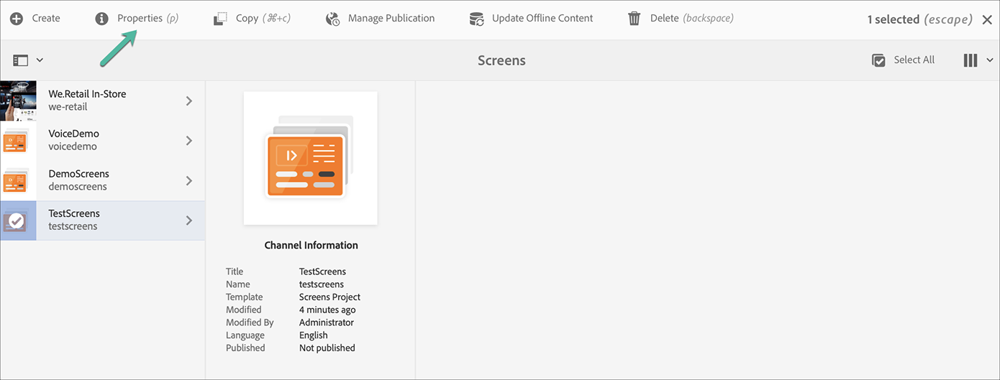

# Projecten maken en beheren {#creating-and-managing-projects}

De AEM Screens is beschikbaar door de Adobe Experience Manager-koppeling (linksboven) te selecteren en vervolgens de koppelingen te screenen.

U kunt ook rechtstreeks navigeren naar: `http://localhost:4502/screens.html/content/screens`

>[!NOTE]
>**Navigatietips:**
>U kunt de cursorsleutels ook gebruiken om door verschillende omslagen in AEM te navigeren. Als u bovendien een bepaalde entiteit hebt geselecteerd, klikt u op de spatiebalk om eigenschappen voor die specifieke map te bewerken of weer te geven.

## Een nieuw schermproject maken {#creating-a-new-screens-project}

Voer de onderstaande stappen uit om een nieuw project voor schermen te maken:

1. Selecteer **Schermen** van uw AEM instantie.

1. Klik **Schermproject maken**.

1. Voer de titel in als **TestScreens** en klik op **Save**.

Het project wordt gecreeerd en het brengt u terug naar de console van het Project van de Schermen. U kunt nu uw project selecteren.

In een project, zijn er vijf soorten omslagen, zoals aangetoond in het hieronder cijfer:

* **Planningen**
* **Locaties**
* **Toepassingen**
* **Apparaten**
* **Kanalen**

>[!NOTE]
>
>Standaard bevat de initiële structuur de master pagina&#39;s **Planningen**, **Locaties**, **Toepassingen**, **Kanalen** en **Apparaten**, maar deze kunnen indien nodig handmatig worden aangepast. U kunt de opties verwijderen als de beschikbare opties niet relevant zijn voor uw project.

## Eigenschappen weergeven {#viewing-properties}

Nadat u het project Schermen hebt gemaakt, selecteert u het project en klikt u op **Eigenschappen** in de actiebalk om de eigenschappen van het project te bewerken.

Met de volgende opties kunt u eigenschappen van uw **TestScreens** bewerken/wijzigen.

## Een aangepaste map maken {#creating-a-custom-folder}

U kunt ook uw eigen aangepaste map maken onder **Planningen**, **Locaties**, **Toepassingen**, **Kanalen** en **Apparaten** master pagina&#39;s beschikbaar in uw project.

Een aangepaste map maken:

1. Selecteer uw project en klik op **Maken** naast het plusteken in de actiebalk.
1. De **Create** tovenaar opent en selecteert de aangewezen optie.
1. Klik op **Next**.
1. Voer de eigenschappen in en klik op **Maken**.

De volgende stappen tonen de verwezenlijking van een toepassingsomslag aan uw **master pagina van Toepassingen** in **TestScreens**.

### De volgende stappen {#the-next-steps}

Zodra u uw eigen project hebt gecreeerd, zie [Kanaalbeheer](managing-channels.md) om inhoud in uw kanaal tot stand te brengen en te beheren.
