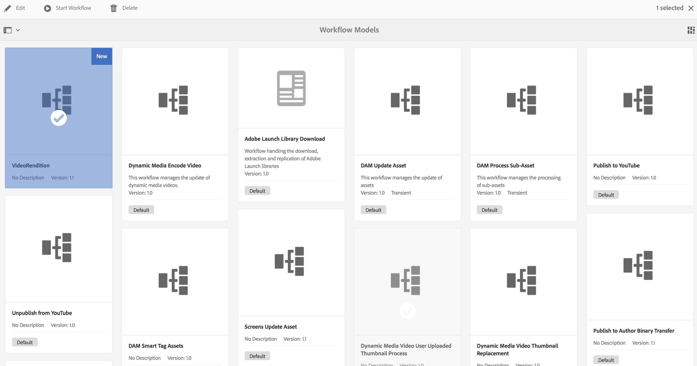
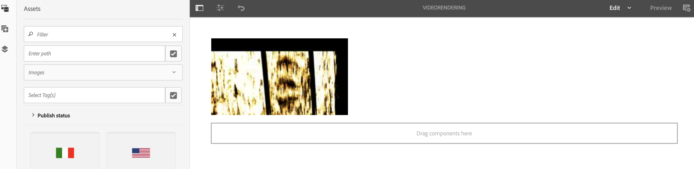

# Workflow voor het opvullen van video&#39;s maken {#creating-a-video-padding-workflow}

In deze sectie worden de volgende onderwerpen behandeld:

* **Overzicht**
* **Vereisten**
* **Workflow voor het opvullen van video&#39;s maken**
   * **Een workflow maken**
   * **De workflow in AEM Screens Project gebruiken**

* **De uitvoer voor de workflow valideren**

## Overzicht {#overview}

Het volgende gebruiksgeval bestaat uit het plaatsen van een video (bijvoorbeeld 1280 x 720) in een kanaal met een beeldscherm van 1920 x 1080 en het plaatsen van de video op 0 x 0 (linksboven). De video mag op geen enkele manier worden uitgerekt of gewijzigd en gebruikt deze **Omslag** in de videocomponent.

De video wordt weergegeven als een object van pixel 1 tot pixel 1280, van pixel 1 tot pixel 720, en de rest van het kanaal is de standaardkleur.

## Vereisten {#prerequisites}

Voordat u een workflow voor video maakt, moet u aan de volgende voorwaarden voldoen:

1. Een video uploaden in **Activa** map in uw AEM-instantie
1. Een AEM Screens-project maken (bijvoorbeeld **TestVideoRendition**) en een kanaal genoemd (**VideoRendering**), zoals weergegeven in onderstaande afbeelding:

## Workflow voor het opvullen van video&#39;s maken {#creating-a-video-padding-workflow-1}

Als u een workflow voor het opvullen van video&#39;s wilt maken, maakt u een workflow voor uw video en gebruikt u dezelfde workflow in het AEM Screens-projectkanaal.

Voer de onderstaande stappen uit om de workflow te maken en te gebruiken:

1. Een workflow maken
1. De workflow gebruiken in een AEM Screens-project

### Een workflow maken {#creating-a-workflow}

Voer de onderstaande stappen uit om een workflow voor uw video te maken:

1. Navigeer naar de AEM.
1. Klik op gereedschappen van de zijbalk.
1. Klikken **Workflow** > **Modellen** zodat u een model kunt maken.

   

1. Klikken **Modellen** > **Maken** > **Model maken**. Voer de **Titel** (as **VideoRendition**) en **Naam** in de **Workflowmodel toevoegen**. Klikken **Gereed** om het workflowmodel toe te voegen.

   

1. Nadat u het workflowmodel hebt gemaakt, klikt u op het model (**VideoRendition**) en klik op **Bewerken** in de actiebalk.

   

1. Sleep de **`Command Line`** aan uw werkstroom.

   

1. Klik op de knop **`Command Line`** en opent u het dialoogvenster met eigenschappen.

   

1. Klik op de knop **Argumenten** tab.
1. In de **Opdrachtregel - stapeigenschappen** de notatie in het dialoogvenster **MIME-typen** (as ***video/mp4***) en de opdracht als (***/usr/local/Cellar/ffmpeg -i ${filename} -vf &quot;pad=1920:height=1080:x=0:y=0:color=black&quot; cq5dam.video.fullhp.mp4**). Met deze opdracht wordt de workflow in het dialoogvenster **Opdrachten** veld.

   Zie de details op **MIME-typen** en **Opdrachten** in de onderstaande opmerking.

   

1. Klik op de workflow (**VideoRenditions**).
1. Klikken **Workflow starten** in de actiebalk.

   

1. In de **Workflow uitvoeren** klikt u op het pad van uw element in het dialoogvenster **Payload** (as ***/content/dam/huseinpeyda-crossroad01_512kb 2.mp4***) en voert u de **Titel** als ***RunVideo*** en klik op **Uitvoeren**.

   

### De workflow gebruiken in een AEM Screens-project {#using-the-workflow-in-an-aem-screens-project}

Voer de onderstaande stappen uit om de workflow in uw AEM Screens-project te gebruiken:

1. Navigeren naar een AEM Screens-project (**TestVideoRendition** > **Kanalen** >**VideoRendition**).

   

1. Klikken **Bewerken** in de actiebalk. Sleep de video die u aanvankelijk hebt geüpload naar **Activa**.

   

1. Wanneer u de video hebt geüpload, klikt u op **Voorvertoning** om de uitvoer weer te geven.

   

## De uitvoer voor de workflow valideren {#validating-the-output-for-the-workflow}

U kunt de uitvoer valideren door:

* De voorvertoning van de video in het kanaal controleren
* Ga naar de ***/content/dam/testvideo.mp4/jcr:content/renditions/cq5dam.video.fullhd-hp.mp4*** in CRXDE Lite, zoals weergegeven in onderstaande afbeelding:

