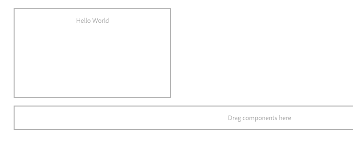

# Een aangepaste component voor AEM Screens ontwikkelen {#developing-a-custom-component-for-aem-screens}

De volgende zelfstudie doorloopt de stappen om een aangepaste component voor AEM Screens te maken. AEM Screens gebruikt veel bestaande ontwerppatronen en technologieën van andere AEM. In de zelfstudie worden verschillen en speciale overwegingen benadrukt bij het ontwikkelen voor AEM Screens.

## Overzicht {#overview}

Deze zelfstudie is bedoeld voor nieuwe ontwikkelaars van AEM Screens. In deze zelfstudie wordt een eenvoudige component &quot;Hello World&quot; gemaakt voor een volgnummer in AEM Screens. In een dialoogvenster kunnen auteurs de weergegeven tekst bijwerken.


## Vereisten {#prerequisites}

Voor het voltooien van deze zelfstudie is het volgende nodig:

1. [AEM 6.5](https://helpx.adobe.com/experience-manager/6-4/release-notes.html) of  [AEM 6.3](https://helpx.adobe.com/experience-manager/6-3/release-notes.html) + Functiepakket voor nieuwste schermen

1. [AEM Screens Player](https://helpx.adobe.com/experience-manager/6-4/sites/deploying/using/configuring-screens-introduction.html)
1. Lokale ontwikkelomgeving

De zelfstudiestappen en schermafbeeldingen worden uitgevoerd met behulp van **CRXDE-Lite**. IDEs kan ook worden gebruikt om het leerprogramma te voltooien. Meer informatie over het gebruiken van winde om [met AEM te ontwikkelen kan hier worden gevonden.](https://helpx.adobe.com/experience-manager/kt/sites/using/getting-started-wknd-tutorial-develop/part1.html#eclipse-ide)


## Projectinstelling {#project-setup}

De broncode van een project van het Scherm wordt typisch geleid als multi-module Maven project. Om de zelfstudie te versnellen, werd een project pre-geproduceerd gebruikend [AEM Project Archetype 13](https://github.com/Adobe-Marketing-Cloud/aem-project-archetype). Meer informatie over [het creëren van een project met Maven AEM Project Archetype kan hier worden gevonden](https://helpx.adobe.com/experience-manager/kt/sites/using/getting-started-wknd-tutorial-develop/part1.html#maven-multimodule).

1. Download en installeer de volgende pakketten met behulp van [CRX package manager](http://localhost:4502/crx/packmgr/index.jsp):

   [Bestand ophalen](assets/base-screens-weretail-runuiapps-001-snapshot.zip)

   [Bestand ophalen](assets/base-screens-weretail-runuicontent-001-snapshot.zip)
   **** Optioneel als u werkt met Eclipse of een andere IDE, het onderstaande bronpakket downloadt. Stel het project aan een lokale AEM instantie op door het Maven bevel te gebruiken:

   **`mvn -PautoInstallPackage clean install`**

   HelloWorld SRC-schermen starten We.Retail Run-project

   [Bestand ophalen](assets/src-screens-weretail-run.zip)

1. Controleer in [CRX Package Manager](http://localhost:4502/crx/packmgr/index.jsp) of de volgende twee pakketten zijn geïnstalleerd:

   1. **screens-weretail-run.ui.content-0.0.1-SNAPSHOT.zip**
   1. **screens-weretail-run.ui.apps-0.0.1-SNAPSHOT.zip**

   

   Schermen die wij.Retail Run UI.Apps en Ui.Content pakketten installeren via CRX Package Manager

1. Met het pakket **screens-weretail-run.ui.apps** wordt code onder `/apps/weretail-run` geïnstalleerd.

   Dit pakket bevat de code die verantwoordelijk is voor het renderen van aangepaste componenten voor het project. Dit pakket bevat componentcode en eventuele benodigde JavaScript- of CSS-code. Dit pakket sluit **screens-weretail-run.core-0.0.1-SNAPSHOT.jar** ook in die om het even welke code bevat Java nodig door het project.

   >[!NOTE]
   >
   >In deze zelfstudie wordt geen Java-code geschreven. Als meer complexe bedrijfslogica nodig is, kan back-end Java worden gemaakt en geïmplementeerd met de Core Java-bundel.

   

   Weergave van de code ui.apps in CRXDE Lite

   De **helloworld** component is momenteel enkel placeholder. Tijdens de zelfstudie wordt functionaliteit toegevoegd waarmee een auteur het bericht kan bijwerken dat door de component wordt weergegeven.

1. Met het pakket **screens-weretail-run.ui.content** wordt de onderstaande code geïnstalleerd:

   * `/conf/we-retail-run`
   * `/content/dam/we-retail-run`
   * `/content/screens/we-retail-run`

   Dit pakket bevat de eerste inhoud en configuratiestructuur die nodig zijn voor het project. **`/conf/we-retail-run`** Bevat alle configuraties voor het project van de Looppas Wij.Retail. **`/content/dam/we-retail-run`** omvat het starten van digitale elementen voor het project. **`/content/screens/we-retail-run`** bevat de structuur van de inhoud van het Scherm. De inhoud onder al deze paden wordt voornamelijk in AEM bijgewerkt. Om de consistentie tussen omgevingen (lokaal, Ontwikkelen, Stage, Prod) te bevorderen, wordt vaak een basisinhoudsstructuur opgeslagen in bronbeheer.

1. **Navigeer naar het AEM Screens > We.Retail Run-project:**

   Klik in het menu AEM Start > op het pictogram Schermen. Verifieer het Web.Retail Project van de Looppas kan worden gezien.

   

## De Hello World-component {#hello-world-cmp} maken

De component Hello World is een eenvoudige component waarmee een gebruiker een bericht kan invoeren dat op het scherm moet worden weergegeven. De component is gebaseerd op de [AEM Screens-componentsjabloon: https://github.com/Adobe-Marketing-Cloud/aem-screens-component-template](https://github.com/Adobe-Marketing-Cloud/aem-screens-component-template).

AEM Screens heeft sommige interessante beperkingen die niet noodzakelijk waar voor traditionele componenten van Plaatsen WCM zijn.

* De meeste componenten van het Scherm moeten in volledig scherm op de doeldigitale signaalapparaten lopen
* De meeste componenten van het Scherm moeten in de opeenvolgingskanalen kunnen worden ingebed om diapresentaties te produceren
* Authoring moet het mogelijk maken afzonderlijke componenten te bewerken in een reekskanaal, zodat het volledig scherm niet meer nodig is

1. Navigeer in **CRXDE-Lite** `http://localhost:4502/crx/de/index.jsp` (of IDE of choice) naar `/apps/weretail-run/components/content/helloworld.`

   Voeg de volgende eigenschappen toe aan de `helloworld` component:

   ```
       jcr:title="Hello World"
       sling:resourceSuperType="foundation/components/parbase"
       componentGroup="We.Retail Run - Content"
   ```

   

   Eigenschappen voor /apps/weretail-run/components/content/helloworld

   De **helloworld** component breidt **foundation/components/parbase** component uit zodat kan het behoorlijk binnen een opeenvolgingskanaal worden gebruikt.

1. Een bestand maken onder `/apps/weretail-run/components/content/helloworld` met de naam `helloworld.html.`

   Vul het bestand met het volgende:

   ```xml
   <!--/*
   
    /apps/weretail-run/components/content/helloworld/helloworld.html
   
   */-->
   
   <!--/* production: preview authoring mode + unspecified mode (i.e. on publish) */-->
   <sly data-sly-test.production="${wcmmode.preview || wcmmode.disabled}" data-sly-include="production.html" />
   
   <!--/* edit: any other authoring mode, i.e. edit, design, scaffolding, etc. */-->
   <sly data-sly-test="${!production}" data-sly-include="edit.html" />
   ```

   Schermcomponenten vereisen twee verschillende weergaven, afhankelijk van de vraag welke [ontwerpmodus](https://helpx.adobe.com/experience-manager/6-4/sites/authoring/using/author-environment-tools.html#PageModes) wordt gebruikt:

   1. **Productie**: Modus Voorvertoning of Publiceren (wcmmode=disabled)
   1. **Bewerken**: worden gebruikt voor alle andere ontwerpmodi, zoals bewerken, ontwerpen, basiskleur, ontwikkelaar...

   `helloworld.html`doet dienst als schakelaar, die welke auteurswijze momenteel actief controleert en aan een ander manuscript van HTML opnieuw richt. Een algemene conventie die door schermcomponenten wordt gebruikt, is een `edit.html`-script voor de bewerkingsmodus en een `production.html`-script voor de productiemodus.

1. Een bestand maken onder `/apps/weretail-run/components/content/helloworld` met de naam `production.html.`

   Vul het bestand met het volgende:

   ```xml
   <!--/*
    /apps/weretail-run/components/content/helloworld/production.html
   
   */-->
   
   <div data-duration="${properties.duration}" class="cmp-hello-world">
    <h1 class="cmp-hello-world__message">${properties.message}</h1>
   </div>
   ```

   Hierboven ziet u de productiemarkering voor de Hello World-component. Een `data-duration` attribuut is inbegrepen aangezien de component op een kanaal van de Opeenvolging wordt gebruikt. Het `data-duration` attribuut wordt gebruikt door het opeenvolgingskanaal om te weten hoe lang een opeenvolgingspunt moet worden getoond.

   De component rendert een `div`- en `h1`-tag met tekst. `${properties.message}` is een deel van het manuscript van HTML dat de inhoud van een bezit zal uitvoeren JCR genoemd  `message`. Later wordt een dialoogvenster gemaakt waarin een gebruiker een waarde kan invoeren voor de tekst van de eigenschap `message`.

   Merk ook op dat BEM-notatie (Block Element Modifier) wordt gebruikt met de component. BEM is een CSS-coderingsconventie die het gemakkelijker maakt om herbruikbare componenten te maken. BEM is de notatie die wordt gebruikt door [AEM Core Components](https://github.com/Adobe-Marketing-Cloud/aem-core-wcm-components/wiki/CSS-coding-conventions). Meer informatie is te vinden op: [https://getbem.com/](https://getbem.com/)

1. Een bestand maken onder `/apps/weretail-run/components/content/helloworld` met de naam `edit.html.`

   Vul het bestand met het volgende:

   ```xml
   <!--/*
   
    /apps/weretail-run/components/content/helloworld/edit.html
   
   */-->
   
   <!--/* if message populated */-->
   <div
    data-sly-test.message="${properties.message}"
    class="aem-Screens-editWrapper cmp-hello-world">
    <p class="cmp-hello-world__message">${message}</p>
   </div>
   
   <!--/* empty place holder */-->
   <div data-sly-test="${!message}"
        class="aem-Screens-editWrapper cq-placeholder cmp-hello-world"
        data-emptytext="${'Hello World' @ i18n, locale=request.locale}">
   </div>
   ```

   Hierboven ziet u de bewerkingsmarkeringen voor de Hello World-component. In het eerste blok wordt een bewerkingsversie van de component weergegeven als het dialoogvenster is gevuld.

   Het tweede blok wordt teruggegeven als geen dialoogdoos is ingegaan. De `cq-placeholder` en `data-emptytext` geven het etiket ***Hello World*** in dat geval als plaatshouder terug. De tekenreeks voor het label kan met i18n worden geïnternationaliseerd ter ondersteuning van ontwerpen in meerdere landinstellingen.

1. **Het dialoogvenster Schermafbeelding kopiëren dat moet worden gebruikt voor de component Hello World.**

   Het is het gemakkelijkst om van een bestaande dialoog te beginnen en dan wijzigingen te maken.

   1. Het dialoogvenster kopiëren van: `/libs/screens/core/components/content/image/cq:dialog`
   1. Het dialoogvenster onder `/apps/weretail-run/components/content/helloworld` plakken

   

1. **Werk het dialoogvenster Hello World bij en voeg een tabblad voor het bericht toe.**

   Werk het dialoogvenster bij, zodat dit overeenkomt met het volgende. De JCR-knooppuntstructuur van het laatste dialoogvenster wordt hieronder in XML weergegeven:

   ```xml
   <?xml version="1.0" encoding="UTF-8"?>
   <jcr:root xmlns:sling="https://sling.apache.org/jcr/sling/1.0" xmlns:cq="https://www.day.com/jcr/cq/1.0" xmlns:jcr="https://www.jcp.org/jcr/1.0" xmlns:nt="https://www.jcp.org/jcr/nt/1.0"
       jcr:primaryType="nt:unstructured"
       jcr:title="Hello World"
       sling:resourceType="cq/gui/components/authoring/dialog">
       <content
           jcr:primaryType="nt:unstructured"
           sling:resourceType="granite/ui/components/coral/foundation/tabs"
           size="L">
           <items jcr:primaryType="nt:unstructured">
               <message
                   jcr:primaryType="nt:unstructured"
                   jcr:title="Message"
                   sling:resourceType="granite/ui/components/coral/foundation/fixedcolumns">
                   <items jcr:primaryType="nt:unstructured">
                       <column
                           jcr:primaryType="nt:unstructured"
                           sling:resourceType="granite/ui/components/coral/foundation/container">
                           <items jcr:primaryType="nt:unstructured">
                               <message
                                   jcr:primaryType="nt:unstructured"
                                   sling:resourceType="granite/ui/components/coral/foundation/form/textfield"
                                   fieldDescription="Message for component to display"
                                   fieldLabel="Message"
                                   name="./message"/>
                           </items>
                       </column>
                   </items>
               </message>
               <sequence
                   jcr:primaryType="nt:unstructured"
                   jcr:title="Sequence"
                   sling:resourceType="granite/ui/components/coral/foundation/fixedcolumns">
                   <items jcr:primaryType="nt:unstructured">
                       <column
                           jcr:primaryType="nt:unstructured"
                           sling:resourceType="granite/ui/components/coral/foundation/container">
                           <items jcr:primaryType="nt:unstructured">
                               <duration
                                   jcr:primaryType="nt:unstructured"
                                   sling:resourceType="granite/ui/components/coral/foundation/form/numberfield"
                                   defaultValue=""
                                   fieldDescription="Amount of time the image will be shown in the sequence, in milliseconds"
                                   fieldLabel="Duration (ms)"
                                   min="0"
                                   name="./duration"/>
                           </items>
                       </column>
                   </items>
               </sequence>
           </items>
       </content>
   </jcr:root>
   ```

   Het tekstveld voor het bericht wordt opgeslagen naar een eigenschap met de naam `message` en dat het nummerveld voor de duur wordt opgeslagen naar een eigenschap met de naam `duration`. Naar deze twee eigenschappen wordt in `/apps/weretail-run/components/content/helloworld/production.html` door HTL verwezen als `${properties.message}` en `${properties.duration}`.

   

   Hello World - dialoogvenster voltooid

## Client-Side bibliotheken maken {#clientlibs}

Client-Side Libraries bieden een mechanisme voor het organiseren en beheren van CSS- en JavaScript-bestanden die nodig zijn voor een AEM-implementatie.

AEM Screens-componenten worden in de bewerkingsmodus anders weergegeven dan in de modus Voorbeeld/productie. Er worden twee clientbibliotheken gemaakt: een voor de bewerkingsmodus en een tweede voor Voorvertoning/Productie.

1. Maak een map voor client-side bibliotheken voor de component Hello World.

   Onder `/apps/weretail-run/components/content/helloworld`maak een nieuwe map met de naam `clientlibs`.

   

1. Onder de map `clientlibs` maakt u een nieuw knooppunt met de naam `shared` van het type `cq:ClientLibraryFolder.`

   

1. Voeg de volgende eigenschappen toe aan de gedeelde clientbibliotheek:

   * `allowProxy` | Boolean | `true`

   * `categories`| String[] |  `cq.screens.components`

   

   Eigenschappen voor /apps/weretail-run/components/content/helloworld/clientlibs/shared

   De eigenschap Categorieën is een tekenreeks die de clientbibliotheek identificeert. De categorie cq.screens.component wordt gebruikt in zowel de modus Bewerken als de modus Voorbeeld/productie. Daarom wordt elke CSS/JS die in de sharedclientLib is gedefinieerd, in alle modi geladen.

   Het is aan te raden geen paden in een productieomgeving rechtstreeks toegankelijk te maken voor /apps. De eigenschap allowProxy zorgt ervoor dat naar de CSS- en JS-clientbibliotheek wordt verwezen via het voorvoegsel of/etc.clientlibs.

1. Maak een bestand met de naam `css.txt` onder de gedeelde map.

   Vul het bestand met het volgende:

   ```
   #base=css
   
   styles.less
   ```

1. Maak een map met de naam `css` onder de map `shared`. Voeg een bestand met de naam `style.less` toe onder de map `css`. De structuur van de clientbibliotheken moet er nu als volgt uitzien:

   

   In plaats van CSS rechtstreeks te schrijven, gebruikt deze zelfstudie LESS. [](https://lesscss.org/) LESS is een populaire CSS-voorcompiler die CSS-variabelen, -mixins en -functies ondersteunt. AEM clientbibliotheken ondersteunen native LESS-compilatie. De klasse of andere pre-compilers kunnen worden gebruikt maar moeten buiten AEM worden gecompileerd.

1. Vul `/apps/weretail-run/components/content/helloworld/clientlibs/shared/css/styles.less` met het volgende:

   ```css
   /**
       Shared Styles
      /apps/weretail-run/components/content/helloworld/clientlibs/shared/css/styles.less
   
   **/
   
   .cmp-hello-world {
       background-color: #fff;
   
    &__message {
     color: #000;
     font-family: Helvetica;
     text-align:center;
    }
   }
   ```

1. Kopieer en plak de map `shared` van de clientbibliotheek om een nieuwe clientbibliotheek met de naam `production` te maken.

   

   Kopieer de gedeelde clientbibliotheek om een nieuwe productieclientbibliotheek te maken

1. De `categories`-eigenschap van de productieklantenbibliotheek bijwerken naar `cq.screens.components.production.`

   Dit zorgt ervoor dat de stijlen alleen worden geladen in de modus Voorbeeld/productie.

   

   Eigenschappen voor /apps/weretail-run/components/content/helloworld/clientlibs/production

1. Vul `/apps/weretail-run/components/content/helloworld/clientlibs/production/css/styles.less` met het volgende:

   ```css
   /**
       Production Styles
      /apps/weretail-run/components/content/helloworld/clientlibs/production/css/styles.less
   
   **/
   .cmp-hello-world {
   
       height: 100%;
       width: 100%;
       position: fixed;
   
    &__message {
   
     position: relative;
     font-size: 5rem;
     top:25%;
    }
   }
   ```

   Bij de bovenstaande stijlen wordt het bericht gecentreerd weergegeven in het midden van het scherm, maar alleen in de productiemodus.

Een derde categorie clientbibliotheek: `cq.screens.components.edit` zou kunnen worden gebruikt om Edit-enige specifieke stijlen aan de component toe te voegen.

| Clientlib-categorie | Gebruik |
|---|---|
| `cq.screens.components` | Stijlen en scripts die worden gedeeld tussen de bewerkings- en de productiemodus |
| `cq.screens.components.edit` | Stijlen en scripts die alleen worden gebruikt in de bewerkingsmodus |
| `cq.screens.components.production` | Stijlen en scripts die alleen in de productiemodus worden gebruikt |

## Ontwerppagina {#design-page} maken

AEM Screens gebruikt [statische paginasjablonen](https://helpx.adobe.com/experience-manager/6-5/sites/developing/using/page-templates-static.html) en [Ontwerpconfiguraties](https://helpx.adobe.com/experience-manager/6-4/sites/authoring/using/default-components-designmode.html) voor algemene wijzigingen. De configuraties van het ontwerp worden vaak gebruikt om toegestane componenten voor Parsys op een kanaal te vormen. U kunt deze configuraties het beste op een toepassingsspecifieke manier opslaan.

Onder een Web.Retail pagina van het Ontwerp van de Looppas wordt gecreeerd die alle configuraties specifiek voor het Web.Retail project van de Looppas zal opslaan.

1. Navigeer in **CRXDE-Lite** `http://localhost:4502/crx/de/index.jsp#/apps/settings/wcm/designs` naar `/apps/settings/wcm/designs`
1. Maak een nieuw knooppunt onder de ontwerpmap met de naam `we-retail-run` met het type `cq:Page`.
1. Voeg onder de pagina `we-retail-run` een ander knooppunt met de naam `jcr:content` van het type `nt:unstructured` toe. Voeg de volgende eigenschappen aan de `jcr:content` knoop toe:

   | Naam | Type | Waarde |
   |---|---|---|
   | jcr:titel | Tekenreeks | We.Retail Run |
   | sling:resourceType | Tekenreeks | wcm/core/components/ontwerper |
   | cq:doctype | Tekenreeks | html_5 |

   

   Ontwerppagina bij /apps/settings/wcm/designs/we-Retail-run

## Een volgend kanaal maken {#create-sequence-channel}

De Hello World-component is bedoeld voor gebruik op een Volgekanaal. Om de component te testen, wordt een nieuw Kanaal van de Opeenvolging gecreeerd.

1. Navigeer in het menu Start AEM naar **Schermen** > **We.Retail Ru** n > en selecteer **Kanalen**.

1. Klik op de knop **Maken**

   1. Kies **Entiteit maken**

   

1. In de wizard Maken:

1. Sjabloonstap - kies **Volgekanaal**

   1. Eigenschappenstap
   * Basistabblad > Titel = **Niet-actief kanaal**
   * Kanaaltab > controleren **Kanaal online maken**

   

1. Open de pagina-eigenschappen voor het onactieve kanaal. Werk het veld Ontwerp bij zodat het naar `/apps/settings/wcm/designs/we-retail-run,`de ontwerppagina verwijst die in de vorige sectie is gemaakt.

   

   Ontwerpconfiguratie die wijst naar /apps/settings/wcm/designs/we-retail-run

1. Bewerk het nieuwe inactieve kanaal om het te openen.

1. Overschakelen van paginamodus naar modus **Design**

   1. Klik **wimpel** pictogram in Parsys om de toegestane componenten te vormen

   1. Selecteer de groep **Schermen** en de groep **We.Retail Run - Content**.

   

1. Schakel de paginamodus in **Bewerken**. De component Hello World kan nu aan de pagina worden toegevoegd en met andere componenten van het opeenvolgingskanaal worden gecombineerd.

   

1. Navigeer in **CRXDE-Lite** `http://localhost:4502/crx/de/index.jsp#/apps/settings/wcm/designs/we-retail-run/jcr%3Acontent/sequencechannel/par` naar `/apps/settings/wcm/designs/we-retail-run/jcr:content/sequencechannel/par`. De eigenschap `components` bevat nu `group:Screens`, `group:We.Retail Run - Content`.

   

   Ontwerpconfiguratie onder /apps/settings/wcm/designs/we-retail-run

## Sjabloon voor aangepaste handlers {#custom-handlers}

Als uw aangepaste component externe bronnen gebruikt, zoals elementen (afbeeldingen, video&#39;s, lettertypen, pictogrammen, enz.), specifieke elementuitvoeringen of clientbibliotheken (css, js, enz.), worden deze niet automatisch toegevoegd aan de offlineconfiguratie omdat de HTML-markering standaard alleen wordt gebundeld.

Om u te laten aanpassen en de nauwkeurige activa optimaliseren die aan de speler worden gedownload, bieden wij een uitbreidingsmechanisme voor douanecomponenten aan om hun gebiedsdelen aan de off-line caching logica in Schermen bloot te stellen.

In de onderstaande sectie ziet u de sjabloon voor aangepaste offline bronhandlers en de minimale vereisten in de `pom.xml` voor dat specifieke project.

```java
package …;

import javax.annotation.Nonnull;

import org.apache.felix.scr.annotations.Component;
import org.apache.felix.scr.annotations.Reference;
import org.apache.felix.scr.annotations.Service;
import org.apache.sling.api.resource.Resource;
import org.apache.sling.api.resource.ResourceUtil;
import org.apache.sling.api.resource.ValueMap;

import com.adobe.cq.screens.visitor.OfflineResourceHandler;

@Service(value = OfflineResourceHandler.class)
@Component(immediate = true)
public class MyCustomHandler extends AbstractResourceHandler {

 @Reference
 private …; // OSGi services injection

 /**
  * The resource types that are handled by the handler.
  * @return the handled resource types
  */
 @Nonnull
 @Override
 public String[] getSupportedResourceTypes() {
     return new String[] { … };
 }

 /**
  * Accept the provided resource, visit and traverse it as needed.
  * @param resource The resource to accept
  */
 @Override
 public void accept(@Nonnull Resource resource) {
     ValueMap properties = ResourceUtil.getValueMap(resource);
     
     /* You can directly add explicit paths for offline caching using the `visit`
        method of the visitor. */
     
     // retrieve a custom property from the component
     String myCustomRenditionUrl = properties.get("myCustomRenditionUrl", String.class);
     // adding that exact asset/rendition/path to the offline manifest
     this.visitor.visit(myCustomRenditionUrl);
     
     
     /* You can delegate handling for dependent resources so they are also added to
        the offline cache using the `accept` method of the visitor. */
     
     // retrieve a referenced dependent resource
     String referencedResourcePath = properties.get("myOtherResource", String.class);
     ResourceResolver resolver = resource.getResourceResolver();
     Resource referencedResource = resolver.getResource(referencedResourcePath);
     // let the handler for that resource handle it
     if (referencedResource != null) {
         this.visitor.accept(referencedResource);
     }
   }
}
```

De volgende code verstrekt de minimumvereisten in `pom.xml` voor dat specifieke project:

```css
   <dependencies>
        …
        <!-- Felix annotations -->
        <dependency>
            <groupId>org.apache.felix</groupId>
            <artifactId>org.apache.felix.scr.annotations</artifactId>
            <version>1.9.0</version>
            <scope>provided</scope>
        </dependency>

        <!-- Screens core bundle with OfflineResourceHandler/AbstractResourceHandler -->
        <dependency>
            <groupId>com.adobe.cq.screens</groupId>
            <artifactId>com.adobe.cq.screens</artifactId>
            <version>1.5.90</version>
            <scope>provided</scope>
        </dependency>
        …
      </dependencies>
```

## Alles samenvoegen {#putting-it-all-together}

In de onderstaande video ziet u de voltooide component en de manier waarop deze aan een volgnummer kan worden toegevoegd. Het kanaal wordt vervolgens toegevoegd aan de weergave Locatie en uiteindelijk toegewezen aan een schermspeler.

>[!VIDEO](https://video.tv.adobe.com/v/22385?quaity=9)

## Voltooide code {#finished-code}

Hieronder ziet u de voltooide code uit de zelfstudie. **screens-weretail-run.ui.apps-0.0.1-SNAPSHOT.zip** en **screens-weretail-run.ui.content-0.0.1-SNAPSHOT.zip** zijn de gecompileerde AEM pakketten. **SRC-screens-weretail-looppas-0.0.1.zip **is de niet-gecompileerde broncode die kan worden opgesteld gebruikend Maven.

[Bestand ophalen](assets/screens-weretail-runuiapps-001-snapshot.zip)

[Bestand ophalen](assets/screens-weretail-runuicontent-001-snapshot.zip)

[Bestand ophalen](assets/screens-weretail-run.zip)
