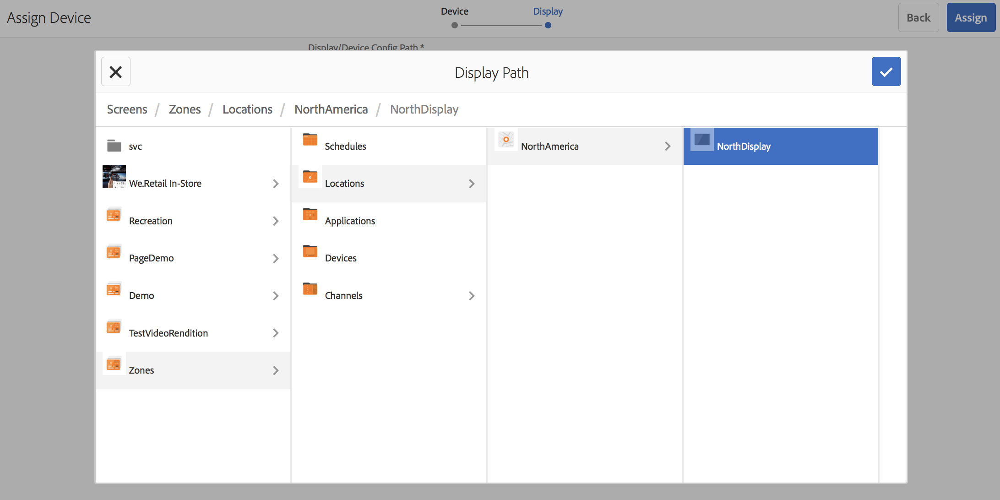

# Apparaatregistratie {#device-registration}

De volgende pagina beschrijft het proces van de apparatenregistratie in een project van AEM Screens.

## Een apparaat {#registering-a-device} registreren

Het registratieproces van het apparaat wordt uitgevoerd op twee aparte computers:

* Het daadwerkelijke apparaat dat moet worden geregistreerd, bijvoorbeeld uw signaalweergave
* De AEM server waarmee het apparaat wordt geregistreerd

>[!NOTE]
>
>Nadat u de nieuwste Windows Player (*.exe*) hebt gedownload, voert u vanuit de pagina [AEM 6.4 Player Downloads](https://download.macromedia.com/screens/) de stappen op de speler uit om de ad-hocinstallatie te voltooien:
>
>1. Druk op de linkerbovenhoek om het beheerpaneel te openen.
>1. Navigeer naar **Configuration** vanuit het linkeractiemenu en voer het locatieadres van de AEM in **Server** in en klik **Save**.
>1. Klik op de koppeling **Registratie** in het linkeractiemenu en de onderstaande stappen om het registratieproces van het apparaat te voltooien.

>


1. Start AEM Screens Player op uw apparaat. De registratieinterface wordt weergegeven.

   

1. Navigeer in AEM naar de map **Devices** van uw project.

   >[!NOTE]
   >
   >Zie [Project voor schermen maken en beheren ](creating-a-screens-project.md) voor meer informatie over het maken van een nieuw project voor schermen in het AEM dashboard.

1. Tik/klik op de knop **Apparaatbeheer** op de actiebalk.

   

1. Tik/klik op de knop **Apparaatregistratie** rechtsboven.

   

1. Selecteer het gewenste apparaat (zelfde als stap 1) en tik/klik **Apparaat registreren**.

   

1. Wacht AEM tot het apparaat de registratiecode heeft verzonden.

   

1. Controleer **Registratiecode** in uw apparaat.

   

1. Als de **Registratiecode** op beide computers hetzelfde is, tikt u op **Valideren** in AEM, zoals in stap (6).
1. Stel de gewenste naam voor het apparaat in en klik op **Register**.

   

1. Tik/klik **Voltooi** om het registratieproces te voltooien.

   

   >[!NOTE]
   >
   >Met **Nieuwe registratie** kunt u een nieuw apparaat registreren.
   >
   >Met **Weergave toewijzen** kunt u het apparaat rechtstreeks aan een weergave toevoegen.

   Als u **Voltooien** klikt, zult u het apparaat aan een vertoning moeten toewijzen.

   

   >[!NOTE]
   >
   >Voor meer informatie over het creëren van en het beheren van een vertoning voor uw project van het Scherm, gelieve te verwijzen naar [het Creëren van en het Leiden Vertoningen](managing-displays.md).

### Apparaat toewijzen aan een beeldscherm {#assigning-device-to-a-display}

Als u het apparaat niet aan een display hebt toegewezen, voert u de onderstaande stappen uit om uw apparaat aan een weergave in uw AEM Screens-project toe te wijzen:

1. Selecteer het apparaat en klik **Apparaat toewijzen** in de actiebalk.

   

1. Selecteer het pad van de weergave in **Pad weergeven/apparaatconfiguratie**.

   

1. Klik **Wijs** toe wanneer u de weg selecteert.

   

1. Klik **Voltooien** zodra het apparaat met succes is toegewezen, zoals getoond in de hieronder figuur.

   

   Daarnaast kunt u het weergavedashboard weergeven door te klikken op **Voltooien**.

   

## Een apparaat zoeken vanuit Apparaatbeheer {#search-device}

Nadat u apparaten hebt geregistreerd voor uw speler, kunt u alle apparaten weergeven via de interface van Apparaatbeheer.

1. Navigeer naar de interface van Apparaatbeheer van uw AEM Screens-project, bijvoorbeeld **DemoScreens** —> **Devices**.

1. Selecteer de map **Apparaten** en klik op **Apparaatbeheer** op de actiebalk.

   

1. De lijst met geregistreerde apparaten wordt weergegeven.

1. Als u een lange lijst met geregistreerde apparaten hebt, kunt u nu zoeken met het zoekpictogram op de actiebalk

   

   Of

   Klik `/` (schuine streep naar voren) om de zoekfunctionaliteit aan te roepen.

   


### Beperkingen betreffende zoekfunctionaliteit {#limitations}

* De gebruiker zal om het even welk woord kunnen zoeken bestaand in *Apparaat ID* of *Apparaatnaam*.

   >[!NOTE]
   >Het wordt aanbevolen de apparaatnamen te maken in meerdere woorden, zoals *Boston Store Lobby* in plaats van één *BostonStoreLobby*.

* Als u apparaatnamen maakt, zoals *Boston Store Lobby*, kunt u zoeken naar elk woord *boston*, *store* of *lobby*, maar als de apparaatnaam wordt aangeduid als *BostonStoreLobby* zoekend *boston* zal de resultaten niet tonen.

* Jokerteken, `*` wordt ondersteund voor zoeken. Als u alle apparaten wilt zoeken met namen die beginnen met *boston*, kunt u *boston** gebruiken.

* Als de apparaatnaam *BostonStoreLobby* is en het zoeken naar *boston* zal het resultaat niet retourneren in plaats daarvan wanneer u *boston** in uw zoekcriteria gebruikt, wordt het resultaat geretourneerd.

## Beperkingen betreffende apparaatregistratie {#limitations-on-device-registration}

Beperkingen van wachtwoorden voor gebruikers in het hele systeem kunnen leiden tot een fout in de apparaatregistratie. De apparaatregistratie gebruikt een willekeurig gegenereerd wachtwoord om de apparaatgebruiker te maken.

Als het wachtwoord wordt beperkt door de configuratie *AuthorizableActionProvider*, zou het creëren van de apparatengebruiker kunnen ontbreken.

>[!NOTE]
>
>Het huidige gegenereerde willekeurige wachtwoord bestaat uit 36 ASCII-tekens, variërend van 33 tot 122 (bevat bijna alle speciale tekens).

```java
25.09.2016 16:54:03.140 *ERROR* [59.100.121.82 [1474844043109] POST /content/screens/svc/registration HTTP/1.1] com.adobe.cq.screens.device.registration.impl.RegistrationServlet Error during device registration
javax.jcr.nodetype.ConstraintViolationException: Password violates password constraint (^(?=.*\d).{7,9}$).
        at org.apache.jackrabbit.oak.spi.security.user.action.PasswordValidationAction.validatePassword(PasswordValidationAction.java:105)
        at org.apache.jackrabbit.oak.spi.security.user.action.PasswordValidationAction.onPasswordChange(PasswordValidationAction.java:76)
        at org.apache.jackrabbit.oak.security.user.UserManagerImpl.onPasswordChange(UserManagerImpl.java:308)
```

### Aanvullende bronnen {#additional-resources}

Zie [AEM Screens Player](working-with-screens-player.md) voor meer informatie over AEM Screens Player.
