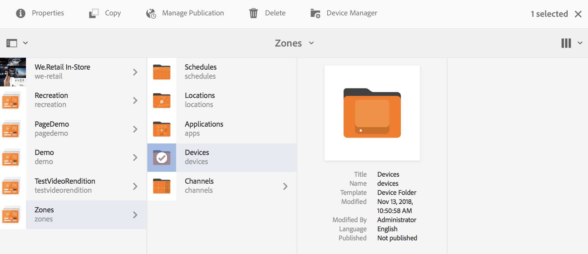
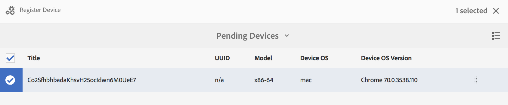

# Apparaatregistratie {#device-registration}

De volgende pagina beschrijft het proces van de apparatenregistratie in een project van AEM Screens.

## Een apparaat registreren {#registering-a-device}

Het registratieproces van het apparaat wordt uitgevoerd op twee aparte computers:

* Het daadwerkelijke apparaat dat moet worden geregistreerd, bijvoorbeeld uw signaalweergave
* De AEM server waarmee het apparaat wordt geregistreerd

>[!NOTE]
>
>Wanneer u de nieuwste Windows Player-versie hebt gedownload (*.exe*), van [AEM 6.4 Player-downloads](https://download.macromedia.com/screens/) Voer de stappen op de speler uit om de ad-hocinstallatie te voltooien:
>
>1. Druk op de linkerbovenhoek om het beheerpaneel te openen.
>1. Navigeren naar **Configuratie** in het linkeractiemenu en voer het locatieadres van de AEM in **Server** en klik op **Opslaan**.
>1. Klik op de knop **Registratie** Klik op de koppeling in het menu met de linkeractie en voer de onderstaande stappen uit om het registratieproces voor apparaten te voltooien.
>


1. Start AEM Screens Player op uw apparaat. De registratieinterface wordt weergegeven.

   

1. Navigeer in AEM naar de **Apparaten** van uw project.

   >[!NOTE]
   >
   >Ga voor meer informatie over het maken van een nieuw project voor schermen in het AEM dashboard naar [Schermproject maken en beheren](creating-a-screens-project.md).

1. Tik/klik op de knop **Apparaatbeheer** in de actiebalk.

   

1. Tik/klik op de knop **Apparaatregistratie** aan de rechterbovenzijde.

   

1. Selecteer het gewenste apparaat (zelfde als stap 1) en tik/klik **Apparaat registreren**.

   

1. Wacht AEM tot het apparaat de registratiecode heeft verzonden.

   

1. Controleer in het apparaat de **Registratiecode**.

   

1. Als de **Registratiecode** is hetzelfde op beide computers, tikken/klikken **Valideren** in AEM, zoals getoond in stap (6).
1. Stel de gewenste naam voor het apparaat in en klik op **Registreren**.

   

1. Tikken/klikken **Voltooien** om het registratieproces te voltooien.

   

   >[!NOTE]
   >
   >De **Nieuwe registratie** kunt u een nieuw apparaat registreren.
   >
   >De **Weergave toewijzen** Hiermee kunt u het apparaat rechtstreeks aan een weergave toevoegen.

   Als u op **Voltooien**, moet u het apparaat toewijzen aan een scherm.

   

   >[!NOTE]
   >
   >Raadpleeg voor meer informatie over het maken en beheren van een weergave voor uw screeningproject [Weergaven maken en beheren](managing-displays.md).

### Apparaat toewijzen aan een weergave {#assigning-device-to-a-display}

Als u het apparaat niet aan een display hebt toegewezen, voert u de onderstaande stappen uit om uw apparaat aan een weergave in uw AEM Screens-project toe te wijzen:

1. Selecteer het apparaat en klik op **Apparaat toewijzen** in de actiebalk.

   

1. Selecteer het pad van de weergave in **Configuratiepad weergeven/apparaat**.

   

1. Klikken **Toewijzen** wanneer u het pad selecteert.

   

1. Klikken **Voltooien** zodra het apparaat met succes is toegewezen, zoals in onderstaande afbeelding wordt getoond.

   

   Bovendien kunt u het weergavedashboard weergeven wanneer u op **Voltooien**.

   

## Een apparaat zoeken vanuit Apparaatbeheer {#search-device}

Nadat u apparaten hebt geregistreerd voor uw speler, kunt u alle apparaten weergeven via de interface van Apparaatbeheer.

1. Navigeer bijvoorbeeld naar de interface van Apparaatbeheer vanuit uw AEM Screens-project. **DemoScreens** > **Apparaten**.

1. Selecteer de **Apparaten** en klik op **Apparaatbeheer** in de actiebalk.

   

1. De lijst met geregistreerde apparaten wordt weergegeven.

1. Als u een lange lijst met geregistreerde apparaten hebt, kunt u nu zoeken met het zoekpictogram op de actiebalk

   

   Of,

   Klikken `/` (forward slash) om de zoekfunctionaliteit aan te roepen.

   


### Beperkingen betreffende zoekfunctionaliteit {#limitations}

* De gebruiker zal om het even welk woord kunnen zoeken dat in *Apparaat-id* of *Apparaatnaam*.

  >[!NOTE]
  >Het wordt aanbevolen de apparaatnamen in meerdere woorden te maken, zoals *Boston Store Lobby* in plaats van één *BostonStoreLobby*.

* Als u apparaatnamen maakt, zoals *Boston Store Lobby*, kan worden gezocht naar elk woord *boston*, *winkel* of *lobby* maar als de apparaatnaam wordt aangeduid als *BostonStoreLobby* zoeken *boston* De resultaten worden niet weergegeven.

* Jokerteken `*` wordt ondersteund voor zoeken. Als dat het geval is, zoekt u naar alle apparaten met namen die beginnen met *boston* kunt u *boston**.

* Als de apparaatnaam *BostonStoreLobby* en zoeken naar *boston* retourneert het resultaat niet met *boston** in je zoekcriteria retourneert het resultaat.

## Beperkingen betreffende apparaatregistratie {#limitations-on-device-registration}

Beperkingen van wachtwoorden voor gebruikers in het hele systeem kunnen leiden tot een fout in de apparaatregistratie. De apparaatregistratie gebruikt een willekeurig gegenereerd wachtwoord om de apparaatgebruiker te maken.

Als het wachtwoord door *AuthorizableActionProvider* configuratie, zou het creëren van de apparatengebruiker kunnen ontbreken.

>[!NOTE]
>
>Het huidige gegenereerde willekeurige wachtwoord bestaat uit 36 ASCII-tekens, variërend van 33 tot 122 (bevat bijna alle speciale tekens).

```java
25.09.2016 16:54:03.140 *ERROR* [59.100.121.82 [1474844043109] POST /content/screens/svc/registration HTTP/1.1] com.adobe.cq.screens.device.registration.impl.RegistrationServlet Error during device registration
javax.jcr.nodetype.ConstraintViolationException: Password violates password constraint (^(?=.*\d).{7,9}$).
        at org.apache.jackrabbit.oak.spi.security.user.action.PasswordValidationAction.validatePassword(PasswordValidationAction.java:105)
        at org.apache.jackrabbit.oak.spi.security.user.action.PasswordValidationAction.onPasswordChange(PasswordValidationAction.java:76)
        at org.apache.jackrabbit.oak.security.user.UserManagerImpl.onPasswordChange(UserManagerImpl.java:308)
```

### Aanvullende bronnen {#additional-resources}

Ga voor meer informatie over AEM Screens Player naar [AEM Screens Player](working-with-screens-player.md).
