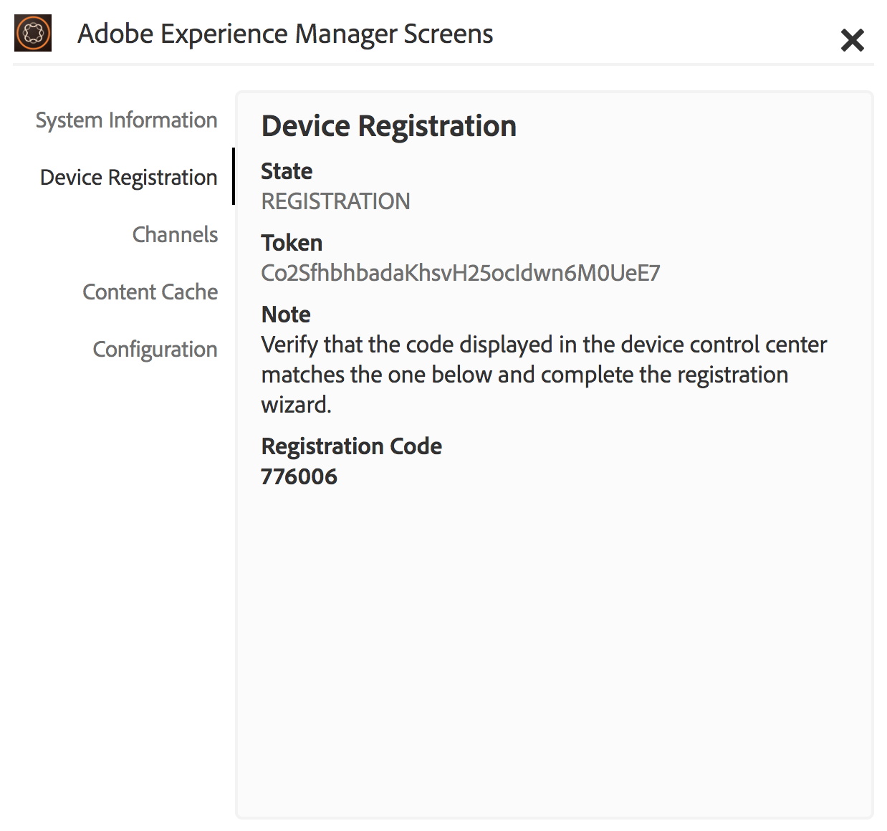

# Apparaatregistratie {#device-registration}

De volgende pagina beschrijft het proces van de apparatenregistratie in een project van AEM Screens.

## Een apparaat registreren {#registering-a-device}

Het registratieproces van het apparaat wordt uitgevoerd op twee aparte computers:

* Het daadwerkelijke apparaat dat moet worden geregistreerd, bijvoorbeeld uw signaalweergave
* De AEM server waarmee het apparaat wordt geregistreerd

>[!NOTE]
>
>Nadat u de nieuwste versie van Windows Player (*.exe*) hebt gedownload, gaat u van [AEM pagina met 6.4 Player-downloads](https://download.macromedia.com/screens/) naar de speler en voert u de ad-hocinstallatie uit:
>
>1. Druk op de linkerbovenhoek om het beheerpaneel te openen.
>1. Navigeer naar **Configuratie** van het linkeractiemenu en ga het plaatsadres van de AEM instantie in **Server** in en klik **sparen**.
>1. Klik op de koppeling **Registratie** in het actiemenu aan de linkerkant en de onderstaande stappen om het registratieproces van het apparaat te voltooien.

>


1. Start AEM Screens Player op uw apparaat. De registratieinterface wordt weergegeven.

   

1. Navigeer in AEM naar de map **Devices** van uw project.

   >[!NOTE]
   >
   >Zie Schermproject [maken en beheren voor meer informatie over het maken van een nieuw project voor schermen in het AEM-dashboard](creating-a-screens-project.md).

1. Tik/klik op de knop **Apparaatbeheer** op de actiebalk.

   

1. Tik/klik op de knop **Apparaatregistratie** rechtsboven.

   

1. Selecteer het gewenste apparaat (zelfde als stap 1) en tik/klik **het Apparaat** van het Register.

   

1. Wacht AEM tot het apparaat de registratiecode heeft verzonden.

   

1. Controleer de **registratiecode** op uw apparaat.

   

1. Als de **registratiecode** op beide computers hetzelfde is, tikt u op de knop **Valideren** of klikt u in AEM op de knop Valideren, zoals in stap 6 wordt getoond.
1. Stel de gewenste naam voor het apparaat in en klik op **Registreren**.

   

1. Tik/klik op **Voltooien** om het registratieproces te voltooien.

   

   >[!NOTE]
   >
   >Met **Register New** kunt u een nieuw apparaat registreren.
   >
   >Met Weergave **** toewijzen kunt u het apparaat rechtstreeks aan een weergave toevoegen.

   Als u op **Voltooien** klikt, moet u het apparaat aan een weergave toewijzen.

   

   >[!NOTE]
   >
   >Voor meer informatie over het creëren van en het beheren van een vertoning voor uw project van het Scherm, gelieve te verwijzen naar het [Creëren van en het Leiden Vertoningen](managing-displays.md).

### Apparaat toewijzen aan een weergave {#assigning-device-to-a-display}

Als u het apparaat niet aan een display hebt toegewezen, voert u de onderstaande stappen uit om uw apparaat aan een weergave in uw AEM Screens-project toe te wijzen:

1. Selecteer het apparaat en klik op Apparaat **** toewijzen op de actiebalk.

   

1. Selecteer het pad van de weergave in **Configuratiepad** weergeven/apparaat.

   

1. Klik op **Toewijzen** wanneer u het pad selecteert.

   

1. Klik op **Voltooien** als het apparaat is toegewezen, zoals in de onderstaande afbeelding wordt getoond.

   

   Bovendien kunt u het weergavedashboard weergeven wanneer u op **Voltooien** klikt.

   

## Beperkingen betreffende apparaatregistratie {#limitations-on-device-registration}

Beperkingen van wachtwoorden voor gebruikers in het hele systeem kunnen leiden tot een fout in de apparaatregistratie. De apparaatregistratie gebruikt een willekeurig gegenereerd wachtwoord om de apparaatgebruiker te maken.

Als het wachtwoord door de configuratie *AuthorizableActionProvider* wordt beperkt, zou het creëren van de apparatengebruiker kunnen ontbreken.

>[!NOTE]
>
>Het huidige gegenereerde willekeurige wachtwoord bestaat uit 36 ASCII-tekens, variërend van 33 tot 122 (bevat bijna alle speciale tekens).

```java
25.09.2016 16:54:03.140 *ERROR* [59.100.121.82 [1474844043109] POST /content/screens/svc/registration HTTP/1.1] com.adobe.cq.screens.device.registration.impl.RegistrationServlet Error during device registration
javax.jcr.nodetype.ConstraintViolationException: Password violates password constraint (^(?=.*\d).{7,9}$).
        at org.apache.jackrabbit.oak.spi.security.user.action.PasswordValidationAction.validatePassword(PasswordValidationAction.java:105)
        at org.apache.jackrabbit.oak.spi.security.user.action.PasswordValidationAction.onPasswordChange(PasswordValidationAction.java:76)
        at org.apache.jackrabbit.oak.security.user.UserManagerImpl.onPasswordChange(UserManagerImpl.java:308)
```

### Aanvullende bronnen {#additional-resources}

Zie [AEM Screens Player](working-with-screens-player.md)voor meer informatie over AEM Screens Player.
