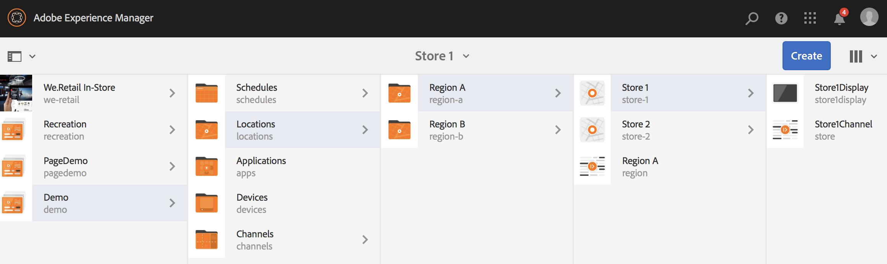

# Dynamische ingesloten reeks gebruiken {#using-dynamic-embedded-sequence}

Het gebruiken van Dynamische Ingesloten Reeksen behandelt de volgende onderwerpen:

* **Overzicht**
* **Gebruikend Dynamische Ingebedde Ervaring in AEM Screens**
* **het Bekijken van de Resultaten**
* **het Beperken van Gebruikers en het Wijzigen van ACLs**

## Overzicht {#overview}

***Dynamische Ingebedde Reeksen*** worden gecreeerd voor grote projecten die een ouder-kind hiërarchie volgen, waar het kind binnen een plaatsomslag en niet een kanaalomslag van verwijzingen wordt voorzien. Het staat de gebruiker toe om een opeenvolging binnen een kanaal door ***Rol van het Kanaal*** in te bedden. Hiermee kan de gebruiker plaatsspecifieke plaatsaanduidingen voor verschillende kantoren definiëren met behulp van een ingesloten reeks in een hoofdkanaal.

Wanneer u een kanaal toewijst aan een weergave, kunt u het pad van de weergave opgeven. U kunt ook de rol opgeven van het kanaal dat per context wordt omgezet in een daadwerkelijk kanaal.

Om Dynamische Ingebedde Opeenvolging te gebruiken, wijst u een kanaal door ***Rol van het Kanaal*** toe. De Rol van het kanaal bepaalt de context van de vertoning. De rol is gericht op verschillende acties en staat los van het daadwerkelijke kanaal dat de rol vervult. In deze sectie wordt een gebruiksscenario beschreven dat kanalen op rol bepaalt en hoe u die inhoud op een globaal kanaal kunt toepassen. U kunt de rol ook zien als een id voor de toewijzing of als een alias voor het kanaal in de context van.

### Voordelen van het gebruik van dynamische ingesloten reeksen {#benefits-of-using-dynamic-embedded-sequences}

Door een volgordekanaal in plaats van de kanaalmap in een locatie te plaatsen, kunnen lokale of regionale auteurs inhoud bewerken die voor hen van belang is. Het staat ook toe om van het uitgeven van kanalen hoger in de hiërarchie worden beperkt.

Verwijzend a *Kanaal door Rol*, laat u een lokale versie van een kanaal tot stand brengen. Als u dit doet, wordt locatiespecifieke inhoud dynamisch omgezet en kunt u ook een globaal kanaal maken dat de inhoud gebruikt voor de locatiespecifieke kanalen.

>[!NOTE]
>
>**Ingesloten Reeksen tegenover Dynamische Ingebedde Reeksen**
>
>Een dynamische ingesloten reeks is vergelijkbaar met een ingesloten reeks, maar de gebruiker kan een hiërarchie volgen waarin wijzigingen en updates die in het ene kanaal zijn aangebracht, aan het andere kanaal worden doorgegeven in relatie tot het andere kanaal. De klasse volgt een bovenliggende-onderliggende hiërarchie en bevat ook elementen zoals afbeeldingen of video&#39;s.
>
>***Dynamische Ingebedde Reeksen*** laat u plaats-specifieke inhoud tonen terwijl ***Ingebedde Reeksen*** slechts algemene diashow van de inhoud tonen. Tijdens het instellen van Dynamische ingesloten reeksen configureert u het kanaal ook met de rol en naam van het kanaal. Zie de onderstaande stappen voor praktische implementatie.
>
>Meer leren over het uitvoeren van ingebedde opeenvolgingen, zie [ Ingesloten Reeksen ](embedded-sequences.md) in AEM Screens.

In het volgende voorbeeld wordt een oplossing geboden waarbij de nadruk ligt op de volgende sleuteltermen:

* a ***belangrijkste opeenvolgingskanaal*** voor de globale opeenvolging.
* ***dynamische ingebedde opeenvolging*** componenten voor elk plaatselijk aanpasbaar deel van de opeenvolging.
* ***individuele opeenvolgingskanalen*** in de respectieve plaatsen met a *rol* in de vertoning die de **dynamische ingebedde opeenvolgingscomponent *rol*** aanpast.

>[!NOTE]
>
>Om meer over kanaaltaak te leren, zie **[Taak van het Kanaal](channel-assignment.md)** onder de Authoring sectie in de documentatie van AEM Screens.

## Dynamische ingesloten reeks gebruiken {#using-dynamic-embedded-sequence-2}

In de volgende sectie wordt uitgelegd hoe u een dynamische ingesloten reeks maakt in een AEM Screens-kanaal.

### Vereisten {#prerequisites}

Voordat u begint met het implementeren van deze functionaliteit, moet u ervoor zorgen dat u aan de volgende voorwaarden kunt voldoen om dynamische ingesloten reeksen te implementeren:

* Creeer een project van AEM Screens (in dit voorbeeld, **Demo**).
* Creeer a **Globaal** kanaal onder de **omslag van Kanalen**.
* Voeg inhoud aan uw **Globale** Kanaal toe (*Controle **Resources.zip**voor relevante activa*).

Het volgende beeld toont het **Demo** project met **Globale** kanaal in de **omslag van Kanalen**.

### Bronnen {#resources}

U kunt de volgende bronnen downloaden (afbeeldingen en deze toevoegen aan elementen) en ze verder gebruiken als inhoud voor kanalen om te demonstreren.

[Bestand ophalen](assets/resources.zip)

>[!NOTE]
>
>Zie de volgende bronnen voor aanvullende informatie over het maken van een project en het maken van een sequentiekanaal:
>
>* **[Creërend en het Leiden Projecten](creating-a-screens-project.md)**
>* **[het Leiden een Kanaal](managing-channels.md)**
>

Het uitvoeren van Dynamische Ingebedde Opeenvolging in een project van AEM Screens omvat drie belangrijke taken:

1. **de taxonomie van het Project van de vestiging met inbegrip van Kanalen, Plaatsen, en Vertoningen**
1. **Creërend een Programma**
1. **Toewijzend Programma aan elke vertoning**

Voer de volgende stappen uit om de functionaliteit te implementeren:

>[!CAUTION]
>
>Terwijl het uitvoeren van Dynamische Ingebedde Reeksen, ben zorgvuldig van de **gebieden van de Naam** en **Titel** terwijl het creëren van kanalen onder elke plaats. Volg de instructies op het gebied van nomenclatuur zorgvuldig op.

1. **creeer twee Omslag van Plaatsen.**

   Navigeer aan uw **plaats** omslag in uw project van AEM Screens en creeer twee plaatsomslagen als **Gebied A** en **Gebied B**.

   >[!NOTE]
   >
   >Terwijl het creëren van het **Gebied A** plaatsomslag, zorg u de **Titel** als **Gebied A** ingaat en u kunt het **gebied van de Naam** leeg verlaten, zodat **gebied-a** naam wordt opgenomen.
   >
   >Gelijkaardig is het geval voor het creëren van de plaatsomslag **Gebied B**, zoals hieronder getoond:

   

   >[!NOTE]
   >Leren hoe te om een plaats tot stand te brengen, zie **[Creërend en het Leiden Plaatsen](managing-locations.md)**.

1. **creeer twee Plaatsen en een Kanaal onder elke plaatsomslag.**

   1. Navigeer aan **Demo** > **Plaatsen** > **Gebied A**.
   1. Klik **Gebied A** en klik **+ creeer** van de actiebar.
   1. Klik **Plaats** van de tovenaar met **Titel** als **Opslag 1**. Op dezelfde manier creeer een andere plaats van de tovenaar die als **wordt genoemd Winkel 2** met de **Titel** als **Opslag 2**. U kunt het **gebied van de Naam** leeg verlaten terwijl het creëren van **Opslag 1** en **Opslag 2**.
   1. Herhaal stap (b) en klik nu **Kanaal van de Opeenvolging** van de tovenaar. Ga de **Titel** als **Gebied A** en **Naam** als **gebied** voor dit kanaal in.

   >[!CAUTION]
   >
   >Zorg ervoor dat terwijl het creëren van kanaal **Gebied A**, de **Titel** als **Gebied A** en de **Naam** als a **gebied** ingaat.

   

   Op dezelfde manier creeer twee plaatsen onder **Gebied B** die als **Opslag 3** en **Opslag 4** wordt genoemd. Ook, creeer het Kanaal van de a **Opeenvolging met** Titel **als** Gebied B **en** Naam **als** gebied **.**

   >[!CAUTION]
   >
   >Zorg ervoor dat u de zelfde naam voor de kanalen kunt gebruiken die in **Gebied A** worden gecreeerd en **Gebied B** als **gebied**.

   

1. **creeer Vertoning en Kanaal onder elke Plaats.**

   1. Navigeer aan **Demo** > **Plaatsen** > **Gebied A** > **Bewaren 1**.
   1. Klik **Opslag 1** en klik **+ creeer** van de actiebar.
   1. Klik **Vertoning** van de tovenaar en creeer **`Store1Display`**.
   1. Herhaal stap (b) en dit keer klik **Kanaal van de Opeenvolging** van de tovenaar. Ga de **Titel** als **`Store1Channel`** en **Naam** in als **opslag**.

   >[!CAUTION]
   >
   >Het is belangrijk wanneer u een opeenvolgingskanaal creeert, kan de **Titel** van het kanaal als uw vereiste zijn, maar de **Naam** zou het zelfde in alle lokale kanalen moeten zijn.
   >In dit voorbeeld, delen de kanalen onder **Gebied A** en **Gebied B** **Naam** als **gebied** en kanalen onder **`Store 1`**, **`Store 2`**, **`Store 3`**, en **`Store 4`** aandeel **Naam** als **opslag**.

   

   Op dezelfde manier creeer een vertoning als **`Store2Display`** en een kanaal **`Store2Channel`** onder **`Store `2** (met naam als **opslag**).

   >[!NOTE]
   >Zorg ervoor dat u de zelfde naam voor de kanalen kunt gebruiken die in **`Store 1`** en **`Store 2`** worden gecreeerd zoals **opslag**.

   

   Volg de voorafgaande stappen zodat kunt u een kanaal en vertoning in **`Store 3`** en **`Store 4`** onder **Gebied B** tot stand brengen. Opnieuw, zorg ervoor dat u zelfde **Naam** als **opslag** terwijl het creëren van kanaal **`Store3Channel`** en **`Store4Channel`** gebruikt.

   In de volgende afbeelding ziet u de weergave en het kanaal in **`Store 3`** .

   

   In de volgende afbeelding ziet u de weergave en het kanaal in **`Store 4`** .

   

1. **voeg Inhoud aan de Kanalen in hun respectieve Plaatsen toe.**

   Navigeer aan de **Demo** > **Plaatsen** > **Gebied A** > **Gebied A** en klik **uitgeven** van de actiebar. Sleep de elementen die u aan het kanaal wilt toevoegen en zet deze neer.

   >[!NOTE]
   >U kunt het {***dossier 0} Resources.zip van de **sectie van Middelen**, hierboven gebruiken, om de beelden als activa voor uw kanaalinhoud te gebruiken.***

   

   Op dezelfde manier navigeer aan de **Demo** > **Plaats** > **Gebied B** > **Gebied B** en klik **uitgeven** van de actiebar om de activa aan uw kanaal, zoals hieronder getoond te slepen en te laten vallen:

   

   Voer de voorgaande stappen en de bronnen uit, zodat u inhoud aan de volgende kanalen kunt toevoegen:

   * **`Store1Channel`**
   * **`Store2Channel`**
   * **`Store3Channel`**
   * **`Store4Channel`**

1. **creeer een Programma**

   Navigeer en klik de **omslag van Programma&#39;s** in uw project van AEM Screens. Dan klik **creëren** van de actiebar.

   Het volgende beeld toont **AdSchedule** die in het **wordt gecreeerd Demo** project.

   

1. **wijst Kanalen aan een Programma toe**

   1. Navigeer aan **Demo** > **Programma&#39;s** > **AdSchedule** en klik **Dashboard** van de actiebar.
   1. Klik **+ Wijs Kanaal** van **TOEGEWEZEN KANALEN** paneel toe zodat kunt u de **Toekenning van het Kanaal** dialoogdoos openen.
   1. Klik **Kanaal van de Verwijzing** door weg.
   1. Klik de **Weg van het Kanaal**, enkel als **Demo** > ***Kanalen*** > ***Globaal***.
   1. Ga de **Rol van het Kanaal**, enkel als **GlobalAdSegment** in.
   1. Klik de **Gesteunde Gebeurtenissen**, enkel aangezien **Aanvankelijke Lading**, **het Niet-actieve Scherm**, en **Interactie van de Gebruiker**.
   1. Klik **sparen**.

   **wijs Kanaal door Rol voor Gebied toe:**

   1. Klik **+ wijs Kanaal** van het **TOEGEWEZEN paneel van KANALEN** toe.
   1. In het de dialoogvakje van de Toewijzing van het Kanaal, klik **Kanaal van de Verwijzing** door naam.
   1. Ga de **Naam van het Kanaal** als **gebied*** in.
   1. Ga de **Rol van het Kanaal** als **RegionAdSegment** in.
   1. Klik **sparen**.

   **wijs Kanaal door Rol voor Opslag toe:**

   1. Klik **+ wijs Kanaal** van het **TOEGEWEZEN paneel van KANALEN** toe.
   1. In het de dialoogvakje van de Toewijzing van het Kanaal, klik **Kanaal van de Verwijzing** door naam.
   1. Ga de **Naam van het Kanaal** als **opslag** in.
   1. Ga de **Rol van het Kanaal** als **StoreAdSegment** in.
   1. Klik **sparen**.

   In de volgende afbeelding worden de toegewezen kanalen weergegeven per pad en per rol.

   

1. **Vormend Dynamische Ingebedde Opeenvolging aan het Globale Kanaal.**

   Navigeer aan het **Globale** Kanaal u aanvankelijk in het **Demo** project creeerde.

   Klik **uitgeven** van de actiebar.

   

   In de redacteur, sleep en daling twee **Dynamische Ingebedde componenten van de Opeenvolging** in de kanaalredacteur.

   Open de eigenschappen van één van de componenten en ga de **Rol van de Taak van het Kanaal** als **RegionAdSegment** in.

   Op dezelfde manier klik de andere componenten en open eigenschappen om de **Rol van de Taak van het Kanaal** als **StoreAdSegment** in te gaan.

   

1. **Toewijzend Programma aan elke Vertoning**

   1. Navigeer aan elke vertoning, zoals **Demo** > **Plaatsen** > **Gebied A** > **Opslag 1** > **`Store1Display`**.
   1. Klik **Dashboard** van de actiebar.
   1. Op het dashboard, klik **...** van **TOEGEWEZEN KANALEN &amp; SCHEMA&#39;S** paneel, en klik dan **+ Wijs Programma** toe.
   1. Klik de weg aan het Programma (bijvoorbeeld, hier, **Demo** > **Programma&#39;s** > **AdSchedule**).
   1. Klik **sparen**.

## De resultaten bekijken {#viewing-the-results}

Wanneer u de instellingen voor kanalen hebt ingesteld en de weergave is voltooid, start u AEM Screens Player om de inhoud weer te geven.

>[!NOTE]
>
>Raadpleeg de volgende bronnen voor meer informatie over AEM Screens Player:
>
>* [ Download de Speler van AEM Screens ](https://download.macromedia.com/screens/)
>* [ Werkend met de Speler van AEM Screens ](working-with-screens-player.md)

De volgende uitvoer bevestigt uw kanaalinhoud in AEM Screens Player, afhankelijk van het weergavepad.

**Scenario 1**:

Als u de vertoningsweg als **Demo** > **Plaatsen** > **Gebied A** > **Opslag 1** > **`Store1Display`** toewijst, de volgende inhoudsvertoningen op uw Speler van AEM Screens.

**Scenario 1**:

Als u de vertoningsweg als **Demo** > **Plaatsen** > **Gebied B** > **Opslag 3** > **`Store3Display`** toewijst, de volgende inhoudsvertoningen op uw Speler van AEM Screens.

## Het beperken van Gebruikers en het Wijzigen van ACLs {#restricting-users-and-modifying-the-acls}

U kunt globale, regionale of lokale auteurs maken om inhoud die voor hen van belang is, te bewerken, terwijl u de mogelijkheid hebt om kanalen hoger in de hiërarchie te bewerken.

Bewerk ACLs zodat u de toegang van de gebruiker tot de inhoud kunt beperken die op hun plaats wordt gebaseerd.

### Voorbeeld van gebruik {#example-use-case}

In het volgende voorbeeld kunt u drie gebruikers voor het bovenstaande demoproject maken.

De bevoegdheden worden aan elke groep toegewezen als volgt:

**Groepen**:

* **globaal-Auteur**: Bestaat uit gebruikers die toegang tot alle plaatsen en kanalen in het **3} project van de Demo {hebben en alle lees hebben, schrijven, en uitgeven toestemmingen.**

* **gebied-auteur**: Bestaat uit gebruikers die, toestemmingen aan **Gebied A** en **Gebied B** lezen schrijven en uitgeven.

* **opslag-auteur**: Bestaat uit gebruikers die, slechts toestemmingen lezen schrijven en uitgeven aan **Opslag 1**, **Opslag 2**, **Opslag 3**, en **Opslag 4**.

#### Stappen voor het creëren van Gebruikersgroepen, Gebruikers, en vestiging ACLs {#steps-for-creating-user-groups-users-and-setting-up-acls}

>[!NOTE]
>
>Om in detail te leren hoe te om projecten te segregeren die ACLs gebruiken zodat elk individu of team hun eigen project behandelt, zie **Vestiging ACLs**.

Volg de stappen hieronder om groepen, gebruikers tot stand te brengen, en ACLs volgens de toestemmingen te wijzigen:

1. **creeer Groepen**

   1. Navigeer aan **Adobe Experience Manager**.
   1. Klik **Hulpmiddelen** > **Veiligheid** > **Groepen**.
   1. Klik **creëren Groep** en ga **globaal-Auteur** in **identiteitskaart** in.
   1. Klik **sparen &amp; Sluiten**.

   Op dezelfde manier creeer twee andere groepen, zoals **gebied-auteur** en **opslag-auteur**.

   

1. **creeer Gebruikers en voeg Gebruikers aan Groepen toe**

   1. Navigeer aan **Adobe Experience Manager**.
   1. Klik **Hulpmiddelen** > **Veiligheid** > **Gebruikers**.
   1. Klik **creëren Gebruiker**, dan in **identiteitskaart**, ga **globaal-Gebruiker** in.
   1. Ga **Wachtwoord** in en bevestig het wachtwoord voor deze gebruiker.
   1. Klik het **lusje van Groepen** en ga de groepsnaam in **Groep** klikken, bijvoorbeeld, ga **globaal-Auteur** in om **globaal-Gebruiker** aan die specifieke groep toe te voegen.
   1. Klik **sparen &amp; Sluiten**.

   Op dezelfde manier creeer twee andere gebruikers, zoals **gebied-Gebruiker** en **opslag-Gebruiker**, en voeg hen aan **gebied-auteur** en **opslag-auteur** respectievelijk toe.

   >[!NOTE]
   >Het is aan te raden gebruikers toe te voegen aan een groep en vervolgens machtigingen toe te wijzen aan elke specifieke groep gebruikers.

   

1. **voeg alle Groepen aan Medewerkers** toe

   1. Navigeer aan **Adobe Experience Manager**.
   1. Klik **Hulpmiddelen** > **Veiligheid** > **Groepen**.
   1. Klik **Medewerkers** van de lijst en klik de **Leden** tabel.
   1. Klik de **Groep** zoals **globaal-auteur**, **gebied-auteur,** en **opslag-auteur** aan contribuanten.
   1. Klik **sparen &amp; Sluiten**.

1. **Toegang hebbend tot Toestemmingen voor Elke Groep**

   1. Navigeer aan *admin van de Gebruiker* en gebruik dit UI om de toestemmingen voor verschillende groepen te wijzigen.
   1. Onderzoek naar **globaal-Auteur** en klik het **3} lusje van Toestemmingen {, zoals aangetoond in het hieronder cijfer.**
   1. Op dezelfde manier kunt u tot de toestemmingen voor **gebied-auteur** en **opslag-auteur** toegang hebben.

   

1. **het Wijzigen Toestemmingen voor Elke Groep**

   **voor globaal-auteur:**

   1. Ga aan het **lusje van Toestemmingen**
   1. Navigeer naar ***/content/screens/demo*** en controleer alle machtigingen
   1. Navigeer naar ***/content/screens/demo/locations*** en controleer alle machtigingen
   1. Navigeer naar ***/content/screens/demo/locations/region-a*** en controleer alle machtigingen. Controleer op dezelfde manier de machtigingen voor **`region-b`** .

   Zie het volgende cijfer voor het begrijpen van de stappen:
   

   Het volgende toont aan dat **globaal-Gebruiker** toegang tot het **Globale Kanaal** heeft. En, toegang tot zowel **Gebied A** als **Gebied B** met alle vier opslag die **opslag 1**, **Opslag 2**, **Opslag 3**, en **Opslag 4**.

   

   **voor gebied-auteur:**

   1. Navigeer aan de **Toestemmingen** tabel.
   1. Navigeer aan ***/content/screens/demo*** en controleer slechts de **Gelezen** toestemmingen.
   1. Navigeer aan ***/content/screens/demo/locations*** en controleer slechts de **Gelezen** toestemmingen.
   1. Navigeer aan ***/content/screens/demo/channel*** en uncheck de toestemmingen voor **Globale** kanaal.
   1. Navigeer aan ***/content/screens/demo/locations***/ ***gebied-a*** en controleer alle toestemmingen. Controleer op dezelfde manier de machtigingen voor **`region-b`** .

   Zie de volgende afbeelding zodat u de stappen kunt begrijpen:

   

   Het volgende toont aan dat de gebied-Gebruiker toegang tot zowel **Gebied A** en **Gebied B** heeft. En, toegang tot alle vier opslag, namelijk **Winkel 1**, **opslag 2**, **opslag 3**, en **opslag 4**, maar heeft geen toegang tot het **Globale** Kanaal.

   

   **voor opslag-auteur:**

   1. Navigeer aan de **Toestemmingen** tabel.
   1. Navigeer aan ***/content/screens/demo*** en controleer slechts de **Gelezen** toestemmingen.
   1. Navigeer aan ***/content/screens/demo/locations*** en controleer slechts de **Gelezen** toestemmingen.
   1. Navigeer aan ***/content/screens/demo/channel*** en uncheck de toestemmingen voor **Globale** kanaal.
   1. Navigeer aan ***/content/screens/demo/locations/region-a*** en controleer slechts de **Gelezen** toestemmingen. Op dezelfde manier controleer slechts de **Gelezen** toestemmingen voor **`region-b`**.
   1. Navigeer aan ***/content/screens/demo/locations***/***gebied-a /store-1*** en controleer alle toestemmingen. Op dezelfde manier controleer de toestemmingen voor **store-2, store-3,** en **store-4**.

   Zie de volgende afbeelding zodat u de stappen kunt begrijpen:

   

   Het volgende toont aan dat de **opslag-Gebruiker** toegang slechts tot **Opslag 1** heeft, **Opslag 2**, **Opslag 3**, en **Opslag 4**. Nochtans, heeft het geen toestemmingen om tot de **Globale** of het gebied (**Gebied A** en **Gebied B**) kanalen toegang te hebben.

   

>[!NOTE]
>
>Om in detail over vestiging toestemmingen te leren, zie [ Vestiging ACLs ](setting-up-acls.md).
