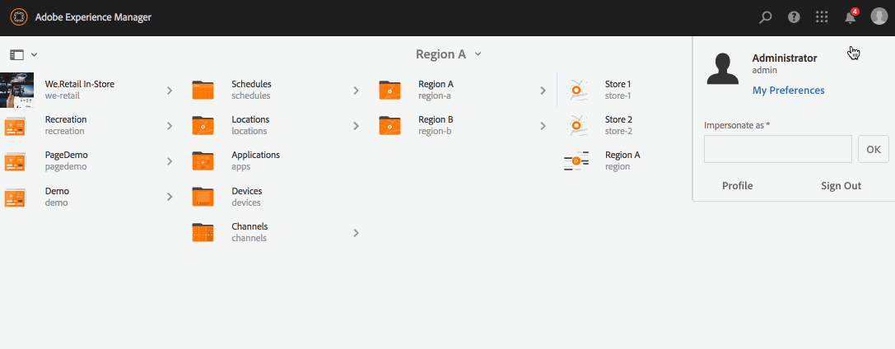

# Dynamische ingesloten reeks gebruiken {#using-dynamic-embedded-sequence}

Het gebruiken van Dynamische Ingesloten Reeksen behandelt de volgende onderwerpen:

* **Overzicht**
* **Dynamische ingesloten ervaring gebruiken in AEM Screens**
* **De resultaten bekijken**
* **Het beperken van Gebruikers en het Wijzigen van ACLs**

## Overzicht {#overview}

***Dynamische ingesloten*** reeksen worden gemaakt voor grote projecten die de onderliggende bovenliggende hiërarchie volgen, waarbij naar het onderliggende element wordt verwezen in een locatiemap en niet in een kanaalmap. Hiermee kan de gebruiker een reeks in een kanaal insluiten met ***Kanaalrol***. Hiermee kan de gebruiker plaatsspecifieke plaatsaanduidingen voor verschillende kantoren definiëren met behulp van een ingesloten reeks in een hoofdkanaal.

Wanneer u een kanaal toewijst aan een weergave, kunt u het pad van de weergave opgeven of de rol van het kanaal die per context wordt omgezet in een daadwerkelijk kanaal.

Om Dynamische Ingesloten Opeenvolging te gebruiken, wijst u een kanaal door ***de Rol van het Kanaal*** toe. De Rol van het kanaal bepaalt de context van de vertoning. De rol wordt op verschillende acties gericht en staat los van het daadwerkelijke kanaal dat de rol vervult. In deze sectie wordt een gebruiksscenario beschreven dat kanalen op rol bepaalt en hoe u die inhoud aan een globaal kanaal kunt gebruiken. U kunt de rol ook zien als een id voor de toewijzing of als een alias voor het kanaal in de context van.

### Voordelen van het gebruik van dynamische ingesloten reeksen {#benefits-of-using-dynamic-embedded-sequences}

Het belangrijkste voordeel van het plaatsen van een opeenvolgingskanaal binnen een plaats in plaats van de kanaalomslag is lokale of regionale auteurs toe te staan om inhoud uit te geven relevant voor hen terwijl het worden beperkt van het uitgeven van kanalen hoger in de hiërarchie.

Door naar een *Kanaal op rol* te verwijzen, kunt u een lokale versie van een kanaal maken om locatie-specifieke inhoud dynamisch op te lossen en kunt u ook een globaal kanaal maken dat de inhoud gebruikt voor de locatie-specifieke kanalen.

>[!NOTE]
>
>**Ingesloten reeksen versus dynamische ingesloten reeksen**
>
>Een dynamische ingesloten reeks is vergelijkbaar met een ingesloten reeks, maar de gebruiker kan een hiërarchie volgen waarin wijzigingen/updates die in het ene kanaal zijn aangebracht, aan het andere kanaal worden doorgegeven in relatie tot het andere kanaal. De klasse volgt de bovenliggende-onderliggende hiërarchie en bevat ook elementen zoals afbeeldingen of video&#39;s.
>
>***Met dynamische ingesloten*** reeksen kunt u locatie-specifieke inhoud weergeven, terwijl met  ***ingesloten*** reeksen alleen algemene presentaties van de inhoud worden weergegeven. Bovendien, terwijl vestiging Dynamische Ingebedde Reeksen, moet u het kanaal vormen gebruikend kanaalrol en naam. Raadpleeg de onderstaande stappen voor praktische implementatie.
>
>Raadpleeg [Ingesloten reeksen](embedded-sequences.md) in AEM Screens voor meer informatie over het implementeren van ingesloten reeksen.

In het volgende voorbeeld wordt een oplossing geboden waarbij de nadruk ligt op de volgende sleuteltermen:

* a ***hoofdsequentiekanaal*** voor de algemene reeks
* ***dynamische ingesloten*** sequencomponenten voor elk lokaal aanpasbaar deel van de reeks
* ***afzonderlijke opeenvolgingskanalen*** in de respectieve plaatsen met een  ** rol in de vertoning die de  **dynamische ingebedde  *rol* van de opeenvolgingscomponent aanpast.**

>[!NOTE]
>
>Zie **[Kanaaltoewijzing](channel-assignment.md)** onder sectie Ontwerpen in AEM Screens-documentatie voor meer informatie over kanaaltoewijzing.

## Dynamische ingesloten reeks gebruiken {#using-dynamic-embedded-sequence-2}

In de volgende sectie wordt uitgelegd hoe u een dynamische ingesloten reeks maakt in een AEM Screens-kanaal.

### Vereisten {#prerequisites}

Voordat u begint met het implementeren van deze functionaliteit, moet u ervoor zorgen dat u aan de volgende voorwaarden kunt voldoen om dynamische ingesloten reeksen te implementeren:

* Een AEM Screens-project maken (in dit voorbeeld **Demo**)

* Een kanaal maken als **Global** onder **Kanalen**-map

* Inhoud toevoegen aan uw **Global**-kanaal (*Controleer **Resources.zip**voor relevante elementen*)

De volgende afbeelding toont het **Demo**-project met **Global**-kanaal in **Channels**-map.

### Bronnen {#resources}

U kunt de volgende bronnen downloaden (afbeeldingen en deze toevoegen aan elementen) en deze verder gebruiken als kanaalinhoud voor demonstratiedoeleinden.

[Bestand ophalen](assets/resources.zip)

>[!NOTE]
>
>Raadpleeg de volgende bronnen voor meer informatie over het maken van een project en het maken van een volgnummer:
>
>* **[Projecten maken en beheren](creating-a-screens-project.md)**
>* **[Een kanaal beheren](managing-channels.md)**

>

Het uitvoeren van Dynamische Ingebedde Opeenvolging in een project van AEM Screens omvat drie belangrijke taken:

1. **Projecttaxonomie instellen, waaronder Kanalen, Locaties en Weergaven**
1. **Een schema maken**
1. **Plan toewijzen aan elke weergave**

Voer de volgende stappen uit om de functionaliteit te implementeren:

>[!CAUTION]
>
>Zorg tijdens het implementeren van dynamische ingesloten reeksen zorgvuldig voor de velden **Naam** en **Titel** terwijl u kanalen onder elke locatie maakt. Volg de instructies op het gebied van nomenclatuur zorgvuldig op.

1. **Maak twee locatiemap.**

   Navigeer naar de map **Locations** in uw AEM Screens-project en maak twee locatiemappen als **Regio A** en **Regio B**.

   >[!NOTE]
   >
   >Zorg tijdens het maken van de **Gebied A** locatiemap ervoor dat u **Titel** als **Gebied A** invoert en dat u het veld **Naam** leeg laat, zodat **regio-a** automatisch wordt opgepakt.
   >
   >Gelijkaardig, is het geval voor het creëren van plaatsomslag **Gebied B**, zoals hieronder getoond:

   

   >[!NOTE]
   >Als u wilt leren hoe u een locatie maakt, raadpleegt u **[Locaties maken en beheren](managing-locations.md)**.

1. **Maak twee locaties en een kanaal onder elke locatiemap.**

   1. Navigeer naar **Demo** —> **Locaties** —> **Regio A**.
   1. Selecteer **Gebied A** en klik **+ creëren** van de actiebar.
   1. Selecteer **Locatie** in de wizard met **Titel** als **Store 1**. Op dezelfde manier creeer een andere plaats van de tovenaar genoemd als **Opslag 2** met **Titel** als **Opslag 2**. U kunt het veld **Naam** leeg laten terwijl u **Store 1** en **Store 2** maakt.
   1. Herhaal stap (b) en selecteer nu **Volgkanaal** van de tovenaar. Voer de **Titel** in als **Regio A** en **Naam** als **regio** voor dit kanaal.

   >[!CAUTION]
   >
   >Zorg ervoor dat u bij het maken van kanaal **Regio A** de **Titel** als **Regio A** en de **Naam** als **regio** invoert.

   

   Maak op dezelfde manier twee locaties onder **Regio B** met de naam **Store 3** en **Store 4**. Maak ook een **Volgekanaal** met **Titel** als **Regio B** en **Naam** als **regio**.

   >[!CAUTION]
   >
   >Zorg ervoor dat u dezelfde naam kunt gebruiken voor de kanalen die worden gemaakt in **Regio A** en **Regio B** als **regio**.

   

1. **Weergave en kanaal maken onder elke locatie.**

   1. Navigeer naar **Demo** —> **Locaties** —> **Region A** —> **Store 1**.
   1. Selecteer **Store 1** en klik **+ creëren** van de actiebar.
   1. Selecteer **Display** in de wizard en maak **Store1Display.**
   1. Herhaal stap (b) en selecteer **Volgorde Kanaal** van de tovenaar. Voer **Title** in als **Store1Channel** en **Name** als **store**.

   >[!CAUTION]
   >
   >Het is belangrijk wanneer u een opeenvolgingskanaal creeert, **Titel** van het kanaal kan als uw vereiste zijn, maar **Naam** zou het zelfde in alle lokale kanalen moeten zijn.
   >In dit voorbeeld delen de kanalen onder **Regio A** en **Regio B** dezelfde **Naam** als **regio** en kanalen onder **Store 1**, **Store 2**, **Store 3**, en **Store 4** delen het zelfde **Name** zoals **store**.

   

   Maak op dezelfde manier een weergave als **Store2Display** en een kanaal **Store2Channel** onder **Store 2** (met naam als **store**).

   >[!NOTE]
   >Zorg ervoor dat u dezelfde naam kunt gebruiken voor de kanalen die zijn gemaakt in **Store 1** en **Store 2** als **store**.

   

   Voer de voorgaande stappen uit om een kanaal te maken en in **Store 3** en **Store 4** onder **Region B** weer te geven. Zorg er opnieuw voor dat u dezelfde **Naam** als **store** gebruikt bij het maken van kanaal **Store3Channel** en **Store4Channel**.

   De volgende afbeelding toont de weergave en het kanaal in **Store 3**.

   

   De volgende afbeelding toont de weergave en het kanaal in **Store 4**.

   

1. **Voeg inhoud aan de Kanalen in hun respectieve Plaatsen toe.**

   Navigeer naar **Demo** -> **Locaties** -> **Regio A** -> **Regio A** en klik **Bewerken** op de actiebalk. Sleep de elementen die u aan het kanaal wilt toevoegen en zet deze neer.

   >[!NOTE]
   >U kunt het ***Resources.zip*** dossier van **Resources** sectie, hierboven gebruiken, om de beelden als activa voor uw kanaalinhoud te gebruiken.

   

   Op dezelfde manier navigeer aan **Demo** -> **Locaties** -> **Gebied B** -> **Gebied B** en klik **Bewerken** van de actiebar om de activa aan uw kanaal te slepen, zoals hieronder getoond:

   

   Voer de voorgaande stappen en de bronnen uit om inhoud toe te voegen aan de volgende kanalen:

   * **Store1Channel**
   * **Store2Channel**
   * **Store3Channel**
   * **Store4Channel**

1. **Een schema maken**

   Navigeer en selecteer **Planningen** omslag in uw project van AEM Screens en klik **Create** van de actiebar om een nieuw programma tot stand te brengen.

   De volgende afbeelding toont de **AdSchedule** die in **Demo**-project is gemaakt.

   

1. **Kanalen toewijzen aan een schema**

   1. Navigeer naar **Demo** —> **Planningen** —> **AdSchedule** en klik **Dashboard** op de actiebalk.
   1. Klik **+ Wijs Kanaal** van **TOEGEWEZEN KANALEN** paneel toe om **Kanaal Toewijzing** dialoogdoos te openen.
   1. Selecteer **Referentiekanaal**.. per pad.
   1. Selecteer **Kanaalpad** als **Demo** —> ***Kanalen*** —> ***Globaal***.
   1. Voer de **Kanaalrol** in als **GlobalAdSegment**.
   1. Selecteer **Ondersteunde gebeurtenissen** als **Eerste lading**, **Niet-actief scherm**, en **Gebruikersinteractie**.
   1. Klik **Opslaan**.

   **Kanaal op rol toewijzen voor regio:**

   1. Klik **+ Wijs Kanaal** van **TOEGEWEZEN KANALEN** paneel toe om **Kanaal Toewijzing** dialoogdoos te openen.
   1. Selecteer **Referentiekanaal**.. op naam.
   1. Voer de **Kanaalnaam** in als **regio***.
   1. Voer de **Kanaalrol** in als **RegioAdSegment**.
   1. Klik **Opslaan**.

   **Kanaal op rol toewijzen voor winkel:**

   1. Klik **+ Wijs Kanaal** van **TOEGEWEZEN KANALEN** paneel toe om **Kanaal Toewijzing** dialoogdoos te openen.
   1. Selecteer **Referentiekanaal**.. op naam.
   1. Voer de **Kanaalnaam** in als **store**.
   1. Voer de **Kanaalrol** in als **StoreAdSegment**.
   1. Klik **Opslaan**.

   In de volgende afbeelding worden de toegewezen kanalen weergegeven per pad en per rol.

   

1. **Dynamische ingesloten reeks configureren naar algemeen kanaal.**

   Navigeer aan **Globaal** Kanaal, u aanvankelijk in **Demo** project creeerde.

   Klik op **Bewerken** in de handeling om de editor te openen.

   

   Sleep twee **Dynamische ingesloten reeks** componenten in de kanaaleditor.

   Open de eigenschappen van één van de componenten en ga **de Rol van de Toewijzing van het Kanaal** als **RegionAdSegment** in.

   Op dezelfde manier selecteer de andere component en open eigenschappen om **de Rol van de Toewijzing van het Kanaal** als **StoreAdSegment** in te gaan.

   

1. **Plan toewijzen aan elke weergave**

   1. Navigeer naar elke weergave, zoals **Demo** —> **Locaties** —> **Region A** —>**Store 1** —>**Store1Display**.
   1. Klik **Dashboard** van de actie om het vertoningsdashboard te openen.
   1. Klik **..** van **TOEGEWEZEN KANALEN &amp; SCHEDULES** en klik verder **+Wijs Programma** toe.
   1. Selecteer het pad naar het schema (bijvoorbeeld **Demo** —> **Planningen** —>**AdSchedule**).
   1. Klik **Opslaan**.

## Resultaten weergeven {#viewing-the-results}

Wanneer u de instellingen voor kanalen hebt ingesteld en de weergave voltooid is, start u de AEM Screens-speler om de inhoud weer te geven.

>[!NOTE]
>
>Raadpleeg de volgende bronnen voor meer informatie over AEM Screen Player:
>
>* [Downloads voor AEM Screens Player](https://download.macromedia.com/screens/)
>* [Werken met AEM Screens Player](working-with-screens-player.md)

De volgende uitvoer bevestigt de inhoud van uw kanaal in de AEM Screens-speler, afhankelijk van het weergavepad.

**Scenario 1**:

Als u het weergavepad toewijst als **Demo** —> **Locaties** —> **Region A** —> **Store 1** —> **Store1Display**, wordt de volgende inhoud weergegeven op uw AEM Screens-speler.

**Scenario 1**:

Als u het weergavepad toewijst als **Demo** —> **Locaties** —> **Regio B** —> **Store 3** —> **Store3Display**, wordt de volgende inhoud weergegeven op uw AEM Screens-speler.

## Het beperken van Gebruikers en het Wijzigen van ACLs {#restricting-users-and-modifying-the-acls}

U kunt globale, regionale of lokale auteurs maken om inhoud die voor hen van belang is, te bewerken, terwijl u de mogelijkheid hebt om kanalen hoger in de hiërarchie te bewerken.

U moet ACLs wijzigen om de gebruikers toegang tot de inhoud te beperken die op hun plaats wordt gebaseerd.

### Voorbeeld met hoofdletter {#example-use-case}

In het volgende voorbeeld kunt u drie gebruikers voor het bovenstaande demoproject maken.

De bevoegdheden worden aan elke groep toegewezen als volgt:

**Groepen**:

* **Globale auteur**: Bestaat uit gebruikers die toegang tot alle plaatsen en kanalen in  **** Demoproject hebben en alle lees hebben, schrijven, en uitgeven toestemmingen.

* **Regionaal-auteur**: Bestaat uit gebruikers die lees-, schrijf- en bewerkmachtigingen hebben voor  **Gebied** en  **Gebied B**.

* **Winkelauteur**: Bestaat uit gebruikers die alleen lees-, schrijf- en bewerkingsmachtigingen hebben voor  **Store 1**,  **Store 2**,  **Store 3** en  **Store 4**.

#### Stappen voor het creëren van Gebruikersgroepen, Gebruikers en vestiging ACLs {#steps-for-creating-user-groups-users-and-setting-up-acls}

>[!NOTE]
>
>Om in detail te leren hoe te om projecten te segregeren die ACLs gebruiken zodat elk individu of team hun eigen project behandelt, gelieve te verwijzen naar **Setting up ACLs**.

Volg de stappen hieronder om groepen, gebruikers tot stand te brengen en ACLs volgens de toestemmingen te wijzigen:

1. **Groepen maken**

   1. Navigeer naar **Adobe Experience Manager**.
   1. Klik **Gereedschappen** —> **Beveiliging** —> **Groepen**.
   1. Klik **Groep maken** en voer **Global-Author** in **ID** in.
   1. Klik **Opslaan en sluiten**.

   Maak op dezelfde manier twee andere groepen, zoals **Regionaal-auteur** en **Store-Author**.

   

1. **Gebruikers maken en gebruikers toevoegen aan groepen**

   1. Navigeer naar **Adobe Experience Manager**.
   1. Klik **Gereedschappen** —> **Beveiliging** —> **Gebruikers**.
   1. Klik **Create Gebruiker** en ga **Global-User** in **ID** in.
   1. Voer **Wachtwoord** in en bevestig het wachtwoord voor deze gebruiker.
   1. Klik op het tabblad **Groepen** en voer de naam van de groep in **Selecteer Groep** in. Voer bijvoorbeeld **Global-Author** in om **Global-User** aan die specifieke groep toe te voegen.
   1. Klik **Opslaan en sluiten**.

   Maak op dezelfde manier twee andere gebruikers, zoals **Region-User** en **Store-User**, en voeg deze toe aan **Region-Author** en **Store-Author**.

   >[!NOTE]
   >Het is aan te raden gebruikers toe te voegen aan een groep en vervolgens machtigingen toe te wijzen aan elke specifieke groep gebruikers.

   

1. **Alle groepen toevoegen aan contribuanten**

   1. Navigeer naar **Adobe Experience Manager**.
   1. Klik **Gereedschappen** —> **Beveiliging** —> **Groepen**.
   1. Selecteer **Medewerkers** in de lijst en selecteer **Leden** tabblad.
   1. Selecteer **Groep** zoals **Global-Author**, **Region-Author,** en **Store-Author** aan contributors.
   1. Klik **Opslaan en sluiten**.

1. **Toegang tot machtigingen voor elke groep**

   1. Navigeer naar *Gebruikerbeheer* en gebruik deze UI om de toestemmingen voor verschillende groepen te wijzigen.
   1. Zoek naar **Global-Author** en klik **Toestemmingen** tabel, zoals aangetoond in het hieronder cijfer.
   1. Op dezelfde manier kunt u tot de toestemmingen voor **Regionaal-Auteur** en **Store-Author** toegang hebben.

   

1. **Machtigingen voor elke groep wijzigen**

   **Voor wereldwijde auteur:**

   1. Navigeer naar het tabblad **Machtigingen**
   1. Navigeer naar ***/content/screens/demo*** en controleer alle machtigingen
   1. Navigeer naar ***/content/screens/demo/locations*** en controleer alle machtigingen
   1. Navigeer naar ***/content/screens/demo/locations/region-a*** en controleer alle machtigingen. Op dezelfde manier controleer de toestemmingen voor **region-b**.

   Raadpleeg de onderstaande afbeelding voor meer informatie over de stappen:
   

   De volgende afbeelding laat zien dat de **Global-User** nu toegang heeft tot het **Global Channel** en zowel **Region A** als **Region B** met alle vier opslagplaatsen: **Store 1**, **Store 2**, **Store 3** en **Store 4**.

   

   **Voor Regionaal-Auteur:**

   1. Navigeer naar het tabblad **Machtigingen**.
   1. Navigeer naar ***/content/screens/demo*** en controleer alleen de **Read**-machtigingen.
   1. Navigeer naar ***/content/screens/demo/locations*** en controleer alleen de **Read**-machtigingen.
   1. Navigeer naar ***/content/screens/demo/kanalen*** en schakel de machtigingen voor **Global**-kanaal uit.
   1. Navigeer naar ***/content/screens/demo/locations***/***region-a*** en controleer alle machtigingen. Op dezelfde manier controleer de toestemmingen voor **region-b**.

   Raadpleeg de onderstaande afbeelding voor meer informatie over de stappen:

   

   In de volgende afbeelding ziet u dat de Regio-gebruiker nu toegang heeft tot zowel **Regio A** als **Regio B** met alle vier opslagruimten: **Store 1**, **Store 2**, **Store 3** en **Store 4&lt;a1 1/> maar heeft geen toegang tot het** Global **-kanaal.**

   

   **Voor Winkelauteur:**

   1. Navigeer naar het tabblad **Machtigingen**.
   1. Navigeer naar ***/content/screens/demo*** en controleer alleen de **Read**-machtigingen.
   1. Navigeer naar ***/content/screens/demo/locations*** en controleer alleen de **Read**-machtigingen.
   1. Navigeer naar ***/content/screens/demo/kanalen*** en schakel de machtigingen voor **Global**-kanaal uit.
   1. Navigeer naar ***/content/screens/demo/locations/region-a*** en controleer alleen de **Read**-machtigingen. Controleer op dezelfde manier alleen de **Read**-machtigingen voor **region-b**.
   1. Navigeer naar ***/content/screens/demo/locations***/***region-a /store-1*** en controleer alle machtigingen. Controleer op dezelfde manier de machtigingen voor **store-2, store-3,** en **store-4**.

   Raadpleeg de onderstaande afbeelding voor meer informatie over de stappen:

   

   De volgende afbeelding laat zien dat de **Store-User** nu alleen toegang heeft tot de vier winkels: **Store 1**, **Store 2**, **Store 3** en **Store 4**, maar niet gemachtigd is om toegang te krijgen tot **Global 11/> of het gebied (** Regio A **en** Regio B **) kanalen.**

   

>[!NOTE]
>
>Om in detail over opstellingstoestemmingen te leren, te verwijzen gelieve [Setting up ACLs](setting-up-acls.md).

