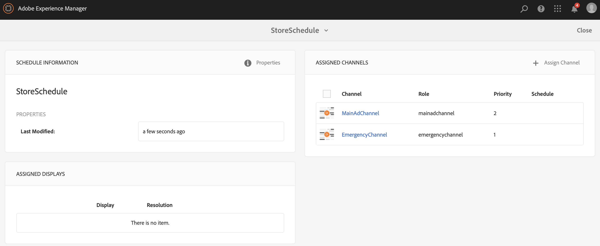

# Noodkanaal {#emergency-channel}

## Omschrijving hoofdletter gebruiken {#use-case-description}

In deze sectie wordt een gebruiksvoorbeeld beschreven waarin wordt benadrukt dat de auteur van de inhoud bij het maken en beheren van een noodkanaal kan schakelen van een volgnummer als er een voorwaarde is.

### Voorwaarden {#preconditions}

Voordat u met dit gebruik begint, moet u controleren hoe u dit kunt doen:

* **[Kanalen maken en beheren](managing-channels.md)**
* **[Locaties maken en beheren](managing-locations.md)**
* **[Planningen maken en beheren](managing-schedules.md)**
* **[Apparaatregistratie](device-registration.md)**

### Primaire acteurs {#primary-actors}

Inhoudsauteurs

## Basisstroom: Het project instellen {#basic-flow-setting-up-the-project}

Voer de onderstaande stappen uit om een noodkanaal in te stellen:

1. Een AEM Screens-project maken met de naam **EmergencyChannel**, zoals hieronder weergegeven.

   >[!NOTE]
   >Zie Een project maken voor meer informatie over het maken en beheren van projecten in AEM Screens.

   

1. **Een volgend kanaal maken**

   1. Selecteer de **Kanalen** map en klik op **Maken**.

   1. Selecteren **Volgekanaal** van de wizard en maakt u het kanaal met de naam **MainAdChannel**.

   

1. **Inhoud toevoegen aan Volgkanaal**

   1. Selecteer het kanaal (**MainAdChannel**).
   1. Klikken **Bewerken** in de actiebalk.
   1. Sleep enkele elementen naar het kanaal.

   

1. **Noodkanaal maken**

   1. Selecteer de **Kanalen** map.
   1. Klikken **Maken**.
   1. Selecteren **Volgekanaal** van de wizard en maakt u het kanaal met de naam **EmergencyChannel**.

   >[!NOTE]
   >
   >Normaal, wordt uw noodkanaal toegevoegd aan uw reeds bestaand productieproject.

   

1. **Inhoud toevoegen aan noodkanaal**

   1. Selecteer het kanaal (**Noodkanaal)**.
   1. Klikken **Bewerken** in de actiebalk.
   1. Sleep het element dat u tijdens een noodsituatie wilt gebruiken naar het kanaal en zet het neer.

   

1. **Een locatie maken**

   1. Navigeren naar **Locaties** map.
   1. Klikken **Maken** op de actiebalk en maak een locatie met de naam **Winkel** van de wizard.

   

1. **Weergaven maken op uw locatie**

   Ga naar uw locatie (**Winkel**) en klik op **Maken** in de actiebalk. Na de wizard maakt u twee **Weergaven** getiteld als **StoreFront** en **StoreRear**.

   

1. **Een schema maken**

   1. Ga naar uw **Planningen** map.
   1. Klikken **Maken** in de actiebalk.
   1. Na de tovenaar, creeer een programma genoemd als **StoreSchedule**.

   

1. Wijs zowel de Vertoningen aan uw Programma toe en vastgestelde Prioriteiten

   1. Selecteer het schema **(StoreSchedule)** en klik op **Dashboard** in de actiebalk.

   1. Klikken **+ Kanaal toewijzen** van de **TOEGEWEZEN KANALEN** deelvenster.

   1. Van de **Kanaaltoewijzing** dialoogvenster:

      1. Selecteer het pad naar de **MainAdChannel**
      1. Stel de **Prioriteit** 2
      1. Ondersteunde gebeurtenissen instellen als **Oorspronkelijke belasting** en **Niet-actief scherm**.
      1. Klikken **Opslaan**

      Voer dezelfde stappen opnieuw uit om de opdracht **EmergencyChannel** en stelt **Prioriteit**.

   >[!NOTE]
   >
   >Prioriteit wordt gebruikt om de toewijzingen te bestellen als meerdere toewijzingen voldoen aan de afspeelcriteria. De waarde met de hoogste waarde heeft altijd voorrang op lagere waarden.

   

1. Klikken **+ Kanaal toewijzen** van de **TOEGEWEZEN KANALEN** deelvenster.

1. Van de **Kanaaltoewijzing** dialoogvenster:

   1. Selecteer het pad naar de **EmergencyChannel**
   1. Stel de **Prioriteit** als 1

   1. Ondersteunde gebeurtenissen instellen als **Oorspronkelijke belasting**, **Niet-actief scherm**, en **Gebruikersinteractie**

   1. Klikken **Opslaan**

   

   U kunt de toegewezen kanalen weergeven via de **StoreSchedule** dashboard.

   

1. **Plan toewijzen aan elke weergave**

   1. Ga naar elke weergave, zoals **EmergencyChannel** > **Locaties** > **Winkel** >**StoreFront**.

   1. Klikken **Dashboard** in de actiebalk.
   1. Klikken **...** van de **TOEGEWEZEN KANALEN EN SCHEMA&#39;S** deelvenster en klik vervolgens op **+Plan toewijzen**.

   1. Selecteer het pad naar het schema (bijvoorbeeld hier **EmergencyChannel** > **Planningen** >**StoreSchedule**).

   1. Klikken **Opslaan**.

   U kunt het toegewezen schema aan de vertoning van bekijken **StoreSchedule** dashboard.
   

1. **Apparaatregistratie**

   Voltooi het registratieproces van het apparaat. Wanneer u zich hebt geregistreerd, kunt u de volgende uitvoer weergeven op uw AEM Screens-speler.

   

## Overschakelen naar noodkanaal {#switching-to-emergency-channel}

Voer in geval van nood de volgende stappen uit:

1. Navigeren naar **EmergencyChannel** > **Planningen** > **StoreSchedule** en selecteert u **Dashboard** in de actiebalk.

   

1. Selecteer de **EmergencyChannel** van de **StoreSchedule** dashboard en klik op **Toewijzing bewerken**.

   

1. Werk de **Prioriteit** van de **EmergencyChannel** tot **3** van de **Kanaaltoewijzing** en klik op **Opslaan**.

   

1. Wanneer de prioriteit van het kanaal wordt bijgewerkt, geeft alle AEM Screens-speler de **EmergencyChannel** inhoud.

   

### Conclusie {#conclusion}

De **EmergencyChannel** gaat verder met het weergeven van de inhoud totdat de auteur van de inhoud de Prioriteitswaarde herstelt naar 1.

Wanneer de auteur van de inhoud de instructies ontvangt dat de noodsituatie is gewist, moet hij of zij de prioriteit van het **MainAdChannel** waardoor het afspelen wordt hervat.
