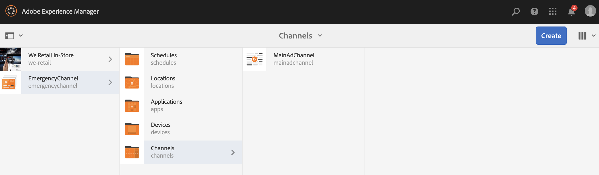

# Noodkanaal {#emergency-channel}

## Omschrijving hoofdletter gebruiken {#use-case-description}

In deze sectie wordt een gebruiksvoorbeeld beschreven waarin wordt benadrukt dat de auteur van de inhoud bij het maken en beheren van een noodkanaal kan schakelen van een volgnummer naar een ander kanaal.

### Voorwaarden {#preconditions}

Voordat u met dit gebruik begint, moet u controleren hoe u dit kunt doen:

* **[Kanalen maken en beheren](managing-channels.md)**
* **[Locaties maken en beheren](managing-locations.md)**
* **[Planningen maken en beheren](managing-schedules.md)**
* **[Apparaatregistratie](device-registration.md)**

### Primaire acteurs {#primary-actors}

Inhoudsauteurs

## Basisstroom: Het project instellen {#basic-flow-setting-up-the-project}

Voer de onderstaande stappen uit om een noodkanaal in te stellen:

1. Maak een AEM-schermproject met de naam **EmergencyChannel**, zoals hieronder wordt weergegeven.

   >[!NOTE]
   >
   >Raadpleeg Een project maken voor meer informatie over het maken en beheren van projecten in AEM-schermen.

   

1. **Een volgend kanaal maken**

   1. Selecteer de map **Kanalen** en klik op **Maken** om de wizard te openen en een kanaal te maken.

   1. Selecteer Kanaal **van de** Opeenvolging van de tovenaar en creeer het kanaal genoemd als **MainAdChannel**.
   

1. **Inhoud toevoegen aan Volgkanaal**

   1. Selecteer het kanaal (**MainAdChannel**).
   1. Klik op **Bewerken** op de actiebalk om de editor te openen. Sleep enkele elementen naar uw kanaal.
   

1. **Noodkanaal maken**

   1. Selecteer de map **Kanalen** .
   1. Klik op **Maken** om de wizard te openen en een kanaal te maken.
   1. Selecteer Kanaal **van de** Opeenvolging van de tovenaar en creeer het kanaal genoemd als **EmergencyChannel**.
   >[!NOTE]
   >
   >Normaal, wordt uw noodkanaal toegevoegd aan uw reeds bestaand productieproject.

   

1. **Inhoud toevoegen aan noodkanaal**

   1. Selecteer het kanaal (**Noodkanaal)**.
   1. Klik op **Bewerken** op de actiebalk om de editor te openen. Sleep het element dat u tijdens een noodsituatie wilt gebruiken naar het kanaal.
   

1. **Een locatie maken**

   1. Navigeer naar de map **Locations** .
   1. Klik op **Maken** op de actiebalk en maak een locatie met de naam **Winkel** van de wizard.
   

1. **Weergaven maken op uw locatie**

   Navigeer naar uw locatie (**Winkel**) en klik op **Maken** op de actiebalk. Volg de wizard om twee **beeldschermen** te maken met de naam **StoreFront** en **StoreRear**.

   

1. **Een schema maken**

   1. Navigeer naar de map **Planningen** .
   1. Klik op **Maken** op de actiebalk. Volg de wizard om een schema met de naam **StoreSchedule** te maken.
   

1. Wijs zowel de Vertoningen aan uw Programma toe en vastgestelde Prioriteiten

   1. Selecteer het schema **(StoreSchedule)** en klik **Dashboard** van de actiebar.

   1. Klik op **+ Kanaal** toewijzen in het deelvenster **TOEGEWEZEN KANALEN** .

   1. Vanuit het dialoogvenster **Kanaaltoewijzing** :

      1. Selecteer het pad naar het **MainAdChannel**
      1. De **prioriteit** instellen op 2
      1. Stel de ondersteunde gebeurtenissen in als **Eerste Laden** en **Niet actief scherm**.
      1. Click **Save**
      Op dezelfde manier zult u dezelfde stappen opnieuw moeten volgen om **EmergencyChannel** toe te wijzen en zijn **Prioriteit** te plaatsen.
   >[!NOTE]
   >
   >Prioriteit wordt gebruikt om de toewijzingen te bestellen als meerdere toewijzingen voldoen aan de afspeelcriteria. Degene met de hoogste waarde heeft altijd voorrang op lagere waarden.

   

1. Klik op **+ Kanaal** toewijzen in het deelvenster **TOEGEWEZEN KANALEN** .

1. Vanuit het dialoogvenster **Kanaaltoewijzing** :

   1. Het pad naar **EmergencyChannel selecteren**
   1. De **prioriteit** instellen op 1

   1. Stel de ondersteunde gebeurtenissen in als **Eerste Laden**, **Niet actief scherm** en **Gebruikersinteractie**

   1. Click **Save**
   

   U kunt de toegewezen kanalen van het **StoreSchedule** dashboard bekijken.

   

1. **Plan toewijzen aan elke weergave**

   1. Navigeer naar elk scherm, zoals **EmergencyChannel** —> **Locations** —> **Store** —>**StoreFront**.

   1. Klik op **Dashboard** in de handeling om het weergavedashboard te openen.
   1. Klik **...** in het **venster TOEGEWEZEN KANALEN EN SCHADUWEN** en klik vervolgens op **+Plan** toewijzen.

   1. Selecteer het pad naar de planning (bijvoorbeeld **EmergencyChannel** —> **Planningen** —>**StoreSchedule**).

   1. Click **Save**.
   U kunt het toegewezen schema aan de vertoning van het **StoreSchedule** dashboard bekijken.
   

1. **Apparaatregistratie**

   Voltooi het registratieproces van het apparaat en zodra u zich hebt geregistreerd, bekijkt u de volgende uitvoer op uw AEM-schermspeler.

   

## Overschakelen naar noodkanaal {#switching-to-emergency-channel}

Voer in noodgevallen de volgende stappen uit:

1. Navigeer naar **EmergencyChannel** —> **Planningen** —> **StoreSchedule** en selecteer **Dashboard** op de actiebalk.

   

1. Selecteer het **EmergencyChannel** in het **StoreSchedule** -dashboard en klik op Toewijzing **bewerken**.

   

1. Werk de **Prioriteit** van **EmergencyChannel** aan **3** van de de dialoogdoos van de Toewijzing **van het** Kanaal bij en klik **sparen**.

   

1. Zodra de prioriteit van het kanaal is bijgewerkt, geeft alle AEM Screens speler de **inhoud van EmergencyChannel** weer, zoals hieronder wordt weergegeven.

   

### Conclusie {#conclusion}

De inhoud van **EmergencyChannel** blijft worden weergegeven totdat de auteur van de inhoud de Prioriteitswaarde herstelt naar 1.

Zodra de inhoudauteur de instructies ontvangt dat de noodsituatie is ontruimd, zou hij/zij de prioriteit van **MainAdChannel** moeten bijwerken die normale playback zal veroorzaken om te hervatten.
