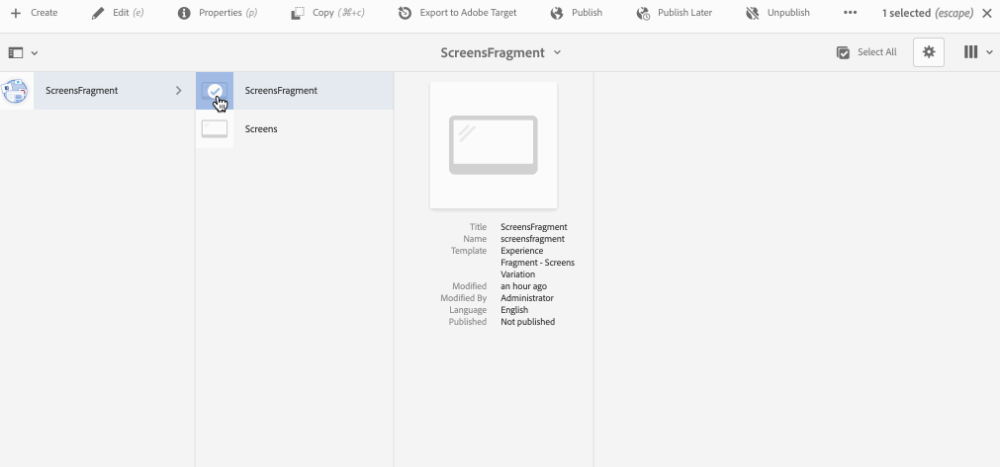

# Ervaringsfragmenten gebruiken {#using-experience-fragments}

Deze pagina behandelt de volgende onderwerpen:

* **Overzicht**
* **Experience Fragments gebruiken in AEM Screens**
* **Wijzigingen op de pagina doorgeven**

## Overzicht {#overview}

Een ***Experience Fragment*** is een groep van een of meer componenten, inclusief inhoud en lay-out, waarnaar op pagina&#39;s kan worden verwezen. De fragmenten van de ervaring kunnen om het even welke component, zoals, één of veelvoudige componenten bevatten die om het even wat binnen een paragraafsysteem kunnen bevatten, die in de volledige ervaring zullen worden van verwijzingen voorzien of door een derde eindpunt gevraagd.

## Het gebruiken van de Fragmenten van de Ervaring in AEM Screens {#using-experience-fragments-in-aem-screens}

>[!NOTE]
>In het volgende voorbeeld wordt **We.Retail** gebruikt als een demoproject van waaruit het Experience Fragment wordt gebruikt vanuit een pagina **Sites** naar een AEM Screens-project.

Als voorbeeld, toont het volgende werkschema het gebruik van ervaringsfragmenten van We.Retail in Plaatsen. U kunt een webpagina kiezen en die inhoud in uw AEM Screens-kanaal gebruiken in een van uw projecten.

### Voorwaarden {#pre-requisites}

**Een demoproject maken met een kanaal**

***Een project maken***

1. Klik **Schermproject maken** om een nieuw project te maken.
1. Voer de titel in als **DemoProject**.
1. Klik **Opslaan**.

Een **DemoProject** zal aan uw AEM Screens worden toegevoegd.

***Een kanaal maken***

1. Navigeer naar **DemoProject** u creeerde en selecteer **Kanalen** omslag.

1. Klik **Maken** van de actiebar om de tovenaar te openen.
1. Kies de **Sequence Channel** sjabloon in de wizard en klik op **Volgende**.

1. Voer de **Titel** in als **TestChannel** en klik op **Create**.

Een **TestChannel** zal aan uw **DemoProject** worden toegevoegd.\

### Een ervaringsfragment maken {#creating-an-experience-fragment}

Volg de onderstaande stappen om de inhoud van **We.Retail** aan uw **TestChannel** in **DemoProject** te gebruiken.

1. **Navigeer aan een pagina van Plaatsen in Wij.Retail**

   1. Navigeer naar Sites en selecteer **We.Retail In-Store** -> **Kanalen** ->**Niet-actief kanaal - Night** en selecteer deze pagina om dit als ervaringsfragment voor uw kanaal van het Scherm te gebruiken.

   1. Klik op **Bewerken** op de actiebalk om de pagina te openen die u wilt gebruiken als ervaringsfragment voor het kanaal Schermen.

1. **De inhoud opnieuw gebruiken**

   1. Selecteer het fragment dat u in het kanaal wilt opnemen.
   1. Klik op het laatste pictogram aan de rechterkant om het dialoogvenster **Omzetten in ervaringsfragment** te openen.

   

1. **Experience-fragment maken**

   1. Kies **Actie** als **Een nieuw Erviteitsfragment** maken.

   1. Selecteer **Bovenliggend pad**.
   1. Selecteer **Sjabloon**. Kies hier de sjabloon **Fragment ervaren - Variatie van schermen**.

   1. Voer **Fragmenttitel** in als **ScreensFragment**.

   1. Klik op het vinkje om het maken van een nieuw ervaringsfragment te voltooien.

   

1. **Actieve kopie van ervaringsfragment maken**

   1. Navigeer naar de AEM startpagina.
   1. Selecteer **Fragmenten ervaren** en markeer **Fragment** van Screens en klik **Variatie als levende-exemplaar**, zoals aangetoond in het hieronder cijfer:

   

   c. Selecteer **ScreensFragment** van **Create Levende Kopie** tovenaar en klik **Next**.

   d. Voer de **Titel** en **Naam** in als **Schermen**.

   e. Klik **Maken** om de actieve kopie te maken.

   f. Klik **Done** om terug te keren naar **ScreensFragment** pagina.

   

   >[!NOTE]
   >
   >Nadat u het fragment Schermen hebt gemaakt, kunt u de eigenschappen van het fragment bewerken. Selecteer het fragment en klik op **Eigenschappen** op de actiebalk.

   **Eigenschappen van een rasterfragment bewerken**

   1. Navigeer naar **ScreensFragment** (u creeerde in de voorafgaande stappen) en klik **Eigenschappen** van de actiebar.

   1. Selecteer de **tab Offline configuratie**, zoals in de onderstaande afbeelding wordt getoond.

   U kunt **Client-side bibliotheken** (java en css) en **Statische bestanden** aan uw ervaringsfragment toevoegen.

   In het volgende voorbeeld ziet u de toevoeging van bibliotheken aan de clientzijde en de lettertypen als onderdeel van statische bestanden aan uw ervaringsfragment.  

1. **Experience Fragment gebruiken als component in Screenkanaal**

   1. Navigeer naar het kanaal van het Scherm waar u het **fragment** van Schermen wilt gebruiken.
   1. Selecteer **TestChannel** en klik **Edit** van de actiebar.

   1. Klik op het componentpictogram op het zijtabblad.
   1. Sleep **Experience Fragment** naar uw kanaal.

   

   e. Selecteer de component **Experience Fragment** en selecteer het pictogram linksboven (moersleutel) om het dialoogvenster **Experience Fragment** te openen.

   f. Selecteer **Schermen** levende exemplaar van het fragment u in *Stap 3* in **Weg** creeerde.

   

   f. Selecteer **Schermen** levende exemplaar van het fragment u in *Stap 3* in **ErvingsFragment** creeerde.

   

   h. Voer de milliseconden in **Duur** in.

   i. Selecteer **Offline Config** van **de dialoogdoos van de Fragments van de Ervaring** om de cliënt-zijbibliotheken en de statische dossiers te bepalen.

   >[!NOTE]
   >
   >Als u clientbibliotheken of statische bestanden wilt toevoegen naast de bestanden die u in stap 4 hebt geconfigureerd, kunt u een bestand toevoegen via het tabblad **Offline configuratie** in het dialoogvenster **Fragment ervaren**.

   

   j. Klik op het vinkje om het proces te voltooien.

### Resultaat {#validating-the-result} valideren

Na voltooiing van vorige stappen, kunt u uw ervaringsfragment in **ChannelOne** bevestigen door:

1. Navigeer naar **TestChannel**.
1. Selecteer **Voorvertoning** in de actiebalk.

U zult de inhoud van de **pagina van Plaatsen** (levend-exemplaar van het ervaringsfragment) in uw kanaal bekijken, zoals aangetoond in het hieronder cijfer:\

## Wijzigingen op de pagina {#propagating-changes-from-the-master-page} doorgeven

***Live*** kopie verwijst naar de kopie (van de bron), onderhouden door synchronisatiehandelingen zoals gedefinieerd door de rollout-configuraties.

Aangezien het Fragment van de Ervaring, wij tot stand gekomen een levende kopie van **Plaatsen** pagina&#39;s is, zodat als u veranderingen in dat bepaalde fragment van de master pagina aanbrengt, zult u de veranderingen in uw kanaal of de bestemming bekijken waar u het Fragment van de Ervaring hebt gebruikt.

>[!NOTE]
>
>Zie Inhoud opnieuw gebruiken voor meer informatie over Live Copy: Beheer van meerdere sites en Live kopie.

Voer de onderstaande stappen uit om wijzigingen van het master kanaal naar het doelkanaal door te geven:

1. Selecteer het fragment van de Ervaring van **de pagina van Plaatsen** (master) en klik het potloodpictogram om de punten in het Fragment van de Ervaring uit te geven.

   

1. Selecteer het fragment van de Ervaring en klik het moersleutelpictogram om de dialoogdoos te openen om de beelden uit te geven.

   

1. Het dialoogvenster **Productraster** wordt geopend.

   

1. U kunt alle afbeeldingen bewerken. Hier wordt bijvoorbeeld de eerste afbeelding in dit fragment vervangen.

   

1. Selecteer het fragment van de Ervaring en klik het pictogram van de Uitvoer om veranderingen in het fragment door te geven dat in uw kanaal wordt gebruikt.

   

1. Klik op Uitvoeren om de wijzigingen te bevestigen.

   U zult zien dat de wijzigingen zijn geïmplementeerd.

   

### Wijzigingen {#validating-the-changes} valideren

Voer de onderstaande stappen uit om de wijzigingen in uw kanaal te bevestigen:

1. Navigeer naar **Schermen** -> **Kanalen** -> **TestChannel**.

1. Klik **Voorvertoning** van de actiebar om de veranderingen te bevestigen.

In de volgende afbeelding ziet u de wijzigingen in uw **TestChannel**:\

