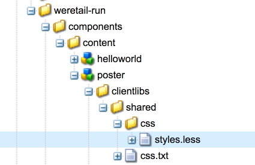

# Een AEM Screens-component uitbreiden {#extending-an-aem-screens-component}

De volgende zelfstudie doorloopt de stappen en aanbevolen procedures voor het uitbreiden uit de doos AEM Screens-componenten. De component Image wordt uitgebreid om een aanwendbare tekstbedekking toe te voegen.

## Overzicht {#overview}

Deze zelfstudie is bedoeld voor nieuwe ontwikkelaars van AEM Screens. In deze zelfstudie wordt de component Schermafbeelding uitgebreid om een postercomponent te maken. Boven op een afbeelding worden een titel, beschrijving en logo geplaatst om een aantrekkelijke ervaring te creëren in een sequentiekanaal.

>[!NOTE]
>
>Voordat u met deze zelfstudie begint, wordt u aangeraden de zelfstudie te voltooien: [Een aangepaste component voor AEM Screens ontwikkelen](developing-custom-component-tutorial-develop.md).


De component van de Poster van de douane wordt gecreeerd door de component van het Beeld uit te breiden.

## Vereisten {#prerequisites}

Voor het voltooien van deze zelfstudie is het volgende nodig:

1. [AEM 6.4](https://docs.adobe.com/content/help/en/experience-manager-64/release-notes/release-notes.html) of  [AEM 6.3](https://helpx.adobe.com/experience-manager/6-3/release-notes.html) + Functiepakket voor nieuwste schermen
1. [AEM Screens Player](/help/user-guide/aem-screens-introduction.md)
1. Lokale ontwikkelomgeving

De lesstappen en schermafbeeldingen worden uitgevoerd met behulp van CRXDE-Lite. [](https://docs.adobe.com/content/help/en/experience-manager-64/developing/devtools/aem-eclipse.html) Eclipseor  [](https://docs.adobe.com/content/help/en/experience-manager-64/developing/devtools/ht-intellij.html) IntelliJIDEs kan ook worden gebruikt om het leerprogramma te voltooien. Meer informatie over het gebruiken van winde aan [ontwikkelen met AEM kan hier worden gevonden](https://docs.adobe.com/content/help/en/experience-manager-learn/getting-started-wknd-tutorial-develop/project-setup.html#eclipse-ide).

## Projectinstelling {#project-setup}

De broncode van een project van het Scherm wordt typisch geleid als multi-module Maven project. Om de zelfstudie te versnellen, werd een project pre-geproduceerd gebruikend [AEM Project Archetype 13](https://github.com/adobe/aem-project-archetype). Meer informatie over [het creëren van een project met Maven AEM Project Archetype kan hier worden gevonden](https://docs.adobe.com/content/help/en/experience-manager-learn/getting-started-wknd-tutorial-develop/project-setup.html#maven-multimodule).

1. Download en installeer de volgende pakketten met behulp van **CRX package manage** `http://localhost:4502/crx/packmgr/index.jsp)r:`

[Bestand ophalen](assets/start-poster-screens-weretail-runuiapps-001-snapshot.zip)

   [Bestand ophalen](assets/start-poster-screens-weretail-runuicontent-001-snapshot.zip)
   **Download optioneel** als u werkt met Eclipse of een andere IDE, het onderstaande bronpakket. Stel het project aan een lokale AEM instantie op door het Maven bevel te gebruiken:

   **`mvn -PautoInstallPackage clean install`**

   Start SRC schermen Web.Retail Run Project

[Bestand ophalen](assets/start-poster-screens-weretail-run.zip)

1. In **CRX Package Manager** `http://localhost:4502/crx/packmgr/index.jsp` worden de volgende twee pakketten geïnstalleerd:

   1. **screens-weretail-run.ui.content-0.0.1-SNAPSHOT.zip**
   1. **screens-weretail-run.ui.apps-0.0.1-SNAPSHOT.zip**

   

   Schermen die wij.Retail Run UI.Apps en Ui.Content pakketten installeren via CRX Package Manager

## Postercomponent maken {#poster-cmp}

De component Poster breidt de afbeelding uit van het vak met rasters. Een mechanisme van het Verdelen, `sling:resourceSuperType`, wordt gebruikt om de kernfunctionaliteit van de component van het Beeld te erven zonder het moeten kopiëren en kleven. Meer informatie over de grondbeginselen van [Verwerking van het Verschuivingsverzoek kunt u hier vinden.](https://helpx.adobe.com/experience-manager/6-5/sites/developing/using/the-basics.html#SlingRequestProcessing)

De postercomponent wordt op volledig scherm weergegeven in de modus Voorvertoning/Productie. In de bewerkingsmodus is het belangrijk dat de component anders wordt gerenderd om het ontwerpen van het sequentiekanaal te vergemakkelijken.

1. In **CRXDE-Lite** `http://localhost:4502/crx/de/index.jsp` (of IDE van keus) onder aan `/apps/weretail-run/components/content`creeer een nieuwe `cq:Component` genoemd `poster`.

   Voeg de volgende eigenschappen toe aan de `poster` component:

   ```xml
   <?xml version="1.0" encoding="UTF-8"?>
   <jcr:root xmlns:sling="https://sling.apache.org/jcr/sling/1.0" xmlns:cq="https://www.day.com/jcr/cq/1.0" xmlns:jcr="https://www.jcp.org/jcr/1.0"
       jcr:primaryType="cq:Component"
       jcr:title="Poster"
       sling:resourceSuperType="screens/core/components/content/image"
       componentGroup="We.Retail Run - Content"/>
   ```

   

   Eigenschappen voor /apps/weretail-run/components/content/poster

   Door de eigenschap `sling:resourceSuperType`gelijk aan `screens/core/components/content/image` in te stellen, overerft de postercomponent in feite alle functionaliteit van de afbeeldingscomponent. Equivalente knooppunten en bestanden onder `screens/core/components/content/image` kunnen onder de component `poster` worden toegevoegd om de functionaliteit te overschrijven en uit te breiden.

1. Kopieer de `cq:editConfig`-node onder `/libs/screens/core/components/content/image.`Plak de `cq:editConfig` onder de `/apps/weretail-run/components/content/poster`-component.

   Werk op het `cq:editConfig/cq:dropTargets/image/parameters`-knooppunt de eigenschap `sling:resourceType` bij tot hetzelfde niveau `weretail-run/components/content/poster`.

   

   XML-representatie van de cq:editConfig hieronder weergegeven:

   ```xml
   <?xml version="1.0" encoding="UTF-8"?>
   <jcr:root xmlns:sling="https://sling.apache.org/jcr/sling/1.0" xmlns:cq="https://www.day.com/jcr/cq/1.0" xmlns:jcr="https://www.jcp.org/jcr/1.0" xmlns:nt="https://www.jcp.org/jcr/nt/1.0"
       jcr:primaryType="cq:EditConfig">
       <cq:dropTargets jcr:primaryType="nt:unstructured">
           <image
               jcr:primaryType="cq:DropTargetConfig"
               accept="[image/.*]"
               groups="[media]"
               propertyName="./fileReference">
               <parameters
                   jcr:primaryType="nt:unstructured"
                   sling:resourceType="weretail-run/components/content/poster"
                   imageCrop=""
                   imageMap=""
                   imageRotate=""/>
           </image>
       </cq:dropTargets>
   </jcr:root>
   ```

1. Kopieer de WCM Stichting `image` dialoog die voor `poster` component moet worden gebruikt.

   Het is het gemakkelijkst om van een bestaande dialoog te beginnen en dan wijzigingen te maken.

   1. Het dialoogvenster kopiëren van: `/libs/wcm/foundation/components/image/cq:dialog`
   1. Het dialoogvenster onder `/apps/weretail-run/components/content/poster` plakken

   

   Gekopieerd dialoogvenster van /libs/wcm/foundation/components/image/cq:dialoogvenster naar /apps/weretail-run/components/content/poster

   De component van de Schermen `image` wordt supertyped aan de `image` component van de Stichting WCM. Daarom erft de `poster` component functionaliteit van beide. De dialoog voor de postercomponent bestaat uit een combinatie van de dialoogvensters Schermen en Stichting. Kenmerken van **Sling Resource Merger** worden gebruikt om irrelevante dialooggebieden en lusjes te verbergen die van de supergetypte componenten worden geërft.

1. Werk cq:dialog bij onder `/apps/weretail-run/components/content/poster` met de volgende wijzigingen in XML:

   ```xml
   <?xml version="1.0" encoding="UTF-8"?>
   <jcr:root xmlns:sling="https://sling.apache.org/jcr/sling/1.0" xmlns:cq="https://www.day.com/jcr/cq/1.0" xmlns:jcr="https://www.jcp.org/jcr/1.0" xmlns:nt="https://www.jcp.org/jcr/nt/1.0"
       jcr:primaryType="nt:unstructured"
       jcr:title="Poster"
       sling:resourceType="cq/gui/components/authoring/dialog">
       <content
           jcr:primaryType="nt:unstructured"
           sling:resourceType="granite/ui/components/foundation/container">
           <layout
               jcr:primaryType="nt:unstructured"
               sling:resourceType="granite/ui/components/foundation/layouts/tabs"
               type="nav"/>
           <items jcr:primaryType="nt:unstructured">
               <image
                   jcr:primaryType="nt:unstructured"
                   jcr:title="Elements"
                   sling:resourceType="granite/ui/components/foundation/section">
                   <layout
                       jcr:primaryType="nt:unstructured"
                       sling:resourceType="granite/ui/components/foundation/layouts/fixedcolumns"
                       margin="{Boolean}false"/>
                   <items jcr:primaryType="nt:unstructured">
                       <column
                           jcr:primaryType="nt:unstructured"
                           sling:resourceType="granite/ui/components/foundation/container">
                           <items
                               jcr:primaryType="nt:unstructured"
                               sling:hideChildren="[linkURL,size]">
                               <file
                                   jcr:primaryType="nt:unstructured"
                                   sling:resourceType="cq/gui/components/authoring/dialog/fileupload"
                                   autoStart="{Boolean}false"
                                   class="cq-droptarget"
                                   fieldLabel="Image asset"
                                   fileNameParameter="./fileName"
                                   fileReferenceParameter="./fileReference"
                                   mimeTypes="[image]"
                                   multiple="{Boolean}false"
                                   name="./file"
                                   title="Upload Image Asset"
                                   uploadUrl="${suffix.path}"
                                   useHTML5="{Boolean}true"/>
                               <title
                                   jcr:primaryType="nt:unstructured"
                                   sling:resourceType="granite/ui/components/foundation/form/textfield"
                                   fieldLabel="Title"
                                   name="./jcr:title"/>
                               <description
                                   jcr:primaryType="nt:unstructured"
                                   sling:resourceType="granite/ui/components/foundation/form/textarea"
                                   fieldLabel="Description"
                                   name="./jcr:description"/>
                               <position
                                   jcr:primaryType="nt:unstructured"
                                   sling:resourceType="granite/ui/components/coral/foundation/form/select"
                                   fieldLabel="Text Position"
                                   name="./textPosition">
                                   <items jcr:primaryType="nt:unstructured">
                                       <left
                                           jcr:primaryType="nt:unstructured"
                                           text="Left"
                                           value="left"/>
                                       <center
                                           jcr:primaryType="nt:unstructured"
                                           text="Center"
                                           value="center"/>
                                       <right
                                           jcr:primaryType="nt:unstructured"
                                           text="Right"
                                           value="right"/>
                                   </items>
                               </position>
                               <color
                                   jcr:primaryType="nt:unstructured"
                                   sling:resourceType="granite/ui/components/coral/foundation/form/select"
                                   fieldLabel="Text Color"
                                   name="./textColor">
                                   <items jcr:primaryType="nt:unstructured">
                                       <light
                                           jcr:primaryType="nt:unstructured"
                                           text="Light"
                                           value="light"/>
                                       <dark
                                           jcr:primaryType="nt:unstructured"
                                           text="Dark"
                                           value="dark"/>
                                   </items>
                               </color>
                           </items>
                       </column>
                   </items>
               </image>
               <accessibility
                   jcr:primaryType="nt:unstructured"
                   sling:hideResource="{Boolean}true"/>
           </items>
       </content>
   </jcr:root>
   ```

   De eigenschap `sling:hideChildren`= `"[linkURL,size]` wordt gebruikt op het `items`-knooppunt om ervoor te zorgen dat de velden **linkURL** en **size** verborgen zijn in het dialoogvenster. Het is niet voldoende deze knooppunten uit het posterdialoogvenster te verwijderen. De eigenschap `sling:hideResource="{Boolean}true"` op het tabblad Toegankelijkheid wordt gebruikt om het gehele tabblad te verbergen.

   Er worden twee geselecteerde velden toegevoegd aan het dialoogvenster, zodat auteurs de tekstpositie en kleur van de titel en beschrijving kunnen bepalen.

   

   Poster - Definitieve dialoogstructuur

   Op dit punt kan een geval van de `poster` component aan **Niet-actieve Kanaal** pagina in het Wij.Retail project van de Looppas worden toegevoegd: `http://localhost:4502/editor.html/content/screens/we-retail-run/channels/idle-channel.edit.html`.

   

   Dialoogvensters Poster

1. Een bestand maken onder `/apps/weretail-run/components/content/poster` met de naam `production.html.`

   Vul het bestand met het volgende:

   ```xml
   <!--/*
   
       /apps/weretail-run/components/content/poster/production.html
   
   */-->
   <div data-sly-use.image="image.js"
        data-duration="${properties.duration}"
        class="cmp-poster"
        style="background-image: url(${request.contextPath @ context='uri'}${image.src @ context='uri'});">
       <div class="cmp-poster__text
                   cmp-poster__text--${properties.textPosition @ context='attribute'}
                   cmp-poster__text--${properties.textColor @ context='attribute'}">
           <h1 class="cmp-poster__title">${properties.jcr:title}</h1>
            <h2 class="cmp-poster__description">${properties.jcr:description}</h2>
       </div>
    
   </div>
   ```

   Hierboven ziet u de productiemarkering voor de postercomponent. Het HTML-script overschrijft `screens/core/components/content/image/production.html`. Het `image.js` is een serverscript dat een POJO-achtig afbeeldingsobject maakt. Het voorwerp van het Beeld kan dan worden geroepen om `src` als gealigneerde stijl achtergrond-beeld terug te geven.

   `The h1` en h2-tags worden toegevoegd, geven de titel en beschrijving weer op basis van de componenteigenschappen:  `${properties.jcr:title}` en  `${properties.jcr:description}`.

   Omringend de `h1` en `h2` markeringen is een div omslag met drie CSS klassen met variaties van &quot; `cmp-poster__text`&quot;. De waarde voor de eigenschappen `textPosition` en `textColor` worden gebruikt om de CSS-klasse te wijzigen die wordt gerenderd op basis van de dialoogselectie van de auteur. In de volgende sectie worden CSS uit clientbibliotheken geschreven om deze wijzigingen in de weergave in te schakelen.

   Een logo wordt ook als een bedekking opgenomen in de component. In dit voorbeeld is het pad naar het logo We.Retail hard-coded in de DAM. Afhankelijk van het gebruiksgeval kan het meer zin hebben om een nieuw dialoogveld te maken om van het logopad een dynamisch gevulde waarde te maken.

   Merk ook op dat BEM-notatie (Block Element Modifier) wordt gebruikt met de component. BEM is een CSS-coderingsconventie die het gemakkelijker maakt om herbruikbare componenten te maken. BEM is de notatie die wordt gebruikt door [AEM Core Components](https://github.com/Adobe-Marketing-Cloud/aem-core-wcm-components/wiki/CSS-coding-conventions). Meer informatie is te vinden op: [https://getbem.com/](https://getbem.com/)

1. Een bestand maken onder `/apps/weretail-run/components/content/poster` met de naam `edit.html.`

   Vul het bestand met het volgende:

   ```xml
   <!--/*
   
       /apps/weretail-run/components/content/poster/edit.html
   
   */-->
   
   <div class="aem-Screens-editWrapper ${image.cssClass} cmp-poster" data-sly-use.image="image.js" data-emptytext="${'Poster' @ i18n, locale=request.locale}">
       
       <div class="cmp-poster__text
              cmp-poster__text--${properties.textPosition @ context='attribute'}
          cmp-poster__text--${properties.textColor @ context='attribute'}">
         <p class="cmp-poster__title">${properties.jcr:title}</p>
         <p class="cmp-poster__description">${properties.jcr:description}</p>
       </div>
   </div>
   ```

   Hierboven ziet u de **edit**-markering voor de postercomponent. Het HTML-script overschrijft `/libs/screens/core/components/content/image/edit.html`. De markering is vergelijkbaar met de markering `production.html` en geeft de titel en beschrijving boven op de afbeelding weer.

   De `aem-Screens-editWrapper`wordt toegevoegd zodat de component geen volledig scherm in de redacteur zal teruggeven. Het `data-emptytext` attribuut zorgt ervoor dat placeholder wordt getoond wanneer geen beeld of inhoud is bevolkt.

## Client-Side bibliotheken maken {#clientlibs}

Client-Side Libraries bieden een mechanisme voor het organiseren en beheren van CSS- en JavaScript-bestanden die nodig zijn voor een AEM-implementatie. Meer informatie over het gebruik van [Client-Side Libraries vindt u hier.](https://helpx.adobe.com/experience-manager/6-5/sites/developing/using/clientlibs.html)

AEM Screens-componenten worden in de bewerkingsmodus anders weergegeven dan in de modus Voorbeeld/productie. Er worden twee sets met clientbibliotheken gemaakt: een voor de bewerkingsmodus en een tweede voor Voorvertoning/Productie.

1. Maak een map voor client-side bibliotheken voor de postercomponent.

   Onder `/apps/weretail-run/components/content/poster,`maak een nieuwe map met de naam `clientlibs`.

   

1. Onder de map `clientlibs` maakt u een nieuw knooppunt met de naam `shared` van het type `cq:ClientLibraryFolder.`

   

1. Voeg de volgende eigenschappen toe aan de gedeelde clientbibliotheek:

   * `allowProxy` | Boolean | `true`
   * `categories` | String[] |  `cq.screens.components`

   

   Eigenschappen voor /apps/weretail-run/components/content/poster/clientlibs/shared

   De eigenschap `categories` is een tekenreeks die de clientbibliotheek identificeert. De categorie `cq.screens.components` wordt gebruikt in zowel de modus Bewerken als de modus Voorbeeld/productie. Daarom wordt elke CSS/JS die in de `shared` clientlib wordt gedefinieerd, in alle modi geladen.

   Het is aan te raden geen paden in een productieomgeving rechtstreeks toegankelijk te maken voor /apps. De eigenschap `allowProxy` zorgt ervoor dat naar de CSS- en JS-clientbibliotheek wordt verwezen via een voorvoegsel van `/etc.clientlibs`. Hier vindt u meer informatie over de eigenschap [allowProxy.](https://helpx.adobe.com/experience-manager/6-5/sites/developing/using/clientlibs.html#main-pars_title_8ced)

1. Maak een bestand met de naam `css.txt` onder de gedeelde map.

   Vul het bestand met het volgende:

   ```
   #base=css
   
   styles.less
   ```

1. Maak een map met de naam `css` onder de map `shared`. Voeg een bestand met de naam `style.less` toe onder de map `css`. De structuur van de clientbibliotheken moet er nu als volgt uitzien:

   

   In plaats van CSS rechtstreeks te schrijven, gebruikt deze zelfstudie LESS. [](https://lesscss.org/) LESS is een populaire CSS-voorcompiler die CSS-variabelen, -mixins en -functies ondersteunt. AEM clientbibliotheken ondersteunen native LESS-compilatie. De klasse of andere pre-compilers kunnen worden gebruikt maar moeten buiten AEM worden gecompileerd.

1. Vul `/apps/weretail-run/components/content/poster/clientlibs/shared/css/styles.less` met het volgende:

   ```css
   /*
    /apps/weretail-run/components/content/poster/clientlibs/shared/css/styles.less
    Poster Component - Shared Style
   */
   
   @import url('https://fonts.googleapis.com/css?family=Fjalla+One|Open+Sans:400i');
   
   @text-light-color: #fff;
   @text-dark-color: #000;
   @title-font-family: 'Fjalla One', sans-serif;
   @description-font-family: 'Open Sans', sans-serif;
   
   .cmp-poster {
   
         &__text {
         position: absolute;
         color: @text-light-color;
         top: 0;
         text-align:center;
         width: 100%;
   
         &--left {
          text-align: left;
                margin-left: 1em;
         }
   
         &--right {
          text-align: right;
                margin-right: 1em;
         }
   
         &--dark {
          color: @text-dark-color;
         }
       }
   
       &__title {
         font-weight: bold;
            font-family: @title-font-family;
            font-size: 1.2em;
       }
   
       &__description {
     font-style: italic;
           font-family: @description-font-family;
    }
   
   }
   ```

   >[!NOTE]
   >
   >Google-weblettertypen worden gebruikt voor de lettertypefamilies. Weblettertypen vereisen internetverbinding en niet alle schermimplementaties bieden een betrouwbare verbinding. Planning voor off-line wijze is een belangrijke overweging voor de plaatsingen van het Scherm.

1. Kopieer de clientbibliotheekmap `shared`. Plak het als een sibling en wijzig de naam in `production`.

   

1. De `categories`-eigenschap van de productieklantenbibliotheek bijwerken naar `cq.screens.components.production.`

   De categorie `cq.screens.components.production` zorgt ervoor dat de stijlen alleen worden geladen in de modus Voorbeeld/productie.

   

   Eigenschappen voor /apps/weretail-run/components/content/poster/clientlibs/production

1. Vul `/apps/weretail-run/components/content/poster/clientlibs/production/css/styles.less` met het volgende:

   ```css
   /*
    /apps/weretail-run/components/content/poster/clientlibs/production/css/styles.less
    Poster Component - Production Style
   */
   
   .cmp-poster {
   
       background-size: cover;
    height: 100%;
    width: 100%;
    position:absolute;
   
        &__text {
   
           top: 2em;
   
           &--left {
               width: 40%;
               top: 5em;
           }
   
           &--right {
               width: 40%;
               right: 1em;
           }
       }
   
       &__title {
     font-size: 5rem;
     font-weight: 900;
     margin: 0.1rem;
    }
   
    &__description {
     font-size: 2rem;
     margin: 0.1rem;
     font-weight: 400;
   
    }
   
       &__logo {
     position: absolute;
     max-width: 200px;
     top: 1em;
     left: 0;
    }
   
   }
   ```

   De bovenstaande stijlen geven de titel en beschrijving weer op een absolute positie op het scherm. De titel wordt aanzienlijk groter weergegeven dan de beschrijving. Met de BEM-notatie van de component kunt u de stijlen in de klasse cmp-poster heel eenvoudig nauwkeurig indelen.

Een derde categorie clientbibliotheek: `cq.screens.components.edit` kan worden gebruikt om alleen specifieke stijlen aan de component toe te voegen.

| Clientlib-categorie | Gebruik |
|---|---|
| `cq.screens.components` | Stijlen en scripts die worden gedeeld tussen de bewerkings- en de productiemodus |
| `cq.screens.components.edit` | Stijlen en scripts die alleen worden gebruikt in de bewerkingsmodus |
| `cq.screens.components.production` | Stijlen en scripts die alleen in de productiemodus worden gebruikt |

## Postercomponent toevoegen aan een volgend kanaal {#add-sequence-channel}

De postercomponent is bedoeld voor gebruik op een Kanaal van de Opeenvolging. Het startpakket voor deze zelfstudie bevat een inactief kanaal. Het onactieve kanaal is vooraf geconfigureerd om componenten van de groep **We.Retail Run - Content** toe te staan. De groep van de component Poster wordt ingesteld op `We.Retail Run - Content` en is beschikbaar om aan het kanaal te worden toegevoegd.

1. Open het Onactieve Kanaal van het Web.Retail project van de Looppas: **`http://localhost:4502/editor.html/content/screens/we-retail-run/channels/idle-channel.edit.html`**
1. Sleep en zet een nieuwe instantie van de component **Poster** van de zijbalk op de pagina neer.

   

1. Bewerk het dialoogvenster van de postercomponent om een afbeelding, titel en beschrijving toe te voegen. Gebruik de opties Tekstpositie en Tekstkleur om ervoor te zorgen dat de titel/beschrijving op de afbeelding kan worden gelezen.

   

1. Herhaal bovenstaande stappen om enkele postercomponenten toe te voegen. Voeg overgangen toe tussen de componenten.

   

## Alles samenvoegen {#putting-it-all-together}

In de onderstaande video ziet u de voltooide component en de manier waarop deze aan een volgnummer kan worden toegevoegd. Het kanaal wordt vervolgens toegevoegd aan de weergave Locatie en uiteindelijk toegewezen aan een schermspeler.

>[!VIDEO](https://video.tv.adobe.com/v/22414?quaity=9)

## Voltooide code {#finished-code}

Hieronder ziet u de voltooide code uit de zelfstudie. **screens-weretail-run.ui.apps-0.0.1-SNAPSHOT.zip** en **screens-weretail-run.ui.content-0.0.1-SNAPSHOT.zip** zijn de gecompileerde AEM pakketten. **SRC-screens-weretail-looppas-0.0.1.zip **is de uncompiled broncode die kan worden opgesteld gebruikend Maven.

[Bestand ophalen](assets/final-poster-screens-weretail-runuiapps-001-snapshot.zip)

[Bestand ophalen](assets/final-poster-screens-weretail-runuicontent-001-snapshot.zip)

SRC Final Screens We.Retail Run Project

[Bestand ophalen](assets/src-screens-weretail-run-001.zip)
