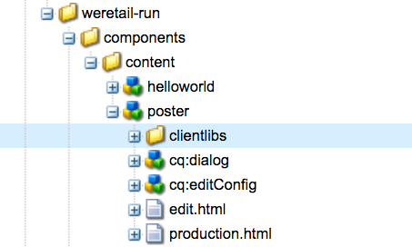

# Een AEM Screens-component uitbreiden

De volgende zelfstudie doorloopt de stappen en aanbevolen procedures voor het uitbreiden uit de doos AEM Screens-componenten. De component Image wordt uitgebreid om een aanwendbare tekstbedekking toe te voegen.

## Overzicht {#overview}

Deze zelfstudie is bedoeld voor nieuwe ontwikkelaars van AEM Screens. In deze zelfstudie wordt de Screens-component Image uitgebreid om een postercomponent te maken. Boven op een afbeelding worden een titel, beschrijving en logo geplaatst om een aantrekkelijke ervaring in een volgnummer te creëren.

>[!NOTE]
>
>Alvorens dit leerprogramma te beginnen, wordt het geadviseerd om het leerprogramma te voltooien: [ ontwikkelend een Component van de Douane voor AEM Screens ](developing-custom-component-tutorial-develop.md).


Een `Custom Poster` -component wordt gemaakt door de component Image uit te breiden.

## Vereisten {#prerequisites}

U hebt het volgende nodig om deze zelfstudie te voltooien:

1. AEM 6.5 + nieuwste Screens-functiepakket
1. [AEM Screens Player](/help/user-guide/aem-screens-introduction.md)
1. Lokale ontwikkelomgeving

De stappen en schermafbeeldingen van de zelfstudie worden uitgevoerd gebruikend CRXDE-Lite. [ Eclipse ](https://experienceleague.adobe.com/nl/docs/experience-manager-65/content/implementing/developing/devtools/aem-eclipse) of [ IntelliJ ](https://experienceleague.adobe.com/nl/docs/experience-manager-65/content/implementing/developing/devtools/ht-intellij) IDEs kan ook worden gebruikt om het leerprogramma te voltooien. Meer informatie bij het gebruiken van winde aan [ ontwikkelt zich met AEM kan hier ](https://experienceleague.adobe.com/nl/docs/experience-manager-learn/getting-started-wknd-tutorial-develop/project-archetype/project-setup) worden gevonden.

## Projectinstelling {#project-setup}

De broncode van een Screens-project wordt doorgaans beheerd als een Maven-project met meerdere modules. Om het leerprogramma te versnellen, werd een project pre-geproduceerd gebruikend [ AEM Archetype 13 van het Project ](https://github.com/adobe/aem-project-archetype). Meer details bij [ het creëren van een project met Maven AEM Archetype van het Project kunnen hier ](https://experienceleague.adobe.com/nl/docs/experience-manager-learn/getting-started-wknd-tutorial-develop/project-archetype/project-setup) worden gevonden.

1. Download en installeer de volgende pakketten gebruikend **het pakket van CRX beheren** `http://localhost:4502/crx/packmgr/index.jsp)r:`

[Bestand ophalen](assets/start-poster-screens-weretail-runuiapps-001-snapshot.zip)

   [ krijgt Dossier ](assets/start-poster-screens-weretail-runuicontent-001-snapshot.zip)
   **naar keuze,** als het werken met Verduistering of een andere winde, download het onder bronpakket. Stel het project aan een lokale AEM instantie op door het Maven bevel te gebruiken:

   **`mvn -PautoInstallPackage clean install`**

   Screens starten SRC `We.Retail` Project uitvoeren

[Bestand ophalen](assets/start-poster-screens-weretail-run.zip)

1. In **de Manager van het Pakket van CRX** `http://localhost:4502/crx/packmgr/index.jsp` worden de volgende twee pakketten geïnstalleerd:

   1. **`screens-weretail-run.ui.content-0.0.1-SNAPSHOT.zip`**
   1. **`screens-weretail-run.ui.apps-0.0.1-SNAPSHOT.zip`**

   

   AEM Screens `We.Retail Run Ui.Apps` - en `Ui.Content` -pakketten geïnstalleerd via CRX Package Manager

## De postercomponent maken {#poster-cmp}

De postercomponent breidt de uit-van-de-doos AEM Screens-afbeeldingscomponent uit. Een mechanisme van Verdelen, `sling:resourceSuperType`, wordt gebruikt om de kernfunctionaliteit van de component van het Beeld te erven zonder het moeten kopiëren en kleven. Meer informatie over de grondbeginselen van [ Verwerking van het Verzoek van de Verkoop kan hier worden gevonden.](https://experienceleague.adobe.com/nl/docs/experience-manager-65/content/implementing/developing/introduction/the-basics)

De postercomponent wordt op volledig scherm weergegeven in de modus Voorvertoning/Productie. In de bewerkingsmodus is het belangrijk dat de component anders wordt gerenderd om het ontwerpen van het kanaal Volgorde te vergemakkelijken.

1. In **CRXDE-Lite** `http://localhost:4502/crx/de/index.jsp` (of winde van keus) onderaan `/apps/weretail-run/components/content` creeer a `cq:Component` genoemd `poster`.

   Voeg de volgende eigenschappen toe aan de component `poster` :

   ```xml
   <?xml version="1.0" encoding="UTF-8"?>
   <jcr:root xmlns:sling="https://sling.apache.org/jcr/sling/1.0" xmlns:cq="https://www.day.com/jcr/cq/1.0" xmlns:jcr="https://www.jcp.org/jcr/1.0"
       jcr:primaryType="cq:Component"
       jcr:title="Poster"
       sling:resourceSuperType="screens/core/components/content/image"
       componentGroup="We.Retail Run - Content"/>
   ```

   

   Eigenschappen voor /apps/weretail-run/components/content/poster

   Door het `sling:resourceSuperType` bezit gelijk aan `screens/core/components/content/image` te plaatsen, erft de component van de Poster effectief alle functionaliteit van de component van het Beeld. Onder `screens/core/components/content/image` gevonden gelijkwaardige knooppunten en bestanden kunnen onder de component `poster` worden toegevoegd om de functionaliteit te overschrijven en uit te breiden.

1. Kopieer het knooppunt `cq:editConfig` onder `/libs/screens/core/components/content/image` . Plak de `cq:editConfig` onder de `/apps/weretail-run/components/content/poster` -component.

   Werk de eigenschap `sling:resourceType` op het knooppunt `cq:editConfig/cq:dropTargets/image/parameters` bij tot gelijk aan `weretail-run/components/content/poster` .

   

   XML-representatie van de afbeelding `cq:editConfig` hieronder weergegeven:

   ```xml
   <?xml version="1.0" encoding="UTF-8"?>
   <jcr:root xmlns:sling="https://sling.apache.org/jcr/sling/1.0" xmlns:cq="https://www.day.com/jcr/cq/1.0" xmlns:jcr="https://www.jcp.org/jcr/1.0" xmlns:nt="https://www.jcp.org/jcr/nt/1.0"
       jcr:primaryType="cq:EditConfig">
       <cq:dropTargets jcr:primaryType="nt:unstructured">
           <image
               jcr:primaryType="cq:DropTargetConfig"
               accept="[image/.*]"
               groups="[media]"
               propertyName="./fileReference">
               <parameters
                   jcr:primaryType="nt:unstructured"
                   sling:resourceType="weretail-run/components/content/poster"
                   imageCrop=""
                   imageMap=""
                   imageRotate=""/>
           </image>
       </cq:dropTargets>
   </jcr:root>
   ```

1. Het dialoogvenster WCM Foundation `image` kopiëren dat moet worden gebruikt voor de `poster` -component.

   Het is het gemakkelijkst om van een bestaande dialoog te beginnen en dan wijzigingen te maken.

   1. Het dialoogvenster kopiëren van: `/libs/wcm/foundation/components/image/cq:dialog`
   1. Het dialoogvenster onder plakken `/apps/weretail-run/components/content/poster`

   

   Gekopieerd dialoogvenster van `/libs/wcm/foundation/components/image/cq:dialog` tot `/apps/weretail-run/components/content/poster`

   De AEM Screens `image` -component krijgt voorrang op de WCM Foundation `image` -component. Daarom overerft de component `poster` functionaliteit van beide. De dialoog voor de postercomponent bestaat uit een combinatie van de dialoogvensters Screens en Foundation. De eigenschappen van de **Verzameling van het Middel** worden gebruikt om irrelevante dialooggebieden en lusjes te verbergen die van de supergetypte componenten worden geërft.

1. Werk `cq:dialog` onder `/apps/weretail-run/components/content/poster` bij met de volgende wijzigingen in XML:

   ```xml
   <?xml version="1.0" encoding="UTF-8"?>
   <jcr:root xmlns:sling="https://sling.apache.org/jcr/sling/1.0" xmlns:cq="https://www.day.com/jcr/cq/1.0" xmlns:jcr="https://www.jcp.org/jcr/1.0" xmlns:nt="https://www.jcp.org/jcr/nt/1.0"
       jcr:primaryType="nt:unstructured"
       jcr:title="Poster"
       sling:resourceType="cq/gui/components/authoring/dialog">
       <content
           jcr:primaryType="nt:unstructured"
           sling:resourceType="granite/ui/components/foundation/container">
           <layout
               jcr:primaryType="nt:unstructured"
               sling:resourceType="granite/ui/components/foundation/layouts/tabs"
               type="nav"/>
           <items jcr:primaryType="nt:unstructured">
               <image
                   jcr:primaryType="nt:unstructured"
                   jcr:title="Elements"
                   sling:resourceType="granite/ui/components/foundation/section">
                   <layout
                       jcr:primaryType="nt:unstructured"
                       sling:resourceType="granite/ui/components/foundation/layouts/fixedcolumns"
                       margin="{Boolean}false"/>
                   <items jcr:primaryType="nt:unstructured">
                       <column
                           jcr:primaryType="nt:unstructured"
                           sling:resourceType="granite/ui/components/foundation/container">
                           <items
                               jcr:primaryType="nt:unstructured"
                               sling:hideChildren="[linkURL,size]">
                               <file
                                   jcr:primaryType="nt:unstructured"
                                   sling:resourceType="cq/gui/components/authoring/dialog/fileupload"
                                   autoStart="{Boolean}false"
                                   class="cq-droptarget"
                                   fieldLabel="Image asset"
                                   fileNameParameter="./fileName"
                                   fileReferenceParameter="./fileReference"
                                   mimeTypes="[image]"
                                   multiple="{Boolean}false"
                                   name="./file"
                                   title="Upload Image Asset"
                                   uploadUrl="${suffix.path}"
                                   useHTML5="{Boolean}true"/>
                               <title
                                   jcr:primaryType="nt:unstructured"
                                   sling:resourceType="granite/ui/components/foundation/form/textfield"
                                   fieldLabel="Title"
                                   name="./jcr:title"/>
                               <description
                                   jcr:primaryType="nt:unstructured"
                                   sling:resourceType="granite/ui/components/foundation/form/textarea"
                                   fieldLabel="Description"
                                   name="./jcr:description"/>
                               <position
                                   jcr:primaryType="nt:unstructured"
                                   sling:resourceType="granite/ui/components/coral/foundation/form/click"
                                   fieldLabel="Text Position"
                                   name="./textPosition">
                                   <items jcr:primaryType="nt:unstructured">
                                       <left
                                           jcr:primaryType="nt:unstructured"
                                           text="Left"
                                           value="left"/>
                                       <center
                                           jcr:primaryType="nt:unstructured"
                                           text="Center"
                                           value="center"/>
                                       <right
                                           jcr:primaryType="nt:unstructured"
                                           text="Right"
                                           value="right"/>
                                   </items>
                               </position>
                               <color
                                   jcr:primaryType="nt:unstructured"
                                   sling:resourceType="granite/ui/components/coral/foundation/form/click"
                                   fieldLabel="Text Color"
                                   name="./textColor">
                                   <items jcr:primaryType="nt:unstructured">
                                       <light
                                           jcr:primaryType="nt:unstructured"
                                           text="Light"
                                           value="light"/>
                                       <dark
                                           jcr:primaryType="nt:unstructured"
                                           text="Dark"
                                           value="dark"/>
                                   </items>
                               </color>
                           </items>
                       </column>
                   </items>
               </image>
               <accessibility
                   jcr:primaryType="nt:unstructured"
                   sling:hideResource="{Boolean}true"/>
           </items>
       </content>
   </jcr:root>
   ```

   Het bezit `sling:hideChildren`= `"[linkURL,size]`&quot; wordt gebruikt op de `items` knoop om ervoor te zorgen dat de **linkURL** en **grootte** gebieden van de dialoog verborgen zijn. Het is niet voldoende deze knooppunten uit het posterdialoogvenster te verwijderen. De eigenschap `sling:hideResource="{Boolean}true"` op het tabblad Toegankelijkheid wordt gebruikt om het hele tabblad te verbergen.

   Er worden twee klikvelden toegevoegd aan het dialoogvenster, Tekstpositie en Tekstkleur, zodat de auteur de positie van de tekst en de kleur van de titel en de beschrijving kan bepalen.

   

   Poster - Definitieve structuur van dialoogvenster

   Op dit punt, kan een geval van de `poster` component aan de **IdleChannel** pagina in het `We.Retail` project van de Looppas worden toegevoegd: `http://localhost:4502/editor.html/content/screens/we-retail-run/channels/idle-channel.edit.html`.

   {de gebieden van de Dialoog van 0} Poster 

   Dialoogvensters Poster

1. Een bestand maken onder de naam `/apps/weretail-run/components/content/poster` `production.html.`

   Vul het bestand met het volgende:

   ```xml
   <!--/*
   
       /apps/weretail-run/components/content/poster/production.html
   
   */-->
   <div data-sly-use.image="image.js"
        data-duration="${properties.duration}"
        class="cmp-poster"
        style="background-image: url(${request.contextPath @ context='uri'}${image.src @ context='uri'});">
       <div class="cmp-poster__text
                   cmp-poster__text--${properties.textPosition @ context='attribute'}
                   cmp-poster__text--${properties.textColor @ context='attribute'}">
           <h1 class="cmp-poster__title">${properties.jcr:title}</h1>
            <h2 class="cmp-poster__description">${properties.jcr:description}</h2>
       </div>
    
   </div>
   ```

   De productiemarkering voor de postercomponent wordt direct hierboven weergegeven. Het HTML-script overschrijft `screens/core/components/content/image/production.html` . `image.js` is een serverscript dat een POJO-achtig afbeeldingsobject maakt. Het object Image kan vervolgens worden aangeroepen om de `src` te renderen als een achtergrondafbeelding in inline stijl.

   `The h1` en h2 tags worden toegevoegd, geven de titel en beschrijving weer op basis van de componenteigenschappen: `${properties.jcr:title}` en `${properties.jcr:description}` .

   Omringend de `h1` en `h2` markeringen is een div omslag met drie CSS klassen met variaties van &quot;`cmp-poster__text`&quot;. De waarde voor de eigenschappen `textPosition` en `textColor` worden gebruikt om de CSS-klasse te wijzigen die wordt gerenderd op basis van het dialoogvenster dat door de auteur is geselecteerd. In de volgende sectie worden CSS uit clientbibliotheken geschreven om deze wijzigingen in de weergave in te schakelen.

   Een logo wordt ook als een bedekking opgenomen in de component. In dit voorbeeld, is de weg aan het ` We.Retail` embleem hard-gecodeerd in DAM. Afhankelijk van het geval van het gebruik, zou het nuttiger kunnen zijn om een dialoogvakje tot stand te brengen om van de logoweg een dynamisch bevolkte waarde te maken.

   Merk ook op dat BEM-notatie (Block Element Modifier) wordt gebruikt met de component. BEM is een CSS-coderingsconventie die het gemakkelijker maakt om herbruikbare componenten te maken. BEM is de aantekening die door [ wordt gebruikt AEM de Componenten van de Kern ](https://github.com/adobe/aem-core-wcm-components/wiki/CSS-coding-conventions). <!-- DEAD LINK More info can be found at: [https://getbem.com/](https://getbem.com/) -->

1. Een bestand maken onder de naam `/apps/weretail-run/components/content/poster` `edit.html.`

   Vul het bestand met het volgende:

   ```xml
   <!--/*
   
       /apps/weretail-run/components/content/poster/edit.html
   
   */-->
   
   <div class="aem-Screens-editWrapper ${image.cssClass} cmp-poster" data-sly-use.image="image.js" data-emptytext="${'Poster' @ i18n, locale=request.locale}">
       
       <div class="cmp-poster__text
              cmp-poster__text--${properties.textPosition @ context='attribute'}
          cmp-poster__text--${properties.textColor @ context='attribute'}">
         <p class="cmp-poster__title">${properties.jcr:title}</p>
         <p class="cmp-poster__description">${properties.jcr:description}</p>
       </div>
   </div>
   ```

   **geeft** prijsverhoging voor de component van de Poster uit wordt gezien direct hierboven. Het HTML-script overschrijft `/libs/screens/core/components/content/image/edit.html` . De markering is vergelijkbaar met de markering `production.html` en geeft de titel en beschrijving boven op de afbeelding weer.

   `aem-Screens-editWrapper` wordt toegevoegd zodat de component niet volledig-scherm in de redacteur wordt teruggegeven. Het attribuut `data-emptytext` zorgt ervoor dat een placeholder wordt getoond wanneer geen beeld of inhoud is bevolkt.

## Client-Side bibliotheken maken {#clientlibs}

Client-Side Libraries bieden een mechanisme voor het organiseren en beheren van CSS- en JavaScript-bestanden die nodig zijn voor een AEM implementatie. Meer informatie over het gebruiken van [ cliënt-Kant Bibliotheken kan hier worden gevonden.](https://experienceleague.adobe.com/nl/docs/experience-manager-65/content/implementing/developing/introduction/clientlibs)

AEM Screens-componenten worden in de bewerkingsmodus anders weergegeven dan in de modus Voorbeeld/productie. Er worden twee sets met clientbibliotheken gemaakt: een voor de bewerkingsmodus en een tweede voor Voorvertoning/Productie.

1. Maak een map voor client-side bibliotheken voor de postercomponent.

   Onder `/apps/weretail-run/components/content/poster` maakt u een map met de naam `clientlibs` .

   

1. Onder de map `clientlibs` maakt u een knooppunt met de naam `shared` of type `cq:ClientLibraryFolder.` .

   

1. Voeg de volgende eigenschappen toe aan de gedeelde clientbibliotheek:

   * `allowProxy` | Boolean | `true`
   * `categories` | String [] | `cq.screens.components`

   

   Eigenschappen voor /apps/weretail-run/components/content/poster/clientlibs/shared

   De eigenschap `categories` is een tekenreeks die de clientbibliotheek identificeert. De categorie `cq.screens.components` wordt gebruikt in zowel de modus Bewerken als de modus Voorbeeld/productie. Daarom wordt elke CSS/JS die in de `shared` clientlib is gedefinieerd, in alle modi geladen.

   U kunt het beste paden nooit rechtstreeks toegankelijk maken voor `/apps` in een productieomgeving. De eigenschap `allowProxy` zorgt ervoor dat naar de CSS- en JS-clientbibliotheek wordt verwezen via een voorvoegsel van `/etc.clientlibs` . Meer informatie over het [ allowProxy bezit kan hier worden gevonden.](https://experienceleague.adobe.com/nl/docs/experience-manager-65/content/implementing/developing/introduction/clientlibs)

1. Maak een bestand met de naam `css.txt` onder de gedeelde map.

   Vul het bestand met het volgende:

   ```
   #base=css
   
   styles.less
   ```

1. Maak een map met de naam `css` onder de map `shared` . Voeg een bestand met de naam `style.less` toe onder de map `css` . De structuur van de clientbibliotheken moet er nu als volgt uitzien:

   

   In plaats van CSS rechtstreeks te schrijven, gebruikt deze zelfstudie LESS. [ LESS ](https://lesscss.org/) is populaire CSS pre-compiler die CSS variabelen, mixins, en functies steunt. AEM clientbibliotheken ondersteunen native LESS-compilatie. De klasse of andere pre-compilers kunnen worden gebruikt maar moeten buiten AEM worden gecompileerd.

1. Vul `/apps/weretail-run/components/content/poster/clientlibs/shared/css/styles.less` met het volgende:

   ```css
   /*
    /apps/weretail-run/components/content/poster/clientlibs/shared/css/styles.less
    Poster component - Shared Style
   */
   
   @import url('https://fonts.googleapis.com/css?family=Fjalla+One|Open+Sans:400i');
   
   @text-light-color: #fff;
   @text-dark-color: #000;
   @title-font-family: 'Fjalla One', sans-serif;
   @description-font-family: 'Open Sans', sans-serif;
   
   .cmp-poster {
   
         &__text {
         position: absolute;
         color: @text-light-color;
         top: 0;
         text-align:center;
         width: 100%;
   
         &--left {
          text-align: left;
                margin-left: 1em;
         }
   
         &--right {
          text-align: right;
                margin-right: 1em;
         }
   
         &--dark {
          color: @text-dark-color;
         }
       }
   
       &__title {
         font-weight: bold;
            font-family: @title-font-family;
            font-size: 1.2em;
       }
   
       &__description {
     font-style: italic;
           font-family: @description-font-family;
    }
   
   }
   ```

   >[!NOTE]
   >
   >Google-Webben Fonts worden gebruikt voor de lettertypefamilies. Webben Fonts vereisen internetverbinding en niet alle AEM Screens-implementaties beschikken over een betrouwbare verbinding. Planning voor off-line wijze is een belangrijke overweging voor de plaatsingen van AEM Screens.

1. Kopieer de clientbibliotheekmap van `shared` . Plak het bestand op hetzelfde niveau en wijzig de naam in `production` .

   

1. De eigenschap `categories` van de productieclientbibliotheek bijwerken naar `cq.screens.components.production.`

   De categorie `cq.screens.components.production` zorgt ervoor dat de stijlen alleen worden geladen in de modus Voorbeeld/productie.

   

   Eigenschappen voor /apps/weretail-run/components/content/poster/clientlibs/production

1. Vul `/apps/weretail-run/components/content/poster/clientlibs/production/css/styles.less` met het volgende:

   ```css
   /*
    /apps/weretail-run/components/content/poster/clientlibs/production/css/styles.less
    Poster component - Production Style
   */
   
   .cmp-poster {
   
       background-size: cover;
    height: 100%;
    width: 100%;
    position:absolute;
   
        &__text {
   
           top: 2em;
   
           &--left {
               width: 40%;
               top: 5em;
           }
   
           &--right {
               width: 40%;
               right: 1em;
           }
       }
   
       &__title {
     font-size: 5rem;
     font-weight: 900;
     margin: 0.1rem;
    }
   
    &__description {
     font-size: 2rem;
     margin: 0.1rem;
     font-weight: 400;
   
    }
   
       &__logo {
     position: absolute;
     max-width: 200px;
     top: 1em;
     left: 0;
    }
   
   }
   ```

   De bovenstaande stijlen geven de titel en beschrijving weer op een absolute positie op het scherm. De titel wordt groter weergegeven dan de beschrijving. Met de BEM-notatie van de component kunt u de stijlen in de klasse cmp-poster heel eenvoudig nauwkeurig indelen.

Een derde categorie in de clientbibliotheek: `cq.screens.components.edit` kan worden gebruikt om alleen specifieke stijlen aan de component toe te voegen.

| Clientlib-categorie | Gebruik |
|---|---|
| `cq.screens.components` | Stijlen en scripts die worden gedeeld tussen de bewerkings- en de productiemodus |
| `cq.screens.components.edit` | Stijlen en scripts die alleen worden gebruikt in de bewerkingsmodus |
| `cq.screens.components.production` | Stijlen en scripts die alleen in de productiemodus worden gebruikt |

## Postercomponent aan een kanaal van de Reeks toevoegen {#add-sequence-channel}

De component Poster wordt gebruikt op een kanaal van de Opeenvolging. Het startpakket voor deze zelfstudie bevatte een inactief kanaal. Het kanaal Niet actief is vooraf geconfigureerd om componenten van de groep **`We.Retail Run - Content`** toe te staan. De groep van de component Poster wordt ingesteld op `We.Retail Run - Content` en is beschikbaar om aan het kanaal te worden toegevoegd.

1. Open het kanaal Niet actief vanuit het project `We.Retail` Uitvoeren: **`http://localhost:4502/editor.html/content/screens/we-retail-run/channels/idle-channel.edit.html`**
1. Sleep + Daling een nieuw geval van de **component van de Poster** van de zijbar op de pagina.

   

1. Bewerk het dialoogvenster van de postercomponent zodat u een afbeelding, titel, beschrijving kunt toevoegen. Gebruik de opties Tekstpositie en Tekstkleur om ervoor te zorgen dat de titel/beschrijving op de afbeelding kan worden gelezen.

   

1. Herhaal de bovenstaande stappen om enkele postercomponenten toe te voegen. Voeg overgangen toe tussen de componenten.

   

## Alles samenvoegen {#putting-it-all-together}

In de onderstaande video ziet u de voltooide component en de manier waarop deze aan een volgnummer kan worden toegevoegd. Het kanaal wordt vervolgens toegevoegd aan de weergave Locatie en uiteindelijk toegewezen aan een Screens-speler.

>[!VIDEO](https://video.tv.adobe.com/v/22414?quaity=9)

## Voltooide code {#finished-code}

Hieronder ziet u de voltooide code uit de zelfstudie. **screens-weretail-run.ui.apps-0.0.1-SNAPSHOT.zip** en **screens-weretail-run.ui.content-0.0.1-SNAPSHOT.zip** zijn de gecompileerde AEM pakketten. **SRC-screens-weretail-looppas-0.0.1.zip** is de niet gecompileerde broncode die kan worden opgesteld gebruikend Maven.

[Bestand ophalen](assets/final-poster-screens-weretail-runuiapps-001-snapshot.zip)

[Bestand ophalen](assets/final-poster-screens-weretail-runuicontent-001-snapshot.zip)

SRC Final AEM Screens `We.Retail` Project uitvoeren

[Bestand ophalen](assets/src-screens-weretail-run-001.zip)
