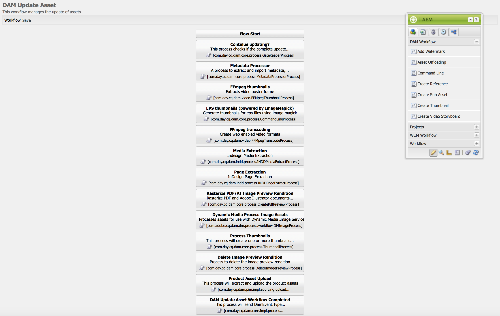
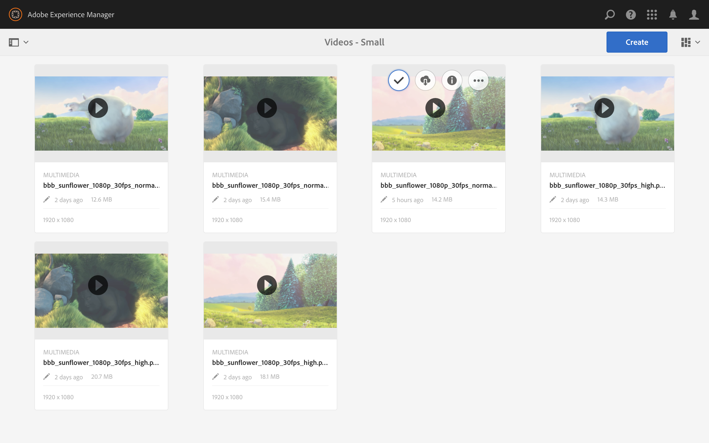

# Video-uitvoeringen {#video-renditions}

U kunt handmatige en automatische full-HD uitvoeringen genereren. In de volgende sectie wordt de workflow beschreven voor het toevoegen van uitvoeringen aan uw elementen.

## Automatisch Full HD-uitvoeringen genereren {#automatically-generating-full-hd-renditions}

>[!NOTE]
>
>Als de AEM Screens-video-uitvoeringen niet optimaal worden afgespeeld op uw apparaat, neemt u contact op met de hardwareleverancier voor de specificaties van de video. Zo krijgt u de beste prestaties op het apparaat. Hiermee kunt u uw eigen aangepaste videoprofiel maken waarin u de juiste parameters voor FFMPEG opgeeft om uw vertoning te genereren. Vervolgens kunt u met de onderstaande stappen uw aangepaste videoprofiel toevoegen aan de lijst met profielen.
>
>Ook, zie [&#x200B; het Oplossen van problemen Video&#39;s &#x200B;](troubleshoot-videos.md) om video te zuiveren en problemen op te lossen die in uw kanaal speelt.

Voer de onderstaande stappen uit om automatisch full-HD-uitvoeringen te genereren:

1. Klik de verbinding van Adobe Experience Manager (top-left) en klik het hamerpictogram zodat kunt u **Werkschema** klikken.

   Klik **Modellen**.

   

1. In het beheer van het werkschemamodel, klik het **model van de Activa van de Update van 0&rbrace; DAM &lbrace;en klik** uitgeven **van de actiebar.**

   

1. In het **DAM venster van de Activa van de Update**, klik de **Fmpeg transcoding** stap tweemaal.

   

1. Klik het **Proces** lusje.
1. Ga de volledige profielen HD aan de lijst in **Argumenten** als volgt in:
   ***`,profile:fullhd-bp,profile:fullhd-hp`***
1. Klik **OK**.

   

1. Klik **sparen** op top-left van het **DAM scherm van de Activa van de Update van de Update**.

   

1. Navigeer aan **Assets** en upload een nieuwe video. Klik op de video en open de rails aan de zijkant van de rendities. Let op de twee full HD video&#39;s.

   

1. Open **Vertoningen** van de zijspoor.

   

1. Let op twee nieuwe full HD-uitvoeringen.

   

## Handmatig Full HD-uitvoeringen genereren {#manually-generating-full-hd-renditions}

Voer de onderstaande stappen uit om volledige HD-uitvoeringen handmatig te genereren:

1. Klik de verbinding van Adobe Experience Manager (verlaten bovenkant) en klik het hamerpictogram zodat kunt u hulpmiddelen klikken en **Werkschema** klikken.

   Klik **Modellen**.

   

1. In werkschemamodel beheer, klik het **model van de Activa van de Update van Screens 0&rbrace; &lbrace;en klik het** Werkschema van het Begin **om het** de dialoogvakje van het Werkschema van de Looppas **te openen.**

   

1. Klik de gewenste video in de **nuttige lading** en klik **Looppas**.

   

1. Navigeer aan **Assets**, boor neer aan uw activa, en klik het.

   

1. Open de **zijspoor 0&rbrace; van Vertoningen &lbrace;.** Let op de nieuwe full HD-uitvoeringen.

   
