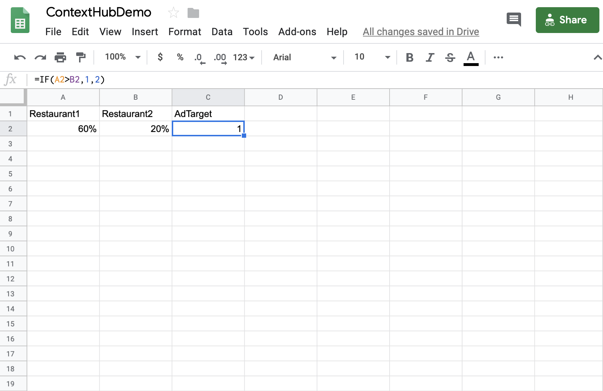
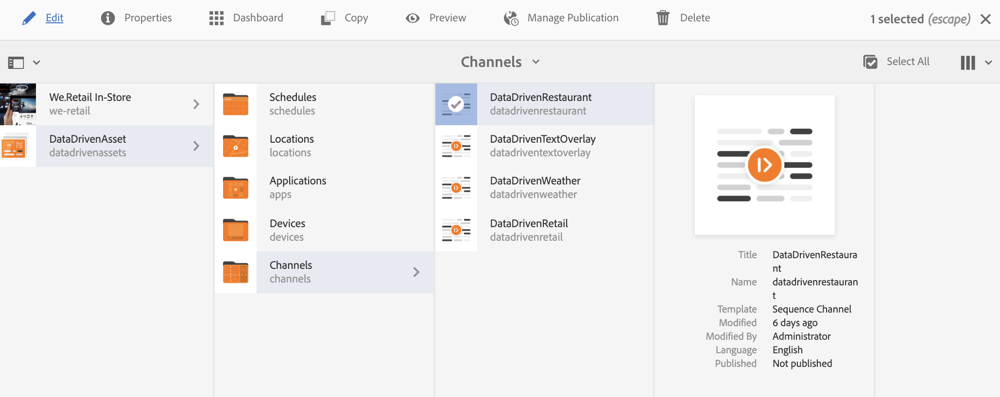

# Activering van ziekenhuisreservering {#hospitality-reservation-activation}

Het volgende gebruiksgeval toont het gebruik van activering van ziekenhuisreserveringen op basis van de waarden in Google Sheets.

## Beschrijving {#description}

Voor dit geval van Gebruik, wordt het Blad van Google bevolkt met percentage van reservering op twee restaurants **Restaurant1** en **Restaurant2**. Een formule wordt toegepast gebaseerd op waarden van Restaurant1 en Restaurant2 en gebaseerd op de formule, wordt waarde 1 of 2 toegewezen aan **AdTarget** Kolom.

Als de waarde van **Restaurant1** > **Restaurant2**, dan **AdTaget** wordt toegewezen waarde **1** anders **AdTarget** wordt toegewezen waarde **2**. Waarde 1 genereert *Stak food* optie en Waarde 2 resulteert in de weergave van *Thai food* optie op uw beeldscherm.

## Voorwaarden {#preconditions}

Voordat u de reserveringsactivering gaat implementeren, moet u leren hoe u ***Gegevensopslag***, ***Audience Segmentation*** en ***Enable Targeting for Channels*** in een AEM Screens-project instelt.

Verwijs naar [het Vormen ContextHub in AEM Screens](configuring-context-hub.md) voor gedetailleerde informatie.

## Basisstroom {#basic-flow}

Voer de onderstaande stappen uit om de activeringsaanvraag voor de ziekenhuisreservering te implementeren voor uw AEM Screens-project:

1. **De Google Sheets vullen en de formule toevoegen.**

   Pas bijvoorbeeld de formule toe op de derde kolom **AdTarget**, zoals in de onderstaande afbeelding wordt getoond.

   

1. **De segmenten in soorten publiek configureren volgens de vereisten**

   1. Navigeer naar de segmenten in uw publiek (zie ***Stap 2: De Segmentatie van het publiek van de vestiging*** in **[Het vormen ContextHub in AEM Screens](configuring-context-hub.md)** pagina voor meer details).

   1. Selecteer **Bladen A1 1** en klik **Bewerken**.

   1. Selecteer het vergelijkingsbezit en klik vormen pictogram om de eigenschappen uit te geven.
   1. Selecteer **googlesheets/value/1/2** in de vervolgkeuzelijst in **Eigenschapnaam**

   1. Selecteer **Operator** als **equal** in het keuzemenu

   1. Voer de **Waarde** in als **1**

   1. Selecteer op dezelfde manier **Bladen A1 2** en klik **Bewerken**.

   1. Selecteer het vergelijkingsbezit en klik vormen pictogram om de eigenschappen uit te geven.
   1. Selecteer **googlesheets/value/1/2** in de vervolgkeuzelijst in **Eigenschapnaam**

   1. Selecteer **Operator** als **2**

1. Navigeer en selecteer uw kanaal () en klik **uitgeven** van de actiebar. In het volgende voorbeeld, **DataDrivenRestaurant**, wordt een opeenvolgend kanaal gebruikt om de functionaliteit te tonen.

   >[!NOTE]
   >
   >Uw kanaal zou reeds een standaardbeeld moeten hebben en het publiek zou pre-gevormd moeten zijn zoals die in [het Vormen ContextHub in AEM Screens](configuring-context-hub.md) wordt beschreven.

   

   >[!CAUTION]
   >
   >U zou opstelling uw **ContextHub** **Configuraties** moeten hebben gebruikend het kanaal **Eigenschappen** —> **Personalization** tabel.

   

1. Selecteer **Doelstelling** in de editor en selecteer **Merk** en **Activiteit** in het keuzemenu en klik **Doelstelling starten**.
1. **De voorvertoning controleren**

   1. Klik op **Voorvertoning.** Open ook uw Google Sheets en werk de waarde ervan bij.
   1. Werk de waarde in **Restaurant1** en **Restaurant2** kolommen bij. Als **Restaurant1** > **Restaurant2,** u een beeld van *Steak* anders zou moeten kunnen bekijken, *Thai* vertoningen van voedselbeeld op uw scherm.

   

