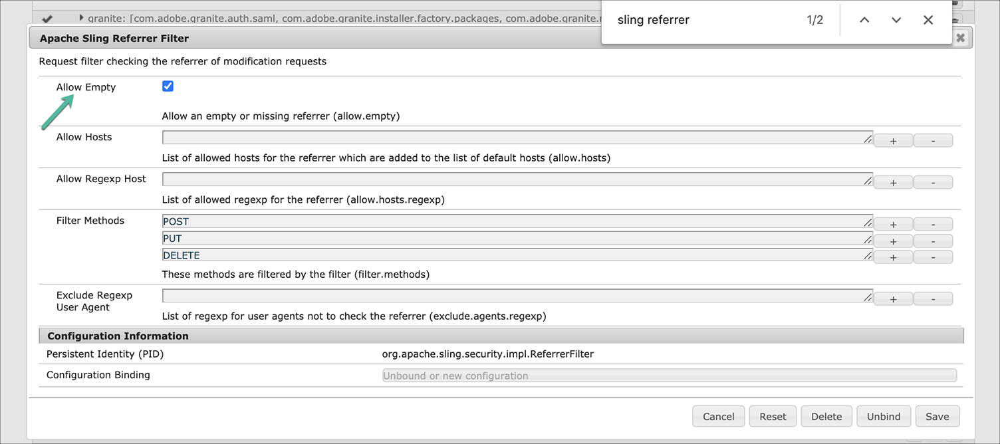
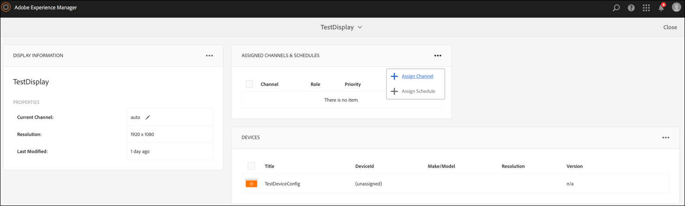

# Kickstart Guide {#kickstart-guide}

Deze sectie is een kickstart naar AEM Screens en laat zien hoe u een AEM Screens-project kunt instellen en uitvoeren. Het begeleidt u door het instellen van een eenvoudige digitale handtekening en het toevoegen van inhoud, zoals elementen en/of video&#39;s, aan elk kanaal en het verder publiceren van de inhoud naar een AEM Screens-speler.

>[!NOTE]
>Voordat u aan de projectdetails gaat werken, moet u eerst het nieuwste Feature Pack hebben geïnstalleerd. U kunt het nieuwste functiepakket voor AEM Screens 6.5.5 Release downloaden van de [Software Distribution Portal](https://experience.adobe.com/#/downloads/content/software-distribution/en/aem.html) met uw Adobe ID.

## Een Digital Signage-ervaring maken in 5 minuten {#creating-a-digital-signage-experience-in-minutes}

Voer de onderstaande stappen uit om een voorbeeldproject voor AEM Screens te maken en inhoud verder te publiceren naar de Schermspeler.

>[!NOTE]
>In de volgende zelfstudie wordt het afspelen van de inhoud van uw kanaal in Chrome OS Player geïllustreerd.

>[!IMPORTANT]
>**OSGi-configuratie-instellingen**
>U moet de lege referentie inschakelen zodat het apparaat gegevens op de server kan plaatsen. Als de lege referentie-eigenschap bijvoorbeeld is uitgeschakeld, kan het apparaat geen schermafbeelding terugplaatsen. Momenteel zijn enkele van deze functies alleen beschikbaar als het filter Lege waarden toestaan van Apache-verwijzing is ingeschakeld in de OSGi-configuratie. Op het dashboard kan een waarschuwing worden weergegeven dat bepaalde functies mogelijk niet kunnen worden gebruikt door beveiligingsinstellingen.
>Voer de onderstaande stappen uit om het filter ***Apache-schuifverwijzing leeg*** toestaan in te schakelen:

## Lege verwijzingsverzoeken toestaan {#allow-empty-referrer-requests}

1. Ga naar **Adobe Experience Manager Web Console Configuration** via AEM instance —> hammer icon —> **Operations** —> **Web Console**.

   

1. **Configuratie** van Adobe Experience Manager-webconsole wordt geopend. Zoeken naar de referentie van de sling.

   Voor het zoeken van het het rangschikken verwijzend bezit, druk **Command+F** voor **MAC** en **Control+F** voor **Vensters**.

1. Schakel de optie Lege **** waarden toestaan in, zoals in de onderstaande afbeelding.

   

1. Klik op **Opslaan** om het filter Leeg toestaan voor Apache-schuifverwijzing in te schakelen.

## Zelfstudie {#tutorial}

### Een nieuw AEM Screens-project maken {#creating-project}

De eerste stap is het maken van een nieuw AEM Screens-project.

1. Navigeer naar uw Adobe Experience Manager-exemplaar (AEM) en klik op **Schermen**. U kunt ook rechtstreeks navigeren vanuit `https://localhost:4502/screens.html/content/screens](https://localhost:4502/screens.html/content/screens`.

1. Klik op Schermproject **** maken om een nieuw rasterproject te maken. Voer de titel in als **DemoScreens** en klik op **Opslaan**.

   

   >[!NOTE]
   >Zodra u het project creeert, brengt het u terug naar de homepage van het Project van de Schermen. U kunt nu uw project selecteren. In een project zijn er vijf verschillende mappen met de naam **Toepassingen**, **Kanalen**, **Apparaten**, **Locaties** en **Planningen**.

### Een nieuw kanaal maken {#creating-channel}

Zodra u uw project op zijn plaats hebt, moet u een nieuw kanaal tot stand brengen waar u de inhoud beheert.

Ga als volgt te werk om een nieuw kanaal voor uw project te maken:

1. Zodra u een project creeert, selecteer het **project DemoScreens** en selecteer de omslag **van** Kanalen, zoals aangetoond in het hieronder cijfer. Klik op **+ Maken** op de actiebalk.

   

1. Kies het kanaal **van de** Reeks van de tovenaar en klik **daarna**.
   

1. Voer de **titel** in als *TestChannel* en klik op **Maken**.

   

Het *bestand TestChannel* wordt gemaakt en aan de map met kanalen toegevoegd, zoals in de onderstaande afbeelding wordt getoond.

### Inhoud toevoegen aan een kanaal {#adding-content}

Wanneer u uw kanaal hebt ingesteld, moet u inhoud aan uw kanaal toevoegen die de Schermspeler zal tonen.

Voer de onderstaande stappen uit om inhoud aan het kanaal (*TestChannel*) in uw project toe te voegen:

1. Navigeer aan *Test_Project* u creeerde en selecteer de omslag van **Kanalen** .

1. Klik op **Bewerken** op de actiebalk (zie de onderstaande afbeelding). De redacteur voor *TestChannel* opent.

1. Klik op het pictogram dat het zijpaneel links van de actiebalk in- en uitschakelt om de elementen en componenten te openen.

1. Sleep de componenten die u aan het kanaal wilt toevoegen en zet deze neer.

   

In dit voorbeeld wordt in de editor een afbeelding weergegeven die aan het kanaal is toegevoegd.

### Een nieuwe locatie maken {#creating-location}

Wanneer u uw kanaal hebt ingesteld, moet u uw locatie maken.

***De plaatsen*** compartimenteren uw diverse digitale signaalervaringen en bevatten de configuraties van de vertoningen volgens waar de diverse schermen zijn.

Ga als volgt te werk om een nieuwe locatie voor uw project te maken:

1. Navigeer aan *Test_Project* u creeerde en selecteer de omslag van **Plaatsen** .

1. Klik op **Maken** naast het plusteken in de actiebalk (zie de onderstaande afbeelding). Er wordt een wizard geopend.
1. Selecteer **Locatie** in de wizard en klik op **Volgende**.

1. Voer de **naam** en de **titel** voor uw locatie in (voer de titel in als *TestLocation*) en klik op **Maken**.

   

De *testlocatie* wordt gemaakt en toegevoegd aan de map **Locations** .

### Een nieuwe weergave maken voor TestLocation {#creating-display}

Nadat u een locatie hebt gemaakt, moet u een nieuwe weergave voor uw locatie maken.

***De vertoningen*** vertegenwoordigen de digitale ervaring die op één of veelvoudige schermen loopt.

1. Navigeer naar de locatie waar u de weergave wilt maken (*Test_* Project —> **Locaties** —> *TestLocation)* , zoals aangegeven in de bovenstaande afbeelding, en selecteer *TestLocation*.

1. Klik op **Maken** op de actiebalk.
1. Selecteer **Weergave** in de wizard **Maken** en klik op **Volgende**.

1. Ga **Naam** en **Titel** voor uw vertoningsplaats in (ga de titel als *TestDisplay* in).

1. Kies onder het tabblad **Weergave** de details van de layout.

   1. Kies de **resolutie** als **Full HD**.

   1. Kies het **aantal apparaten horizontaal** als 1.

   1. Kies het **aantal apparaten verticaal** als 1.

   1. Klik op **Maken**.

Een nieuwe vertoning (*TestDisplay*) wordt toegevoegd aan uw plaats *TestLocation)*, zoals aangetoond in hieronder figuur.

### Een kanaal toewijzen {#assigning-channel}

1. Navigeer naar de weergave vanuit *Test_Project* —> **Locaties** —> *TestLocation* —> *TestDisplay*.

1. Selecteer *Weergave* testen en tik/klik op **Kanaal toewijzen **vanuit de actiebalk *Of*,

1. Klik op **dashboard** en selecteer **+Kanaal** toewijzen rechtsboven in het deelvenster **TOEGEWEZEN KANALEN EN SCHADUWEN** , zoals in de onderstaande afbeelding wordt getoond. **Het dialoogvenster Kanaaltoewijzing** wordt geopend.

1. Referentiekanaal **op** **pad selecteren**

1. Voer de **kanaalrol** in als *LiveStream*.

1. Selecteer het **Kanaalpad** (*Test_Project* —> *Kanalen* —> *TestChannel* ) in het **Kanaal**.

1. Selecteer **Prioriteit** voor dit kanaal als *1*.

1. Kies de **Ondersteunde gebeurtenissen** als **Eerste Laden** en **Niet actief scherm**.

1. Voer **Planning** in en selecteer de datums in **actieve modus van** en **actief tot**.

1. Click **Save**.

Het kanaal wordt gemaakt en aan het deelvenster toegevoegd.

### Een apparaat registreren {#registering-device}

U moet het apparaat registreren via het AEM dashboard.

>[!NOTE]
>U kunt de schermspeler openen met de AEM Screens-app die u hebt gedownload of met de webbrowser.

### De inhoud weergeven in AEM Screens Player {#viewing-the-content-in-screens-player}

Nadat u de bovenstaande configuraties hebt toegevoegd, geeft de speler automatisch het standaardkanaal voor de weergave op het apparaat weer.

Zie [AEM Screens Player](working-with-screens-player.md) voor meer informatie over AEM Screens Player.
