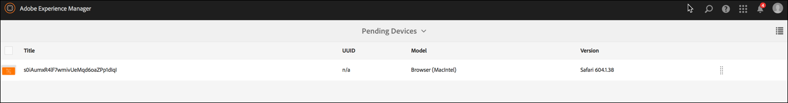

# Kickstart Guide {#kickstart-guide}

Deze sectie is een snelbegin voor AEM-schermen en laat zien hoe u basishandelingen kunt uitvoeren. Het begeleidt u door het instellen van een eenvoudige digitale handtekening met inhoud/middelen en het publiceren naar een schermspeler. Zie de bronnen aan het einde van de pagina voor een diepgaand inzicht in alle componenten voor schermontwikkeling.

## Een Digital Signage-ervaring maken in 5 minuten {#creating-a-digital-signage-experience-in-minutes}

In de volgende stappen kunt u een voorbeeldproject voor schermen maken en inhoud publiceren naar de Schermspeler.

1. Klik **hier** om AEM Screens Player te downloaden.

   AEM-schermen zijn ook beschikbaar in **Google Play**.

   Zie [Chrome Management Console](implementing-chrome-os-player.md) voor meer informatie voor de implementatie van Chrome OS Player.

   Zie Schermen [installeren en configureren](configuring-screens-introduction.md) voor meer informatie.

   >[!NOTE]
   >
   >**OSGI-instellingen**
   >
   >
   >U moet de lege referentie inschakelen zodat het apparaat gegevens op de server kan plaatsen. Als de lege referentie-eigenschap bijvoorbeeld is uitgeschakeld, kan het apparaat geen schermafbeelding terugplaatsen. Sommige van deze functies zijn momenteel alleen beschikbaar als het filter Lege items toestaan in Apache Sling Referrer is ingeschakeld in de Configuratie OSGI. Op het dashboard kan een waarschuwing worden weergegeven dat bepaalde functies mogelijk niet kunnen worden gebruikt door beveiligingsinstellingen.
   >
   >
   >Voer de onderstaande stappen uit om het filter ***Apache-schuifverwijzing leeg*** toestaan in te schakelen:
   >
   >
   >
   >    1. Navigeer naar de Configuratie **van de Console van het Web van de Manager van de Ervaring van** Adobe, namelijk `https://localhost:4502/system/console/configMgr/org.apache.sling.security.impl.ReferrerFilter`.
   >    1. Schakel de optie **allow.empty** in.
   >    1. Click **Save**.

1. **Een nieuw project maken**

   1. Selecteer de koppeling Adobe Experience Manager (linksboven) en vervolgens **Schermen**. U kunt ook rechtstreeks navigeren naar `https://localhost:4502/screens.html/content/screens](https://localhost:4502/screens.html/content/screens`.

   1. Klik op **Maken** om een nieuw project voor schermen te maken (zie de onderstaande afbeelding).
   1. Selecteer **Schermen** van de **Create tovenaar van het Project** van Schermen en klik **daarna**.

   1. Voer de titel in als *Test_Project* en klik op **Maken**.
   

   Zodra het project wordt gecreeerd, brengt het u terug naar de console van het Project van de Schermen. U kunt nu uw project selecteren. In een project, zijn er vijf soorten omslagen: **Toepassingen**, **Kanalen**, **Apparaten**, **Plaatsen**, en **Programma**, zoals aangetoond in het hieronder cijfer.

   >[!NOTE]
   >
   >Planningen zijn alleen beschikbaar als u AEM 6.3 Sites Feature Pack 1 hebt geïnstalleerd. Neem contact op met de ondersteuning van Adobe om toegang te krijgen tot dit onderdeel. Als u beschikt over de juiste machtigingen, kunt u deze downloaden via Pakket delen.

   

   Zie Schermproject  maken en beheren voor meer informatie.

1. **Een nieuw kanaal maken**

   Zodra u uw project op zijn plaats hebt, moet u een nieuw kanaal tot stand brengen waar u de inhoud beheert.

   Ga als volgt te werk om een nieuw kanaal voor uw project te maken:

   1. Navigeer aan *Test_Project* u creeerde en selecteer de omslag van **Kanalen** .

   1. Klik op **Maken** op de actiebalk (zie de onderstaande afbeelding). Er wordt een wizard geopend.
   1. Kies het kanaal **van de** Reeks en klik **daarna**.

   1. Voer de **naam** en de **titel** in als *TestChannel* en klik op **Maken**.
   

   Het *bestand TestChannel* wordt gemaakt en aan de map met kanalen toegevoegd, zoals in de onderstaande afbeelding wordt getoond.

   

   Zie [Kanaalbeheer](managing-channels.md) voor meer informatie over het maken en beheren van kanalen.

1. **Inhoud toevoegen aan een kanaal**

   Wanneer u uw kanaal hebt ingesteld, moet u inhoud aan uw kanaal toevoegen die de Schermspeler zal tonen.

   Voer de onderstaande stappen uit om inhoud aan het kanaal (*TestChannel*) in uw project toe te voegen:

   1. Navigeer aan *Test_Project* u creeerde en selecteer de omslag van **Kanalen** .

   1. Klik op **Bewerken** op de actiebalk (zie de onderstaande afbeelding). De redacteur voor *TestChannel* opent.

   1. Klik op het pictogram dat het zijpaneel links van de actiebalk in- en uitschakelt om de elementen en componenten te openen.
   1. Sleep de componenten die u aan het kanaal wilt toevoegen en zet deze neer.
   

   In dit voorbeeld wordt in de editor een afbeelding weergegeven die aan het kanaal is toegevoegd.

   

1. **Een nieuwe locatie maken**

   Wanneer u uw kanaal hebt ingesteld, moet u uw locatie maken.

   ***De plaatsen*** compartimenteren uw diverse digitale signaalervaringen en bevatten de configuraties van de vertoningen volgens waar de diverse schermen zijn.

   Ga als volgt te werk om een nieuwe locatie voor uw project te maken:

   1. Navigeer aan *Test_Project* u creeerde en selecteer de omslag van **Plaatsen** .

   1. Klik op **Maken** naast het plusteken in de actiebalk (zie de onderstaande afbeelding). Er wordt een wizard geopend.
   1. Selecteer **Locatie** in de wizard en klik op **Volgende**.

   1. Voer de **naam** en de **titel** voor uw locatie in (voer de titel in als *TestLocation*) en klik op **Maken**.
   

   De *testlocatie* wordt gemaakt en toegevoegd aan de map **Locations** .

   

1. **Een nieuwe weergave maken voor *TestLocation ***

   Nadat u een locatie hebt gemaakt, moet u een nieuwe weergave voor uw locatie maken.

   ***De vertoningen*** vertegenwoordigen de digitale ervaring die op één of veelvoudige schermen loopt.

   1. Navigeer naar de locatie waar u de weergave wilt maken (*Test_* Project —> **Locaties** —> *TestLocation)* , zoals aangegeven in de bovenstaande afbeelding, en selecteer *TestLocation*.

   1. Klik op **Maken** op de actiebalk.
   1. Selecteer **Weergave** in de wizard **Maken** en klik op **Volgende**.

   1. Ga **Naam** en **Titel** voor uw vertoningsplaats in (ga de titel als *TestDisplay* in).

   1. Kies onder het tabblad **Weergave** de details van de layout.

      1. Kies de **resolutie** als **Full HD**.

      1. Kies het **aantal apparaten horizontaal** als 1.
      1. Kies het **aantal apparaten verticaal** als 1.
   1. Klik op **Maken**.
   Een nieuwe vertoning (*TestDisplay*) wordt toegevoegd aan uw plaats *TestLocation)*, zoals aangetoond in hieronder figuur.

   

1. **Een schema toevoegen**

   *Met schema&#39;s* kunt u in AEM-rasters kanalen indelen in herbruikbare groepen, zodat u de toewijzing niet afzonderlijk hoeft te herhalen voor elke weergave waarop u de inhoud wilt weergeven.

   >[!NOTE]
   >
   >Deze schermfunctionaliteit is alleen beschikbaar als u AEM 6.3 Sites Feature Pack 1 hebt geïnstalleerd. Neem contact op met de ondersteuning van Adobe om toegang te krijgen tot dit onderdeel. Als u beschikt over de juiste machtigingen, kunt u deze downloaden via Pakket delen.

   1. Navigeer naar de map **Planningen** vanuit Test_Project —> **Planningen**.

   1. Klik op **Maken** op de actiebalk. Er wordt een wizard geopend.
   1. Selecteer **Planning** op de pagina **Create** Wizard.

   1. Ga de **Naam** en de **Titel** als *MorningSchedule* in de eigenschappen pagina in.

   1. Klik op **Maken** en het schema wordt toegevoegd aan de map **Planningen** , zoals in de onderstaande afbeelding wordt getoond.
   

   Selecteer bovendien het schema (*MorningSchedule*) en klik op **Dashboard** in de actiebalk om het dashboard met planningen weer te geven. U kunt de eigenschappen van het programma weergeven/wijzigen, kanalen toewijzen en toegewezen weergaven weergeven via het dashboard.

   

   Zie [Planningen](managing-schedules.md) maken en beheren voor gedetailleerde informatie over schema&#39;s.

1. **Een kanaal toewijzen**

   1. Navigeer naar de weergave vanuit *Test_Project* —> **Locaties** —> *TestLocation* —> *TestDisplay*.

   1. Selecteer *Weergave* testen en tik/klik op **Kanaal toewijzen **vanuit de actiebalk *Of*,

   1. Klik op **dashboard** en selecteer **+Kanaal** toewijzen rechtsboven in het deelvenster **TOEGEWEZEN KANALEN EN SCHADUWEN** , zoals in de onderstaande afbeelding wordt getoond. **Het dialoogvenster Kanaaltoewijzing** wordt geopend.

   1. Referentiekanaal **op** **pad selecteren**

   1. Voer de **kanaalrol** in als *LiveStream*.

   1. Selecteer het **Kanaalpad** (*Test_Project* —> *Kanalen* —> *TestChannel* ) in het **Kanaal**.

   1. Selecteer **Prioriteit** voor dit kanaal als *1*.

   1. Kies de **Ondersteunde gebeurtenissen** als **Eerste Laden** en **Niet actief scherm**.

   1. Voer **Planning** in en selecteer de datums in **actieve modus van** en **actief tot**.

   1. Click **Save**.
   Het kanaal wordt gemaakt en aan het deelvenster toegevoegd.

   

   Zie Kanalen toewijzen voor meer informatie over het dialoogvenster **Kanaaltoewijzing** en de eigenschappen die eraan zijn gekoppeld .

1. **Schema toevoegen aan een kanaal**

   1. Navigeer naar de weergave vanuit *Test_Project* —> **Locaties** —> *TestLocation* —> *TestDisplay*.

   1. Klik op **Dashboard** en selecteer **+Plan** toewijzen rechtsboven in het deelvenster **TOEGEWEZEN KANALEN EN SCHADUWEN** , zoals in de bovenstaande afbeelding wordt getoond. **Het dialoogvenster Toewijzing** plannen wordt geopend.

   1. Kies het pad waar u uw schema hebt gemaakt (hier, *Test_Project* —> **Planningen** —> *MorningSchedule*).

   1. Klik op **Opslaan** om uw schema aan uw kanaal toe te voegen.
   

1. **Een apparaat registreren**

   U moet uw apparaat registreren met het AEM-dashboard.

   >[!NOTE]
   >
   >U kunt de Schermspeler openen met de AEM Screens-app die u hebt gedownload of met de webbrowser.

   U kunt als volgt het apparaat in behandeling weergeven:

   1. Open een apart browservenster.
   1. Ga naar de schermspeler met de *webbrowser* `https://localhost:4502/content/mobileapps/cq-screens-player/firmware.html` of start de AEM Screens-app. Wanneer u het apparaat opent, zult u merken dat de status van het apparaat niet is geregistreerd.
   1. Navigeer vanaf het AEM-dashboard naar *Test_Project* —> **Apparaten**

   1. Klik op **Apparaatbeheer** op de actiebalk.
   1. Klik op **Apparaatregistratie** en u ziet de apparaten in behandeling, zoals in de onderstaande afbeelding wordt getoond.
   

   Selecteer het apparaat dat u wilt registreren en klik op **Apparaat** registreren.

   

   U moet de code valideren door de code te controleren vanuit de webbrowser of AEM Screens player.

   Klik op **Valideren** om naar het scherm **Apparaatregistratie** te navigeren.

   

   Voer **Titel** in en klik op **Registreren** en het apparaat wordt geregistreerd.

   Klik op **Voltooien** om de stap voor apparaatregistratie te voltooien.

   

   Als u op **Voltooien** klikt, keert u terug naar de apparaatpagina waarop niet-toegewezen en toegewezen apparaten worden weergegeven.

   

   >[!NOTE]
   >
   >Het apparaat dat u hebt toegevoegd, wordt weergegeven als **Niet toegewezen** onder **Toegewezen** status.

1. **Het apparaat toewijzen aan weergave**

   Nadat u het apparaat hebt geregistreerd, moet u het apparaat aan een weergave toewijzen.

   Voer de onderstaande stappen uit om een apparaat toe te wijzen:

   1. Selecteer het apparaat dat u wilt toewijzen.
   1. Klik op Apparaat **** toewijzen in de actiebalk.
   1. Selecteer het weergavepad voor uw kanaal als `/content/screens/Test_Project/***Locations***/TestLocation/TestDisplay.`

   1. Klik op **Toewijzen**.
   1. Klik op **Voltooien** om het proces te voltooien en nu wordt het apparaat toegewezen.
   

   Het vertoningsdashboard opent en u zult alle informatie met betrekking tot toegewezen kanalen en programma&#39;s samen met apparaat zien configuratiedetails.

   

### De inhoud weergeven in Schermspeler {#viewing-the-content-in-screens-player}

Nadat u de bovenstaande configuraties hebt toegevoegd, moet de speler automatisch het standaardkanaal voor de weergave op uw apparaat weergeven, bijvoorbeeld een afbeelding (in dit scenario is een volgnummer en de inhoud zichtbaar in Screens Player voor webbrowser).

Zie [AEM Screens Player](working-with-screens-player.md) voor meer informatie over AEM Screens Player.
