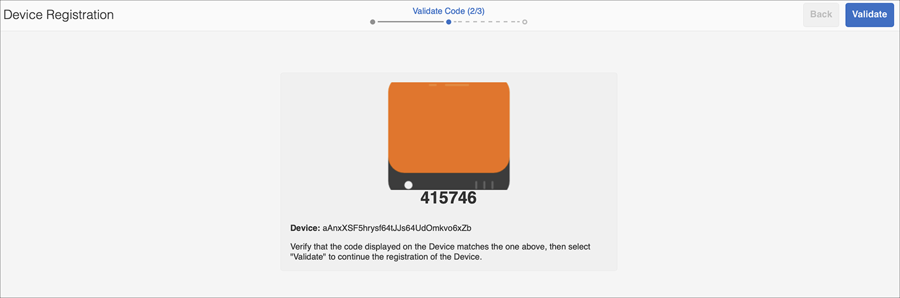

# Kickstart Guide {#kickstart-guide}

Deze sectie is een kickstart naar AEM Screens en laat zien hoe u een AEM Screens-project kunt instellen en uitvoeren. Het begeleidt u door het instellen van een eenvoudige digitale handtekening en het toevoegen van inhoud, zoals elementen en/of video&#39;s, aan elk kanaal en het verder publiceren van de inhoud naar een AEM Screens-speler.

>[!NOTE]
>Voordat u aan de projectdetails gaat werken, moet u eerst het nieuwste Feature Pack hebben geïnstalleerd. U kunt het nieuwste functiepakket voor AEM Screens 6.5.5 Release downloaden van de [Software Distribution Portal](https://experience.adobe.com/#/downloads/content/software-distribution/en/aem.html) met uw Adobe ID.

## Vereisten {#prerequisites}

Voer de onderstaande stappen uit om een voorbeeldproject voor AEM Screens te maken en inhoud verder te publiceren naar de Schermspeler.

>[!NOTE]
>In de volgende zelfstudie wordt het afspelen van de inhoud van uw kanaal in Chrome OS Player geïllustreerd.

>[!IMPORTANT]
>**OSGi-configuratie-instellingen**
>U moet de lege referentie inschakelen zodat het apparaat gegevens op de server kan plaatsen. Als de lege referentie-eigenschap bijvoorbeeld is uitgeschakeld, kan het apparaat geen schermafbeelding terugplaatsen. Momenteel zijn enkele van deze functies alleen beschikbaar als het filter Lege waarden toestaan van Apache-verwijzing is ingeschakeld in de OSGi-configuratie. Op het dashboard kan een waarschuwing worden weergegeven dat bepaalde functies mogelijk niet kunnen worden gebruikt door beveiligingsinstellingen.
>Voer de onderstaande stappen uit om het filter ***Apache-schuifverwijzing leeg*** toestaan in te schakelen:

## Lege verwijzingsverzoeken toestaan {#allow-empty-referrer-requests}

1. Ga naar **Adobe Experience Manager Web Console Configuration** via AEM instance —> hammer icon —> **Operations** —> **Web Console**.

   

1. **Configuratie** van Adobe Experience Manager-webconsole wordt geopend. Zoeken naar de referentie van de sling.

   Voor het zoeken van het het rangschikken verwijzend bezit, druk **Command+F** voor **MAC** en **Control+F** voor **Vensters**.

1. Schakel de optie Lege **** waarden toestaan in, zoals in de onderstaande afbeelding.

   

1. Klik op **Opslaan** om het filter Leeg toestaan voor Apache-schuifverwijzing in te schakelen.

## Een Digital Signage-ervaring maken in 5 minuten {#creating-a-digital-signage-experience-in-minutes}

### Creating an AEM Screens Project {#creating-project}

De eerste stap is het maken van een nieuw AEM Screens-project.

1. Navigeer naar uw Adobe Experience Manager-exemplaar (AEM) en klik op **Schermen**. U kunt ook rechtstreeks navigeren vanuit `https://localhost:4502/screens.html/content/screens](https://localhost:4502/screens.html/content/screens`.

1. Klik op Schermproject **** maken om een nieuw rasterproject te maken. Voer de titel in als **DemoScreens** en klik op **Opslaan**.

   

   >[!NOTE]
   >Zodra u het project creeert, brengt het u terug naar de homepage van het Project van de Schermen. U kunt nu uw project selecteren. In een project zijn er vijf verschillende mappen met de naam **Toepassingen**, **Kanalen**, **Apparaten**, **Locaties** en **Planningen**.

### Een kanaal maken {#creating-channel}

Zodra u uw project op zijn plaats hebt, moet u een nieuw kanaal tot stand brengen waar u de inhoud beheert.

Ga als volgt te werk om een nieuw kanaal voor uw project te maken:

1. Zodra u een project creeert, selecteer het **project DemoScreens** en selecteer de omslag **van** Kanalen, zoals aangetoond in het hieronder cijfer. Klik op **+ Maken** op de actiebalk.

   

1. Kies het kanaal **van de** Reeks van de tovenaar en klik **daarna**.
   

1. Voer de **titel** in als *TestChannel* en klik op **Maken**.

   

   Het *bestand TestChannel* wordt gemaakt en aan de map met kanalen toegevoegd, zoals in de onderstaande afbeelding wordt getoond.

   

### Inhoud toevoegen aan een kanaal {#adding-content}

Wanneer u uw kanaal hebt ingesteld, moet u inhoud aan uw kanaal toevoegen die de Schermspeler zal tonen.

Voer de onderstaande stappen uit om inhoud aan het kanaal (*TestChannel*) in uw project toe te voegen:

1. Navigeer naar het **DemoProject** dat u hebt gemaakt en selecteer de map **Kanalen** .

1. Klik op **Bewerken** op de actiebalk (zie de onderstaande afbeelding). De redacteur voor **TestChannel** opent.

   

1. Klik op het pictogram dat het zijpaneel links van de actiebalk in- en uitschakelt om de elementen en componenten te openen.

1. Sleep de componenten die u aan het kanaal wilt toevoegen en zet deze neer.

   

### Een locatie maken {#creating-location}

Als u het kanaal eenmaal hebt ingesteld, moet u een locatie maken.

>[!NOTE]
>***De plaatsen*** compartimenteren uw diverse digitale signaalervaringen en bevatten de configuraties van de vertoningen volgens waar de diverse schermen zijn.

Ga als volgt te werk om een nieuwe locatie voor uw project te maken:

1. Navigeer naar het **demoProject** dat u hebt gemaakt en selecteer de map **Locations** .

1. Klik op **+ Maken** op de actiebalk.

1. Selecteer **Locatie** in de wizard en klik op **Volgende**.

1. Voer de **naam** voor uw locatie in (voer de titel in als *TestLocation*) en klik op **Maken**.

De **testlocatie** wordt gemaakt en toegevoegd aan de map **Locations** .

### Weergave voor locatie maken {#creating-display}

Nadat u een locatie hebt gemaakt, moet u een nieuwe weergave voor uw locatie maken.

>[!NOTE]
>***De vertoningen*** vertegenwoordigen de digitale ervaring die op één of veelvoudige schermen loopt.

1. Navigeer naar **TestLocation** en selecteer het.

1. Klik op **Maken** op de actiebalk.

   

1. Selecteer **Weergave** in de wizard **Maken** en klik op **Volgende**.

   

1. Voer de **titel** in als **LobbyDisplay** en klik op **Maken**.

   

   Een nieuwe vertoning genoemd als **TestDisplay** wordt nu toegevoegd aan uw plaats **TestLocation**, zoals aangetoond in hieronder figuur.

   

### Een kanaal toewijzen {#assigning-channel}

Zodra de projectopstelling volledig is, moet u het kanaal aan een vertoning toewijzen om de inhoud te bekijken.

1. Navigeer naar de vereiste weergave vanuit **DemoScreens** —> **Locations** —> **TestLocation** —> **LobbyDisplay**.

1. Tik/klik op Kanaal **** toewijzen op de actiebalk.

   

   Of

   Tik/klik op **Dashboard** op de actiebalk en klik op **+Kanaal** toewijzen in het deelvenster **TOEGEWEZEN KANALEN EN SCHADUWEN** .

   

1. Het dialoogvenster **Kanaaltoewijzing** wordt geopend.

1. Kies in de optie **Instellingen** het kanaal **per pad** en de **ondersteunde gebeurtenissen** als **Eerste Laden** en **Niet actief scherm**.

   >[!NOTE]
   >
   >De **Methoden** van de Rol **van het Kanaal,** Prioriteit **, en van de** Onderbreking zijn allen bevolkt door gebrek. Zie de sectie [Kanaaleigenschappen](/help/user-guide/channel-assignment-latest-fp.md#channel-properties) voor meer informatie over de eigenschappen van kanaaltoewijzingen.

   

   Daarnaast kunt u ook het **activeringsvenster** en het **herhalingsschema** selecteren.

   >[!NOTE]
   >Het *Programma* van de Herhaling staat u toe om een terugkerend programma voor uw kanaal te plaatsen. U stelt meerdere herhalingsschema&#39;s voor een kanaal in.
   >Zie [Herhalingsschema](/help/user-guide/channel-assignment-latest-fp.md#recurrence-schedule) voor meer informatie.

1. Klik op **Opslaan** als u de voorkeuren hebt geconfigureerd.

### Een apparaat registreren en Apparaat aan een Vertoning toewijzen {#registering-device}

U moet het apparaat registreren via het AEM dashboard.

>[!IMPORTANT]
>De ChromeOS-speler kan als Chrome Browser-insteekmodule worden geïnstalleerd in de modus voor ontwikkelaars zonder dat hiervoor een daadwerkelijk chrome speler-apparaat nodig is. Volg onderstaande stappen voor installatie:
>
>1. Klik [hier](https://download.macromedia.com/screens/) om de nieuwste Chrome Player te downloaden.
>1. Pak het uit en sla het op de schijf op.
>1. Open Chrome-browser en selecteer **Extensies** in het menu of navigeer rechtstreeks naar ***chrome://extensions***.
>1. Schakel de modus **Ontwikkelaar** in de rechterbovenhoek in.
>1. Klik op **Niet-verpakt** laden in de linkerbovenhoek en laad niet-gecomprimeerde Chrome Player.
>1. Controleer de **AEM Screens Chrome Player** -insteekmodule als deze beschikbaar is in de lijst met extensies.
>1. Open een nieuw tabblad en klik op het pictogram **Apps** linksboven of navigeer rechtstreeks naar ***chrome://apps***.
>1. Klik op **AEM Screens** -insteekmodule om Chrome Player te starten. Standaard wordt de speler gestart in de modus Volledig scherm. Druk op **esc** om de modus Volledig scherm af te sluiten.

Wanneer uw ChromeOS-speler is ingeschakeld, voert u de onderstaande stappen uit om een Chrome-apparaat te registreren.

1. Navigeer vanuit uw AEM naar de map **Devices** (Apparaten) van uw project.

1. Tik/klik op **Apparaatbeheer** op de actiebalk.

   

1. Tik/klik op de **apparaatregistratie** rechtsboven.

1. Selecteer het gewenste apparaat en tik op het apparaat of klik op **Apparaat** registreren.

   

1. Wacht tot het apparaat de registratiecode verzendt en tegelijkertijd de **Registratiecode** van uw apparaat van Chrome controleert.
   

1. Als de **registratiecode** op beide computers hetzelfde is, tikt u op **Valideren** of klikt u op AEM.

1. Stel de gewenste naam in als **ChromeDeviceforDemo** voor het apparaat en klik op **Registreren**.

   

1. Klik op Weergave **** toewijzen in het dialoogvenster **Apparaatregistratie gelukt** .

   

1. Selecteer het pad naar uw weergave als **DemoScreens** —> **Locations** —> **TestLocation** —> **LobbyDisplay** en klik op **Toewijzen**.

   

1. Nadat het apparaat is toegewezen, wordt de volgende bevestiging weergegeven.

   

1. Tik/klik op **Voltooien** om het registratieproces te voltooien.

1. U moet het geregistreerde apparaat kunnen bekijken vanaf het weergavedashboard.

   

### De inhoud weergeven in Chrome Player {#viewing-content-output}

Alle elementen in uw kanaal worden nu afgespeeld op uw Chrome-apparaat.

Gefeliciteerd, u speelt nu inhoud in een AEM Screens-kanaal af.

