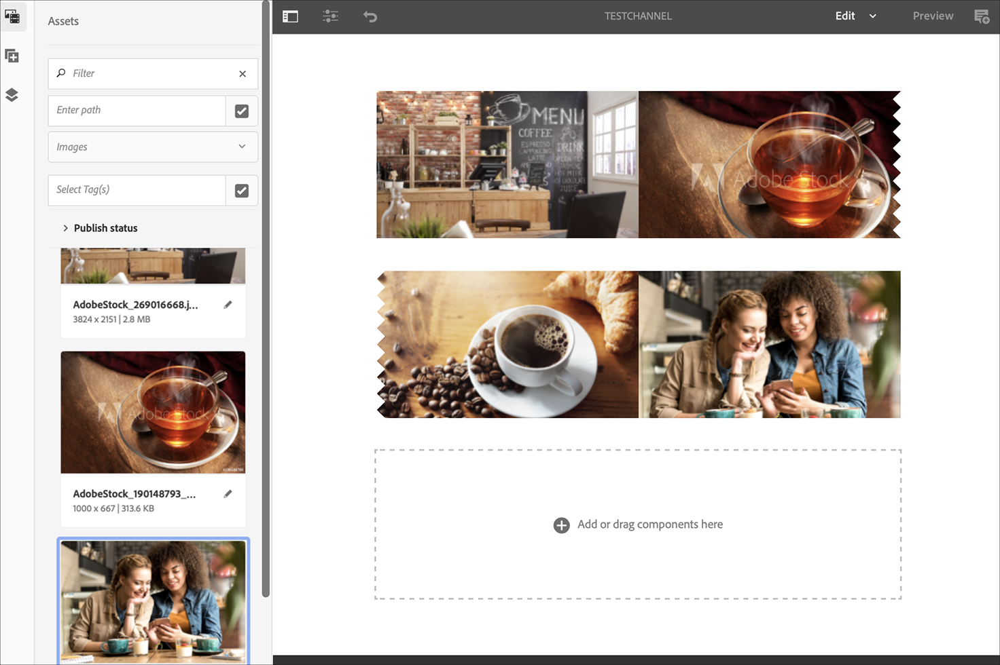
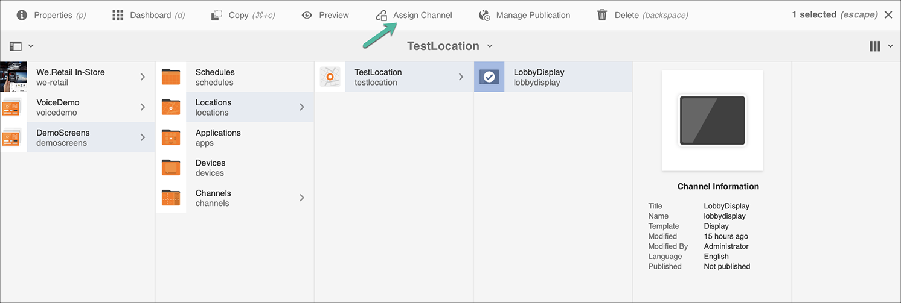

# Kickstart Guide {#kickstart-guide}

De kickstart naar AEM Screens laat zien hoe u een AEM Screens-project kunt opzetten en uitvoeren. Het begeleidt u door het instellen van een eenvoudige digitale handtekening en het toevoegen van inhoud, zoals elementen en/of video&#39;s, aan elk kanaal en het verder publiceren van de inhoud naar een AEM Screens-speler.

>[!NOTE]
>Voordat u aan de projectdetails gaat werken, moet u eerst het nieuwste Feature Pack voor AEM Screens hebben geïnstalleerd. U kunt het nieuwste functiepakket downloaden van de [Software Distribution Portal](https://experience.adobe.com/#/downloads/content/software-distribution/en/aem.html) met uw Adobe ID.

## Vereisten {#prerequisites}

Voer de onderstaande stappen uit om een voorbeeldproject voor AEM Screens te maken en inhoud verder te publiceren naar de Schermspeler.

>[!NOTE]
>In de volgende zelfstudie wordt het afspelen van de inhoud van uw kanaal in Chrome OS Player geïllustreerd.

>[!IMPORTANT]
>**OSGi-configuratie-instellingen**
>U moet de lege referentie inschakelen zodat het apparaat gegevens op de server kan plaatsen. Als de lege referentie-eigenschap bijvoorbeeld is uitgeschakeld, kan het apparaat geen schermafbeelding terugplaatsen. Momenteel zijn enkele van deze functies alleen beschikbaar als het filter Lege waarden toestaan van Apache-verwijzing is ingeschakeld in de OSGi-configuratie. Op het dashboard kan een waarschuwing worden weergegeven dat bepaalde functies mogelijk niet kunnen worden gebruikt door beveiligingsinstellingen.
>Voer de onderstaande stappen uit om de ***Lege filter Apache-schuifverwijzing toestaan***:

## Lege verwijzingsverzoeken toestaan {#allow-empty-referrer-requests}

1. Navigeren naar **Configuratie Adobe Experience Manager-webconsole** via AEM instantie > hamerpictogram > **Bewerkingen** > **Webconsole**.

   

1. **Configuratie Adobe Experience Manager-webconsole** wordt geopend. Zoeken naar de referentie van de sling.

   Druk op **Command+F** for **Mac** en **Ctrl+F** for **Windows**.

1. Controleer de **Lege waarden toestaan** zoals weergegeven in de onderstaande afbeelding.

   

1. Klikken **Opslaan** om het filter Apache Sling Referrer inschakelen Leeg toestaan.

## Een Digital Signage-ervaring maken in 5 minuten {#creating-a-digital-signage-experience-in-minutes}

### Een AEM Screens-project maken {#creating-project}

De eerste stap is het maken van een AEM Screens-project.

1. Ga naar uw Adobe Experience Manager-exemplaar (AEM) en klik op **Schermen**. U kunt ook rechtstreeks navigeren vanuit `https://localhost:4502/screens.html/content/screens](https://localhost:4502/screens.html/content/screens`.

1. Klikken **Schermproject maken** zodat kunt u een project van Schermen tot stand brengen.
1. Voer de titel in als **DemoScreens** en klik vervolgens op **Opslaan**.

   

   >[!NOTE]
   >Nadat u het project creeert, brengt het u terug naar de homepage van het Project van AEM Screens. U kunt nu uw project selecteren. In een project zijn er vijf verschillende mappen met de naam **Toepassingen**, **Kanalen**, **Apparaten**, **Locaties**, en **Planningen**.

### Een kanaal maken {#creating-channel}

Nadat u uw AEM Screens-project hebt gemaakt, maakt u een kanaal waarin u de inhoud beheert.

Ga als volgt te werk om een kanaal voor uw project te maken:

1. Nadat u een project creeert, selecteer **DemoScreens** en selecteert u de **Kanalen** map, zoals weergegeven in de onderstaande afbeelding. Klikken **+ Maken** in de actiebalk.

   

1. Kies de optie **Volgekanaal** van de wizard en klik op **Volgende**.
   

1. Voer de **Titel** als **TestChannel** en klik op **Maken**.

   

   De **TestChannel** wordt nu toegevoegd aan uw kanaalomslag, zoals aangetoond in hieronder figuur.

   

### Inhoud toevoegen aan een kanaal {#adding-content}

Wanneer u uw kanaal op zijn plaats hebt, voeg inhoud aan uw kanaal toe die de speler van AEM Screens kan tonen.

Voer de onderstaande stappen uit om inhoud aan het kanaal toe te voegen (**TestChannel**) in uw project:

1. Ga naar de **DemoProject** u creeerde en selecteert **TestChannel** van de **Kanalen** map.

1. Klikken **Bewerken** op de actiebalk (zie de onderstaande afbeelding). De redacteur voor **TestChannel** wordt geopend.

   

1. Klik op het pictogram dat het zijpaneel aan de linkerkant van de actiebalk in- en uitschakelt om de elementen en componenten te openen.

1. Sleep de componenten die u aan het kanaal wilt toevoegen en zet deze neer.

   

### Een locatie maken {#creating-location}

Wanneer u uw kanaal op zijn plaats hebt, creeer een plaats.

>[!NOTE]
>***Locaties*** kunt u de verschillende digitale signage-ervaringen onderverdelen en kunt u de configuraties van de displays instellen op basis van de locatie van de verschillende schermen.

Voer de onderstaande stappen uit om een locatie voor uw project te maken:

1. Ga naar de **DemoProject** u creeerde en selecteert **Locaties** map.
1. Klikken **+ Maken** in de actiebalk.
1. Selecteren **Locatie** van de wizard en klik op **Volgende**.
1. Voer de **Naam** voor uw locatie (voer de titel in als **TestLocation**) en klik op **Maken**.

De **TestLocation** wordt gemaakt en toegevoegd aan uw **Locaties** map.

### Weergave voor locatie maken {#creating-display}

Wanneer u een locatie hebt gemaakt, maakt u een weergave voor uw locatie.

>[!NOTE]
>***Weergave*** vertegenwoordigt de digitale ervaring die op één of veelvoudige schermen loopt.

1. Ga naar de **TestLocation** en selecteert u deze.
1. Klikken **Maken** in de actiebalk.

   

1. Selecteren **Weergave** van de **Maken** wizard en klik op **Volgende**.

   

1. Voer de **Titel** als **LobbyDisplay** en klik op **Maken**.

   

   Een nieuwe weergave met de naam **TestDisplay** wordt nu toegevoegd aan uw locatie **TestLocation**, zoals weergegeven in onderstaande afbeelding.

   

### Een kanaal toewijzen {#assigning-channel}

Wanneer de projectopstelling volledig is, wijs het kanaal aan een vertoning toe om de inhoud te bekijken.

1. Ga vanuit **DemoScreens** > **Locaties** > **TestLocation** > **LobbyDisplay**.

1. Tikken/klikken **Kanaal toewijzen** in de actiebalk.

   

   Of,

   Tikken/klikken **Dashboard** op de actiebalk en klik op **+Kanaal toewijzen** van de **TOEGEWEZEN KANALEN EN SCHEMA&#39;S** deelvenster.

   

1. De **Kanaaltoewijzing** wordt geopend.

1. Van de **Instellingen** kiest u het kanaal **op pad**  en **Ondersteunde gebeurtenissen** als **Oorspronkelijke belasting** en **Niet-actief scherm**.

   >[!NOTE]
   >
   >De **Kanaalrol**, **Prioriteit**, en **Methoden voor onderbreking** worden standaard allemaal gevuld. Zie [Kanaaleigenschappen](/help/user-guide/channel-assignment-latest-fp.md#channel-properties) voor meer informatie over de eigenschappen van de kanaaltoewijzing.

   

   U kunt ook de opdracht **Activeringsvenster** en **Herhalingsschema**.

   >[!NOTE]
   >De *Herhalingsschema* Hiermee kunt u een terugkerend schema voor uw kanaal instellen. U stelt meerdere herhalingsschema&#39;s voor een kanaal in.
   >Zie [Herhalingsschema](/help/user-guide/channel-assignment-latest-fp.md#recurrence-schedule) voor meer informatie .

1. Klikken **Opslaan** zodra u uw voorkeuren hebt geconfigureerd.

### Een apparaat registreren en Apparaat aan een Vertoning toewijzen {#registering-device}

Registreer het apparaat met het AEM dashboard.

>[!IMPORTANT]
>De Chrome OS-speler kan worden geïnstalleerd als Chrome Browser-insteekmodule in de ontwikkelaarsmodus zonder dat hiervoor een echt chrome speler-apparaat nodig is. Volg onderstaande stappen voor installatie:
>
>1. Klikken [hier](https://download.macromedia.com/screens/) om de nieuwste Chrome Player te downloaden.
>1. Pak het uit en sla het op de schijf op.
>1. Chrome openen en **Extensies** in het menu of rechtstreeks door ***chrome://extensions***.
>1. Schakel de **Modus Ontwikkelaar** in de rechterbovenhoek.
>1. Klikken **Niet-verpakt laden** in de linkerbovenhoek en geladen niet-gecomprimeerde Chrome Player.
>1. Controleren **AEM Screens Chrome Player** insteekmodule als deze beschikbaar is in de lijst met extensies.
>1. Open een nieuw tabblad en klik op de knop **Apps** in de linkerbovenhoek, of rechtstreeks naar ***chrome://apps***.
>1. Klikken **AEM Screens** Insteekmodule voor het starten van Chrome Player. Standaard wordt de speler gestart in de modus Volledig scherm. Druk **Esc** om de modus Volledig scherm af te sluiten.

Nadat uw Chrome OS-speler is ingeschakeld, voert u de onderstaande stappen uit om een Chrome-apparaat te registreren.

1. Ga naar de **Apparaten** van uw project van uw AEM instantie.

1. Tik/klik op de knop **Apparaatbeheer** in de actiebalk.

   

1. Tik/klik op de knop **Apparaatregistratie** van rechtsboven.

1. Selecteer het vereiste apparaat en tik/klik **Apparaat registreren**.

   

1. Wacht tot het apparaat de registratiecode heeft verzonden en controleer tegelijkertijd de **Registratiecode** van uw Chrome-apparaat.
   

1. Als de **Registratiecode** is hetzelfde op beide computers, tikken/klikken **Valideren** in AEM.

1. Stel de gewenste naam in als **ChromeDeviceforDemo** voor het apparaat en klik op **Registreren**.

   

1. Klikken **Weergave toewijzen** van de **Apparaatregistratie voltooid** in.

   

1. Selecteer het pad naar uw weergave als **DemoScreens** > **Locaties** > **TestLocation** > **LobbyDisplay** en klik op **Toewijzen**.

   

1. Wanneer het apparaat met succes is toegewezen, ziet u de volgende bevestiging.

   

1. Selecteren **Voltooien** om het registratieproces te voltooien. U kunt uw geregistreerde apparaat nu bekijken vanaf het weergavedashboard.

   

### De inhoud weergeven in Chrome Player {#viewing-content-output}

Alle elementen in uw kanaal worden nu afgespeeld op uw Chrome OS-speler.

Gefeliciteerd, u speelt nu inhoud in een AEM Screens-kanaal af.

