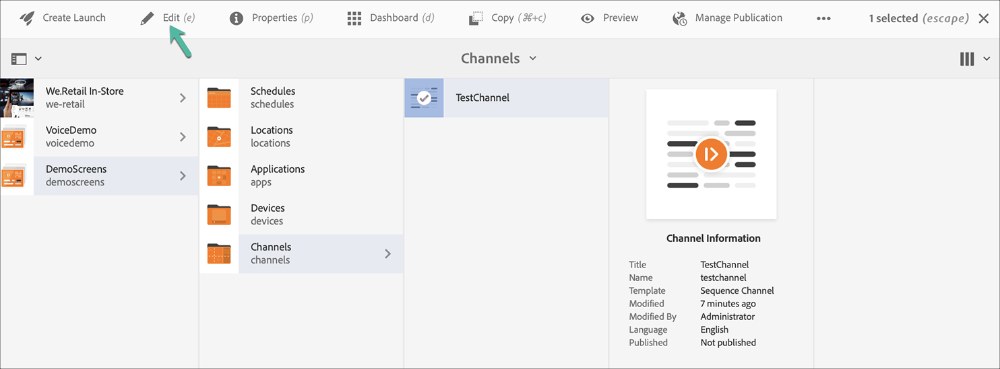

# Kickstart Guide {#kickstart-guide}

De kickstart naar AEM Screens laat zien hoe u een AEM Screens-project kunt opzetten en uitvoeren. Het begeleidt u door het instellen van een eenvoudige digitale handtekening en het toevoegen van inhoud, zoals elementen en/of video&#39;s, aan elk kanaal en het verder publiceren van de inhoud naar een AEM Screens Player.

>[!NOTE]
>Voordat u aan de projectdetails gaat werken, moet u eerst het nieuwste Feature Pack voor AEM Screens hebben geïnstalleerd. U kunt het recentste Pak van de Eigenschap van het [ Portaal van de Distributie van de Software downloaden ](https://experience.adobe.com/#/downloads/content/software-distribution/en/aem.html) gebruikend uw Adobe ID.

## Vereisten {#prerequisites}

Voer de onderstaande stappen uit om een voorbeeldproject voor AEM Screens te maken en inhoud verder te publiceren naar de Screens-speler.

>[!NOTE]
>In de volgende zelfstudie wordt uitgelegd hoe u de inhoud van uw kanaal kunt afspelen in een Chrome OS-speler.

>[!IMPORTANT]
>**OSGi de Montages van de Configuratie**
>U moet de lege referentie inschakelen zodat het apparaat gegevens op de server kan plaatsen. Als de lege referentie-eigenschap bijvoorbeeld is uitgeschakeld, kan het apparaat geen schermafbeelding terugplaatsen. Momenteel zijn enkele van deze functies alleen beschikbaar als het filter Lege waarden toestaan van Apache-verwijzing is ingeschakeld in de OSGi-configuratie. Op het dashboard kan een waarschuwing worden weergegeven dat bepaalde functies mogelijk niet kunnen worden gebruikt door beveiligingsinstellingen.
>Volg de stappen hieronder om de ***filter van de Verwijzer van Apache toe te laten toestaat Lege***:

## Lege verwijzingsverzoeken toestaan {#allow-empty-referrer-requests}

1. Navigeer aan **Configuratie van de Console van het Web van Adobe Experience Manager** als AEM instantie > hamerpictogram > **Verrichtingen** > **Console van het Web**.

   

1. **de Configuratie van de Console van het Web van Adobe Experience Manager** opent. Zoeken naar de referentie van de sling.

   Voor het zoeken van het het rangschikken verwijzersbezit, druk **Command+F** voor **Mac** en **Control+F** voor **Vensters**.

1. Controleer **Lege** optie, zoals aangetoond in het hieronder cijfer toestaat.

   

1. Klik **sparen** om de Filter van de Verwijzer van de Rand toe te laten Apache leeg toestaat.

## Een Digital Signage-ervaring maken in 5 minuten {#creating-a-digital-signage-experience-in-minutes}

### Een AEM Screens-project maken {#creating-project}

De eerste stap is het maken van een AEM Screens-project.

1. Navigeer aan uw (AEM) instantie van Adobe Experience Manager en klik **Screens**. U kunt ook rechtstreeks navigeren vanuit `https://localhost:4502/screens.html/content/screens](https://localhost:4502/screens.html/content/screens` .

1. Klik **creëren het Project van Screens** zodat kunt u een project van Screens tot stand brengen.
1. Ga de titel als **DemoScreens** in, dan klik **sparen**.

   

   >[!NOTE]
   >Nadat u het project creeert, brengt het u terug naar de homepage van het Project van AEM Screens. U kunt nu op uw project klikken. In een project, zijn er vijf verschillende omslagen die **Toepassingen** worden genoemd, **Kanalen**, **Apparaten**, **Plaatsen**, en **Programma&#39;s**.

### Een kanaal maken {#creating-channel}

Nadat u uw AEM Screens-project hebt gemaakt, maakt u een kanaal waarin u de inhoud beheert.

Ga als volgt te werk om een kanaal voor uw project te maken:

1. Nadat u een project creeert, klik het **project 0} DemoScreens {en klik de** omslag van Kanalen **, zoals aangetoond in het hieronder cijfer.** Klik op **+ Maken** op de actiebalk.

   

1. Kies het **Kanaal van de Opeenvolging** van de tovenaar en klik **daarna**.
   

1. Ga de **Titel** als **TestChannel** in en klik **creeer**.

   

   **TestChannel** wordt nu toegevoegd aan uw kanaalomslag, zoals aangetoond in het hieronder cijfer.

   

### Inhoud toevoegen aan een kanaal {#adding-content}

Wanneer u uw kanaal op zijn plaats hebt, voeg inhoud aan uw kanaal toe die de Speler van AEM Screens kan tonen.

Volg de stappen hieronder om inhoud aan het kanaal (**TestChannel**) in uw project toe te voegen:

1. Navigeer aan **DemoProject** u creeerde en klik **TestChannel** van de **omslag van Kanalen**.

1. Klik **uitgeven** van de actiebar (zie hieronder het cijfer). De redacteur voor **TestChannel** opent.

   

1. Klik op het pictogram dat het zijpaneel aan de linkerkant van de actiebalk in- en uitschakelt om de elementen en componenten te openen.

1. Sleep de componenten die u aan het kanaal wilt toevoegen en zet deze neer.

   

### Een locatie maken {#creating-location}

Wanneer u uw kanaal op zijn plaats hebt, creeer een plaats.

>[!NOTE]
>***compartimenteer de plaatsen van 0} {uw diverse digitale signaalervaringen en bevat de configuraties van de vertoningen volgens waar de diverse schermen zijn.***

Voer de onderstaande stappen uit om een locatie voor uw project te maken:

1. Navigeer aan **DemoProject** u creeerde en klik de **omslag van Plaatsen**.
1. Klik op **+ Maken** op de actiebalk.
1. Klik **Plaats** van de tovenaar en klik **daarna**.
1. Ga de **Naam** voor uw plaats in (ga de titel als **TestLocation** in) en klik **creeer**.

**TestLocation** wordt gecreeerd en aan uw **omslag van Plaatsen** toegevoegd.

### Weergave voor locatie maken {#creating-display}

Wanneer u een locatie hebt gemaakt, maakt u een weergave voor uw locatie.

>[!NOTE]
>***Vertoning*** vertegenwoordigt de digitale ervaring die op één of veelvoudige schermen loopt.

1. Navigeer aan **TestLocation** en klik het.
1. Klik **creëren** van de actiebar.

   

1. Klik **Vertoning** van **creëren** tovenaar en klik **daarna**.

   

1. Ga de **Titel** als **LobbyDisplay** in en klik **creeer**.

   

   Een nieuwe vertoning die als **wordt genoemd TestDisplay** wordt nu toegevoegd aan uw plaats **TestLocation**, zoals aangetoond in het hieronder cijfer.

   

### Een kanaal toewijzen {#assigning-channel}

Wanneer de projectopstelling volledig is, wijs het kanaal aan een vertoning toe om de inhoud te bekijken.

1. Navigeer aan de vereiste vertoning van **DemoScreens** > **Plaatsen** > **TestLocation** > **LobbyDisplay**.

1. Klik **toewijzen Kanaal** van de actiebar.

   

   Of,

   Klik **Dashboard** van de actiebar en klik **+ wijs Kanaal** van **TOEGEWEZEN KANALEN &amp; SCHEDULES** paneel toe.

   

1. Het **de dialoogvakje van de Toewijzing van het Kanaal** opent.

1. Van de **optie van Montages**, kies het kanaal **door weg** en **Ondersteunde Gebeurtenissen** zoals **Eerste Lading** en **Onactief het Scherm**.

   >[!NOTE]
   >
   >De **Rol van het Kanaal**, **Prioriteit**, en **Methoden van de Onderbreking** zijn allen bevolkt door gebrek. Zie de ](/help/user-guide/channel-assignment-latest-fp.md#channel-properties) sectie van de Eigenschappen van het Kanaal 0} {voor meer informatie over de eigenschappen van de kanaaltaak.[

   

   Ook, kunt u het **Venster van de Activering** en **Programma van de Herhaling** klikken.

   >[!NOTE]
   >Het *Programma van de Herhaling* laat u een terugkomende programma voor uw kanaal plaatsen. U kunt meerdere herhalingsschema&#39;s instellen voor een kanaal.
   >Zie [ Programma van de Herhaling ](/help/user-guide/channel-assignment-latest-fp.md#recurrence-schedule) voor meer details.

1. Klik **sparen** zodra u uw voorkeur hebt gevormd.

### Een apparaat registreren en Apparaat aan een Vertoning toewijzen {#registering-device}

Registreer het apparaat met het AEM dashboard.

>[!IMPORTANT]
>Chrome OS Player kan als Chrome browser stop in ontwikkelaarwijze worden geïnstalleerd zonder daadwerkelijke Chrome Player apparaat te vereisen. Volg onderstaande stappen voor installatie:
>
>1. Klik [ hier ](https://download.macromedia.com/screens/) om de recentste Speler van Chrome te downloaden.
>1. Pak het uit en sla het op de schijf op.
>1. Open browser van Chrome en klik **Uitbreidingen** van het menu of navigeer direct aan ***chrome://extensions***.
>1. Schakelaar op de **wijze van de Ontwikkelaar** van de top-juiste hoek.
>1. Klik **Lading Onverpakte** van de hoogste-linkerhoek en lading unzipped Speler van Chrome.
>1. Controle **AEM Screens Chrome Player** stop in als het in de lijst van uitbreidingen beschikbaar is.
>1. Open een nieuw lusje en klik **Apps** pictogram van de top-linkerhoek, of navigeer direct aan ***chrome://apps***.
>1. Klik **Insteekmodule van AEM Screens** zodat kunt u de Speler van Chrome lanceren. Standaard wordt de speler gestart in de modus Volledig scherm. Pers **Esc** om volledige het schermwijze weg te gaan.

Nadat uw Chrome OS-speler is ingeschakeld, voert u de onderstaande stappen uit om een Chrome-apparaat te registreren.

1. Navigeer aan de **omslag van Apparaten** van uw project van uw AEM instantie.

1. Klik de **Manager van het Apparaat** van de actiebar.

   

1. Klik de **Registratie van het Apparaat** van het hoogste recht.

1. Klik het vereiste apparaat en klik **Apparaat van het Register**.

   

1. Wacht op het apparaat om zijn registratiecode te verzenden en tegelijkertijd de **Code van de Registratie** van uw apparaat van Chrome te controleren.
   

1. Als de **Code van de Registratie** het zelfde op beide machines is, klik **bevestigen** in AEM.

1. Plaats de gewenste naam als **ChromeDeviceforDemo** voor het apparaat, en klik **Register**.

   

1. Klik **toewijzen Vertoning** van de **Succesvolle Registratie van het Apparaat** dialoogdoos.

   

1. Klik de weg aan uw vertoning als **DemoScreens** > **Plaatsen** > **TestLocation** > **LobbyDisplay** en klik **toewijzen**.

   

1. Wanneer het apparaat met succes is toegewezen, ziet u de volgende bevestiging.

   

1. Klik **Afwerking** om het registratieproces te voltooien. U kunt uw geregistreerde apparaat nu bekijken vanaf het weergavedashboard.

   

### De inhoud weergeven in Chrome Player {#viewing-content-output}

Alle elementen in uw kanaal worden nu afgespeeld op uw Chrome OS-speler.

Gefeliciteerd, u speelt nu inhoud in een AEM Screens-kanaal af.

