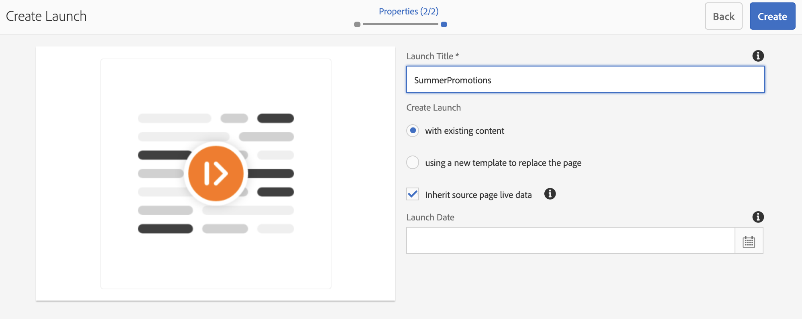

# Lanceringen {#launches}

Inhoudsauteurs kunnen een toekomstige versie van de kanalen maken. Deze versie wordt **Launch** genoemd en bij het instellen van de live datum voor deze lancering kan inhoud live worden weergegeven op apparaten of spelers.

Met behulp van lanceringen, kunnen de auteurs elk kanaal in de lancering voorproef en een verzoek tot overzicht in werking stellen. De groep van fiatteurs zal bericht krijgen en kan het verzoek goedkeuren of verwerpen. Wanneer de actieve datum is bereikt, wordt de inhoud op de apparaten afgespeeld.

Als de auteur bijvoorbeeld toekomstige versies van c1, c2 (kanalen) wil maken, wordt een introductie gemaakt en wordt een live datum ingesteld (bijvoorbeeld 10e 8:00 AM nov). Eventuele verdere updates in de inhoud worden ter controle verzonden. Na goedkeuring en op live datum (10 november, 8:00 uur) speelt deze lancering de inhoud op de apparaten of spelers af.

## Vereisten {#requirements}

Voordat u de implementatie van Launches start in een AEM Screens-project, moet u het concept Respijtperiode en de relevantie ervan begrijpen.

De volgende sectie verklaart de Periode van de Aflossing en verder hoe te om het uit-van-de-doos te vormen. U kunt een configuratie van de steekproeftest ook downloaden om zijn gebruik te begrijpen.

### Respijtperiode begrijpen {#understanding-grace-period}

De volgende opstelling staat admin toe om de Periode ***van de*** Restitutie te vormen, die in Lanceringen wordt vereist.

**Respijtperiode**, inclusief:

* bevordering van de lancering
* publiceren van de bronnen die moeten worden gepubliceerd
* tijd die de apparaten nodig hebben om de inhoud van de publicatieinstantie te downloaden en eventuele tijdverschillen tussen de server en de speler

Bijvoorbeeld, is de server in PST en de apparaten in EST zijn, is het maximumtijdverschil 3 uren in dit geval en veronderstelt dat de bevordering 1 min zal vergen en het publiceren van auteur 10 min neemt en de speler kan de middelen typisch in 10-15 min downloaden. De respijtperiode = tijdsverschil (3 uur) + tijd om de start te bevorderen (1 min) + tijd om de start te publiceren (10 min) + tijd om te downloaden bij speler (10-15 min) + buffer (om veilig te zijn, bijvoorbeeld 30 min) = 3 uur 56 min = 14160 seconden. Dus als we elke introductie live plannen, zal de promotie vroeg beginnen bij deze offset. In de bovenstaande vergelijking, nemen de meeste punten niet veel tijd, kunnen wij een behoorlijk gok voor deze compensatie gebruiken zodra wij het maximum tijdverschil b/w de server en om het even welke speler kennen.

### Respijtperiode buiten de box configureren {#configuring-out-of-the-box-grace-period}

De respijtperiode voor een introductie is ingesteld op 24 uur. Dit betekent dat wanneer we een live-datum vaststellen voor elke introductie van middelen onder */content/screens*, de promotie zal beginnen met deze verschuiving. Als de liveDate bijvoorbeeld is ingesteld op 24 november, 9:00 uur en de respijtperiode op 24 uur, begint de promotietaak op 23 november, 9:00 uur.

### Configuraties downloaden {#downloading-configurations}

Download de volgende testconfiguraties:

[Bestand ophalen](assets/launches_event_handlerconfig-10.zip)

>[!NOTE]
>
>De bovengenoemde configuratie heeft 600 seconden als Periode van de Restitutie in deze testconfiguratie.

#### De configuraties bijwerken {#updating-the-configurations}

Als u de bovenstaande configuratie wilt wijzigen, volgt u de onderstaande instructies:

* Maak de ***sling:OsgiConfig/ nt:bestand in /apps/system/config*** met naam **com.adobe.cq.wcm.launches.impl.LaunchesEventHandler.config** en inhoud

   *launches.eventhandler.updateListModification=B&quot;false&quot;launches.eventhandler.launch.promotion.graceperiod=[&quot;/content/screens(/.*):600&quot;]launches.eventhandler.threadpool.maxsize=I&quot;5&quot;launches.eventhandler.threadpool.priority=&quot;MIN&quot;*

* `launches.eventhandler.launch.promotion.graceperiod=["/content/screens(/.&#42;):600"`kunt u een respijtperiode van 600 seconden instellen in het pad */de inhoud/schermen*.

Dit betekent dat wanneer u een live-datum instelt voor het starten van bronnen onder */inhoud/schermen*, de promotie begint met deze verschuiving. Als de live datum bijvoorbeeld is ingesteld op 24 november, 9:00 uur en de respijtperiode op 600 seconden, begint de promotietaak op 24 november, 8:50 uur.

## Lanceringen gebruiken {#using-launches}

Volg de onderstaande sectie om Launches te implementeren in uw AEM Screens-project. In deze sectie worden de volgende onderwerpen behandeld:

1. **Starten maken**
1. **Een Starten bewerken om de actieve datum en het actieve bereik in te stellen**

### Starten maken {#creating-a-launch}

Voer de onderstaande stappen uit om toekomstige publicatiefunctionaliteit te implementeren voor uw AEM Screens-project:

1. Navigeer naar het kanaal in uw project van de Schermen AEM, bijvoorbeeld **LaunchesDemo** —> **Kanalen** —> **FutureLaunch**, zoals hieronder getoond.

   >[!CAUTION]
   >
   >U moet een lancering van een reeds bestaand kanaal in uw project van het Schermen van AEM tot stand brengen.

   

1. Selecteer het kanaal **FutureLaunch** en klik op **Create**. Selecteer **Starten** in het keuzemenu.

   

1. De wizard **Start** maken wordt geopend. Klik op **+ Pagina&#39;s** toevoegen om de AEM-rasterkanalen te selecteren waarvoor u de opstart wilt maken.

   

1. Navigeer naar het kanaal en klik op **Selecteren**.

   

1. Als u de pagina hebt geselecteerd, klikt u op **Volgende** om een stap verder te gaan in de wizard **Starten** maken.

   

1. Ga de Titel **van de** Lancering als **SummerPromotions** in en u te hoeven niet om de Datum **van de** Lancering te plaatsen, zoals aangetoond in het hieronder cijfer. Klik op **Maken**.

   >[!NOTE]
   >
   >*Als u de optie Live-gegevens* van bronpagina **overnemen inschakelt of controleert** , kunnen de kanalen tijdens het starten als live kopieën worden gemaakt. Als er wijzigingen worden aangebracht in het oorspronkelijke kanaal, worden deze wijzigingen automatisch toegepast op de startkanalen.
   >
   >
   >*Als u Live-gegevens* van bronpagina&#39;s **overnemen in- of uitschakelt** , kunnen de kanalen zonder live-relatie worden gekopieerd tijdens het starten. Als er dus wijzigingen worden aangebracht in het oorspronkelijke kanaal, worden deze wijzigingen niet toegepast op de startkanalen.

   

   >[!NOTE]
   >
   >U kunt de live startdatum in deze stap instellen of u kunt deze later instellen tijdens het bewerken van de eigenschappen van de start nadat deze al is gemaakt.

1. U ziet dat de opstart is gemaakt. U kunt op **Openen** klikken om de pagina&#39;s in de editor weer te geven of op **Gereed** klikken om terug te gaan naar uw project.

   

   Klik op **Gereed** om terug te navigeren naar uw **LaunchesDemo** -project.

   

### De eigenschappen voor het starten bewerken om de actieve datum en het actieve bereik in te stellen {#editing-the-launch-properties-to-set-the-live-date-and-scope}

Nadat u de opstart hebt gemaakt, moet u de opstarteigenschappen bewerken om de actieve datum en het bereik van de opstart in te stellen.

Voer de onderstaande stappen uit om de eigenschappen van de startpagina te bewerken:

1. Navigeer naar het kanaal (**FutureLaunch**) en selecteer het kanaal, zoals in de onderstaande afbeelding wordt getoond. Open de **References** rail vanaf de linkerkant.

   >[!NOTE]
   >
   >Selecteer de optie **Inhoudsstructuur** in de linkertrack om de startpagina te openen die u hebt gemaakt.

   

1. Navigeer naar **Starten** en selecteer de lancering (**SummerPromotions**) u creeerde. Klik op Eigenschappen **bewerken**.

   

1. Het dialoogvenster **SummerPromotions** starten wordt geopend. Vul de volgende velden in:

   * Selecteer de **startdatum**
   * Gereed voor **productiecontrole**
   * Selecteer goedgekeurde pagina **&#39;s** promoten vanuit **bereik**
   >[!NOTE]
   >
   >Inzicht krijgen in de items van Launches bij **Automatisch bevorderen**:

   >    * **Begindatum** verwijst naar de live datum, dat wil zeggen de datum/tijd waarop de inhoud in de schermspeler wordt afgespeeld volgens de tijdzone van de speler.
   >    * **Productieklaar**, maakt het mogelijk de kanalen te bevorderen en betekent dat de lancering klaar is om te worden gebruikt.
   >    * **Bereik** verwijst naar de kanalen die kunnen worden bevorderd tijdens het lanceren.

   De volgende drie opties zijn beschikbaar om het werkingsgebied te plaatsen:
   1. **Volledige introductie** bevorderen: Alle kanalen van de lancering worden bevorderd op de vastgestelde levende datum.
   1. **Gewijzigde pagina**&#39;s promoten: Alleen bewerkte opstartbronnen worden bevorderd. U wordt aangeraden deze optie te gebruiken als de startrevisie niet vereist is. Hierdoor kunnen wijzigingen in de lanceerkanalen worden bevorderd.
   1. **Goedgekeurde pagina**&#39;s promoten: Alleen goedgekeurde pagina&#39;s worden gepromoveerd op de ingestelde live datum.
   

   >[!CAUTION]
   >
   >Bij het starten wordt de tijdzone van de speler/apparaat in plaats van die van de server gerespecteerd.

1. Klik op **Opslaan en sluiten** om terug te navigeren naar het kanaal **FutureLaunch** .

   

