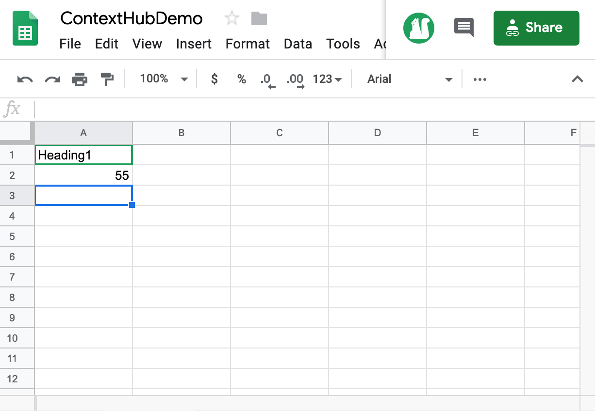

# Temperatuuractivering in het midden van de reis {#travel-center-temperature-activation}

Het volgende gebruiksgeval toont het gebruik van de lokale temperatuuractivering van het reiscentrum op basis van de waarden die in Google Sheets worden bevolkt.

## Beschrijving {#description}

Als de waarde in Google Sheets lager is dan 50, wordt in dit geval een afbeelding met warme dranken weergegeven. Als de waarde groter dan of gelijk aan 50 is, wordt een afbeelding met koude dranken weergegeven. Als er een andere waarde of helemaal geen waarde is, geeft de speler een standaardafbeelding weer.

## Voorwaarden {#preconditions}

Voordat u de lokale temperatuuractivering van het reiscentrum gaat implementeren, moet u leren hoe u de installatie kunt uitvoeren ***Gegevensopslag***, ***Auditiesegmentatie*** en ***Doelstelling voor kanalen inschakelen*** in een AEM Screens-project.

Zie [ContextHub configureren in AEM Screens](configuring-context-hub.md) voor nadere informatie.

## Basisstroom {#basic-flow}

Voer de onderstaande stappen uit om het gebruik-hoofdlettergebruik voor lokale temperatuuractivering van Travel Center te implementeren:

1. **De Google-bladen vullen**

   1. Navigeer naar het Google-werkblad ContextHubDemo.
   1. Een kolom toevoegen met **`Heading1`** met de bijbehorende temperatuurwaarde.

   

1. **De segmenten in soorten publiek configureren volgens de vereisten**

   1. Navigeer naar de segmenten in uw publiek (zie ***Stap 2: De Segmentatie van het publiek instellen*** in **[ContextHub configureren in AEM Screens](configuring-context-hub.md)** voor meer informatie).

   1. Klik op de knop **Bladen A1 1** en klik op **Bewerken**.

   1. Klik het vergelijkingsbezit en klik het configuratiepictogram.
   1. Klikken **goochelesheets/value/1/0** in de vervolgkeuzelijst **Eigenschapnaam**

   1. Klik op de knop **Operator** als **groter dan of gelijk aan** in het keuzemenu

   1. Voer de **Waarde** als **50**

   1. Selecteer op dezelfde manier de **Bladen A1 2** en klik op **Bewerken**.

   1. Klik op de knop **Vergelijkingseigenschap - waarde** en selecteer het configuratiepictogram.
   1. Klikken **goochelesheets/value/1/0** in de vervolgkeuzelijst **Eigenschapnaam**

   1. Klik op de knop **Operator** als **kleiner dan** in het keuzemenu

   1. Voer de **Waarde** als **50**

1. Navigeer en selecteer het kanaal () en klik **Bewerken** in de actiebalk. In het volgende voorbeeld: **DataDrivenWeather**, wordt een opeenvolgend kanaal gebruikt om de functionaliteit te tonen.

   >[!NOTE]
   >
   >Het kanaal moet al een standaardafbeelding hebben en het publiek moet vooraf zijn geconfigureerd zoals beschreven in [ContextHub configureren in AEM Screens](configuring-context-hub.md).

   

   >[!CAUTION]
   >
   >U moet uw **ContextHub** **Configuraties** het kanaal gebruiken **Eigenschappen** > **Personalisatie** tab.

   

1. Klikken **Targeting** vanuit de editor en klik op **Merk** en de **Activiteit** in het keuzemenu en klik op **Doelstelling starten**.

   

1. **De voorvertoning controleren**

   1. Klikken **Voorvertoning.** Open ook het Google-werkblad en werk de waarde ervan bij.
   1. Wijzig de waarde in minder dan 50. Je moet een afbeelding van een koude drank kunnen bekijken. Als de waarde in Google Sheets 50 of hoger is, ziet u een afbeelding van een warme drank.

   
