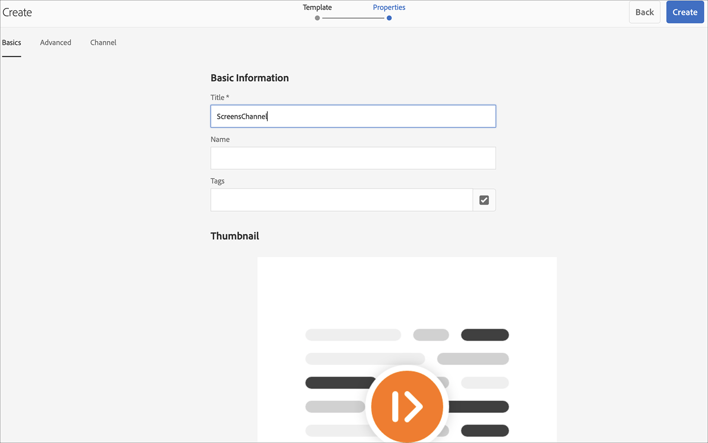
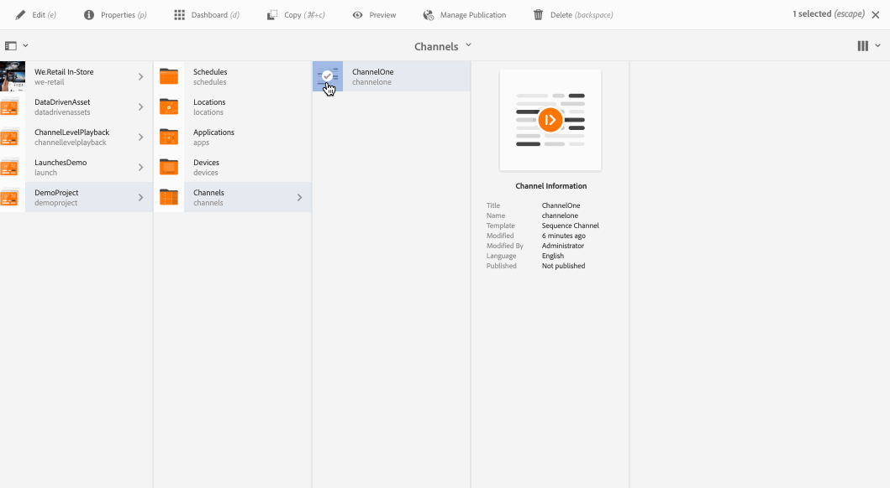
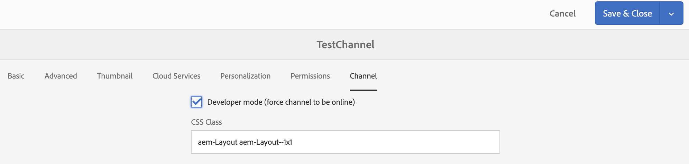

# Kanalen {#creating-and-managing-channels} maken en beheren

Een kanaal geeft een reeks inhoud (afbeeldingen en video&#39;s) weer en geeft ook een website of een toepassing van één pagina weer.

Op deze pagina worden kanalen voor AEM Screens gemaakt en beheerd.

**Voorwaarden**:

* [Schermen configureren en implementeren](configuring-screens-introduction.md)
* [Schermproject maken en beheren](creating-a-screens-project.md)

## Nieuw kanaal {#creating-a-new-channel} maken

Nadat u uw project voor AEM Screens hebt gemaakt, volgt u de onderstaande stappen om een nieuw kanaal voor uw project te maken:

1. Selecteer de Adobe Experience Manager-koppeling (linksboven) en klik vervolgens op Rasteren. U kunt ook rechtstreeks naar `https://localhost:4502/screens.html/content/screens` navigeren.

1. Navigeer naar uw project van het Scherm en selecteer **Kanalen** omslag.

1. Klik **Maken** van de actiebar.

   

1. Selecteer de **Sequence Channel**-sjabloon in de wizard **Maken** en klik op **Volgende**.

   

1. Voer de titel in als **ScreensChannel** en klik op **Maken**.

   

1. Een kanaal van de Opeenvolging wordt nu toegevoegd aan uw **omslag van Kanalen**.

### Kanaaltypen {#channel-types}

De volgende sjabloonopties zijn beschikbaar wanneer u de wizard gebruikt, zoals:

| **Sjabloon, optie** | **Beschrijving** |
|---|---|
| Map Kanalen | Hiermee kunt u een map maken waarin de verzameling kanalen wordt opgeslagen. |
| Volgekanaal | Hiermee kunt u een kanaal maken waarmee de componenten opeenvolgend worden afgespeeld (een voor een in een presentatie). |
| Toepassingskanaal | Hiermee kunt u uw aangepaste webtoepassing weergeven in de schermspeler. |
| 1 x 1 gesplitst schermkanaal | Hiermee kunt u de component in één zone weergeven. |
| 1 x 2 gesplitst schermkanaal | Hiermee kunt u de elementen weergeven in twee zones (horizontaal gesplitst). |
| 2 x 1 gesplitst rasterkanaal | Hiermee kunt u de elementen weergeven in twee zones (verticaal gesplitst). |
| 2 x 2 gesplitst schermkanaal | Hiermee kunt u de elementen weergeven in vier zones (horizontaal en verticaal in een matrix). |
| 2 tot 3 gesplitste schermkanaal | Hiermee kunt u de elementen weergeven in twee zones (horizontaal gesplitst) waarbij een van de zones groter is dan de andere. |
| Linker- of rechterL-balkgesplitste schermkanaal | Hiermee kunnen auteurs van inhoud verschillende typen elementen weergeven in zones met de juiste grootte. |

>[!NOTE]
>
>De gesplitste kanalen van het Scherm verdelen de vertoning in veelvoudige streken zodat kunt u verscheidene ervaringen tezelfdertijd, zij aan zij spelen. De ervaringen kunnen statische elementen/tekst of ingesloten reeksen zijn.

>[!IMPORTANT]
>
> Als u eenmaal inhoud aan uw kanaal hebt gemaakt en toegevoegd, bestaat de volgende stap uit het maken van een locatie, gevolgd door het maken van een weergave. Bovendien moet u dat kanaal aan een vertoning toewijzen. Zie de bronnen hieronder aan het einde van de sectie voor meer informatie.

## Werken met kanalen {#working-with-channels}

U kunt een kanaal bewerken, weergeven, eigenschappen en dashboard, kopiëren, voorvertonen en verwijderen.

### Inhoud toevoegen aan/bewerken in een kanaal {#adding-editing-content-to-a-channel}

Ga als volgt te werk om inhoud aan een kanaal toe te voegen of te bewerken:

1. Selecteer het kanaal dat u wilt bewerken (zoals in de bovenstaande afbeelding wordt getoond).
1. Klik **Bewerken** in de linkerbovenhoek van de actiebalk om de kanaaleigenschappen te bewerken. De redacteur opent die u toestaat om activa/componenten aan uw kanaal toe te voegen die u wilt publiceren.

>[!NOTE]
>U kunt componenten aan uw kanaal toevoegen. Raadpleeg **[Componenten toevoegen aan een kanaal](adding-components-to-a-channel.md)** voor meer informatie.

**Video&#39;s uploaden naar het kanaal**

Voer de onderstaande stappen uit om video&#39;s naar uw kanaal te uploaden:

1. Selecteer het kanaal waar u de video wilt uploaden.
1. Klik **Bewerken** van de actiebar om de redacteur te openen.
1. Selecteer **Video&#39;s** onder Elementen en sleep de vereiste video&#39;s.

>[!NOTE]
>Zie [Problemen met het uploaden van video&#39;s in uw kanaal oplossen](troubleshoot-videos.md) als er problemen optreden bij het uploaden van video&#39;s naar uw kanaal.

### Weergaveeigenschappen {#viewing-properties}

Volg onderstaande stappen om de eigenschappen van een kanaal weer te geven of te bewerken:

1. Klik op het kanaal u wilt uitgeven.
1. Klik **Eigenschappen** van de actiebar om de kanaaleigenschappen te bekijken/uit te geven. Met de volgende tabbladen kunt u de opties wijzigen.

### Het dashboard {#viewing-dashboard} weergeven

Voer de volgende stappen uit om het dashboard van een kanaal weer te geven:

1. Selecteer het kanaal dat u wilt bewerken.
1. Klik **Dashboard** van de actiebar om het dashboard te bekijken. Het **KANAALINFORMATIE**,**TOEGEWEZEN WEERGAVEN**, en **PENDING LAUNCHES** paneel opent, zoals aangetoond in de hieronder figuur:

### Kanaalgegevens {#channel-information}

In het deelvenster Kanaalgegevens worden de kanaaleigenschappen beschreven, samen met de voorvertoning naar het kanaal. Ook, verstrekt het u de informatie over of het kanaal off-line of online is.

Klik op (**..**) op de actiebalk **KANAALINFORMATIE** om eigenschappen weer te geven, de inhoud te bewerken of de cache (offlineinhoud) voor het kanaal bij te werken.

#### Het manifest {#view-manifest} weergeven

U kunt manifest van het kanaaldashboard bekijken.

>[!IMPORTANT]
>Deze optie is alleen beschikbaar bij AEM 6.4 Feature Pack 8 of AEM 6.5 Feature Pack 4.

Ga als volgt te werk om deze optie in te schakelen vanaf het kanaaldashboard:

1. **Kanaal op offline instellen**
   1. Selecteer het kanaal en selecteer **Eigenschappen** in de actiebalk
   1. Navigeer naar het tabblad **Kanaal** en zorg ervoor dat u **Developer Mode (forceer dat kanaal online moet zijn)** uitschakelt.
   1. Klik **Opslaan en sluiten**
1. **Offline inhoud bijwerken**
   1. Selecteer het kanaal en selecteer **Dashboard** in de actiebalk
   1. Navigeer naar **KANAALINFORMATIE** en klik op *..*
   1. Klik **Offline inhoud bijwerken**

U zou **Manifest van de Mening** optie van **INFORMATIE VAN HET KANAAL** in het dashboard van het Kanaal moeten zien.

### Online- en offlinekanalen {#online-and-offline-channels}

>[!NOTE]
>Wanneer u een kanaal maakt, is dit standaard offline.

Wanneer u een kanaal maakt, kan dit worden gedefinieerd als een online- of een offlinekanaal.

Een ***Onlinekanaal*** toont de bijgewerkte inhoud in de real-time omgeving, terwijl een ***Offlinekanaal*** de in de cache opgeslagen inhoud toont.

Volg de onderstaande stappen om het kanaal online te maken:

1. Navigeer naar het kanaal als **TestProject** —> **Kanalen** —> **TestChannel**.

   Selecteer het kanaal.

   

   Klik **Dashboard** van de actiebar om de status van de speler te bekijken. In het deelvenster **KANAALINFORMATIE** vindt u informatie over de vraag of het kanaal online of offline is.

   

1. Klik **Eigenschappen** van de actiebar en navigeer aan **het lusje van het Kanaal** zoals hieronder getoond:

   

1. Controleer de **Developer** **modus (forceer het kanaal online te zijn)** om het kanaal online te maken.

   Klik **Opslaan en sluiten** om uw optie op te slaan.

   

   Navigeer terug naar het kanaaldashboard en nu wordt in het deelvenster **KANAALINFORMATIE** de onlinestatus van de speler weergegeven.

   

>[!NOTE]
>Als u uw kanaal opnieuw als off-line wilt vormen, uncheck de de wijzeoptie van de Ontwikkelaar van **Eigenschappen** tabel (zoals aangetoond in stap (3)) en dan van **het paneel van de INFORMATIE van het KANAAL** klikt **Offlineinhoud**, zoals aangetoond in het hieronder cijfer.

#### Automatische versus handmatige updates van het dashboard van het Apparaat {#automatic-versus-manual-updates-from-the-device-dashboard}

De volgende tabel geeft een overzicht van de gebeurtenissen die zijn gekoppeld aan de automatische en handmatige updates van het apparaatdashboard.

<table>
 <tbody>
  <tr>
   <td><strong>Gebeurtenis</strong></td>
   <td><strong>Automatisch bijwerken van apparaat</strong></td>
   <td><strong>Handmatige update van apparaat</strong></td>
  </tr>
  <tr>
   <td>Wijzigen in onlinekanaal</td>
   <td>Inhoud automatisch bijgewerkt</td>
   <td>
Inhoud bijgewerkt op "Apparaat: Push Config"
 
Of
 
Inhoud bijgewerkt op <strong><i>Apparaat: Opnieuw starten</i></strong>
 </td>
  </tr>
  <tr>
   <td>Wijziging in offlinekanaal, maar Channel "Push Content" wordt NIET geactiveerd (geen offlinepakket wordt opnieuw gemaakt)</td>
   <td>Geen inhoud bijwerken</td>
   <td>Geen inhoud bijwerken</td>
  </tr>
  <tr>
   <td>Wijziging in offlinekanaal en Kanaal wordt "pushinhoud" geactiveerd (nieuw offlinepakket)</td>
   <td>Inhoud automatisch bijgewerkt</td>
   <td>
Inhoud bijgewerkt op <strong><i>Apparaat: Push Config</i></strong>
 
Of
 
Inhoud bijgewerkt op <strong><i>Apparaat: Opnieuw starten</i></strong>
 </td>
  </tr>
  <tr>
   <td>
Wijzigen in configuratie

    <ul>
     <li>Weergave (geforceerd kanaal)</li>
     <li>Apparaat</li>
     <li>Kanaaltoewijzingen (nieuw kanaal, verwijderd kanaal)</li>
     <li>Kanaaltoewijzing (rol, gebeurtenis, planning)</li>
    </ul> </td>
   <td>Configuratie automatisch bijgewerkt</td>
   <td>
Config bijgewerkt op <strong><i>Apparaat: Push Config</i></strong>
 
Of
 
Config bijgewerkt op <strong><i>Apparaat: Opnieuw starten</i></strong>
 </td>
  </tr>
 </tbody>
</table>

### Toegewezen beeldschermen {#assigned-displays}

In het toegewezen deelvenster wordt de weergave weergegeven die aan het kanaal is gekoppeld. Het verstrekt een momentopname van de toegewezen vertoning samen met de resolutie.

De bijbehorende vertoningen zullen in **Toegewezen Vertoningen** paneel, zoals hieronder getoond worden vermeld:

>[!NOTE]
>Raadpleeg de volgende bronnen voor meer informatie over het maken van een weergave op een locatie:
>
>* [Locaties maken en beheren](managing-locations.md)
* [Weergaven maken en beheren](managing-displays.md)

Klik bovendien op de weergave in het deelvenster **TOEGEWEZEN WEERGAVEN** om de weergavegegevens weer te geven, zoals hieronder wordt getoond:

### De volgende stappen {#the-next-steps}

De volgende stap na het maken van een kanaal en het toevoegen/bewerken van inhoud in uw kanaal is te leren hoe u een locatie en weergave kunt maken. Vervolgens wijst u een kanaal aan dat beeldscherm toe.

Zie de volgende bronnen voor de volgende stappen:

* [Kanalen maken en beheren](managing-channels.md)
* [Locaties maken en beheren](managing-locations.md)
* [Weergaven maken en beheren](managing-displays.md)

