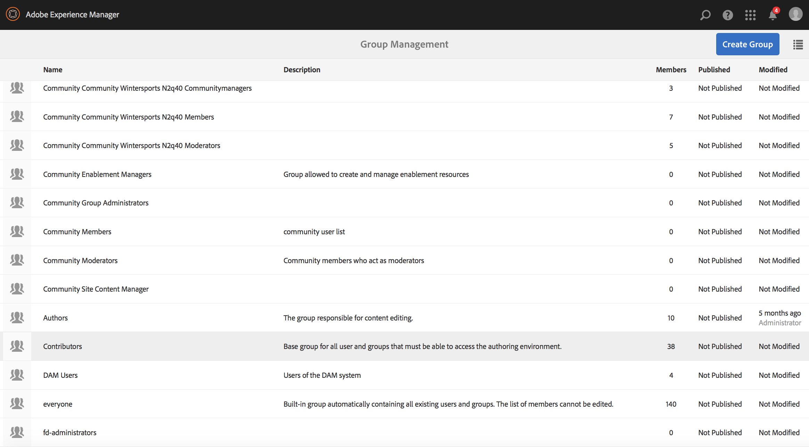

# Apparaten beheren {#managing-devices}

In deze pagina wordt de toewijzing van het apparaat beschreven.

Met de apparaatconsole hebt u toegang tot de apparaatmanager om uw apparaat aan een scherm toe te wijzen.

>[!CAUTION]
>
>Registreer het voordat u het apparaat toewijst. Zie [&#x200B; Registratie van het Apparaat &#x200B;](device-registration.md).

## Apparaattoewijzing {#device-assignment}

Voer de onderstaande stappen uit om een apparaat aan een scherm toe te wijzen:

1. Ga bijvoorbeeld naar de map Devices van uw project

   `http://localhost:4502/screens.html/content/screens/TestProject`

   

1. Klik uw **omslag van Apparaten** en klik **Manager van het Apparaat** in de actiebar. De toegewezen en niet toegewezen apparatenvertoning.

   

1. Klik een niet toegewezen apparaat van de lijst, dan in de actiebar, klik **toewijzen Apparaat**.

   

1. Klik de vertoning die u het apparaat aan van de lijst wilt toewijzen, en **klikken toewijzen**.

   

1. Klik de **Afwerking** om het taakproces te voltooien.

   Het vertoningsdashboard toont het toegewezen apparaat in het **paneel van APPARATEN**.

   

   Klik (**...**) op de hoogste-juiste hoek van het **3&rbrace; paneel van APPARATEN &lbrace;om of apparaat toe te voegen config of de apparaten bij te werken.**

   

>[!NOTE]
>
>Telkens wanneer het eerste apparaat aan een nieuw Screens-project wordt toegevoegd, wordt een gebruikersgroep gemaakt.
>&#x200B;>Bijvoorbeeld, als de naam van de projectknoop *wij-kleinhandel* is, dan is de naam van de gebruikersgroep *schermen-wij-retail-apparaten*.
>&#x200B;>Deze groep wordt toegevoegd als lid van de **Groep van Medewerkers**, zoals aangetoond in het hieronder cijfer:

### De volgende stappen {#the-next-steps}

Nadat u met het toewijzen van kanaal aan een vertoning vertrouwd bent, zie het [&#x200B; Monitor en los &#x200B;](monitoring-screens.md) problemen op.
