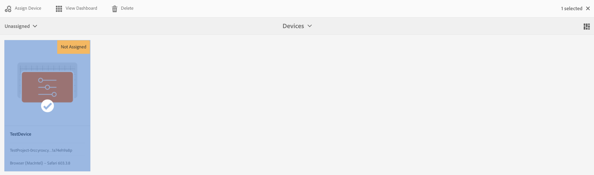

# Apparaten {#managing-devices} beheren

In deze pagina wordt de toewijzing van apparaten beschreven.

Met de apparaatconsole hebt u toegang tot de apparaatmanager om uw apparaat aan een scherm toe te wijzen.

>[!CAUTION]
>
>Voordat u het apparaat toewijst, moet u het registreren. Zie [Apparaatregistratie](device-registration.md) voor meer informatie.

## Apparaattoewijzing {#device-assignment}

Voer de onderstaande stappen uit om een apparaat aan een scherm toe te wijzen:

1. Navigeer naar de map Devices van uw project, bijvoorbeeld

   `http://localhost:4502/screens.html/content/screens/TestProject`

   

1. Selecteer de map **Apparaten** en tik op **Apparaatbeheer** in de actiebalk. De toegewezen en niet toegewezen apparatenvertoning.

   

1. Selecteer een niet-toegewezen apparaat in de lijst en tik op **Apparaat toewijzen** in de actiebalk.

   

1. Selecteer de weergave waaraan u het apparaat wilt toewijzen in de lijst en tik op **Toewijzen**.

   

1. Tik/klik op **Voltooien** om het toewijzingsproces te voltooien.

   Het weergavedashboard geeft het toegewezen apparaat weer in het deelvenster **DEVICES**.

   

   Klik op het pictogram (**..**) in de rechterbovenhoek van het **deelvenster DEVICES** om apparaatconfiguratie toe te voegen of de apparaten bij te werken.

   

>[!NOTE]
>
>Telkens wanneer het eerste apparaat aan een nieuw project van het Scherm wordt toegevoegd, wordt een gebruikersgroep gecreeerd.
>Als de naam van het projectknooppunt bijvoorbeeld *we-retail* is, is de naam van de gebruikersgroep *screens-we-retail-devices*.
>Deze groep wordt toegevoegd als lid van de groep **Contributors**, zoals in de onderstaande afbeelding wordt getoond:

### De volgende stappen {#the-next-steps}

Wanneer u bekend bent met het toewijzen van kanaal aan een weergave, raadpleegt u de volgende bronnen:

* [Monitor en problemen oplossen](monitoring-screens.md)

