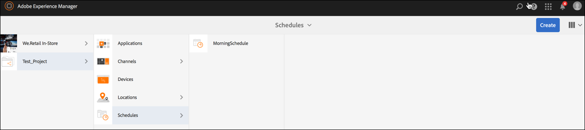

# Weergaven maken en beheren {#creating-and-managing-displays}

Een weergave is een virtuele groep schermen die naast elkaar zijn geplaatst. Het beeldscherm is permanent voor een installatie. Het zijn de objecten inhoudsauteurs werken met en verwijzen altijd naar als logische vertoning eerder dan hun fysieke tegendelen.

Wanneer u een locatie maakt, moet u een weergave voor uw locatie maken.

Op deze pagina ziet u hoe u weergaven voor Screens maakt en beheert.

**Voorwaarden**:

* [Screens configureren en implementeren](configuring-screens-introduction.md)
* [Screens-project maken en beheren](creating-a-screens-project.md)
* [Kanalen maken en beheren](managing-channels.md)
* [Locaties maken en beheren](managing-locations.md)

## Een nieuwe weergave maken {#creating-a-new-display}

>[!NOTE]
>
>Maak een locatie voordat u een weergave maakt. Zie [&#x200B; Locaties &#x200B;](managing-locations.md) voor meer informatie creëren en beheren.

1. Ga naar de juiste locatie, bijvoorbeeld `http://localhost:4502/screens.html/content/screens/TestProject` .
1. Klik uw plaatsomslag en klik **creëren** dat naast het plus pictogram in de actiebar is.
1. Klik **Vertoning** van **creëren** tovenaar, dan klik **daarna**.
1. Ga uw **Naam** en **Titel** voor uw vertoningsplaats in.
1. Onder het **lusje van de Vertoning**, kies de details van de Lay-out. Kies de gewenste **Resolutie**, zoals **Volledige HD**. Kies het aantal apparaten horizontaal en verticaal.
1. Klik **creëren**.

De vertoning (*StoreDisplay*) wordt gecreeerd en aan de plaats toegevoegd (*SanJose*).

Wanneer u een vertoning in positie hebt, moet de volgende stap een apparaat tot stand brengen config voor die bepaalde vertoning.

>[!NOTE]
>
>**de Volgende Stap**:
>
>Wanneer u een weergave voor uw locatie maakt, wijst u een kanaal toe aan uw weergave om de inhoud te gebruiken.
>
>Zie [&#x200B; toewijzen Kanalen &#x200B;](channel-assignment.md) sectie leren hoe te om een kanaal aan de vertoning toe te wijzen.

## Een nieuwe apparaatconfiguratie maken {#creating-a-new-device-config}

Een apparaat config dienst als placeholder voor een echt digitaal signaalapparaat dat nog niet geïnstalleerd is.

1. Navigeer naar de juiste weergave, bijvoorbeeld `http://localhost:4502/screens.html/content/screens/TestProject/locations/newlocation` .
1. Klik uw vertoningsomslag en klik **Dashboard van de Mening** in de actiebar.
1. Klik **+ voeg de Configuratie van het Apparaat** op het hoogste recht van het **paneel van Apparaten** toe.

1. Klik **Config van het Apparaat** als vereist malplaatje en klik **daarna**.

1. Ga de eigenschappen zoals vereist in en klik **creëren**.

Het apparaat config wordt gecreeerd en aan de huidige vertoning toegevoegd (in de volgende demonstratie, is het nieuwe apparaat config *DeviceConfig*).

>[!NOTE]
>
>Wanneer een apparaat config aan uw vertoning in de plaats wordt geplaatst, zal de volgende stap een kanaal aan uw vertoning moeten toewijzen.
>
>Zoals aangetoond in het hieronder cijfer, als het apparaat config als niet toegewezen in het **paneel van APPARATEN** wordt getoond, als geen kanaal aan dat bepaalde apparaat config wordt toegewezen.
>
>U moet eerst weten hoe u kanalen maakt en beheert. Zie [&#x200B; Kanalen &#x200B;](managing-channels.md) voor meer details creëren en beheren.

## Het dashboard weergeven {#display-dashboard}

Het weergavedashboard biedt u verschillende deelvensters voor het beheer van weergaveapparaten. Het laat u ook uw apparaat vormen.

>[!NOTE]
>
>U kunt op de dashboardlijsten klikken en acties voor grote hoeveelheden van items activeren in plaats van elk item afzonderlijk te doorlopen.
>
>In de volgende afbeelding ziet u bijvoorbeeld hoe u op meerdere kanalen van het weergavedashboard kunt klikken.

### Deelvenster Informatie weergeven {#display-information-panel}

Het **Comité van de INFORMATIE van de WEERGAVE** verstrekt de vertoningseigenschappen.

Klik (**...**) in de hoger-juiste hoek in het **paneel van de INFORMATIE VAN DE VERTONING** zodat kunt u de eigenschappen bekijken en de vertoning voorproef.

#### Weergaveeigenschappen {#viewing-properties}

Klik **Eigenschappen** zodat kunt u de eigenschappen van uw vertoning bekijken of veranderen.

Ook, kunt u de waarde van de gebeurtenistijdopnemer voor uw interactief kanaal onder de **Vertoning** tabel aanpassen. De standaardwaarde wordt geplaatst aan *300 seconden*.

Het gebruik **CRXDE Lite**, om tot het **idleTimeout** bezit toegang te hebben, namelijk `http://localhost:4502/crx/de/index.jsp#/content/screens/we-retail/locations/demo/flagship/single/jcr%3Acontent/channels`.

### Deelvenster Toegewezen kanalen {#assigned-channels-panel}

Het **TOEGEWEZEN paneel van KANALEN** toont de toegewezen kanalen aan dit apparaat.

### Deelvenster Apparaten {#devices-panel}

Het **Comité van 1&rbrace; APPARATEN** verstrekt informatie over de apparatenconfiguraties.

Klik (**..**) in de hoger-juiste hoek in het **3&rbrace; paneel van APPARATEN &lbrace;zodat kunt u apparatenconfiguraties toevoegen en apparaten bijwerken.**

Klik ook op de apparaatconfiguratie om eigenschappen weer te geven, een apparaat toe te wijzen of het volledig te verwijderen.

#### De volgende stappen {#the-next-steps}

Wanneer u klaar bent met het maken van een weergave voor uw locatie, wijst u een kanaal toe aan uw weergave.

Zie [&#x200B; Kanalen &#x200B;](channel-assignment.md) toewijzen voor meer details.
