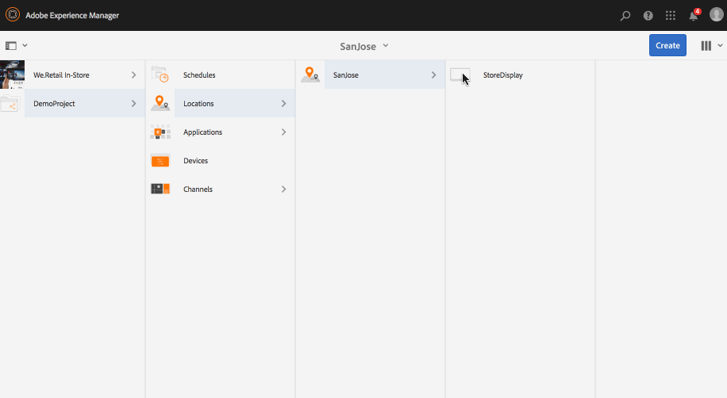

# Weergaven maken en beheren {#creating-and-managing-displays}

Een weergave is een virtuele groep schermen die naast elkaar zijn geplaatst. Het beeldscherm is permanent voor een installatie. Dit is de objecten inhoudsauteurs werken met en verwijzen altijd naar als logische vertoning eerder dan hun fysieke tegendelen.

Wanneer u een locatie maakt, moet u een weergave voor uw locatie maken.

Op deze pagina ziet u hoe u beeldschermen maakt en beheert.

**Voorwaarden**:

* [Schermen configureren en implementeren](configuring-screens-introduction.md)
* [Schermproject maken en beheren](creating-a-screens-project.md)
* [Kanalen maken en beheren](managing-channels.md)
* [Locaties maken en beheren](managing-locations.md)

## Een nieuwe weergave maken {#creating-a-new-display}

>[!NOTE]
>
>Maak een locatie voordat u een weergave maakt. Zie [Locaties maken en beheren](managing-locations.md) voor meer informatie .

1. Ga bijvoorbeeld naar de juiste locatie `http://localhost:4502/screens.html/content/screens/TestProject`.
1. Selecteer uw locatiemap en selecteer **Maken** Deze bevindt zich naast het plusteken op de actiebalk.
1. Selecteren **Weergave** van de **Maken** wizard, selecteert u vervolgens **Volgende**.
1. Enter **Naam** en **Titel** voor uw weergavelocatie.
1. Onder de **Weergave** kiest, kiest u de details van de layout. Kies het gewenste **Resolutie**, zoals **Volledig HD**. Kies het aantal apparaten horizontaal en verticaal.
1. Selecteren **Maken**.

De weergave (*StoreDisplay*) wordt gemaakt en toegevoegd aan de locatie (*SanJose*).

Wanneer u in positie hebt tonen, moet de volgende stap een apparaat tot stand brengen config voor die bepaalde vertoning.

>[!NOTE]
>
>**De volgende stap**:
>
>Wanneer u een weergave voor uw locatie maakt, wijst u een kanaal toe aan uw weergave om de inhoud te gebruiken.
>
>Zie [Kanalen toewijzen](channel-assignment.md) voor meer informatie over het toewijzen van een kanaal aan de weergave.

## Een nieuwe apparaatconfiguratie maken {#creating-a-new-device-config}

Een apparaat config dienst als placeholder voor een echt digitaal signaalapparaat dat nog niet geïnstalleerd is.

1. Ga bijvoorbeeld naar de juiste weergave, `http://localhost:4502/screens.html/content/screens/TestProject/locations/newlocation`.
1. Selecteer uw weergavemap en selecteer **Dashboard weergeven** in de actiebalk.
1. Selecteren **+ Apparaatconfiguratie toevoegen** rechtsboven in het **Apparaten** deelvenster.

1. Selecteer de **Apparaatconfiguratie** als de vereiste sjabloon en selecteer **Volgende**.

1. Voer de vereiste eigenschappen in en selecteer **Maken**.

Het apparaat config wordt gecreeerd en aan de huidige vertoning toegevoegd (in de volgende demonstratie, wordt het nieuwe apparaat config gecreeerd *DeviceConfig*).

>[!NOTE]
>
>Wanneer een apparaat config aan uw vertoning in de plaats wordt geplaatst, zal de volgende stap een kanaal aan uw vertoning moeten toewijzen.
>
>Zoals aangetoond in het hieronder cijfer, als het apparaat config als niet toegewezen in wordt getoond **APPARATEN** als er geen kanaal is toegewezen aan de desbetreffende apparaatconfiguratie.
>
>U zou voorafgaand inzicht in het creëren van en het beheer van kanalen moeten hebben. Zie [Kanalen maken en beheren](managing-channels.md) voor meer informatie .

## Het dashboard weergeven {#display-dashboard}

Het weergavedashboard biedt u verschillende deelvensters voor het beheer van weergaveapparaten en apparaatconfiguraties voor uw apparaat.

>[!NOTE]
>
>U kunt de dashboardlijsten selecteren en bulkacties voor items activeren in plaats van elk item afzonderlijk te doorlopen.
>
>De volgende afbeelding laat bijvoorbeeld zien hoe u meerdere kanalen van het weergavedashboard kunt selecteren.

### Deelvenster Informatie weergeven {#display-information-panel}

De **INFORMATIE OVER WEERGAVE** Het deelvenster bevat de weergave-eigenschappen.

Selecteren (**...**) in de rechterbovenhoek in de **INFORMATIE OVER WEERGAVE** zodat u de eigenschappen kunt bekijken en een voorvertoning van de weergave kunt bekijken.

#### Weergaveeigenschappen {#viewing-properties}

Selecteren **Eigenschappen** zodat u de eigenschappen van de weergave kunt bekijken of wijzigen.

U kunt ook de waarde van de gebeurtenistimer voor uw interactieve kanaal aanpassen in **Niet-actieve time-out** eigendom onder **Weergave** tab. De standaardwaarde is *300 seconden*.

Gebruiken **CRXDE Lite**, om toegang te krijgen tot **idleTimeout** eigenschap, dat wil zeggen: `http://localhost:4502/crx/de/index.jsp#/content/screens/we-retail/locations/demo/flagship/single/jcr%3Acontent/channels` .

### Deelvenster Toegewezen kanalen {#assigned-channels-panel}

De **TOEGEWEZEN KANALEN** toont de toegewezen kanalen aan dit apparaat.

### Deelvenster Apparaten {#devices-panel}

De **APPARATEN** Het paneel verstrekt informatie over de apparatenvormen.

Selecteren (**...**) in de rechterbovenhoek in de **APPARATEN** zodat u apparaatconfiguraties kunt toevoegen en apparaten kunt bijwerken.

Ook, selecteer het apparaat config om eigenschappen te bekijken, een apparaat toe te wijzen, of het volledig te schrappen.

#### De volgende stappen {#the-next-steps}

Wanneer u klaar bent met het maken van een weergave voor uw locatie, wijst u een kanaal toe aan uw weergave.

Zie [Kanalen toewijzen](channel-assignment.md) voor meer informatie .
