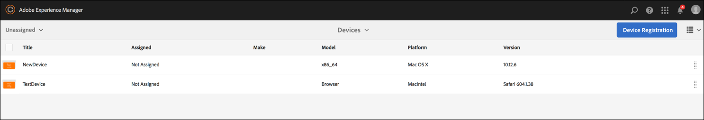

# Een live kopie maken en beheren {#creating-and-managing-a-live-copy}

Op deze pagina vindt u een beschrijving van het maken en beheren van Actieve exemplaren van kanalen.

A ***Live kopie*** is een kopie van specifieke site-inhoud waarvoor een live relatie met de oorspronkelijke bron behouden blijft. Met deze live relatie kan de live kopie inhoud en pagina-eigenschappen overnemen van de bron.

Deze pagina beschrijft het maken van een live kopie van een kanaal, het weergeven van eigenschappen, het controleren van de status en het doorgeven van wijzigingen van een kanaal naar de live kopie.

## Een actieve kopie maken {#creating-a-live-copy}

Voer de onderstaande stappen uit om een live kopie van een kanaal in uw projectmap te maken.

1. Selecteer de Adobe Experience Manager-koppeling (linksboven) en **Schermen**. U kunt ook rechtstreeks naar: `http://localhost:4502/screens.html/content/screens`.

1. Navigeer naar het project Screens en klik op **Kanalen**.
1. Klikken **Maken** en selecteert u **Live kopie** om een live kopie van het kanaal te maken.

1. Selecteer het doel en klik op **Volgende**.
1. Selecteer de locatie waar de live kopie zich bevindt.
1. Voer de **Titel** en **Naam** in de **Live kopie maken** pagina.

1. Klikken **Openen** om de inhoud van een nieuwe live kopie te bekijken of **Gereed** om terug te keren naar de hoofdpagina.

U kunt ook de onderstaande stappen volgen voor een visuele weergave voor het maken van een nieuwe live kopie van een kanaal.

In het volgende voorbeeld wordt getoond hoe u een live kopie (***IdleLiveCopy***) voor ***Niet-actief kanaal*** met doelmap als ***Kanalen***.

## Inhoud van het kanaal Live kopie weergeven {#viewing-content-of-the-live-copy-channel}

Een actieve kopie is een kopie van een kanaal dat al bestaat.

Zie de volgende stappen om de inhoud van uw live kopie weer te geven:

1. Navigeer naar het project Schermen en klik op de locatie waar u oorspronkelijk een live kopie hebt gemaakt, zoals in de bovenstaande sectie wordt getoond. (Hier is de locatie gekozen als **Kanalen** map)

   

1. Klikken **Bewerken** in de actiebalk om de inhoud in het kanaal weer te geven.

   

   >[!NOTE]
   >
   >Wanneer u inhoud voor een live-kopieerkanaal weergeeft, ziet u een extra item in het menu als **Status van live kopiëren**. Zie de onderstaande sectie voor meer informatie.

### Eigenschappen van een actieve kopie weergeven {#viewing-properties-of-a-live-copy}

Bovendien kunt u de eigenschappen van het kanaal van uw levende exemplaar bekijken.

1. Ga naar uw livecopanaal en klik op **Eigenschappen** in de actiebalk.

   

1. Selecteer **Live kopie** om details van uw kanaal te bekijken.

   

### Status van live kopiëren {#live-copy-status}

De modus **Status van live kopiëren**, zoals in de onderstaande afbeelding wordt getoond, kunt u de relatiestatus van alle elementen in het kanaal bekijken.

1. Klikken **Bewerken** om de **Status van live kopiëren** en bekijk de koppeling van uw kanaalinhoud aan het oorspronkelijke kanaal (waaruit de live kopie wordt gegenereerd).

   

1. Selecteren **Status van live kopiëren** om de voorvertoningspagina weer te geven.

   Alle bronnen met een groene rand tonen aan dat de inhoud wordt overgenomen van het oorspronkelijke kanaal.

   

### De overerving doorbreken {#breaking-the-inheritance}

U kunt ook de overerving van de livecopy annuleren, zodat de inhoud onafhankelijk wordt van de oorspronkelijke vertakking.

In het volgende voorbeeld ziet u dat u de afbeelding in de bewerkingsmodus selecteert en rechtsboven op het overervingssymbool Annuleren klikt.

### Wijzigingen doorgeven aan het kanaal van Live kopie {#propagating-changes-to-the-live-copy-channel}

Als u wijzigingen/updates aanbrengt in het oorspronkelijke kanaal, moet u deze wijzigingen ook doorgeven aan uw Live Copy-kanaal.

Voer de onderstaande stappen uit om ervoor te zorgen dat uw wijzigingen van het oorspronkelijke kanaal naar het actieve kopieerkanaal worden doorgegeven:

1. Het oorspronkelijke kanaal selecteren (***Niet-actief kanaal***) en klik op **Bewerken** in de actiebalk.

   

1. Bewerk de inhoud van dit kanaal. Verwijder bijvoorbeeld een afbeelding uit dit kanaal.

   

1. Selecteer de live kopie van het kanaal (***IdleLiveCopy***) en klik op **Bewerken** in de actiebalk. U zult zien dat de afbeelding die u hebt verwijderd, nog steeds zichtbaar is in de live kopie.

   Als u de wijzigingen wilt doorgeven, moet u het kanaal synchroniseren.

   

1. Als u wijzigingen wilt doorgeven aan het actieve kopieerkanaal, navigeert u naar het AEM dashboard en selecteert u het actieve kopieerkanaal en klikt u op **Eigenschappen** in de actiebalk.

   

1. Selecteer **Live kopie** en klik op **Synchroniseren** in de actiebalk.

   

1. Klikken **Synchroniseren** om de wijzigingen te bevestigen. Klikken **Opslaan en sluiten** om terug naar het AEM dashboard te navigeren.

   

   U zult merken dat de afbeelding nu ook uit het live-kopieerkanaal wordt verwijderd.
