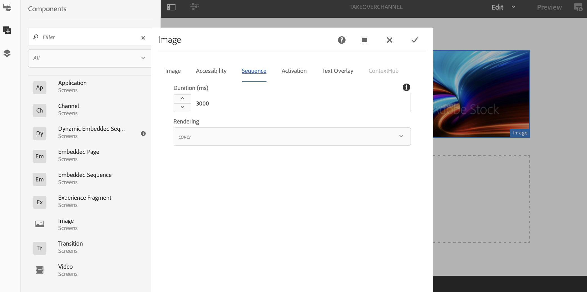

# Meerdere zones naar één zone overgang {#multizone-to-singlezone-use-case}

## Omschrijving hoofdletter gebruiken {#use-case-description}

In deze sectie wordt een gebruiksvoorbeeld beschreven waarin wordt benadrukt hoe u een lay-outkanaal met meerdere zones instelt dat met een lay-outkanaal met één zone afwisselt. Het kanaal met meerdere zones heeft het rangschikken van beeld/video activa en het toont hoe u opstelling een project dat van multi-zone aan single-zone afwisselt en omgekeerd.

### Voorwaarden {#preconditions}

Voordat u met dit gebruik begint, moet u controleren hoe u dit kunt doen:

* **[creeer en beheer Kanalen](managing-channels.md)**
* **[creeer en beheer Plaatsen](managing-locations.md)**
* **[creeer en beheer Programma&#39;s](managing-schedules.md)**
* **[Registratie van het Apparaat](device-registration.md)**

### Primaire acteurs {#primary-actors}

Inhoudsauteurs

## Het project instellen {#setting-up-the-project}

Voer de onderstaande stappen uit om een project in te stellen:

1. Creeer een Project van AEM Screens dat als **wordt genoemd TakOPLoop**, zoals hieronder getoond.

   

1. **Creërend een Kanaal van Screens van de multi-Zone**

   1. Klik de **omslag van Kanalen** en klik **creëren** van de actiebar en het openen van de tovenaar zodat kunt u een kanaal tot stand brengen.
   1. Klik **van het Kanaal van het Scherm van de Bar van links-L** van de tovenaar en creeer het kanaal dat als **wordt genoemd MultiZoneLayout**.
   1. Voeg inhoud toe aan het kanaal. Sleep de elementen naar elk van de zones. Het volgende voorbeeld toont a **kanaal 0} MultiZoneLayout dat een video, een beeld, en een tekstbanner (in een ingebedde opeenvolging) omvat, zoals hieronder getoond.**

   

   >[!NOTE]
   >
   >Meer leren over het creëren van een multi-zonelay-out in uw kanaal, zie {Lay-out Van meerdere zones 0} ](multi-zone-layout-aem-screens.md).[

1. Creeer een ander kanaal dat als **wordt genoemd TakOPChannel** aan uw **omslag van Kanalen**.

   

1. Klik **uitgeven** van de actiebar zodat kunt u inhoud aan dit kanaal toevoegen. Voeg de component van het a **Kanaal** en een beeldactiva toe die u voor dit kanaal wilt schakelen, zoals aangetoond in het hieronder cijfer:

   

1. Open de montages voor de component van het Kanaal en punt het aan het **** kanaal MultiZoneLayout dat u in *stap 2* creeerde.

   

1. Plaats de duur van het **gebied van de Opeenvolging** {aan **10000 milliseconden**.

   

1. Op dezelfde manier open de montages voor het Beeld (activa u) toevoegde en zijn duur van het **1} gebied van de Opeenvolging {aan** 3000 milliseconden **plaatsen.**

   

## De voorvertoning controleren {#checking-the-preview}

U kunt de gewenste output van de speler bekijken of enkel door **Voorproef** van de redacteur te selecteren.

De output toont aan hoe een lay-out multi-zone voor *10000 milliseconden* speelt. Dan, schakelt het aan één enkele streeklay-out over die een playbackduur van *3000 milliseconden* heeft. Tot slot gaat het terug naar de multi-zone layout.

>[!VIDEO](https://video.tv.adobe.com/v/30366)

>[!NOTE]
>
>U kunt de kanaalovergang naar wens aanpassen (van multi-zone naar single-zone lay-out of omgekeerd).
