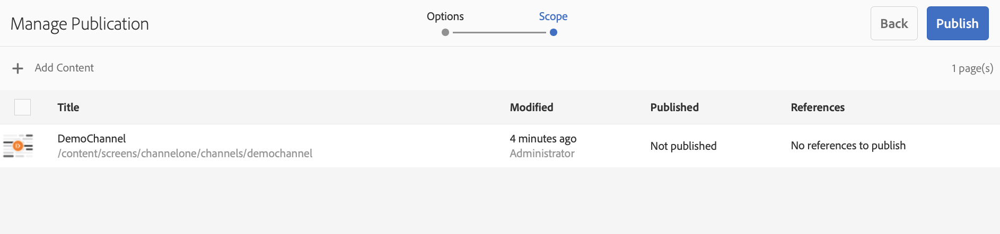

# Inhoud op aanvraag bijwerken {#on-demand}

In deze sectie wordt on-demand-inhoud voor het beheer van publicaties beschreven.

## Publicatie beheren: inhoud van auteur bijwerken om op apparaat te publiceren {#managing-publication-delivering-content-updates-from-author-to-publish-to-device}

U kunt inhoud vanuit AEM Screens publiceren en de publicatie ervan ongedaan maken. **beheert Publicatie** laat u inhoudsupdates van auteur leveren om aan apparaat te publiceren. U kunt inhoud publiceren/unpublish voor uw volledige AEM Screens-project of slechts voor één van uw kanalen, plaats, apparaat, toepassing, of een programma.

### Publicatie voor een AEM Screens-project beheren {#managing-publication-for-an-aem-screens-project}

Voer de onderstaande stappen uit om inhoud te updaten van auteur tot uitgever naar apparaat voor een AEM Screens-project:

1. Ga naar uw AEM Screens-project.
1. Klik **leiden Publicatie** van de actiebar zodat kunt u het project aan uw publiceren instantie.

   

1. De **beheert 1} Tovenaar van de Publicatie {opent.** U kunt de **Actie** klikken en ook de het publiceren tijd voor nu of later plannen. Klik op **Next**.

   

1. Controleer de doos zodat kunt u het volledige project van de **`Manage Publication`** tovenaar klikken.

   

1. Klik **+ omvat Kinderen** van de actiebar en uncheck alle opties zodat kunt u alle modules in uw project publiceren en **klikken voegt** toe om te publiceren.

   >[!NOTE]
   >
   >Door gebrek, worden alle vakjes gecontroleerd en u moet de vakjes manueel uncheck om alle modules in uw project te publiceren.

   

   **Begrijp omvat de dialoogdoos van Kinderen**

   De bovenstaande stappen laten zien hoe u de volledige inhoud kunt publiceren. Als u de andere drie beschikbare alternatieven wilt gebruiken, moet u die bepaalde optie controleren.
In de volgende afbeelding ziet u bijvoorbeeld hoe u alleen de gewijzigde pagina&#39;s in uw project kunt beheren en bijwerken:
   

   Volg de onderstaande uitleg om inzicht te krijgen in de beschikbare opties:

   1. **omvat slechts directe kinderen**:
Met deze optie kunt u alleen updates voor de subknooppunten in uw projectstructuur beheren.
   1. **omvat slechts gewijzigde pagina&#39;s**:
Met deze optie kunt u alleen updates beheren voor de gewijzigde pagina&#39;s van het project waar de wijzigingen zich bevinden in de projectstructuur.
   1. **omvat slechts reeds gepubliceerde pagina&#39;s**:
Met deze optie kunt u alleen updates beheren voor de pagina&#39;s die eerder zijn gepubliceerd.

1. Van **`Manage Publication wizard`**, klik **publiceren**.

   

   >[!NOTE]
   >
   >Wacht een paar seconden/minuten, zodat de inhoud de instantie publish bereikt.
   >
   >
   >    1. Het werkschema werkt niet als er geen veranderingen in het project en niets voor **Offline Inhoud van de Update** zijn.
   >    1. Het werkschema werkt niet als de auteur niet het replicatieproces voltooit (de inhoud uploadt om instantie te publiceren) na het selecteren van **publiceer** knoop in het leiden publicatiewerkschema.

   >[!CAUTION]
   >Als inhoudsschepper, als u de veranderingen in de apparaten wilt zien die aan de auteursinstantie in bijlage zijn, klik **Offline Inhoud van de Update** van het kanaaldashboard of door het project te selecteren. In dit geval wordt de update van offline inhoud alleen uitgevoerd in de auteurinstantie.

1. Navigeer aan het project en klik **Offline Inhoud van de Update** van de actiebar. Deze handeling stuurt dezelfde opdracht door naar de instantie publish, zodat de offline ritten ook voor uw instantie Publish worden gemaakt.

   

   >[!NOTE]
   >
   >Nadat u de publicatieworkflow hebt voltooid en wanneer er een speler is die naar een instantie Auteur verwijst, activeert u de update offline-inhoud in de auteur. Als u dit doet, wordt de update offline in de instantie Auteur gemaakt.

   >[!CAUTION]
   >
   >Trigger de update offline inhoud in de instantie Auteur, als u een speler hebt die bij de auteurserver wordt geregistreerd. U hoeft de offline inhoud niet bij te werken voor de speler die is geregistreerd bij de instantie Publishing.

### Publicatie voor een kanaal beheren {#managing-publication-for-a-channel}

Voer de onderstaande stappen uit om inhoudsupdates te leveren van Auteur > Publiceren > apparaat voor een Kanaal in een AEM Screens-project:

>[!NOTE]
>
>Volg deze sectie alleen als er wijzigingen zijn in een kanaal. Als er na de vorige update geen wijzigingen zijn aangebracht in een kanaal, werkt de publicatieworkflow voor een afzonderlijk kanaal niet.

1. Navigeer naar uw AEM Screens-project en klik op het kanaal.
1. Klik **leiden Publicatie** van de actiebar zodat kunt u het kanaal aan uw publiceren instantie.

   

1. De **beheert 1} Tovenaar van de Publicatie {opent.** U kunt de **Actie** klikken en ook de het publiceren tijd voor nu of later plannen. Klik op **Next**.

   

1. Klik **publiceren** van de **`Manage Publication`** tovenaar.

   

   >[!NOTE]
   >
   >Wacht een paar seconden/minuten, zodat de inhoud de instantie publish bereikt.

1. Het teweegbrengen **Offline Inhoud van de Update** in het kanaaldashboard duwt slechts de off-line inhoud aan de instantie van de Auteur maar niet de het Publiceren instantie. De stappen 1-4 zijn voor het duwen van off-line inhoud aan Publish instantie.

   

   >[!CAUTION]
   >
   >Publiceer eerst, dan teweegbrengt de update off-line inhoud zoals samengevat in de voorafgaande stappen.

### Kanaal- en apparaattoewijzing: {#channel-and-device-re-assignment}

Als u een apparaat opnieuw hebt toegewezen, publiceert u zowel de eerste weergave als de nieuwe weergave zodra het apparaat opnieuw is toegewezen aan de nieuwe weergave.

Als u een kanaal opnieuw hebt toegewezen, publiceert u ook de eerste weergave en de nieuwe weergave zodra het kanaal opnieuw is toegewezen aan de nieuwe weergave.
