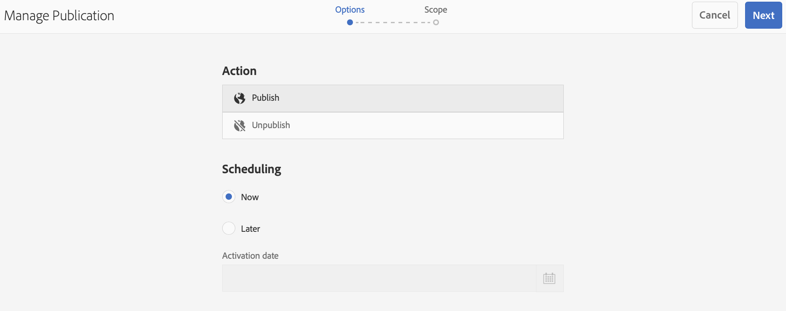

# Update voor on-demand inhoud {#on-demand}

In deze sectie wordt on-demand-inhoud voor het beheer van publicaties beschreven.

## Publicatie beheren: Inhoudsupdates leveren van auteur naar apparaat voor publicatie {#managing-publication-delivering-content-updates-from-author-to-publish-to-device}

U kunt inhoud vanuit AEM Screens publiceren en de publicatie ervan ongedaan maken. Met de functie Publicatie beheren kunt u inhoud-updates van de auteur leveren en op het apparaat publiceren. U kunt inhoud publiceren/unpublish voor uw volledige AEM Screens-project of slechts voor één van uw kanalen, plaats, apparaat, toepassing, of een programma.

### Publicatie voor een AEM Screens-project beheren {#managing-publication-for-an-aem-screens-project}

Voer de onderstaande stappen uit om inhoud te updaten van auteur tot uitgever naar apparaat voor een AEM Screens-project:

1. Ga naar uw AEM Screens-project.
1. Selecteren **Publicatie beheren** van de actiebar zodat kunt u het project aan uw publiceren instantie.

   

1. De **Publicatie beheren** wizard wordt geopend. U kunt de **Handeling** en plant ook de publicatietijd voor nu of later. Selecteren **Volgende**.

   

1. Controleer de doos zodat kunt u het volledige project van selecteren **`Manage Publication`** wizard.

   

1. Selecteren **+ Inclusief onderliggende items** van de actiebar en uncheck alle opties zodat kunt u alle modules in uw project publiceren en selecteren **Toevoegen** publiceren.

   >[!NOTE]
   >
   >Door gebrek, worden alle vakjes gecontroleerd en u moet de vakjes manueel uncheck om alle modules in uw project te publiceren.

   

   **Het dialoogvenster Inclusief onderliggende elementen**

   De bovenstaande stappen laten zien hoe u de volledige inhoud kunt publiceren. Als u de andere drie beschikbare alternatieven wilt gebruiken, moet u die bepaalde optie controleren.
In de volgende afbeelding ziet u bijvoorbeeld hoe u alleen de gewijzigde pagina&#39;s in uw project kunt beheren en bijwerken:
   

   Volg de onderstaande uitleg om inzicht te krijgen in de beschikbare opties:

   1. **Alleen directe kinderen opnemen**: Met deze optie kunt u alleen updates voor de subknooppunten in uw projectstructuur beheren.
   1. **Alleen gewijzigde pagina&#39;s opnemen**: Met deze optie kunt u alleen updates beheren voor de gewijzigde pagina&#39;s van het project waar de wijzigingen zich bevinden in de projectstructuur.
   1. **Alleen reeds gepubliceerde pagina&#39;s opnemen**: Met deze optie kunt u alleen updates beheren voor de pagina&#39;s die eerder zijn gepubliceerd.

1. Van de **`Manage Publication wizard`**, selecteert u **Publiceren**.

   

   >[!NOTE]
   >
   >Wacht een paar seconden/minuten, zodat de inhoud de instantie publish bereikt.
   >
   >
   >    1. De workflow werkt niet als er geen wijzigingen zijn in het project en niets als **Offline inhoud bijwerken**.
   >    1. De workflow werkt niet als de auteur het replicatieproces niet voltooit (de inhoud wordt nog geüpload naar een publicatie-instantie) nadat de auteur het **Publiceren** in de publicatieworkflow beheren.

   >[!CAUTION]
   >Als u als auteur of inhoudsmaker de wijzigingen wilt zien in de apparaten die aan de auteurinstantie zijn gekoppeld, selecteert u **Offline inhoud bijwerken** van het kanaaldashboard of door het project te selecteren. In dit geval wordt de update offline-inhoud alleen uitgevoerd in de auteurinstantie.

1. Ga naar het project en selecteer **Offline inhoud bijwerken** in de actiebalk. Deze handeling stuurt dezelfde opdracht door naar de publicatie-instantie, zodat de offline ritssluitingen ook in de publicatie-instantie worden gemaakt.

   

   >[!NOTE]
   >
   >Nadat u de publicatieworkflow hebt voltooid en wanneer er een speler is die naar een instantie Auteur verwijst, activeert u de update offline-inhoud in de auteur. Als u dit doet, wordt de update offline in de instantie Auteur gemaakt.

   >[!CAUTION]
   >
   >Trigger de update offline inhoud in de instantie Auteur, als u een speler hebt die bij de auteurserver wordt geregistreerd. Offline inhoud bijwerken is niet vereist voor de speler die is geregistreerd bij de instantie Publishing.

### Publicatie voor een kanaal beheren {#managing-publication-for-a-channel}

Voer de onderstaande stappen uit om inhoudsupdates te leveren van Auteur > Publiceren > apparaat voor een Kanaal in een AEM Screens-project:

>[!NOTE]
>
>Volg deze sectie alleen als er wijzigingen zijn in een kanaal. Als er na de vorige update geen wijzigingen zijn aangebracht in een kanaal, werkt de publicatieworkflow voor een afzonderlijk kanaal niet.

1. Navigeer naar uw AEM Screens-project en selecteer het kanaal.
1. Selecteren **Publicatie beheren** in de actiebalk, zodat u het kanaal naar uw instantie Publiceren kunt publiceren.

   

1. De **Publicatie beheren** wizard wordt geopend. U kunt de **Handeling** en plant ook de publicatietijd voor nu of later. Selecteren **Volgende**.

   

1. Selecteren **Publiceren** van de **`Manage Publication`** wizard.

   

   >[!NOTE]
   >
   >Wacht een paar seconden/minuten, zodat de inhoud de instantie publish bereikt.

1. Triggerend **Offline inhoud bijwerken** in het kanaaldashboard plaatst u alleen de offline inhoud op de instantie Auteur, maar niet de instantie Publishing. De stappen 1-4 zijn voor het duwen van off-line inhoud aan Publish instantie.

   

   >[!CAUTION]
   >
   >Publiceer eerst, dan teweegbrengt de update off-line inhoud zoals samengevat in de voorafgaande stappen.

### Opnieuw toewijzen kanaal en apparaat: {#channel-and-device-re-assignment}

Als u een apparaat opnieuw hebt toegewezen, publiceert u zowel de eerste weergave als de nieuwe weergave zodra het apparaat opnieuw is toegewezen aan de nieuwe weergave.

Als u een kanaal opnieuw hebt toegewezen, publiceert u ook de eerste weergave en de nieuwe weergave zodra het kanaal opnieuw is toegewezen aan de nieuwe weergave.
