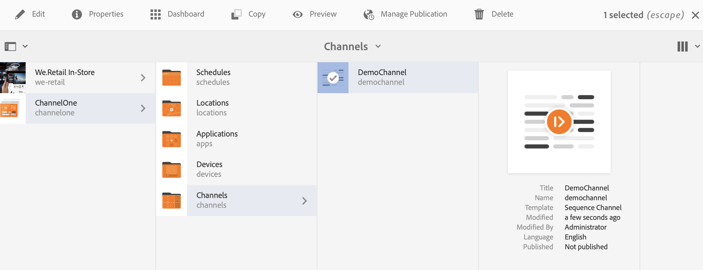

# Update voor on-demand inhoud {#on-demand}

In deze sectie wordt on-demand-inhoud voor het beheer van publicaties beschreven.

## Publicatie beheren: Inhoud-updates leveren van auteur voor publicatie op apparaat {#managing-publication-delivering-content-updates-from-author-to-publish-to-device}

U kunt inhoud publiceren en de publicatie ervan ongedaan maken vanuit AEM-schermen. Met de functie Publicatie beheren kunt u inhoud-updates van de auteur leveren en op het apparaat publiceren. U kunt inhoud publiceren/unpublish voor uw volledige project van het Scherm AEM of slechts voor één van uw kanaal, plaats, apparaat, toepassing, of een programma.

### Publicatie beheren voor een AEM-schermproject {#managing-publication-for-an-aem-screens-project}

Voer de onderstaande stappen uit om inhoudsupdates van auteur te leveren voor publicatie naar apparaat voor een AEM-schermproject:

1. Navigeer naar uw AEM-rasterproject.
1. Klik op Publicatie **** beheren op de actiebalk om het project te publiceren dat u wilt publiceren.

   

1. The **Manage Publication** wizard opens. U kunt de **actie** selecteren en ook de publicatietijd voor nu of later plannen. Click **Next**.

   

1. Schakel het selectievakje in om het volledige project te selecteren vanuit de wizard **Publicatie** beheren.

   

1. Klik op **+ Inclusief onderliggende items** op de actiebalk en schakel alle opties uit om alle modules in uw project te publiceren. Klik vervolgens op **Toevoegen** om te publiceren.

   >[!NOTE]
   >
   >Door gebrek, zullen alle dozen worden gecontroleerd en u zult manueel uncheck de dozen moeten om alle modules in uw project te publiceren.

   

   **Inzicht in het dialoogvenster Inclusief onderliggende elementen**

   In de bovenstaande stap ziet u hoe u de volledige inhoud kunt publiceren. Als u de andere drie beschikbare alternatieven wilt gebruiken, moet u die optie controleren.
Met de volgende afbeelding kunt u bijvoorbeeld alleen de gewijzigde pagina&#39;s in uw project beheren en bijwerken:
   

   Volg de onderstaande uitleg voor meer informatie over de beschikbare opties:

   1. **Alleen directe onderliggende**elementen opnemen:
Met deze optie kunt u alleen updates voor de subknooppunten in uw projectstructuur beheren.
   1. **Alleen gewijzigde pagina**&#39;s opnemen:
Met deze optie kunt u alleen updates beheren voor de gewijzigde pagina&#39;s van het project waar de wijzigingen zich bevinden in de projectstructuur.
   1. **Alleen reeds gepubliceerde pagina**&#39;s opnemen:
Met deze optie kunt u alleen updates beheren voor de pagina&#39;s die eerder zijn gepubliceerd.

1. Klik op **Publiceren** in de wizard **Publicatie beheren.**

   

   >[!NOTE]
   >
   >Wacht een paar seconden/minuten, zodat de inhoud de instantie publish bereikt.
   >
   >
   >    1. De workflow werkt niet als het project geen wijzigingen bevat en niets voor Offlineinhoud **** bijwerken.
   >    1. De workflow werkt niet als de auteur het replicatieproces niet voltooit (inhoud wordt nog geüpload naar een publicatieexemplaar) nadat deze op de knop **Publiceren** in de publicatieworkflow heeft geklikt.

   > [!CAUTION]
   > Als u als auteur of inhoudsmaker de wijzigingen wilt zien in de apparaten die aan de auteurinstantie zijn gekoppeld, klikt u op Offlineinhoud **** bijwerken vanaf het kanaaldashboard of door het project te selecteren. In dit geval wordt de update offline-inhoud alleen uitgevoerd in de auteurinstantie.

1. Navigeer naar het project en klik op Offlineinhoud **** bijwerken op de actiebalk. Deze handeling stuurt dezelfde opdracht door naar de publicatie-instantie, zodat de offline ritten ook in de publicatie-instantie worden gemaakt.

   

   >[!NOTE]
   >
   >Nadat u de publicatieworkflow voor beheren hebt voltooid en een speler naar de instantie van de auteur verwijst, moet u de update offline activeren in de auteur. De update wordt dan offline op de instantie van de auteur gemaakt.

   >[!CAUTION]
   >
   >U moet de update offline inhoud in auteursinstantie teweegbrengen, als u een speler hebt die bij de auteursserver wordt geregistreerd. Offline inhoud bijwerken is niet vereist voor de speler die is geregistreerd bij de publicatie-instantie.

### Publicatie voor een kanaal beheren {#managing-publication-for-a-channel}

Voer de onderstaande stappen uit om inhoudsupdates van auteur te leveren voor publicatie naar apparaat voor een Kanaal in een AEM-schermproject:

>[!NOTE]
>
>Volg deze sectie alleen als er wijzigingen zijn in een kanaal. Als er na de vorige update geen wijzigingen zijn aangebracht in een kanaal, werkt de publicatieworkflow voor een afzonderlijk kanaal niet.

1. Navigeer naar het project Schermen en selecteer het kanaal.
1. Klik op Publicatie **** beheren op de actiebalk om het kanaal te publiceren dat u wilt publiceren.

   

1. The **Manage Publication** wizard opens. U kunt de **actie** selecteren en ook de publicatietijd voor nu of later plannen. Click **Next**.

   

1. Klik op **Publiceren** in de wizard **Publicatie beheren.**

   

   >[!NOTE]
   >
   >Wacht een paar seconden/minuten, zodat de inhoud de instantie publish bereikt.

1. Als u Offline-inhoud **** bijwerken activeert op het dashboard voor kanalen, wordt de offlineinhoud alleen naar de ontwerpinstantie verschoven, maar wordt de publicatie-instantie niet gepubliceerd. De stappen 1-4 zijn voor het drukken van off-line inhoud om instantie te publiceren.

   

   >[!CAUTION]
   >
   >U moet eerst de update offline inhoud publiceren en vervolgens activeren, zoals samengevat in de voorgaande stappen.

### Opnieuw toewijzen kanaal en apparaat: {#channel-and-device-re-assignment}

Als u een apparaat opnieuw hebt toegewezen, moet u zowel de eerste weergave als de nieuwe weergave publiceren zodra het apparaat opnieuw is toegewezen aan de nieuwe weergave.

Als u een kanaal opnieuw hebt toegewezen, moet u ook zowel de eerste weergave als de nieuwe weergave publiceren zodra het kanaal opnieuw is toegewezen aan de nieuwe weergave.