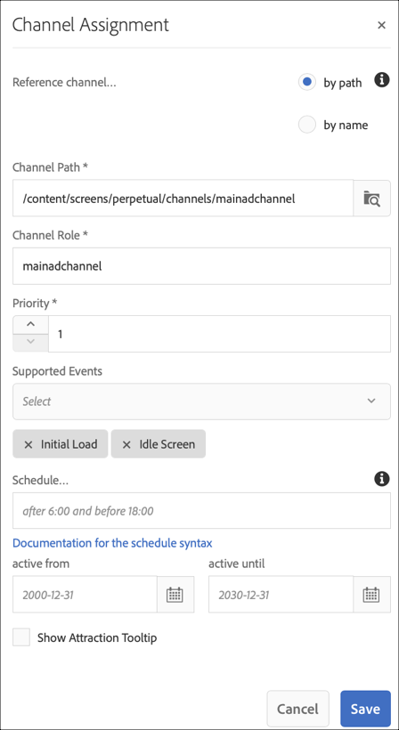
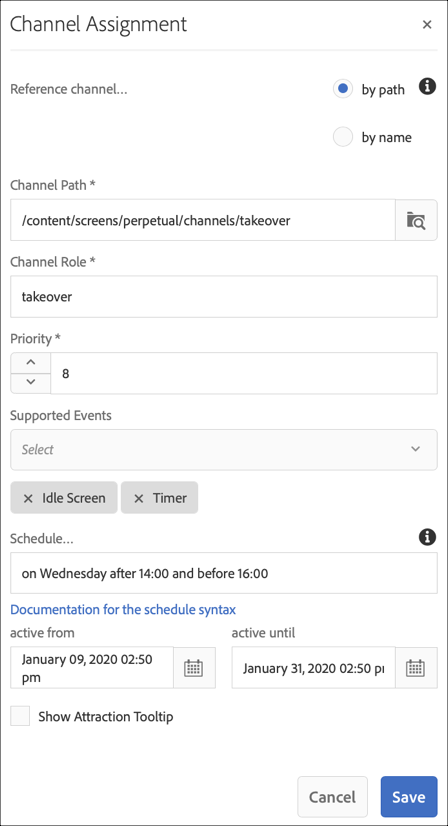

# Perpetual TakeOver Channel {#perpetual-takeover-channel}

De volgende pagina toont een gebruiksgeval dat op vestiging een project op benadrukt hoe te om een Perpetual te creëren TakeOver kanaal dat voor een specifieke tijddag en een tijd onophoudelijk speelt.

## Omschrijving hoofdletter gebruiken {#use-case-description}

Met deze optie wordt uitgelegd hoe u een kanaal kunt maken dat het normale afspeelkanaal *overneemt* voor een weergave of groep weergaven. De overname zal een bepaalde dag en tijd onafgebroken plaatsvinden.
Bijvoorbeeld, is er een Perpetual TakeOver kanaal dat elke Vrijdag van 9AM aan 10AM speelt. Tijdens deze tijd, zou geen ander kanaal moeten spelen. In het volgende voorbeeld ziet u hoe u een perpetual takeover channel maakt waarmee de inhoud elke woensdag 2 uur vanaf 14.00 tot 16.00 uur kan worden afgespeeld.

### Voorwaarden {#preconditions}

Voordat u met dit gebruik begint, moet u controleren hoe u dit kunt doen:

* **[Kanalen maken en beheren](managing-channels.md)**
* **[Locaties maken en beheren](managing-locations.md)**
* **[Planningen maken en beheren](managing-schedules.md)**
* **[Apparaatregistratie](device-registration.md)**

### Primaire acteurs {#primary-actors}

Inhoudsauteurs

## Het project instellen {#setting-up-the-project}

Voer de onderstaande stappen uit om een project in te stellen:

**Kanalen en weergave instellen**

1. Maak een AEM-schermproject met de naam **PerpetualTakeOver**, zoals hieronder wordt weergegeven.

   

1. Maak een **MainAdChannel** in de map **Kanalen** .

   

1. Selecteer **MainAdChannel** en klik op **Bewerken** op de actiebalk. Sleep enkele elementen (afbeeldingen, video&#39;s, ingesloten reeksen) naar het kanaal.

   

   >[!NOTE]
   >Het **MainAdChannel** in dit voorbeeld toont een opeenvolgingskanaal aan dat inhoud onophoudelijk speelt.

1. Creeer een **TakeOver** kanaal dat de inhoud in **MainAdChannel** overneemt en elke woensdag van 2:00 tot 16:00 zal spelen.

1. Selecteer **TakeOver** en klik **uitgeven** van de actiebar. Sleep enkele elementen naar uw kanaal. In het volgende voorbeeld ziet u hoe een afbeelding met één zone wordt toegevoegd aan dit kanaal.

   

1. Stel een locatie en weergave voor uw kanalen in. Bijvoorbeeld, wordt de volgende plaats **MainLobby** en vertoning **MainLobbyDisplay** opstelling voor dit project.

   

**Kanalen toewijzen aan een weergave**

1. Selecteer de display **MainLobbyDisplay** in de map **Locations** . Klik op Kanaal **** toewijzen op de actiebalk om het dialoogvenster **Kanaaltoewijzing** te openen.

   >[!NOTE]
   >Zie **[Kanaaltoewijzing](channel-assignment.md)**voor meer informatie over het toewijzen van een kanaal aan een weergave.

1. Vul de velden (**Kanaalpad**, **Prioriteit** en **Ondersteunde gebeurtenissen**) in het dialoogvenster **Kanaaltoewijzing** en klik op **Opslaan** **** om de MainAdChannel toe te wijzen aan uw weergave.

   * **Kanaalpad**: Het pad naar het **MainAdChannel** -kanaal selecteren
   * **Prioriteit**: Stel de prioriteit van dit kanaal in op 1.
   * **Ondersteunde gebeurtenissen**: Selecteer de **Eerste keer laden** en **Niet-actief scherm**.
   

1. Selecteer de weergave **TakeOver** in de map **Locations** . Klik op Kanaal **** toewijzen op de actiebalk om het kanaal voor overname toe te wijzen.

1. Als u het kanaal **TakeOver** op een gepland tijdstip aan uw weergave wilt toewijzen, vult u de volgende velden in vanuit het dialoogvenster **Kanaaltoewijzing** en klikt u op **Opslaan**:

   * **Kanaalpad**: Het pad naar het **kanaal TakeOver** selecteren
   * **Prioriteit**: Plaats de prioriteit van dit kanaal groter dan **MainAdChannel**. De prioriteit die in dit voorbeeld wordt ingesteld, is bijvoorbeeld 8.
   * **Ondersteunde gebeurtenissen**: Selecteer het **Stationele Scherm** en de **Tijdopnemer**.
   * **Schema**: Voer de tekst in voor het schema waarop u wilt dat dit kanaal de weergave uitvoert. De tekst in het in dit voorbeeld vermelde **schema** staat *op woensdag na 14.00 uur en vóór 16.00 uur*.
      >[!NOTE]
      >Meer over de uitdrukkingen leren u aan het **Programma** kunt toevoegen, verwijs naar de hieronder sectie van de Uitdrukkingen [van het](#example-expressions) Voorbeeld.
   * **actief van**: Begindatum en -tijd.
   * **actief tot**: Einddatum en -tijd.

      Bijvoorbeeld, staat de tekst in **Programma** en **actief van** en **actief tot** datum en tijd hier de inhoud toe om elke Woensdag van 2:00 tot 16:00 te spelen.

      

      Navigeer naar de weergave vanuit **TakeOver** —> **Locaties** —> **MainLobby** —> **MainLobbyDisplay** en klik op **Dashboard** op de actiebalk om de toegewezen kanalen met hun prioriteiten weer te geven, zoals hieronder wordt weergegeven.

      >[!NOTE]
      >Het is verplicht de prioriteit van het overnamekanaal als hoogste vast te stellen.

      Now, zal het **TakeOver** kanaal het **MainAdChannel** om 2:00 uur voor twee uur tot 16:00 uur elke woensdag overnemen en zijn inhoud van 09 januari 2020 tot 31 januari 2020 afspelen.

## Voorbeeldexpressies {#example-expressions}

In de volgende tabel worden enkele voorbeeldexpressies samengevat die u aan het schema kunt toevoegen terwijl u kanaal toewijst aan een weergave.

| **Expressie** | **Interpretatie** |
|---|---|
| vóór 8:00 | het kanaal speelt vóór 8:00 uur dagelijks |
| 14:00 | het kanaal wordt dagelijks om 14.00 uur afgespeeld |
| na 12:15 en vóór 12:45 | het kanaal wordt 30 minuten lang elke dag om 12:15 uur afgespeeld |
| vóór 12:15 ook na 12:45 | het kanaal wordt dagelijks vóór 12:15 uur afgespeeld en vervolgens ook na 12:45 uur |
| op de eerste dag van januari na 23.00 uur ook op de tweede dag van januari, ook op de derde dag van januari vóór 15.00 uur | het kanaal begint na 1 januari om 2:00 uur af te spelen, gaat de hele dag door met afspelen op 2 januari tot 3:00 uur op 3 januari |
| op de 1-2 dag van januari na 2:00 uur, ook op de 2-3 dag van januari vóór 15.00 uur | Het kanaal start speler na 1 januari om 2:00 uur, gaat verder met spelen tot 2 januari om 3:00 uur, dan start het opnieuw op 2 januari om 2:00 uur en gaat verder met spelen tot 3:00 uur op 3 januari |

>[!NOTE]
>U kunt ook _militaire tijd_ notatie (dat wil zeggen 14:00) gebruiken in plaats van *am/pm* notatie (dat wil zeggen, 2:00 pm).
