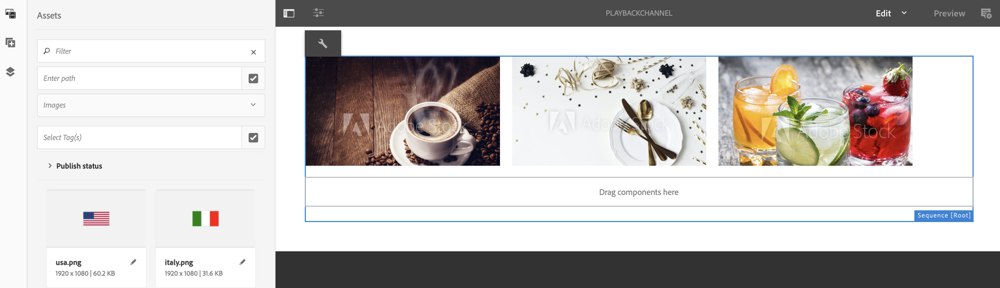

# Tijdsduur afspeelafbeelding op projectniveau {#project-level-image-playback}

## Overzicht {#overview}

Met deze functie kunt u de afspeelduur van afbeeldingen op projectniveau definiëren. In alle afbeeldingen wordt deze afspeelduur standaard overgenomen. Als geen duur op het projectniveau wordt bepaald, blijft het standaardplayback van 8 seconden verdergaan.

### Vereisten {#prerequisites}

Voordat u deze functie kunt gebruiken, moet u een project instellen als een voorwaarde voor het implementeren van deze functie. Bijvoorbeeld:

1. Een AEM Screens-project maken (in dit voorbeeld: **ProjectLevelPlayback**).
1. Een volgnummer maken als **PlayBackChannel** krachtens **Kanalen** map.
1. Inhoud toevoegen aan **PlayBackChannel**.

   

   In de volgende afbeelding ziet u bijvoorbeeld de afbeeldingen die aan de **PlayBackChannel** editor:

   

## Tijdsduur afbeelding afspelen op projectniveau bewerken {#editing-project-level-image-playback-duration-assignment}

In de onderstaande sectie wordt uitgelegd hoe u de afspeelduur van inhoud in een AEM Screens-project kunt bewerken.

### De afspeelduur voor afbeeldingen bijwerken op projectniveau {#updating-the-playback-duration-for-images-in-a-project}

>[!NOTE]
>
>Als u de afspeelduur op afbeeldings- of kanaalniveau wilt bijwerken, raadpleegt u [Duur afspeelafbeelding op kanaalniveau](channel-level-image-playback.md).

Volg de onderstaande stappen om te leren hoe u de duur van het afspelen van afbeeldingen op projectniveau kunt bijwerken:

1. Ga naar uw project **ProjectLevelPlayback** en selecteert u **Eigenschappen** in de actiebalk.
   

1. Selecteer alle afbeeldingen in het kanaal en selecteer het moersleutelpictogram linksboven (zoals in de onderstaande afbeelding), zodat u het dialoogvenster Kanaalniveau configureren kunt openen.

   

1. De **Pagina** wordt geopend.

   >[!NOTE]
   >
   >De afbeeldingen in een kanaal worden standaard ingesteld op een afspeelduur van 8 seconden en de video&#39;s worden op de standaardduur afgespeeld.

   

   Bewerk de **Duur** van 8000 (milliseconden) tot 3000 (milliseconden), dat wil zeggen, 3 seconden. Selecteer het vinkje in de rechterbovenhoek van het dialoogvenster **Pagina** zodat uw wijzigingen worden opgeslagen.

   

### Het resultaat weergeven {#viewing-the-result}

Nadat u de afspeelduur van het kanaal hebt bijgewerkt (in dit voorbeeld worden alle drie de afbeeldingen weergegeven), worden de afbeeldingen nu 3 seconden afgespeeld in plaats van 8 seconden (standaardwaarde).

