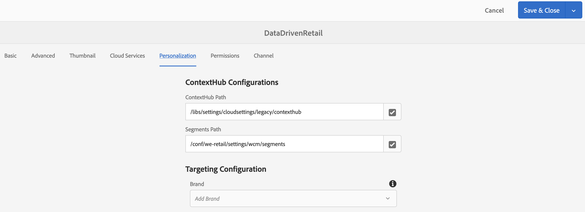

# Activering {#retail-inventory-targeted-activation} gericht op handelsvoorraad

In het volgende gebruiksgeval worden drie verschillende afbeeldingen gedemonstreerd op basis van de waarden in uw Google-werkblad.

## Beschrijving {#description}

In deze Use Case wordt de voorraad voor de detailhandel getoond voor drie verschillende gekleurde sweatshirts. Afhankelijk van het aantal sweatshirts dat beschikbaar is in voorraad en dat is opgenomen in Google Sheets, wordt de afbeelding (rood, groen of blauw sweatshirt) met het hoogste aantal weergegeven op het scherm.

Voor dit geval van Gebruik, zal de Rood, Groen, of Blauwe trui op uw scherm tonen die op de hoogste waarde van aantal sweaters wordt gebaseerd die beschikbaar is.

## Voorwaarden {#preconditions}

Voordat u begint met het implementeren van de in de handel verkrijgbare activering, moet u leren hoe u ***Gegevensopslag***, ***Audience Segmentation*** en ***Enable Targeting for Channels*** in een AEM Screens-project instelt.

Verwijs naar [het Vormen ContextHub in AEM Screens](configuring-context-hub.md) voor gedetailleerde informatie.

## Basisstroom {#basic-flow}

Volg de onderstaande stappen om de Gebruiksscenario voor de activering van de Retail Inventory te implementeren:

1. **De Google Sheets vullen**

   1. Navigeer naar het Google-werkblad ContextHubDemo.
   1. Voeg drie kolommen (Rood, Groen en Blauw) toe met de bijbehorende waarden voor drie verschillende sweatshirts.

   

1. **Het publiek configureren volgens de vereisten**

   1. Navigeer naar de segmenten in uw publiek (zie ***Stap 2: De Segmentatie van het publiek van de vestiging*** in **[Het vormen ContextHub in AEM Screens](configuring-context-hub.md)** pagina voor meer details).

   1. Voeg drie nieuwe segmenten **For_Red**, **For_Green** en **For_Blue** toe.

   1. Selecteer **For_Red** en klik **Edit** in de actiebalk.

   1. Sleep de **Vergelijking: Bezit - bezit** aan de redacteur en klik vormen pictogram om de eigenschappen uit te geven.
   1. Selecteer **googlesheets/value/1/2** in de vervolgkeuzelijst in **Voornaam eigenschap**

   1. Selecteer **Operator** als **groter-dan** van het drop-down menu

   1. Selecteer **Gegevenstype** als **getal**

   1. Selecteer **googlesheets/value/1/1** in de vervolgkeuzelijst in **Tweede eigenschapsnaam**.

   1. **een andere vergelijking slepen en neerzetten: Bezit - bezit** aan de redacteur en klik vormen pictogram om de eigenschappen uit te geven.
   1. Selecteer **googlesheets/value/1/2** in de vervolgkeuzelijst in **Voornaam eigenschap**.

   1. Selecteer **Operator** als **groter-dan** van het drop-down menu

   1. Selecteer **Gegevenstype** als **getal**

   1. Selecteer **googlesheets/value/1/0** in de vervolgkeuzelijst in **Tweede eigenschapsnaam**

   

   Op dezelfde manier geef en voeg vergelijkingsbezitsregels aan **For_Blue** segment zoals aangetoond in het hieronder cijfer uit:

   

   Op dezelfde manier geef en voeg vergelijkingsbezitsregels aan* voor_Groen **segment toe zoals aangetoond in het hieronder cijfer:

   

   >[!NOTE]
   >
   >Voor segmenten **For_Green** en **For_Green** kunnen gegevens niet worden opgelost in de editor omdat alleen de eerste vergelijking nu geldig is volgens de waarden in het Google-blad.

1. Navigeer en selecteer uw **DataDrivenRetail** kanaal (een opeenvolgend kanaal) en klik **Edit** van de actiebar.

   

   >[!CAUTION]
   >
   >U zou opstelling uw **ContextHub** **Configuraties** moeten hebben gebruikend het kanaal **Eigenschappen** —> **Personalization** tabel.

   

   >[!NOTE]
   U moet zowel **Merk** als **Gebied** voor de activiteiten selecteren om behoorlijk te worden vermeld wanneer u het Targeting proces begint.

1. **Een standaardafbeelding toevoegen**

   1. Voeg een standaardafbeelding toe aan uw kanaal en klik op **Doelafbeelding**.
   1. Selecteer **Merk** en **Activiteit** van het drop-down menu en klik **Begin richten**.

   1. Klik **Beginnen met richten**.

   

   >[!NOTE]
   Voordat u de doelframes maakt, moet u de segmenten (**For_Green**, **For_Red** en **For_Blue**) toevoegen door te klikken op **+ Add Experience Targeting** vanuit de zijspoor, zoals in de onderstaande afbeelding wordt getoond.

   

1. Voeg de afbeeldingen toe aan alle drie de verschillende scenario&#39;s, zoals hieronder wordt weergegeven.

   

1. **De voorvertoning controleren**

   1. Klik op **Voorvertoning.** Open ook uw Google-werkblad en werk de waarde ervan bij.
   1. Wijzig de waarde voor alle drie de kolommen en u ziet hoe de afbeelding van de weergave wordt bijgewerkt volgens de hoogste waarde in de voorraad.

   

