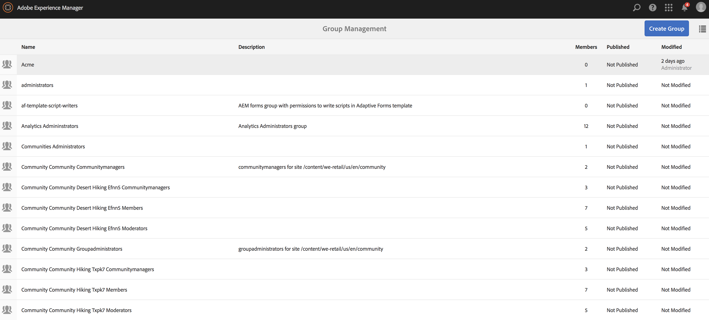

# ACLs van de vestiging {#setting-up-acls}

De volgende sectie verklaart hoe te om projecten te segregeren gebruikend ACLs zodat elk individu of team hun eigen project behandelt.

Als AEM beheerder, wilt u ervoor zorgen dat de teamleden van een project zich niet in andere projecten mengen en elk van de gebruikers specifieke rollen zoals per projectvereisten worden toegewezen.

## Machtigingen instellen {#setting-up-permissions}

De volgende stappen vatten de procedure voor vestiging ACLs voor een project samen:

1. Aanmelden om te AEM en naar **Gereedschappen** > **Beveiliging**.

   

1. Klikken **Groepen** en voer een id in (bijvoorbeeld Acme).

   U kunt ook deze koppeling gebruiken, `http://localhost:4502/libs/granite/security/content/groupadmin.html`.

   Selecteer vervolgens **Opslaan**.

   

1. Selecteren **Medewerkers** in de lijst en dubbelklik erop.

   

1. Voeg de **Acme** (project dat u hebt gemaakt) naar **Leden aan groep toevoegen**. Klikken **Opslaan**.

   

   >[!NOTE]
   >
   >Als u projectteamleden spelers wilt registreren (wat het creëren van een gebruiker voor elke speler impliceert) zoek de groep gebruiker-beheerders en voeg de ACME groep aan gebruiker-beheerders toe

1. Voeg alle gebruikers toe die aan de **Acme** Project aan de **Acme** groep.

   

1. De machtigingen voor de groep instellen **Acme** gebruiken `(http://localhost:4502/useradmin)`.

   Selecteer de groep **Acme** en klik op de knop **machtigingen**.

   

### Machtigingen {#permissions}

De volgende lijst vat de weg met de toestemmingen op het projectniveau samen:

| **Pad** | **Machtiging** | **Beschrijving** |
|---|---|---|
| `/apps/<project>` | LEZEN | Biedt indien van toepassing toegang tot projectbestanden. |
| `/content/dam/<project>` | ALLES | Biedt toegang tot de opslag van de projectelementen, zoals afbeeldingen of video in DAM. |
| `/content/screens/<project>` | ALLES | Verwijdert toegang tot alle andere projecten onder /content/screens. |
| `/content/screens/svc` | LEZEN | Biedt toegang tot de registratieservice. |
| `/libs/screens` | LEZEN | Biedt toegang tot DCC. |
| `/var/contentsync/content/screens/` | ALLES | Hiermee kunt u offline inhoud voor het project bijwerken. |

>[!NOTE]
>
>Soms kunt u auteurfuncties (zoals het beheren van activa en het creëren van kanalen) van adminfuncties (zoals het registreren van spelers) scheiden. In zulk een scenario, creeer twee groepen en voeg de auteursgroep aan contribuanten en de admingroep aan zowel auteurs als gebruiker-beheerders toe.

### Groepen maken {#creating-groups}

Het creëren van een project zou standaardgebruikersgroepen met een basisreeks toegewezen toestemmingen ook moeten tot stand brengen. Breid de toestemmingen tot de typische rollen uit die in AEM Screens worden bepaald.

U kunt bijvoorbeeld de volgende projectspecifieke groepen maken:

* Scherm Projectbeheerders
* Schert Projectoperators (registreer spelers en beheer locaties en apparaten)
* De Gebruikers van het Project van schermen (werk met kanalen, programma&#39;s, en kanaaltaken)

De volgende tabel geeft een overzicht van de groepen met een beschrijving en machtigingen voor een AEM Screens-project:

<table>
 <tbody>
  <tr>
   <td><strong>Groepsnaam</strong></td>
   <td><strong>Beschrijving</strong></td>
   <td><strong>Machtigingen</strong></td>
  </tr>
  <tr>
   <td>Schermbeheerders  <em>screens-admins</em></td>
   <td>Toegang op beheerniveau voor AEM Screens-mogelijkheden</td>
   <td>
    <ul>
     <li>Lid van contribuanten</li>
     <li>Lid van gebruikersbeheerders</li>
     <li>ALLE /content/screens</li>
     <li>ALLE /content/dam</li>
     <li>ALL /content/experience-fragments</li>
     <li>ALLE /etc/ontwerp/schermen</li>
    </ul> </td>
  </tr>
  <tr>
   <td>Schermgebruikers  <em>schermen-gebruikers</em></td>
   <td>Kanalen en schema's maken en bijwerken en toewijzen aan locaties in AEM Screens</td>
   <td>
    <ul>
     <li>Lid van contribuanten</li>
     <li>&lt;project&gt; /content/screens</li>
     <li>&lt;project&gt; /content/dam</li>
     <li>&lt;project&gt; /content/experience-fragments</li>
    </ul> </td>
  </tr>
  <tr>
   <td>Schermoperatoren  <em>schermoperatoren</em></td>
   <td>Locatiestructuur maken en bijwerken en spelers registreren in AEM Screens</td>
   <td>
    <ul>
     <li>Lid van contribuanten</li>
     <li>jcr:alle /home/users/screens</li>
     <li>jcr:alle /home/groups/screens</li>
     <li>&lt;project&gt; /content/screens</li>
    </ul> </td>
  </tr>
  <tr>
   <td>Schermspelers  <em>schermen-&lt;project&gt;-devices</em></td>
   <td>Hiermee worden alle spelers en alle spelers/apparaten automatisch gegroepeerd als leden van de contribuanten.</td>
   <td>
 Lid van contribuanten
 </td>
  </tr>
 </tbody>
</table>
