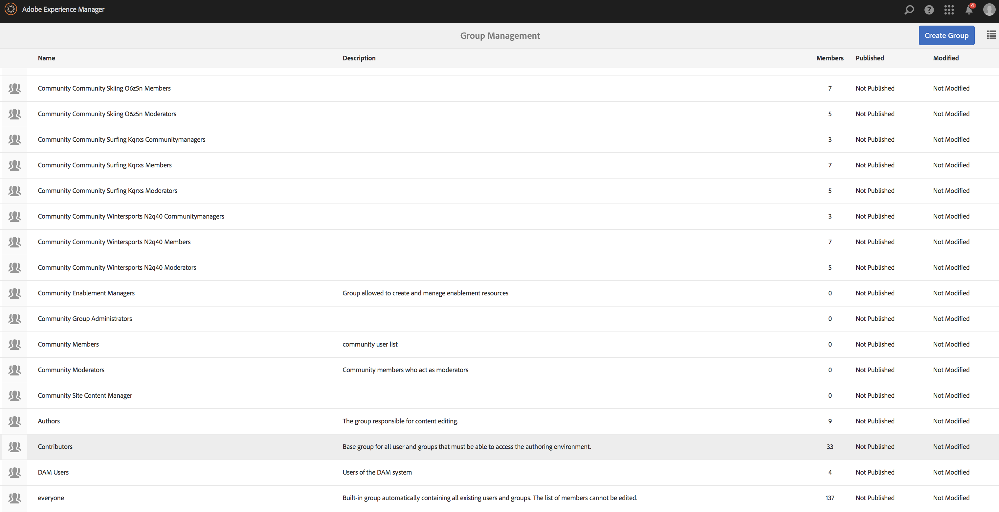

# De Lijsten van het Toegangsbeheer van de vestiging (ACLs) {#setting-up-acls}

De volgende sectie verklaart hoe te om projecten te scheiden die de Lijsten van het Toegangsbeheer (ACLs) gebruiken zodat elk individu of team hun eigen project behandelt.

Als AEM beheerder, wilt u ervoor zorgen dat de teamleden van een project zich niet in andere projecten mengen. Elke gebruiker wordt toegewezen specifieke rollen zoals per projectvereisten.

## Machtigingen instellen {#setting-up-permissions}

De volgende stappen vatten de procedure voor vestiging ACLs voor een project samen:

1. Login aan AEM en navigeer aan **Hulpmiddelen** > **Veiligheid**.

   

1. Klik **Groepen** en ga identiteitskaart (bijvoorbeeld, Toegang) in.

   U kunt deze koppeling ook gebruiken, `http://localhost:4502/libs/granite/security/content/groupadmin.html` .

   Daarna, klik **sparen**.

   

1. Klik **Medewerkers** van de lijst en klik het tweemaal.

   

1. Voeg de **Toegang** (project dat u) creeerde toe **leden aan de Groep** toevoegen. Klik **sparen**.

   

   >[!NOTE]
   >
   >Als u projectteamleden spelers wilt registreren (wat het creëren van een gebruiker voor elke speler impliceert) zoek de groep gebruiker-beheerders en voeg de ACME groep aan gebruiker-beheerders toe

1. Voeg alle gebruikers toe die aan het **Acme** Project aan de **Acme** groep werken.

   

1. Opstelling de toestemmingen voor de groep **Toegang** gebruikend dit `(http://localhost:4502/useradmin)`.

   Klik de groep **Toegang** en klik de **toestemmingen**.

   

### Machtigingen {#permissions}

De volgende lijst vat de weg met de toestemmingen op het projectniveau samen:

| **Weg** | **Toestemming** | **Beschrijving** |
|---|---|---|
| `/apps/<project>` | LEZEN | Indien van toepassing toegang verlenen tot projectbestanden. |
| `/content/dam/<project>` | ALLES | Toegang bieden tot de opslag van de projectmiddelen, zoals afbeeldingen of video in DAM. |
| `/content/screens/<project>` | ALLES | Verwijdert toegang tot alle andere projecten onder /content/screens. |
| `/content/screens/svc` | LEZEN | Toegang verlenen tot de registratieservice. |
| `/libs/screens` | LEZEN | Toegang tot DCC bieden. |
| `/var/contentsync/content/screens/` | ALLES | Help u offline inhoud voor het project bij te werken. |

>[!NOTE]
>
>Soms kunt u auteurfuncties (zoals het beheren van activa en het creëren van kanalen) van adminfuncties (zoals het registreren van spelers) scheiden. In zulk een scenario, creeer twee groepen en voeg de auteursgroep aan contribuanten en de admingroep aan zowel auteurs als gebruiker-beheerders toe.

### Groepen maken {#creating-groups}

Het creëren van een project zou standaardgebruikersgroepen met een basisreeks toegewezen toestemmingen ook moeten tot stand brengen. Breid de toestemmingen tot de typische rollen uit die in AEM Screens worden bepaald.

U kunt bijvoorbeeld de volgende projectspecifieke groepen maken:

* Screens-projectbeheerders
* Screens Project Operators (registreer spelers en beheer locaties en apparaten)
* Screens Project Users (werken met kanalen, planningen en kanaaltoewijzingen)

De volgende tabel geeft een overzicht van de groepen met een beschrijving en machtigingen voor een AEM Screens-project:

<table>
 <tbody>
  <tr>
   <td><strong>Groepsnaam</strong></td>
   <td><strong>Beschrijving</strong></td>
   <td><strong>Machtigingen</strong></td>
  </tr>
  <tr>
   <td>Screens Admins  <em><code>screens-admins</code></em></td>
   <td>Toegang op beheerniveau voor AEM Screens-mogelijkheden</td>
   <td>
    <ul>
     <li>Lid van contribuanten</li>
     <li>Lid van gebruikersbeheerders</li>
     <li>ALLE /content/screens</li>
     <li>ALLE /content/dam</li>
     <li>ALL /content/experience-fragments</li>
     <li>ALLE /etc/ontwerp/schermen</li>
    </ul> </td>
  </tr>
  <tr>
   <td>Screens-gebruikers  <em><code>screens-users</code></em></td>
   <td>Kanalen en schema's maken en bijwerken en toewijzen aan locaties in AEM Screens</td>
   <td>
    <ul>
     <li>Lid van contribuanten</li>
     <li><code>&lt;project&gt; /content/screens</code></li>
     <li><code>&lt;project&gt; /content/dam</code></li>
     <li><code>&lt;project&gt; /content/experience-fragments</code></li>
    </ul> </td>
  </tr>
  <tr>
   <td>Screens-operatoren  <em><code>screens-operators</code></em></td>
   <td>Locatiestructuur maken en bijwerken en spelers registreren in AEM Screens</td>
   <td>
    <ul>
     <li>Lid van contribuanten</li>
     <li><code>jcr:all /home/users/screens</code></li>
     <li><code>jcr:all /home/groups/screens</code></li>
     <li><code>&lt;project&gt; /content/screens</code></li>
    </ul> </td>
  </tr>
  <tr>
   <td>Screens-spelers  <em><code>screens-&lt;project&gt;-devices</code></em></td>
   <td>Alle spelers en alle spelers/apparaten zijn automatisch lid van de contribuanten.</td>
   <td>
 Lid van contribuanten
 </td>
  </tr>
 </tbody>
</table>
