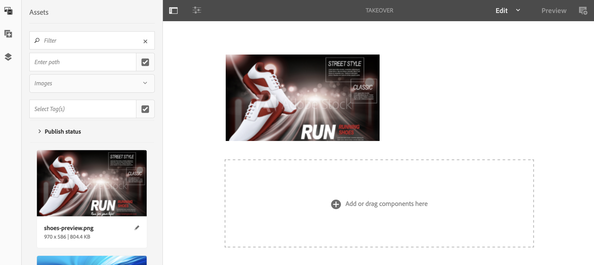
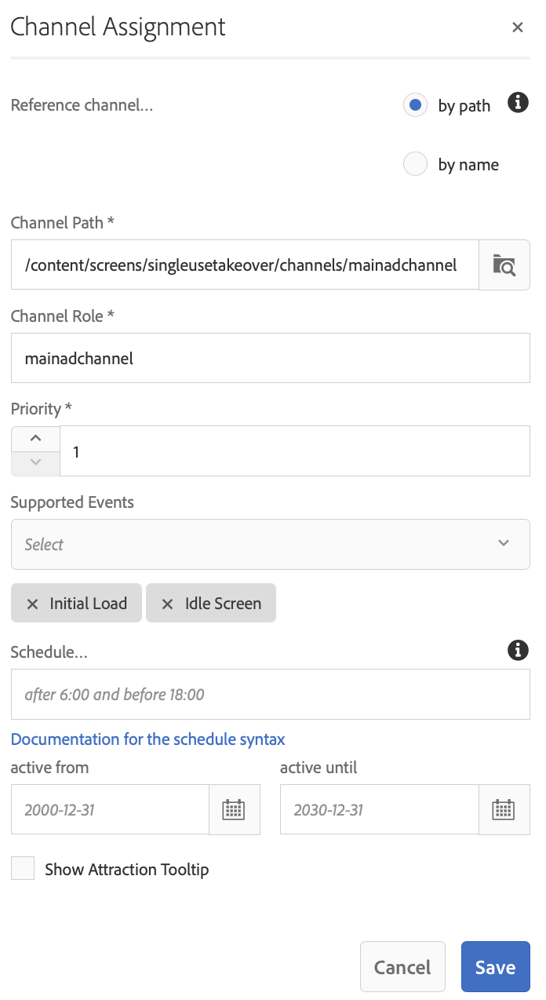
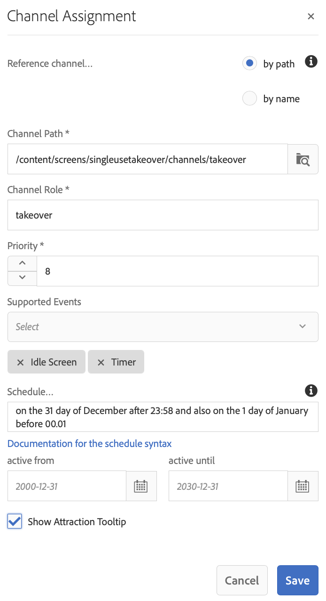

# Overnamekanaal voor één gebruik {#single-use-takeover-channel}

De volgende pagina toont een gebruiksgeval dat op vestiging een project op benadrukt hoe te om een Enig kanaal tot stand te brengen TakeOver dat één keer voor een specifieke tijd speelt.

## Omschrijving hoofdletter gebruiken {#use-case-description}

Met deze optie wordt uitgelegd hoe u een kanaal maakt dat *overname* in het normale afspeelkanaal voor een weergave of groep weergaven. De overname vindt slechts eenmaal en voor een bepaalde tijd plaats.

Er is bijvoorbeeld een Single TakeOver-kanaal dat op vrijdag 9.00 tot 10.00 uur &#39;s nachts wordt afgespeeld. Er is dan geen enkel ander kanaal nodig. Voor en na deze keer wordt het overnamekanaal voor eenmalig gebruik niet afgespeeld. In het volgende voorbeeld wordt de creatie getoond van één overnamekanaal waarmee de inhoud gedurende 2 minuten vóór 12:00 uur op 31 december kan worden afgespeeld tot 12:01 uur

### Voorwaarden {#preconditions}

Voordat u met dit gebruik begint, moet u controleren hoe u dit kunt doen:

* **[Kanalen maken en beheren](managing-channels.md)**
* **[Locaties maken en beheren](managing-locations.md)**
* **[Planningen maken en beheren](managing-schedules.md)**
* **[Apparaatregistratie](device-registration.md)**

### Primaire acteurs {#primary-actors}

Inhoudsauteurs

## Het project instellen {#setting-up-the-project}

Voer de onderstaande stappen uit om een project in te stellen:

**Kanalen en weergave instellen**

1. Een AEM Screens-project maken met de naam **SingleUseTakeOver**, zoals hieronder weergegeven.

   

1. Een **MainAdChannel** in de **Kanalen** map.

   

1. Selecteer de **MainAdChannel** en klik op **Bewerken** in de actiebalk. Sleep enkele elementen (afbeeldingen, video&#39;s, ingesloten reeksen) naar het kanaal.

   

   >[!NOTE]
   >De **MainAdChannel** in dit voorbeeld wordt een volgnummer weergegeven waarmee inhoud continu wordt afgespeeld.

   

1. Een **Overname** kanaal dat de inhoud in **MainAdChannel** en wordt alleen gedurende een bepaalde dag en tijd afgespeeld.

1. Selecteer de **Overname** en klik op **Bewerken** in de actiebalk. Sleep enkele elementen naar uw kanaal. In het volgende voorbeeld ziet u hoe een afbeelding met één zone wordt toegevoegd aan dit kanaal.

   

1. Stel een locatie en weergave voor uw kanalen in. Bijvoorbeeld het volgende **Lobby** locatie en  **MainLobbyDisplay** de vertoning wordt opstelling voor dit project.

   

**Kanalen toewijzen aan een weergave**

1. De weergave selecteren **MainLobbyDisplay** van de **Locaties** map. Klikken **Kanaal toewijzen** in de actiebalk.

   

   >[!NOTE]
   >Raadpleeg voor meer informatie over het toewijzen van een kanaal aan een weergave **[Kanaaltoewijzing](channel-assignment.md)**.

1. Vul de velden (**Kanaalpad**, **Prioriteit**, en **Ondersteunde gebeurtenissen**) van de **Kanaaltoewijzing** en klik op **Opslaan**. U hebt nu de opdracht **MainAdChannel** op uw scherm.

   

1. De weergave selecteren **Overname** van de **Locaties** map. Klikken **Kanaal toewijzen** op de actiebalk, zodat u het kanaal voor één keer overnemen kunt toewijzen.

1. Wijs het **Overname** naar de weergave op een gepland moment en vul de volgende velden in via het menu **Kanaaltoewijzing** en klik op **Opslaan**:

   * **Kanaalpad**: Selecteer het pad naar het kanaal TakeOver
   * **Prioriteit**: Stel de prioriteit van dit kanaal groter in dan de **MainAdChannel**. De prioriteit die in dit voorbeeld wordt ingesteld, is bijvoorbeeld 8.

     >[!NOTE]
     >Prioriteit kan elke waarde zijn die hoger is dan de prioritaire waarde van het normale afspeelkanaal.
   * **Ondersteunde gebeurtenissen**: Selecteer de **Niet-actief scherm** en **Timer**.
   * **Schema**: Ga de tekst voor het programma in dat u dit kanaal wilt in werking stellen de vertoning. De tekst hier staat bijvoorbeeld toe dat de inhoud 2 minuten vóór 12.00 uur op 31 december wordt afgespeeld. De tekst in het dialoogvenster **Schema** in dit voorbeeld wordt vermeld *op de 31 dag van december na 23.58 uur en ook op de 1 dag van januari vóór 00.01*.

     

     Navigeren naar de weergave vanuit **SingleUseTakeOver** > **Locaties** > **Lobby** > **MainLobbyDisplay** en klik op **Dashboard** in de actiebalk, zodat u de toegewezen kanalen met hun prioriteiten kunt weergeven, zoals hieronder wordt weergegeven.

     >[!NOTE]
     >Het is verplicht de prioriteit van het overnamekanaal als hoogste vast te stellen.

     

>[!NOTE]
>
>Het is aan te raden om het kanaal voor het meenemen van overnames voor eenmalig gebruik te verwijderen als dit eenmaal is afgespeeld.
