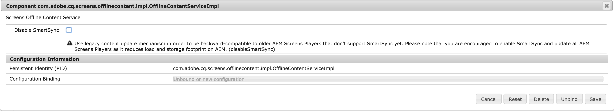

# Overstappen van ContentSync naar SmartSync {#transitioning-from-contentsync-to-smartsync}

Deze sectie biedt een overzicht van de functie SmartSync en hoe deze de belasting van de server/opslag en het netwerkverkeer minimaliseert om de kosten te verlagen.

## Overzicht {#overview}

SmartSync is het meest recente mechanisme dat door AEM Screens wordt gebruikt. Het dient als vervanging van de huidige methode die wordt gebruikt om offlinekanalen in de cache op te slaan en aan de speler te leveren.

Deze wordt zowel op de server als op de client uitgevoerd.

**Op de server**

* Inhoud van de kanalen, inclusief elementen, wordt in cache geplaatst in *`/var/contentsync`*.
* Cache wordt aan de spelers blootgesteld als manifest dat de beschikbare inhoud voor een vertoning beschrijft.

**Aan de clientzijde**

* De speler werkt de inhoud bij op basis van het hierboven gegenereerde manifest.

### Voordelen van het gebruik van SmartSync {#benefits-of-using-smartsync}

De functie SmartSync biedt verschillende voordelen voor uw AEM Screens-project, zoals:

* Een drastische vermindering van het netwerkverkeer en de opslagvereisten aan de serverzijde.
* De speler downloadt op intelligente wijze elementen alleen als het element ontbreekt of is gewijzigd.
* Opslagoptimalisaties voor servers en clients.

>[!NOTE]
>
>Adobe raadt u ten zeerste aan om SmartSync te gebruiken voor AEM Screens-projecten.

## Migreren van ContentSync naar SmartSync {#migrating-from-contentsync-to-smartsync}

>[!NOTE]
>
>Als u al AEM 6.3 Feature Pack 5 en AEM 6.4 Feature Pack 3 hebt geïnstalleerd, kunt u SmartSync voor middelen inschakelen om het gebruik van schijfruimte te verbeteren. Als u SmartSync wilt inschakelen, volgt u de onderstaande sectie voor de overgang van ContentSync naar SmartSync en schakelt u SmartSync dus in.
>
>SmartSync is beschikbaar voor schermPlayer met ondersteunde servers AEM 6.4.3 FP3.
>
>Zie de [Downloads voor AEM Screens Player](https://download.macromedia.com/screens/) om de nieuwste speler te downloaden. In de volgende tabel wordt de minimaal vereiste Player-versie voor elk platform beschreven:

| **Platform** | **Minimaal ondersteunde Player-versie** |
|---|---|
| Android™ | 3.3.72. |
| Chrome-besturingssysteem | 1.0.136 |
| Windows | 1.0.136 |

Voer de onderstaande stappen uit om van ContentSync over te schakelen op SmartSync:

1. Voor het migreren van ContentSync naar SmartSync moet de ContentSync-cache worden gewist voordat SmartSync wordt geactiveerd.

   Ga via de koppeling naar de ContentSync-console van uw instantie ***https://localhost:4502/libs/cq/contentsync/content/console.html*** en klik op **Cache wissen**, zoals weergegeven in onderstaande afbeelding:

   

   >[!CAUTION]
   >
   >Alle inhoudcache moet worden gewist voordat u SmartSync voor het eerst kunt gebruiken.

1. Navigeren naar **Configuratie Adobe Experience Manager-webconsole** via AEM > hamerpictogram > **Bewerkingen** > **Webconsole**.

   

1. **Configuratie Adobe Experience Manager-webconsole** wordt geopend. Zoeken naar *offlinecontent*.

   Als u de opdracht **Schermen offline-inhoudsservice** eigenschap, druk **Command+F** for **Mac**, en **Ctrl+F** for **Windows**.

   

1. Klikken **Opslaan** de **Schermen met services voor offline inhoud** en dus SmartSync voor AEM Screens gebruiken.
1. Wanneer u SmartSync hebt ingeschakeld, navigeert u naar uw project en klikt u op **Offline inhoud bijwerken** *(vanaf de actiebalk),* zoals weergegeven in onderstaande afbeelding.

   
